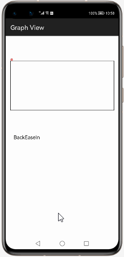
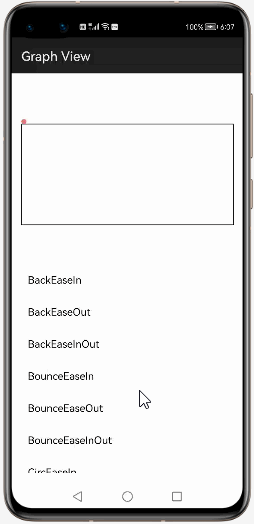
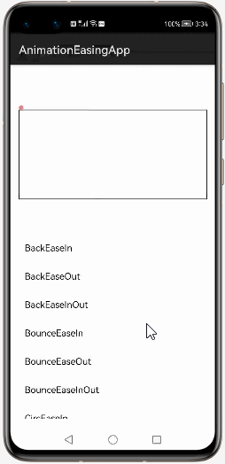
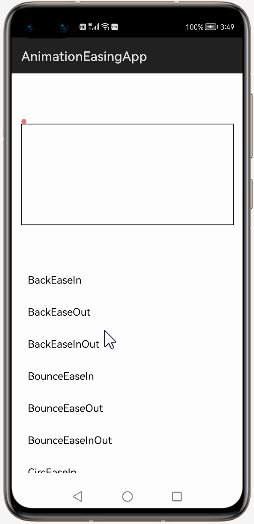
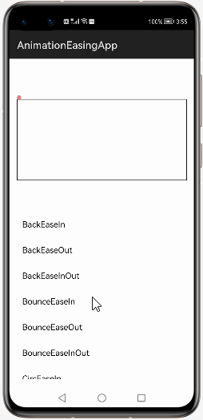

# How to use AnimationEasingFunctions  Library for HarmonyOS: A developer’s Guide

## **1. Introduction**

 AnimationEasingFunctions is a which is an animation collection, to help you make animation easier.
## **2. Typical Use Cases**
This library - daimajia.com.easing, is very useful in the development of applications which are in our daily use. Some of such examples mentioned below:


<center><table>
    <tr>
        <td>
            <ul><li><b>Graph View</b></br>If you are looking for a view to represent some statistical data</li><ul>
        </td>
       <td>
            <ul><li><b>Multiple GraphView</b></br>Using GraphView Library for functions to display multiple graphs.</li><ul>
        </td>
    </tr>
    <tr>
        <td><center></center></td>
        <td><center></center></td>
    </tr>
</table></center>


## **3. Capability**
In this section, we can see the list of features which the library provides which makes the use of this library very easy and friendly. Primarily, this library supports customization of component attributes using the below mechanism.

* **Java APIs**</br>
AnimationEasingFunctions  uses a simple fluent java API's that allows users to make most requests in a single line:
 
## **4. Features**
Features supported by this component includes the below:
* **BackEaseIn**</br>
* **BackEaseOut**</br>
* **BackEaseInOut**</br>
* **BounceEaseIn**</br>
* **BounceEaseOut**</br>
* **BounceEaseInOut**</br>
* **CircEaseIn**</br>
* **CircEaseOut**</br>
* **CircEaseInOut**</br>
* **CubicEaseIn**</br>
* **CubicEaseOut**</br>
* **CubicEaseInOut**</br>
* **ElasticEaseIn**</br>
* **ElasticEaseOut**</br>
* **ExpoEaseIn**</br>
* **ExpoEaseOut**</br>
* **ExpoEaseInOut**</br>
* **QuadEaseIn**</br>
* **QuadEaseOut**</br>
* **QuadEaseInOut**</br>
* **QuintEaseOut**</br>
* **QuintEaseInOut**</br>
* **SineEaseIn**</br>
* **SineEaseOut**</br>
* **SineEaseInOut**</br>
* **Linear**</br>


## **5. Installation**
For using the library in your HarmonyOS mobile app, you need to first install it by following below methods.

* **Method 1:**  </br>
Generate the .har package through the library and add the .har package to the libs folder.Add the following code to the entry level build.gradle:
    <pre>
       <b style="color:green">
    implementation fileTree  (dir: 'libs', include: ['* .jar', '* .har'])
       </b>
</pre>

* **Method 2 :**  </br>
Copy the dependency from the gitee and add it to the entry level build.gradle:
<pre>
dependencies {
    implementation fileTree(dir: 'libs', include: ['*.har'])
    <b style="color:blue;">implementation 'io.openharmony.tpc.thirdlib:AnimationEasingFunctions:1.0.2'</b>
           }
</pre>


## **6. Usage**
This section will help us to understand the usage of the library as you use it in your Harmony-application developemnt project.

### **Step 1: Define layout via XML**
We are going to load list  into DrawView component using This  Library. So, add DrawView component into <strong>resource_file.xml</strong> file.

```xml
    <?xml version="1.0" encoding="utf-8"?>
    <DirectionalLayout
        xmlns:ohos="http://schemas.huawei.com/res/ohos"
        xmlns:app="http://schemas.huawei.com/hap/res-auto"
        ohos:height="match_parent"
        ohos:width="match_parent"
        ohos:orientation="vertical"
        ohos:background_element="#000000">
            
       <daimajia.com.easing.DrawView
            ohos:id="$+id:history"
            ohos:width="match_parent"
            ohos:height="280vp"/>
    <Component
            ohos:align_left="$id:history"
            ohos:id="$+id:target"
            ohos:width="8vp"
            ohos:align_bottom="$id:history"
            ohos:height="8vp"
            ohos:bottom_margin="60vp"
            ohos:background_element="$graphic:circle"/>
    <ListContainer
            ohos:top_margin="280vp"
            ohos:id="$+id:easing_list"
            ohos:width="match_parent"
            ohos:height="match_content"></ListContainer>

    </DirectionalLayout>
```
### **Step 2: Customize programmatically via Java API**
```java
  private ListContainer mEasingList;
    private EasingAdapter mAdapter;
    private Component mTarget;
    private long mDuration = 2000;
    private DrawView mHistory;

        mEasingList = (ListContainer) findComponentById(ResourceTable.Id_easing_list);
        mAdapter = new EasingAdapter(this);
        mEasingList.setItemProvider(mAdapter);
        mTarget = findComponentById(ResourceTable.Id_target);
        mHistory = (DrawView) findComponentById(ResourceTable.Id_history);
        mEasingList.setItemClickedListener(new ListContainer.ItemClickedListener() {
            @Override
            public void onItemClicked(ListContainer listContainer, Component component, int position, long var4) {
                mHistory.clear();
                Skill skill = (Skill) component.getTag();
               / / Animation collection
                AnimatorGroup set = new AnimatorGroup();
                mTarget.setTranslationX(0);
                mTarget.setTranslationY(0);
                //Numeric animation
                AnimatorValue animator = new AnimatorValue();
                animator.setDuration(mDuration);
                BaseEasingMethod easing = skill.getMethod(mDuration);
                / / Draw the initial point.
                mHistory.drawPoint(0, mDuration, 0 - vpToPixels(getContext(), 60));
                set.runSerially(
                 Glider.glide(skill, mDuration, animator,new AnimatorValue.ValueUpdateListener() {
                @Override
                public void onUpdate(AnimatorValue animatorValue, float value) {
 
                 float start = 0;
                 float end = -vpToPixels(getContext(), 157) ;
                 float result = easing.evaluate(value, start, end);
                  mTarget.setTranslationY(result);
                 mHistory.drawPoint(mDuration * value, mDuration, result - vpToPixels(getContext(), 60));
                    }
                }));
                set.setDuration(mDuration);
                set.start();
            }
        });
```

### **List of public APIs for app-developer**
The public methods below will help us to operate on the component at runtime.

**AnimationEasingFunctions  Methods**
<table>
<tr>
    <td>
        <ul>
            <li>drawPoint()</li>
            <li>dipToPixels()</li> 
			<li>clear()</li>
			<li>onDraw(Component component, Canvas canvas)()</li>
			<li>close()</li>
			<li>animateClose()</li>
			<li>setHandle(Component handle)</li>
			<li>setHolder(Component holder)</li>
			<li>animate(final float position, int time)</li>
        </ul>
    </td>
  
</tr>
</table>

## **8. API usage examples**
In this section, we can have a look at some the examples where the APIs of this library is put to use and the results which we can acheive.

**Example1: AnimationEasingFunctions with Graph will be plotted for BackEaseIn **
<table>
    <tr>
        <td >
        <b><u>Layout.xml</u>:</b>
        <pre>
&ltdaimajia.com.easing.DrawView
            ohos:id="$+id:history"
            ohos:width="match_parent"
            ohos:height="280vp"/>
</br>
</pre>
<b><u>Java Slice</u>:</b>
<pre>
mHistory.drawPoint(0, mDuration, 0 - vpToPixels(getContext(), 60));
  set.runSerially(
   // Glider.glide(skill, mDuration, 
   animator,new AnimatorValue.ValueUpdateListener()
   Glider.glide(skill, mDuration, animator, 
   new AnimatorValue.ValueUpdateListener() {
  @Override
   public void onUpdate(AnimatorValue animatorValue, float value) {
float start = 0;
 float end = -vpToPixels(getContext(), 157);
 float result = easing.evaluate(value, start, end);
mTarget.setTranslationY(result);
 mHistory.drawPoint(mDuration
 * value, mDuration, result - vpToPixels(getContext(), 60));
        </pre>
        </td>
        <td >
        <center></center>
        </td>
    </tr>
</table>


**Example2: AnimationEasingFunctions With  Graph will be plotted for BackEaseOut**
<table>
    <tr>
        <td >
        <b><u>Layout.xml</u>:</b>
        <pre>
&ltdaimajia.com.easing.DrawView
            ohos:id="$+id:history"
            ohos:width="match_parent"
            ohos:height="280vp"/>
</br>
</pre>
<b><u>Java Slice</u>:</b>
<pre>
  Glider.glide(skill, mDuration, animator, 
  new AnimatorValue.ValueUpdateListener() {
   @Override
  public void onUpdate(AnimatorValue animatorValue,
  float value) {
  float start = 0;
    float end = -vpToPixels(getContext(), 157);
     float result = easing.evaluate(value, start, end);
      mTarget.setTranslationY(result);
      mHistory.drawPoint(mDuration
	  * value, mDuration, result - vpToPixels(getContext(), 60));
           }
           }));
        </pre>
        </td>
        <td >
        <center></center>
        </td>
    </tr>
</table>


**Example3: AnimationEasingFunctions With  Graph will be plotted for BackEaseInOut**
<table>
    <tr>
        <td >
        <b><u>Layout.xml</u>:</b>
        <pre>
&ltdaimajia.com.easing.DrawView
            ohos:id="$+id:history"
            ohos:width="match_parent"
            ohos:height="280vp"/>
</br>
</pre>
<b><u>Java Slice</u>:</b>
<pre>
   AnimatorValue animator = new AnimatorValue();
   animator.setDuration(mDuration);
   BaseEasingMethod easing = skill.getMethod(mDuration);
    // Draw the first point
   mHistory.drawPoint(0, mDuration, 0 - vpToPixels(getContext(), 60));
   set.runSerially(
    // Glider.glide(skill, mDuration, 
	animator,new AnimatorValue.ValueUpdateListener()
    Glider.glide(skill, mDuration, 
	animator, new AnimatorValue.ValueUpdateListener() {
   @Override
   public void onUpdate(AnimatorValue animatorValue, float value) {
    float start = 0;
    float end = -vpToPixels(getContext(), 157);
     float result = easing.evaluate(value, start, end);
     mTarget.setTranslationY(result);
     mHistory.drawPoint(mDuration
	 * value, mDuration, result - vpToPixels(getContext(), 60));
        }
        }));
    set.setDuration(mDuration);
      set.start();
        </pre>
        </td>
        <td >
        <center></center>
        </td>
    </tr>
</table>

 
## **9. Conclusion**
AnimationEasingFunctions is a very easy to use and very powerful library.The performance of the library is very good even when it works on one of the latest operating systems in the world, which is HarmonyOS!

* For more exciting libraries to develop your app, peep into third-party-components at </br>
[OpenHarmony-TPC](https://gitee.com/openharmony-tpc)

* To know more about the developement work happening on harmony aaplication layer, and even be part of the exciting stuff, watch this space of [Application Library Engineering Group](https://github.com/applibgroup)