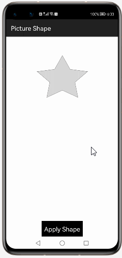

# How to use Anyshape  Library for HarmonyOS: A developer’s Guide

## **1. Introduction**

Anyshape: An openharmony library that can help developers to display mask image in any shape.


## **2. Typical Use Cases**
This library - cn.lankton.anyshape, is very useful in the development of applications which are in our daily use. Some of such examples mentioned below:


<center><table>
    <tr>
        <td>
            <ul><li><b>Picture Shape</b></br>Create stunning shapes for your beautiful photos easily with our Picture Shape app </li><ul>
        </td>
       <td>
            <ul><li><b>Edge Shape</b></br>We bring you many features by swipe the edges of your device, it's very very convenient for devices </li><ul>
        </td>
    </tr>
    <tr>
        <td><center></center></td>
        <td><center></center></td>
    </tr>
</table></center>


## **3. Capability**
In this section, we can see the list of features which the library provides which makes the use of this library very easy and friendly. Primarily, this library supports customization of component attributes using the below mechanism.

* **Java APIs**</br>
Anyshape  uses a simple fluent java API's that allows users to make most requests in a single line:
 
## **4. Features**
Features supported by this component includes the below:
* **Masking the any shape image using AnyShapeImageView:** </br>
ohos anyshape UI is displaying all different mask image will display.

* **Masking the image in different color shape.:**<br>
 
ohos anyshape: while display the image  ring color button ring will display different-2 kind of colors.

## **5. Installation**
For using the library in your HarmonyOS mobile app, you need to first install it by following below methods.

* **Method 1:**  </br>
Generate the .har package through the library and add the .har package to the libs folder.Add the following code to the entry level build.gradle:
    <pre>
       <b style="color:green">
    implementation fileTree  (dir: 'libs', include: ['* .jar', '* .har'])
       </b>
</pre>

* **Method 2 :**  </br>
Copy the dependency from the gitee and add it to the entry level build.gradle:
<pre>
dependencies {
    implementation fileTree(dir: 'libs', include: ['*.har'])
    <b style="color:blue;">implementation 'io.openharmony.cn.lankton.anyshape.AnyshapeImageView:1.0.1'</b>
           }
</pre>


## **6. Usage**
This section will help us to understand the usage of the library as you use it in your Harmony-application developemnt project.

### **Step 1: Define layout via XML**
We are going to load list  into AnyshapeImageView component using This  Library. So, add AnyshapeImageView component into <strong>resource_file.xml</strong> file.

```xml
    <?xml version="1.0" encoding="utf-8"?>
    <DirectionalLayout
        xmlns:ohos="http://schemas.huawei.com/res/ohos"
        xmlns:app="http://schemas.huawei.com/hap/res-auto"
        ohos:height="match_parent"
        ohos:width="match_parent"
        ohos:orientation="vertical"
        ohos:background_element="#000000">
            
      <cn.lankton.anyshape.AnyshapeImageView
        ohos:id="$+id:iv_text"
        ohos:width="match_content"
        ohos:height="200vp"
        ohos:scale_mode="center"
        ohos:layout_alignment="center"
        ohos:top_margin="-15vp"
        />
    </DirectionalLayout>
```
### **Step 2: Customize programmatically via Java API**
```java
   @Override
    public void onStart(Intent intent) {
        super.onStart(intent);
      PixelMap original = AnyshapeImageView.decodeResource(this, ResourceTable.Media_scene);
      PixelMap mask = AnyshapeImageView.decodeResource(this, ResourceTable.Media_text);
      PixelMap.InitializationOptions initializationOptions = new PixelMap.InitializationOptions();
      initializationOptions.size = new Size(mask.getImageInfo().size.width, mask.getImageInfo().size.height);
      initializationOptions.pixelFormat = PixelFormat.ARGB_8888;
      PixelMap result = PixelMap.create(initializationOptions);
      Texture texture = new Texture(result);
      Canvas mCanvas = new Canvas(texture);
      Paint paint = new Paint();
      paint.setAntiAlias(true);
      paint.setBlendMode(BlendMode.DST_IN);
      mCanvas.drawPixelMapHolder(new PixelMapHolder(original), 0, 0, new Paint());
      mCanvas.drawPixelMapHolder(new PixelMapHolder(mask), 0, 

    }
```
### **List of XML attributes supported for Anyshape**
Below is the list of XML attributes which are supported by the library.

<table>
	<tr><th>Name</th><th>Type</th><th width="100%">Info</th></tr>
	<tr><td>anyshapeBackColor</td><td>Color</td><td>To apply the  color of the anyshapeview</td></tr>
	</table>
	
### **List of public APIs for app-developer**
The public methods below will help us to operate on the component at runtime.

**Anyshape  Methods**
<table>
<tr>
    <td>
        <ul>
            <li>onDraw(Component component, Canvas canvas)</li>
            <li>PixelMap decodeResource(Context context, int id) </li>
        </ul>
    </td>
  
</tr>
</table>

## **8. API usage examples**
In this section, we can have a look at some the examples where the APIs of this library is put to use and the results which we can acheive.

**Example1: Anyshape with Change the Ring Color**
<table>
    <tr>
        <td >
        <b><u>Layout.xml</u>:</b>
        <pre>
&ltcn.lankton.anyshape.AnyshapeImageView
ohos:id="$+id:iv_panda"
ohos:height="250vp"
ohos:width="250vp"
ohos:layout_alignment="center"
ohos:scale_mode="center"
     />
</br>
</pre>
<b><u>Java Slice</u>:</b>
<pre>
 PixelMap result = PixelMap.create(initializationOptions);
  Texture texture = new Texture(result);
  Canvas mCanvas = new Canvas(texture);
  Paint paint = new Paint();
  paint.setAntiAlias(true);
  paint.setBlendMode(BlendMode.DST_IN);
  mCanvas.drawPixelMapHolder(new PixelMapHolder(original),
  0, 0, new Paint());
  mCanvas.drawPixelMapHolder(new PixelMapHolder(mask), 0, 0, paint);
  iv_ring_image.setPixelMap(texture.getPixelMap());
        </pre>
        </td>
        <td >
        <center></center>
        </td>
    </tr>
</table>


**Example2: Anyshape with apply Mask Element Panda**
<table>
    <tr>
        <td >
        <b><u>Layout.xml</u>:</b>
        <pre>
&ltcn.lankton.anyshape.AnyshapeImageView
   ohos:id="$+id:iv_panda"
   ohos:height="250vp"
   ohos:width="250vp"
   ohos:layout_alignment="center"
   ohos:scale_mode="center"
     />
</br>
</pre>
<b><u>Java Slice</u>:</b>
<pre>
 PixelMap result = PixelMap.create(initializationOptions);
  Texture texture = new Texture(result);
 Canvas mCanvas = new Canvas(texture);
  Paint paint = new Paint();
  paint.setAntiAlias(true);
  paint.setBlendMode(BlendMode.DST_IN);
  mCanvas.drawPixelMapHolder(new PixelMapHolder(original),
  0, 0, new Paint());
  0, 0, paint);
<b style="color:DarkCyan;"> 
   mCanvas.drawPixelMapHolder(new PixelMapHolder(mask),</b> 
        </pre>
        </td>
        <td >
        <center></center>
        </td>
    </tr>
</table>


**Example3: Anyshape with apply Text**
<table>
    <tr>
        <td >
        <b><u>Layout.xml</u>:</b>
        <pre>
&ltcn.lankton.anyshape.AnyshapeImageView
   ohos:id="$+id:iv_panda"
   ohos:height="250vp"
   ohos:width="250vp"
   ohos:layout_alignment="center"
   ohos:scale_mode="center"
     />
</br>
</pre>
<b><u>Java Slice</u>:</b>
<pre>
 PixelMap mask = AnyshapeImageView.decodeResource(this,
 ResourceTable.Media_personal);
 PixelMap.InitializationOptions initializationOptions = 
 new PixelMap.InitializationOptions();
 initializationOptions.size = new Size(mask.getImageInfo()
 .size.width, mask.getImageInfo().size.height);
 initializationOptions.pixelFormat = PixelFormat.ARGB_8888;
 PixelMap result = PixelMap.create(initializationOptions);
 Texture texture = new Texture(result);
 Canvas mCanvas = new Canvas(texture);
 Paint paint = new Paint();
 paint.setAntiAlias(true);
 paint.setBlendMode(BlendMode.DST_IN);
 mCanvas.drawPixelMapHolder(new PixelMapHolder(original),
 0, 0, new Paint());
 mCanvas.drawPixelMapHolder(new PixelMapHolder(mask),
 0, 0, paint);
 
<b style="color:DarkCyan;"> 
    iv_text_image.setPixelMap(texture.getPixelMap());</b> 
        </pre>
        </td>
        <td >
        <center></center>
        </td>
    </tr>
</table>


## ** 9. Conclusion**
Anyshape is a very easy to use and very powerful library.The performance of the library is very good even when it works on one of the latest operating systems in the world, which is HarmonyOS!

* For more exciting libraries to develop your app, peep into third-party-components at </br>
[OpenHarmony-TPC](https://gitee.com/openharmony-tpc)

* To know more about the developement work happening on harmony aaplication layer, and even be part of the exciting stuff, watch this space of [Application Library Engineering Group](https://github.com/applibgroup)