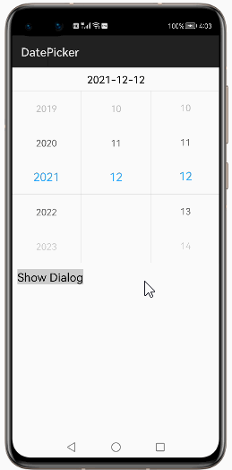
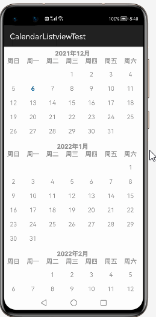
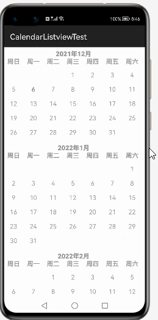
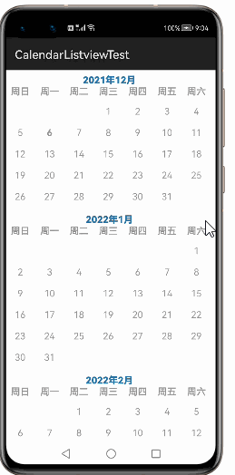

# How to use CalendarListview  Library for HarmonyOS: A developer’s Guide

## **1. Introduction**

CalendarListview provides a easy way to select dates with a calendar. You can find a sample that show how to add DatePickerView to your layout without customization
## **2. Typical Use Cases**
This library - andexert.calendarlistview.library, is very useful in the development of applications which are in our daily use. Some of such examples mentioned below:


<center><table>
    <tr>
        <td>
            <ul><li><b>CalendarList</b></br>Is a personal calendar app that lets you take control of your daily tasks                                </li><ul>
        </td>
       <td>
            <ul><li><b>DatePicker</b></br>Date Picker allows you to select the date consisting of day, month and year in your custom user interface.</li><ul>
        </td>
    </tr>
    <tr>
        <td><center></center></td>
        <td><center></center></td>
    </tr>
</table></center>


## **3. Capability**
In this section, we can see the list of features which the library provides which makes the use of this library very easy and friendly. Primarily, this library supports customization of component attributes using the below mechanism.

* **Java APIs**</br>
CalendarListview  uses a simple fluent java API's that allows users to make most requests in a single line:
 
## **4. Features**
Features supported by this component includes the below:
* **CalendarListview-colorNormalDay**</br>
* **CalendarListview-colorCurrentDay**</br>
* **CalendarListview-colorSelectedDayBackground**</br>
* **CalendarListview-colorSelectedDayText**</br>
* **CalendarListview-colorPreviousDay**</br>
* **CalendarListview-colorMonthName**</br>
* **CalendarListview-colorDayName**</br>
* **CalendarListview-textSizeDay**</br>
* **CalendarListview-textSizeMonth**</br>
* **CalendarListview-textSizeDayName**</br>
* **CalendarListview-headerMonthHeight**</br>
* **CalendarListview-drawRoundRect**</br>
* **CalendarListview-selectedDayRadius**</br>
* **CalendarListview-enablePreviousDay**</br>
* **CalendarListview-currentDaySelected**</br>
* **CalendarListview-firstMonth**</br>
* **CalendarListview-lastMonth**</br>
* **CalendarListview-calendarHeight**</br>
* **CalendarListview-getDaysInMonth**</br>


## **5. Installation**
For using the library in your HarmonyOS mobile app, you need to first install it by following below methods.

* **Method 1:**  </br>
Generate the .har package through the library and add the .har package to the libs folder.Add the following code to the entry level build.gradle:
    <pre>
       <b style="color:green">
    implementation fileTree  (dir: 'libs', include: ['* .jar', '* .har'])
       </b>
</pre>

* **Method 2 :**  </br>
Copy the dependency from the gitee and add it to the entry level build.gradle:
<pre>
dependencies {
    implementation fileTree(dir: 'libs', include: ['*.har'])
    <b style="color:blue;">implementation 'io.openharmony.tpc.thirdlib:CalendarListview:1.0.2'</b>
           }
</pre>


## **6. Usage**
This section will help us to understand the usage of the library as you use it in your Harmony-application developemnt project.

### **Step 1: Define layout via XML**
We are going to load list  into DatePickerView component using This  Library. So, add DatePickerView component into <strong>resource_file.xml</strong> file.

```xml
    <?xml version="1.0" encoding="utf-8"?>
    <com.andexert.calendarlistview.library.DayPickerView
        xmlns:ohos="http://schemas.huawei.com/res/ohos"
        ohos:id="$+id:pickerView"
        ohos:height="match_parent"
        ohos:width="match_parent"/>
```
### **Step 2: Customize programmatically via Java API**
```java
  DayPickerView dayPickerView = (DayPickerView) findComponentById(ResourceTable.Id_pickerView);
    dayPickerView.setController(new DatePickerController() {
        @Override
        public int getMaxYear() {
           / / The calendar displays the maximum number of years returned by this interface.

            return 2023;
        }

        @Override
        public void onDayOfMonthSelected(int year, int month, int day) {
            //This interface is invoked whenever a user selects a new date.

            }

        @Override
        public void onDateRangeSelected(SimpleMonthAdapter.SelectedDays<SimpleMonthAdapter.CalendarDay> selectedDays) {
         //When a user selects two dates, this interface is invoked to obtain the two selected dates.            }
    });
```
### **List of XML attributes supported for CalendarListview**
Below is the list of XML attributes which are supported by the library.

<table>
	<tr><th>Name</th><th>Type</th><th width="100%">Info</th></tr>
	<tr><td>colorCurrentDay</td><td>Color</td><td>Text color of the current date</td></tr>
	<tr><td>colorSelectedDayBackground	</td><td>Color</td><td>The background color of the indicator when the date is clicked</td></tr>
    <tr><td>colorSelectedDayText</td><td>Color</td><td>Text color of the date clicked</td></tr>
	<tr><td>colorPreviousDay</td><td>Color</td><td>Text color for past date of current month</td></tr>
	<tr><td>colorNormalDay	</td><td>Color</td><td>All undated text colors</td></tr>
	<tr><td>colorMonthName	</td><td>Color</td><td>Text color of each month's year and month title/td></tr>
	<tr><td>colorDayName</td><td>Color</td><td>Text color for the week of each month</td></tr>
    <tr><td>textSizeDay	</td><td>Dimension</td><td>Date text size</td></tr>
	<tr><td>textSizeMonth</td><td>Dimension</td><td>Text size of each month's year and month title</td></tr>
    <tr><td>textSizeDayName</td><td>Dimension</td><td>Text size for the week of each month</td></tr>
    <tr><td>headerMonthHeight	</td><td>Dimension</td><td>Height of each month's year and month title</td></tr>
    <tr><td>selectedDayRadius</td><td>Dimension</td><td>Radius dimension of the click date indicator</td></tr>
    <tr><td>calendarHeight	</td><td>Dimension</td><td>Each month minus the height of the year-month title</td></tr>
    <tr><td>enablePreviousDay	</td><td>Boolean</td><td>Enable the past date of the current month</td></tr>
    <tr><td>currentDaySelected	</td><td>Boolean</td><td>Current date is selected by default</td></tr>
    <tr><td>drawRoundRect</td><td>Boolean</td><td>Each month minus the height of the year-month title</td></tr>
    <tr><td>firstMonth</td><td>Integer</td><td>Month to start displaying</td></tr>
    <tr><td>lastMonth</td><td>Integer</td><td>Last Month Displayed</td></tr>
</table>

### **List of public APIs for app-developer**
The public methods below will help us to operate on the component at runtime.

**CalendarListview  Methods**
<table>
<tr>
    <td>
        <ul>
            <li>getDaysInMonth()</li>
            <li>getMaxYear()</li> 
			<li>onDayOfMonthSelected()</li>
			<li>onDateRangeSelected()</li>
			<li>setController()</li>
			<li>getSelectedDays()</li>
			<li>setDay()</li>
			<li>getDate()</li>
			<li>SelectedDays<K></li>
      </ul>
    </td>
  
</tr>
</table>

## **8. API usage examples**
In this section, we can have a look at some the examples where the APIs of this library is put to use and the results which we can acheive.

**Example1: CalendarListview with Showing Current Date**
 calender list view should Appear with current date marked with provided color
<table>
    <tr >
        <td width="50%">
        <b><u>Layout.xml</u>:</b>
        <pre >
&ltcom.andexert.calendarlistview.library.DayPickerView
    xmlns:ohos="http://schemas.huawei.com/res/ohos"
    ohos:id="$+id:pickerView"
    ohos:height="match_parent"
    ohos:width="match_parent"
    ohos:colorCurrentDay="#2874A6"/>
</br>
        </pre>
        </td>
        <td>
        <center></center>
        </td>
    </tr>
</table>


**Example2: CalendarListview colorSelectedDayText attribute with different color** 
. If you click on a day, a circle indicator or a rouded rectangle indicator will be draw with the given color.

<table>
    <tr >
        <td width="50%">
        <b><u>Layout.xml</u>:</b>
        <pre >
&ltcom.andexert.calendarlistview.library.DayPickerView
    xmlns:ohos="http://schemas.huawei.com/res/ohos"
    ohos:id="$+id:pickerView"
    ohos:height="match_parent"
    ohos:width="match_parent"
    ohos:colorSelectedDayText="#2874A6"/>
	</br>
        </pre>
        </td>
        <td>
        <center></center>
        </td>
    </tr>
</table>


**Example3: CalendarListview  colorMonthName attribute with different color**
<table>
    <tr >
        <td width="50%">
        <b><u>Layout.xml</u>:</b>
        <pre >
&ltcom.andexert.calendarlistview.library.DayPickerView
    xmlns:ohos="http://schemas.huawei.com/res/ohos"
    ohos:id="$+id:pickerView"
    ohos:height="match_parent"
    ohos:width="match_parent"
    ohos:colorMonthName="#2874A6"/>
	</br>
        </pre>
        </td>
        <td>
        <center></center>
        </td>
    </tr>
</table>
 
## **9. Conclusion**
CalendarDay is a very easy to use and very powerful library.The performance of the library is very good even when it works on one of the latest operating systems in the world, which is HarmonyOS!

* For more exciting libraries to develop your app, peep into third-party-components at </br>
[OpenHarmony-TPC](https://gitee.com/openharmony-tpc)

* To know more about the developement work happening on harmony aaplication layer, and even be part of the exciting stuff, watch this space of [Application Library Engineering Group](https://github.com/applibgroup)