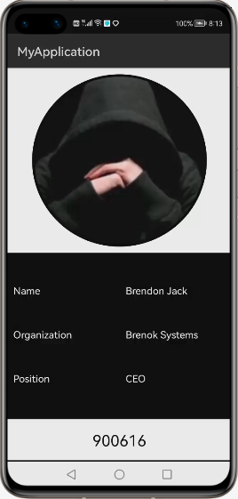
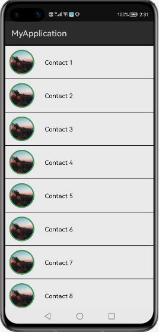
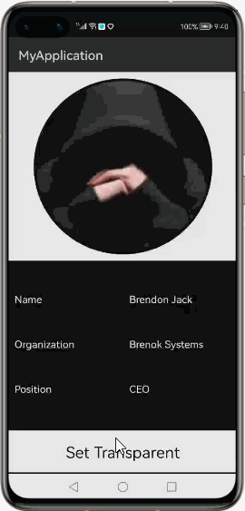
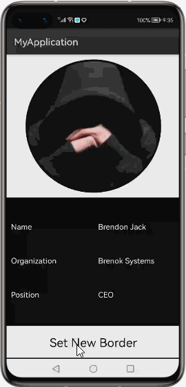
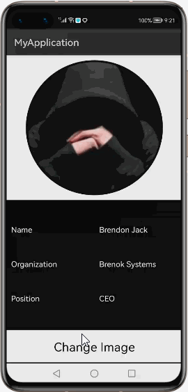

# How to use CircleImageView Library for HarmonyOS: A developer’s Guide

## **1. Introduction**
CircleImageView library provides you a seamless and hassle-free development experience to display an image in a circular view. This can be often helpful in displaying profile pictures on mobile-apps. With its superior performance, this library can be a good choice when we want to display many number of images in a single screen, as like a chat list. It can also be used appropriately in other scenarios where an image needs to be displayed in a circular shape.

To get started right away, head on to [Gitee](https://gitee.com/openharmony-tpc/CircleImageView)

## **2. Typical Use Cases**
This library - de.hdodendof.circleimageview, is very useful in the development of applications which are in our daily use. Couple of such examples are mentioned below:

<table>
    <tr>
        <td>
            <ul><li><b>Profile Picture</b> A Single highlighting profile picture.</li><ul>
        </td>
        <td>
            <ul><li><b>Chat List</b> A chat list with profile picture of contacts.</li><ul>
        </td>
    </tr>
    <tr>
        <td width="50%">

</td>
        <td width="100%">

</td>
    </tr>
</table>

## **3. Capability**
In this section, we can see the list of features which the library provides which makes the use of this library very easy and friendly. Primarily, this library supports customization of component attributes using the below mechanisms.

* **XML layout inflation** 
With the help of xml layout inflation, the library is so easy to use such that, we can put the component to action without even writing a single line of code. This will be so useful for quick development, as well as for beginners who are starting with mobile-app development. On how to use the XML Layout Inflation can be seen in the coming sections of the tutorial.

* **Customization via Java APIs** 
In case we need to customize the component during run time, we also have the flexibility to do that using the JAVA APIs which the library exposes. The APIs will also help us to utilize the features provided from its parent “Image” Class 

## **4. Features**
Features supported by this component includes the below:
* **Customizing border properties** 
We can configure the border color, border width and overlay parameter using these properties. Often setting the right border properties for a circular-image-view makes a whole lot of difference in the way the image appeals to audience.

* **Setting custom image, image background** 
Using this library, we can set any custom image into circe-image-view. A suitable backgroud color for the image can also be provided incase of using the component along with transparency. The library supports a wide range of file types like *.jpg, *.png etc, whichever supported by the harmony platform.

* **Adjusting the image transparency** 
The transparecy of the image can set from the library. It can be made a fully transparent one or even a fully opaque image. It can be set by defining value in the range 0.0 to 1.0. A value of 0 indicates full transparency, whereas 1 indicates complete opaquness.

* **Configuring the padding** 
Padding is used to reserve some space on the sides of the component drawn by the library. We can define how much such space should be on the left, top, right & bottom side of the component.

## **5. Installation**
For using the library in your HarmonyOS mobile app, you need to first install it by adding the below dependency in your entry/build.gradle file.
<pre>
dependencies {
    implementation fileTree(dir: 'libs', include: ['*.har'])
    <b style="color:blue;">implementation 'io.openharmony.tpc.thirdlib:circleimageview:1.0.0'</b>
    testCompile 'junit:junit:4.12'
}
</pre>

## **6. Usage**
This section will help us to understand the usage of the library as you use it in your Harmony-application developemnt project.

### **Step 1: Define layout via XML**

    <?xml version="1.0" encoding="utf-8"?>
    <DirectionalLayout
        xmlns:ohos="http://schemas.huawei.com/res/ohos"
        xmlns:app="http://schemas.huawei.com/hap/res-auto"
        ohos:height="match_parent"
        ohos:width="match_parent"
        ohos:orientation="vertical"
        ohos:background_element="#000000">
            <de.hdodenhof.circleimageview.CircleImageView
                ohos:id="$+id:tempciv"
                ohos:height="290vp"
                ohos:width="290vp"
                ohos:image_src="$media:profilepic"
                ohos:orientation="vertical"
                ohos:layout_alignment="center"
                ohos:top_padding="10vp"
                app:civ_border_width="4vp"
                app:civ_color="#000000"
                app:civ_bg_color="#FF0000"/> 
    </DirectionalLayout>

### **Step 2: Customize programmatically via Java API**

    @Override
    public void onStart(Intent intent) {
        super.onStart(intent);
        super.setUIContent(ResourceTable.Layout_NewSilce);
        CircleImageView civ;
        civ = (CircleImageView)findComponentById(ResourceTable.Id_tempciv);
        civ.setBorderColor(Color.BLACK);
    }

### **List of XML attributes supported**
Below is the list of XML attributes which are supported by the library.

* civ_color - To specify the border color.
* civ_border_width - To specify border width.
* civ_bg_color - To specify a background color

### **List of public APIs for app-developer**
The public methods below will help us to operate on the component at runtime.

**Setter Methods**
<table>
<tr>
    <td>
        <ul>
            <li>setAlpha()</li>
            <li>setBorderColor()</li>
            <li>setBorderOverlay()</li>
            <li>setBorderWidth()</li>
            <li>setCircleBackgroundColor()</li>
            <li>setColorFilter()</li>
        </ul>
    </td>
    <td>
        <ul>
            <li>setDisableCircularTransformation()</li>
            <li>setImageDrawable()</li>
            <li>setImageUri()</li>
            <li>setPadding()</li>
            <li>setPaddingRelative()</li>
            <li>setPixelMap()</li>
        </ul>
    </td>
</tr>
</table>

**Getter Methods**

<table>
<tr>
    <td>
        <ul>
            <li>getAlpha()</li>
            <li>getBorderColor()</li>
            <li>getBorderWidth()</li>
            <li>getCircleBackgroundColor()</li>
        </ul>
    </td>
    <td>
        <ul>
            <li>getColorFilter()</li>
            <li>isBorderOverlay()</li>
            <li>isDisableCircularTransformation()</li>
        </ul>
    </td>
</tr>
</table>

## **7. API usage examples**
In this section, we can have a look at some the examples where the APIs of this library is put to use and the results which we can acheive.

**Example1: Putting transparency into action**

In this example, first the background-color of the circleImageView is set to red color in layout.xml so that transparency is clearly observable. The color code is in [RGB-format](https://htmlcolorcodes.com/)
<table>
    <tr>
        <td width="75%">
        <pre>
<b><u>Layout.xml</u>:</b>
&ltde.hdodenhof.circleimageview.CircleImageView
    ohos:id="$+id:tempciv"
    ohos:height="290vp"
    ohos:width="290vp"
    ohos:image_src="$media:profilepic"
    ohos:orientation="vertical"
    ohos:layout_alignment="center"
    ohos:top_padding="10vp"
    app:civ_border_width="4vp"
    app:civ_color="#000000"
    <b style="color:blue;">app:civ_bg_color="#FF0000"</b>/>
 
<b><u>Java Slice</u>:</b>
CircleImageView civ;
civ = (CircleImageView)
findComponentById
(ResourceTable.Id_tempciv);
<b style="color:blue;">civ.setAlpha(0.5f);</b>
        </pre>
        </td>
        <td width="100%">
        

        </td>
    </tr>
</table>

**Example2: Customising border related attributes**
<table>
    <tr>
        <td width="75%">
        <pre>
<b><u>Layout.xml</u>:</b>
&ltde.hdodenhof.circleimageview.CircleImageView
    ohos:id="$+id:tempciv"
    ohos:height="290vp"
    ohos:width="290vp"
    ohos:image_src="$media:profilepic"
    ohos:orientation="vertical"
    ohos:layout_alignment="center"
    ohos:top_padding="10vp"
    app:civ_border_width="4vp"
    app:civ_color="#000000"
    app:civ_bg_color="#FF0000"/>
 
<b><u>Java Slice</u>:</b>
CircleImageView civ;
civ = (CircleImageView)
findComponentById
(ResourceTable.Id_tempciv);
<b style="color:blue;">civ.setBorderColor(Color.BLUE);
civ.setBorderWidth(20);
</b>
        </pre>
        </td>
        <td width="100%">
        

        </td>
    </tr>
</table>

**Example3: Changing the image at runtime**
<table>
    <tr>
        <td width="75%">
        <pre>
<b><u>Layout.xml</u>:</b>
&ltde.hdodenhof.circleimageview.CircleImageView
    ohos:id="$+id:tempciv"
    ohos:height="290vp"
    ohos:width="290vp"
    ohos:image_src="$media:profilepic"
    ohos:orientation="vertical"
    ohos:layout_alignment="center"
    ohos:top_padding="10vp"
    app:civ_border_width="4vp"
    app:civ_color="#000000"
    app:civ_bg_color="#FF0000"/>
 
<b><u>Java Slice</u>:</b>
CircleImageView civ;
civ = (CircleImageView)
findComponentById
(ResourceTable.Id_tempciv);
<b style="color:blue;">civ.setPixelMap(ResourceTable.Media_Desert);</b>
        </pre>
        </td>
        <td width="100%">
        

        </td>
    </tr>
</table>

## **8. Conclusion**
CircleImageView is a very easy to use and very powerful library.The performance of the library is very good even when it works on one of the latest operating systems in the world, which is HarmonyOS!

* For more exciting libraries to develop your app, peep into third-party-components at  
[OpenHarmony-TPC](https://gitee.com/openharmony-tpc)

* To know more about the developement work happening on harmony aaplication layer, and even be part of the exciting stuff, watch this space of [ALEG](https://github.com/applibgroup)
