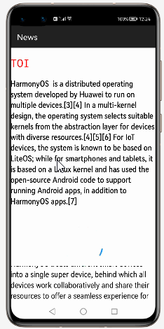

# How to use CircularProgressView   Library for HarmonyOS: A developer’s Guide

## **1. Introduction**

This CircularProgressView is a (surprisingly) circular progress bar openharmony View that is designed to imitate the Material versions of ProgressBar. These versions can be seen on this page of the Material design spec under Circular indicators.


## **2. Typical Use Cases**
This library -  com.github.rahatarmanahmed.cpv, is very useful in the development of applications which are in our daily use. Some of such examples mentioned below:


<div align="center">
<table>
    <tr>
        <td>
            <ul><li><b>News </b></br> News app that presents the latest news in crisp format from trusted national and international publishers</li><ul>
        </td>
       <td>
            <ul><li><b>FileDownload</b></br>FileDownload App is  Download All Files is a powerful download manager. It helps you download files quickly </li><ul>
        </td>
    </tr>
    <tr>
        <td width="50%"><p align="center"></p></td>
        <td width="50%"><p align="center"></p></td>
    </tr>
</table>
</div>

## **3. Capability**
In this section, we can see the list of features which the library provides which makes the use of this library very easy and friendly. Primarily, this library supports customization of component attributes using the below mechanism.

* **Java APIs**</br>
CircularProgressView  uses a simple fluent java API's that allows users to make most requests in a single line:
 
## **4. Features**
Features supported by this component includes the below:
* **Indeterminate CircularProgressView:** </br>
CircularProgressView  should be On the screen you can see the CircularProgressView starts rotation animation and will not stop, rotates indefinitely
* **Determinate CircularProgressView:**<br>
 CircularProgressView  should be On the screen you can see the Animation start automatically


## **5. Installation**
For using the library in your HarmonyOS mobile app, you need to first install it by following below methods.

* **Method 1:**  </br>
Generate the .har package through the library and add the .har package to the libs folder.Add the following code to the entry level build.gradle:
```groovy
    implementation fileTree  (dir: 'libs', include: ['* .jar', '* .har'])
```

* **Method 2 :**  </br>
Copy the dependency from the gitee and add it to the entry level build.gradle:
```groovy
dependencies {
    implementation fileTree(dir: 'libs', include: ['*.har'])
    implementation 'io.openharmony.tpc.thirdlib:CircularProgressView:1.0.1'
           }
```


## **6. Usage**
This section will help us to understand the usage of the library as you use it in your Harmony-application developemnt project.

### **Step 1: Define layout via XML**
We are going to load list  into CircularProgressView component using This  Library. So, add CircularProgressView component into <strong>resource_file.xml</strong> file.

```xml
    <?xml version="1.0" encoding="utf-8"?>
    <DirectionalLayout
        xmlns:ohos="http://schemas.huawei.com/res/ohos"
        xmlns:app="http://schemas.huawei.com/hap/res-auto"
        ohos:height="match_parent"
        ohos:width="match_parent"
        ohos:orientation="vertical"
        ohos:background_element="#000000">
            
      <com.github.rahatarmanahmed.cpv.CircularProgressView
      ohos:id="$+id:progress_view"
      ohos:height="50vp"
      ohos:width="50vp"
      ohos:layout_alignment="horizontal_center"
      ohos:padding="0vp"
      ohos:top_margin="50vp"
      app:cpv_animAutostart="false"
      app:cpv_indeterminate="true"
      app:cpv_thickness="8"/>

    </DirectionalLayout>
```
### **Step 2: Customize programmatically via Java API**
```java
   @Override
    public void onStart(Intent intent) {
        super.onStart(intent);
        progressView = (CircularProgressView) findComponentById(ResourceTable.Id_progress_view);

        // Test the listener with logcat messages
        progressView.addListener(new CircularProgressViewAdapter() {
            @Override
            public void onProgressUpdate(float currentProgress) {
                LogUtil.debug(TAG, "onProgressUpdate: " + currentProgress);
            }

            @Override
            public void onProgressUpdateEnd(float currentProgress) {
                LogUtil.debug(TAG, "onProgressUpdateEnd: " + currentProgress);
            }

            @Override
            public void onAnimationReset() {
                LogUtil.debug(TAG, "onAnimationReset");
            }

            @Override
            public void onModeChanged(boolean isIndeterminate) {
                LogUtil.debug(TAG, "onModeChanged: " + (isIndeterminate ? "indeterminate" : "determinate"));
            }
        });

    }
```
### **List of XML attributes supported for Floating action Button**
Below is the list of XML attributes which are supported by the library.

<table>
	<tr><th>Name</th><th>Type</th><th width="100%">Info</th></tr>
	<tr><td>cpv_progress</td><td>float</td><td>The current progress of the progress bar.</td></tr>
	<tr><td>cpv_maxProgress</td><td>float</td><td>The maximum progress of the progress bar; what's considered as 100% of the bar</td></tr>
    <tr><td>cpv_thickness</td><td>dimension</td><td>The thickness of the progress bar</td></tr>
	<tr><td>cpv_color</td><td>Color</td><td>The color of the progress bar.</td></tr>
	<tr><td>cpv_indeterminate</td><td>boolean</td><td>Whether this progress bar is indeterminate or not. If indeterminate, the progress set on this view will not have any effect.</td></tr>
	<tr><td>cpv_animDuration</td><td>integer</td><td>The duration of the indeterminate progress bar animation in milliseconds. It is the duration of all "steps" of the indeterminate animation. (Indeterminate only</td></tr>
	<tr><td>cpv_animSwoopDuration</td><td>integer</td><td>The duration of the initial swoop of the determinate animation. (Determinate only)</td></tr>
	<tr><td>cpv_animSyncDuration</td><td>integer</td><td>The duration of the determinate progress update animation. When you use setUpdate(int), this is how long it takes for the view to finish animating to that progress. (Determinate only)</td></tr>
    <tr><td>cpv_animSteps</td><td>integer</td><td>The number of "steps" in the indeterminate animation</td></tr>
	<tr><td>cpv_animAutostart</td><td>Boolean</td><td>Whether this progress bar should automatically start animating once it is initialized.</td></tr>
	<tr><td>cpv_startAngle</td><td>float</td><td>	The starting angle for progress bar. (Determinate only)</td></tr>

</table>

### **List of public APIs for app-developer**
The public methods below will help us to operate on the component at runtime.

**CircularProgressView  Methods**
<table>
<tr>
    <td>
        <ul>
            <li>isIndeterminate()</li>
            <li>setIndeterminate()</li> 
			<li>getThickness()</li>
			<li>setThickness(int value))</li>
			<li>getColor()</li>
			<li>setColor(int color)</li>
			<li>getMaxProgress()</li>
			<li>setMaxProgress(float value))</li>
        </ul>
    </td>
   <td>
        <ul>
            <li>getProgress()</li>
            <li>setProgress(float value)</li> 
			<li>startAnimation()</li>
			<li>resetAnimation()</li>
			<li>stopAnimation()</li>
			<li>addListener(CircularProgressViewListener)</li>
			<li>removeListener(CircularProgressViewListener)</li>
			<li>onComponentBoundToWindow(Component component)</li>
			<li>onComponentUnboundFromWindow(Component var1) ()</li>
        </ul>
    </td>
</tr>
</table>

## **8. API usage examples**
In this section, we can have a look at some the examples where the APIs of this library is put to use and the results which we can acheive.

**Example1: CircularProgressView with Indeterminate Mode**
<table>
    <tr>
        <td width=700px>
        <b><u>Layout.xml</u>:</b>
        <pre>
&ltcom.github.rahatarmanahmed.cpv.CircularProgressView
   ohos:id="$+id:progress_view"
   ohos:height="50vp"
   ohos:width="50vp"
   ohos:layout_alignment="horizontal_center"
   ohos:padding="0vp"
   ohos:top_margin="50vp"
   app:cpv_animAutostart="false"
   app:cpv_indeterminate="true"
   app:cpv_thickness="8">
</br>
</pre>
<b><u>Java Slice</u>:</b>
<pre>
 progressView = (CircularProgressView) 
 findComponentById(ResourceTable.Id_progress_view); 
 
<b style="color:DarkCyan;">
 progressView.setIndeterminate(true);</b>
        </pre>
        </td>
        <td width=300px>
        <p align="center"></p>
        </td>
    </tr>
</table>


**Example2: CircularProgressView With Determinate Modee**
<table>
    <tr>
        <td width=700px>
        <b><u>Layout.xml</u>:</b>
        <pre>
&ltcom.github.rahatarmanahmed.cpv.CircularProgressView
   ohos:id="$+id:progress_view"
   ohos:height="50vp"
   ohos:width="50vp"
   ohos:layout_alignment="horizontal_center"
   ohos:padding="0vp"
   ohos:top_margin="50vp"
   app:cpv_animAutostart="false"
   app:cpv_indeterminate="true"
   app:cpv_thickness="8">
</br>
</pre><b><u>Java Slice</u>:</b>
<pre>
 progressView = (CircularProgressView) 
 findComponentById(ResourceTable.Id_progress_view);

 if (progressView.isIndeterminate()) {
     progressView.setIndeterminate(false);
    button.setText("Switch to indeterminate");
    } else {
    progressView.setIndeterminate(true);
    button.setText("Switch to determinate");
    }
     startAnimationThreadStuff(0);
<b style="color:DarkCyan;">
 progressView.setIndeterminate(false);</b>
        </pre>
        </td>
        <td width=300px>
        <p align="center"></p>
        </td>
    </tr>
</table>


 
## **9. Conclusion**
CircularProgressView is a very easy to use and very powerful library.The performance of the library is very good even when it works on one of the latest operating systems in the world, which is HarmonyOS!

* For more exciting libraries to develop your app, peep into third-party-components at </br>
[OpenHarmony-TPC](https://gitee.com/openharmony-tpc)

* To know more about the developement work happening on harmony aaplication layer, and even be part of the exciting stuff, watch this space of [Application Library Engineering Group](https://github.com/applibgroup)
