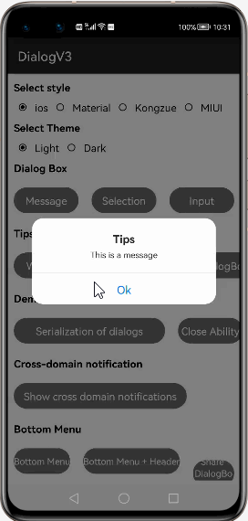
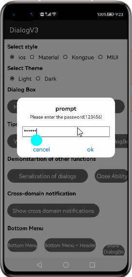
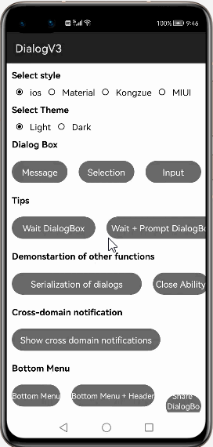
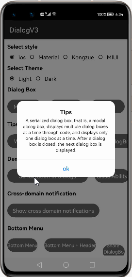
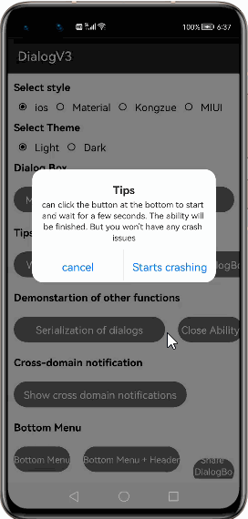
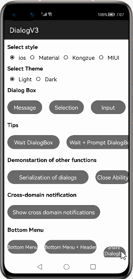
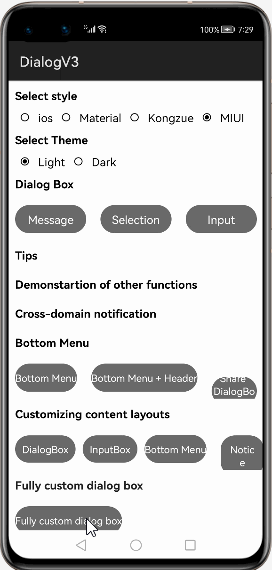

# How to use DialogV3 Library for HarmonyOS: A developer’s Guide

## **1. Introduction**
DialogV3 provides differents themes for creating dialogs(ios,Material,MIUI and Kongzue) and for different modes dark and light.

To get started right away, head on to [gitee](https://gitee.com/openharmony-tpc/DialogV3?_from=gitee_search)

## **2. Typical Use Cases**
This library - com.kongzue.dialogdemo, is very useful in the development of applications which are in our daily use. Couple of such examples are mentioned below:

<table>
    <tr>
        <td>
            <ul><li><b>IOS theme </b> ISO theme dialog box in light and dark modes.</li><ul>
        </td>
        <td>
            <ul><li><b>Material theme</b> Material theme dialog box in light and dark modes.</li><ul>
        </td>
    </tr>
    <tr>
        <td>

</td>
        <td>

</td>
    </tr>
</table>

<table>
    <tr>
        <td>
            <ul><li><b>MIUI theme </b> MIUI theme dialog box in light and dark modes.</li><ul>
        </td>
        <td>
            <ul><li><b>Kongzue theme</b> Kongzue theme dialog box in light and dark modes.</li><ul>
        </td>
    </tr>
    <tr>
        <td>

</td>
        <td>

</td>
    </tr>
</table>

## **3. Capability**
In this section, we can see the list of features which the library provides which makes the use of this library very easy and friendly. Primarily, this library supports customization of component attributes using the below mechanisms.

* **Customization via Java APIs** 

The components can be customize during run time using JAVA APIs.The APIs will also help us to utilize the features provided from its parent “Component” Class 

## **4. Features**
Features supported by this component includes the below:
* **Customizing Theme for Dialogs** 
 Can configure IOS,Material,Kongzue and MIUI themes for dialogue boxe for providing the information.This provides a interactive style to the dialogue box which developer can use for the application.

* **Customizing Modes for Dialog box** 
Dark and light modes can be configured,which can be controlled and can be synced by device mode to seemless navigation to application.

* **Various Dialog types** 
Library provides various dialogue types Messege Dialog box,Input dialogue,Bottom dialog,Wait Dialog and notifiaction dialog already defined for hassel free usage in the application

* **Support for fully Customizing Dialogs** 
Developer can also fully customize the dialogs as pet the need of the application.

## **5. Installation**
For using the library in your HarmonyOS mobile app, you need to first install it by adding the below dependency in your entry/build.gradle file if you have imported the library.
<pre>
dependencies {
  <b style="color:cyan;">implementation project(path: ':dialog')</b>
  testCompile 'junit:junit:4.12'
}
</pre>

If the library is compiled to .har file than add below dependency to your build.gradle.
<pre>
dependencies {
  <b style="color:cyan;">implementation fileTree (dir: 'libs', include: ['*.jar', 
  '*.har'])</b>
  testCompile 'junit:junit:4.12'
}
</pre>

## **6. API Usage With Example**
This section will help us to understand the usage of the library as you use it in your Harmony-application developemnt project.

### **Messege Dialog Display**

<left><table>
    <tr>
        <td>

</td>
    </tr>   
</table></left> 

MessgeDialog can be used to display simple messeges.
 
<pre>
 <b style="color:lightcyan;">//set the theme IOS,Material,kongzue or MIUI</b>
 DialogSettings.style = DialogSettings.STYLE.STYLE_IOS;
     
 <b style="color:lightcyan;">//set the mode light or dark</b>
 DialogSettings.theme = DialogSettings.THEME.LIGHT;

 <b style="color:lightcyan;">//Onclick display the messege</b>
 messageDialog.setClickedListener(component -> {
 MessageDialog.show(getContext(), "Tips", "This is a 
 message", "Ok");
 });
  </pre>  

### **Selection Messege Dialog Display**

<left><table>
    <tr>
        <td>

</td>
    </tr> 
</table></left>

Selection dialog box can be used to navigate a user

<pre>   
<b style="color:lightcyan;">//set the theme IOS,Material,kongzue or MIUI</b>
DialogSettings.style = DialogSettings.STYLE.STYLE_IOS;

<b style="color:lightcyan;">//set the mode light or dark</b>
DialogSettings.theme = DialogSettings.THEME.LIGHT;

<b style="color:lightcyan;">//Onclick display the messege</b>
MessageDialog.show(getContext(), "Tips", "This is a message", 
"Ok", "cancel", "back")

<b style="color:lightcyan;">//set the orientation</b>
.setButtonOrientation(LayoutAlignment.VERTICAL_CENTER);
</pre>    

### **Input Dialog Display**
<left><table>
    <tr>
        <td>

</td>
    </tr> 
</table></left>
 
Input dialog box can be used to get input from user or can be used to validate password.
 <pre>
 <b style="color:lightcyan;"> //set the theme IOS,Material,kongzue or MIUI</b>
 DialogSettings.style = DialogSettings.STYLE.STYLE_IOS;

 <b style="color:lightcyan;"> //set the mode light or dark</b>
 DialogSettings.theme = DialogSettings.THEME.LIGHT;

 <b style="color:lightcyan;">//Onclick display the messege</b>
 InputDialog.build(getContext())
                       <b style="color:lightcyan;"> //set the prompt messege</b>
                        .setTitle("prompt").setMessage("Please 
                        enter the password(123456)")
                        <b style="color:lightcyan;">//set input text to show in prompt messge</b>
                        .setInputText("111111")
                        .setOkButton("ok", new          
                        OnInputDialogButtonClickListener(){
               @Override
               public boolean onClick( String inputStr) {
                        <b style="color:lightcyan;">//check validation of input string</b>
                        if (inputStr.equals("123456")) {
                        TipDialog.show(getContext(), "success!",
                        TipDialog.TYPE.SUCCESS);
                        return false;
                         } else {
                        TipDialog.show(getContext(), "Incorrect 
                        password", TipDialog.TYPE.ERROR);
                        return true;
                                }
                            }
                        })
                        .setCancelButton("cancel")
                       <b style="color:lightcyan;"> //Hint for helping user</b>
                        .setHintText("Please enter the password")
                        .setInputInfo(new InputInfo()
                       <b style="color:lightcyan;"> //maximum length of the input string</b>
                        .setMAX_LENGTH(6)
                        )
                        .setCancelable(true)
                        .show(getContext());
                        }
 
</pre>

### **Wait DialogBox Display**
<left><table>
    <tr>
        <td>

</td>
    </tr> 
</table></left>
Wait Dialog Box can be used to get the wait signal for any processing.
<pre>
<b style="color:lightcyan;"> //set the theme IOS,Material,kongzue or MIUI</b>
 DialogSettings.style = DialogSettings.STYLE.STYLE_IOS;
     
  <b style="color:lightcyan;">//set the mode light or dark</b>
  DialogSettings.theme = DialogSettings.THEME.LIGHT;

<b style="color:lightcyan;">//Onclick Wait Dialog will appear</b>
     WaitDialog.show(getContext(), "Test")
                    .setOnBackClickListener(newOnBackClickListener() {
                     @Override
                     public boolean onBackClick() {
                     toast("Press return!");
                     return false;}
                     });
                     <b style="color:lightcyan;">//set the time till the dialog box appears on </b>
                     screen        
                     WaitDialog.dismiss(3000);
                     }            
</pre>
### **Serialization of Dialog Display**
<left><table>
    <tr>
        <td>

</td>
    </tr> 
</table></left>

Dialog box can be arranged in a one after the another manner for UI experience.
<pre>

     DialogSettings.modalDialog = true;
                MessageDialog.build(getContext())
                        .setTitle("Tips")
                        .setMessage("write messege here.")
                        .setOkButton("ok", new    
                        .show(getContext());
                         MessageDialog.show(getContext(), 
                         "More",
                        "Messege2.",
                        "Point", "I can't turn it off.")
                        .setOnCancelButtonClickListener(new 
                         MessageDialog.show(getContext(), "
                        Longitudinal arrangement", 
                        "Messege3", 
                        "ok", 
                        "cancel", "whatelse?")              
                         .setButtonOrientation(LayoutAlignment.VERTICAL_CENTER)
                         InputDialog.show(getContext(), 
                         "Input 
                         DialogBox", "You can also show just 
                         one button, like this", "ok");
                         MessageDialog.show(getContext(), 
                         "Tips", "Messege4", "Give me a 
                         hint", "cancel")
                        .setOnOkButtonClickListener(new  
                        }).setOnDismissListener(new 
                        OnDismissListener() {
                         @Override
                        public void onDismiss() {
                        DialogSettings.modalDialog = false;
                    }
                });
            }
        });
</pre>

### **Crash DialogBox Display**
<left><table>
    <tr>
        <td>

</td>
    </tr> 
</table></left>
App not responding dialog box can be showing using the library
<pre>
<b style="color:lightcyan;"> //set the theme IOS,Material,kongzue or MIUI</b>
 DialogSettings.style = DialogSettings.STYLE.STYLE_IOS;
     
  <b style="color:lightcyan;">//set the mode light or dark</b>
  DialogSettings.theme = DialogSettings.THEME.LIGHT;

<b style="color:lightcyan;">//Onclick Wait Dialog crash will apper with messege</b>
MessageDialog.show(getContext(), "Tips", "Crash Messege", "cancel")
                        .setMessageTextInfo(new TextInfo().setGravity(TextAlignment.LEFT))
                        .setOnOkButtonClickListener(new OnDialogButtonClickListener() {
                            @Override
                            public boolean onClick() {
                                WaitDialog.show(getContext(), "Preparing to crash...");
                                WaitDialog.show(getContext(), "Please wait...");
                                EventHandler handler = new EventHandler(EventRunner.getMainEventRunner());
                                handler.postTask(new Runnable() {
                                    @Override
                                    public void run() {
                                        getUITaskDispatcher().asyncDispatch(() -> {
                                            TipDialog.show(getContext(), "success", TipDialog.TYPE.SUCCESS).setOnDismissListener(new OnDismissListener() {
                                                @Override
                                                public void onDismiss() {
<b style="color:lightcyan;">//jump(MainActivity.class);</b>

</pre>

### **Notification Dialog Display**

<left><table>
    <tr>
        <td>

</td>
    </tr>   
</table></left> 

Custom notification can be used to display.The notification here is not a system notification, and does not have the feature of persistent display in the notification bar of your device. It is essentially a cross-interface prompt bar at the top of the screen realized by modifying Toast.
It does not depend on the interface display and will not interrupt the user's operation. It can be used as an instant messaging IM software cross-interface message reminder, or used for network error status prompts.
 
<pre>
 <b style="color:lightcyan;">//set the theme IOS,Material,kongzue or MIUI</b>
 DialogSettings.style = DialogSettings.STYLE.STYLE_IOS;
     
 <b style="color:lightcyan;">//set the mode light or dark</b>
 DialogSettings.theme = DialogSettings.THEME.LIGHT;

 <b style="color:lightcyan;">//Onclick display the notification messege</b>
Notification.show(this, "prompt", "Prompt message", ResourceTable.Media_ico_wechat)
.setOnNotificationClickListener(new On.setOnDismissListener(() -> Log.d(TAG, "The news slipped away."));
  </pre> 

### **Bottom Menu Dialog Display**

<left><table>
    <tr>
        <td>

</td>
    </tr>   
</table></left> 

Bottom Menu items can be displayed for selection.
 
<pre>
 <b style="color:lightcyan;">//set the theme IOS,Material,kongzue or MIUI</b>
 DialogSettings.style = DialogSettings.STYLE.STYLE_IOS;
     
 <b style="color:lightcyan;">//set the mode light or dark</b>
 DialogSettings.theme = DialogSettings.THEME.LIGHT;

 <b style="color:lightcyan;">//Onclick display the bottom menu items can be displayed also and adapter can also be set</b>
   BottomMenu.show(this, new String[]{"Menu1", "Menu2",
  "Menu3"}, new OnMenuItemClickListener() {
  @Override
  public void onClick(String text, int index) {
        toast("Clicked：" + text);
        }
    });
  </pre>  

### **Share Dialog Display**

<left><table>
    <tr>
        <td>

</td>
    </tr>   
</table></left> 

Share dialog from where user can sahre information can be siplayed also the platforms user wants to share can be displayed and connected in the share dialog box.
 
<pre>
 <b style="color:lightcyan;">//set the theme IOS,Material,kongzue or MIUI</b>
 DialogSettings.style = DialogSettings.STYLE.STYLE_IOS;
     
 <b style="color:lightcyan;">//set the mode light or dark</b>
 DialogSettings.theme = DialogSettings.THEME.LIGHT;

 <b style="color:lightcyan;">//set the the items to be presesnt in share dialog</b>
itemList.add(new ShareDialog.Item(getContext(), ResourceTable.Media_img_email_ios, "email"));
itemList.add(new ShareDialog.Item(getContext(), ResourceTable.Media_img_qq_ios, "QQ"));

 <b style="color:lightcyan;">//Show the shared content</b>
 ShareDialog.show(getContext(), itemList, (shareDialog, 
 index, item) -> {
            toast("Clicked：" + item.getText());
            return false;
  </pre>  

### **Content customized Dialog Display**

<left><table>
    <tr>
        <td>

</td>
    </tr>   
</table></left> 

Contents can be added to notification,Bottom menu,messege dialog box and Input box like image ,text or other resources.
 
<pre>
 <b style="color:lightcyan;">//set the theme IOS,Material,kongzue or MIUI</b>
 DialogSettings.style = DialogSettings.STYLE.STYLE_IOS;
     
 <b style="color:lightcyan;">//set the mode light or dark</b>
 DialogSettings.theme = DialogSettings.THEME.LIGHT;

 <b style="color:lightcyan;">//For customizing content in messege dialog box,input box,bottom menu and notification adnn setCustomView() method add below</b>
 .setCustomView(ResourceTable.Layout_layout_custom, new MessageDialog.OnBindView() {
    @Override
    public void onBind(MessageDialog dialog, Component v) {
    v.setClickedListener(new Component.ClickedListener() {
  </pre>  

### **Fully Customize Dialog Display**

<left><table>
    <tr>
        <td>

</td>
    </tr>   
</table></left> 

Dialog V3 provides a fully customizable dialog box style for quick and easy realization of special effects.
 
<pre>
<b style="color:lightcyan;">//with uninstantiated layouts</b>
CustomDialog.show(this, ResourceTable.Layout_layout_custom_dialog, new CustomDialog.OnBindView() {
@Override
public void onBind(final CustomDialog dialog, Component v) {
Image btnOk = v.findViewById(R.id.btn_ok);
btnOk.setClickedListener(new Component.ClickedListener() {
        @Override
        public void onClick(Component v) {
            dialog.doDismiss();
        }
    });
}
});

<b style="color:lightcyan;">//with instantiated layouts</b>
Component customView;
CustomDialog.show(MainActivity.this, customView, new CustomDialog.OnBindView() {
@Override
public void onBind(final CustomDialog dialog, Component v) {
Image btnOk = v.findViewById(R.id.btn_ok);
btnOk.setClickedListener(new Component.ClickedListener() {
        @Override
        public void onClick(Component v) {
            dialog.doDismiss();
        }
    });
}
});
  </pre>  

### **List of public APIs for app-developer**
The public methods accessible for developers to use the DialogV3 library.

 API      | Description |
| ----------- | ----------- |
| DialogSettings.modalDialog      | Whether to enable the modal window mode. If multiple dialog boxes are displayed at a time, the dialog boxes are displayed in a queue. By default, the dialog boxes are disabled.      |
| DialogSettings.style   | global theme style, available in three styles, STYLE_MATERIAL, STYLE_KONGZUE, STYLE_IOS      |
| DialogSettings.theme  |  global dialog box light-shading style. Two themes are available: LIGHT and DARK.       |
| DialogSettings.tipTheme  | global prompt box light-shading style. Two themes are available: LIGHT and ARK.      |
| DialogSettings.titleTextInfo  | Global Dialog Header Text Style       |
|DialogSettings.menuTitleInfo   | Global Menu Title Text Style       |
| DialogSettings.menuTextInfo   | Global Menu List Text Style     |
| DialogSettings.contentTextInfoParagraph   | Global Body Text Style       |
| DialogSettings.buttonTextInfo  | Global Default Button Text Style       |
| DialogSettings.buttonPositiveTextInfo  | global focus button text style (generally the OK button)      |
| DialogSettings.inputInfo   | Global Input Box Text Style      |
| DialogSettings.backgroundColor   | Bacground colour   |
| DialogSettings.cancelable  | Dialog box can be closed by clicking the peripheral mask area or pressing the Back key by default. This switch does not affect the TipDialog and Wait dialog boxes.        |
| DialogSettings.cancelableTipDialog  | Whether the global dialog box and waiting dialog box (WaitDialog and TipDialog) of the DialogSettings.cancelableTipDialog = (boolean); // can be closed by default        |
| DialogSettings.DEBUGMODE    |  To print logs    |
| DialogSettings.defaultCancelButtonText    | Sets the text of the Default Cancel button for BottomMenu and ShareDialog        |
| DialogSettings.tipBackgroundResId  | Setting Background Resources for TipDialog and WaitDialog       |
| DialogSettings.tipTextInfo      | Setting TipDialog and WaitDialog Text Styles      |
| DialogSettings.okButtonDrawable  | Set OK Button Background Resource      |
| DialogSettings.cancelButtonDrawable  | Setting the Cancel Button Background Resource    |
| DialogSettings.otherButtonDrawable   | Setting Other Button Background Resources      |

## **8. Conclusion**
DialogV3 is a very easy to use and very powerful library.The performance of the library is very good even when it works on one of the latest operating systems in the world, which is HarmonyOS!

* For more exciting libraries to develop your app, peep into third-party-components at  
[OpenHarmony-TPC](https://gitee.com/openharmony-tpc)

* To know more about the developement work happening on harmony aaplication layer, and even be part of the exciting stuff, watch this space of [Application-Library Engineering Group](https://github.com/applibgroup)