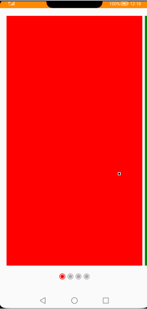
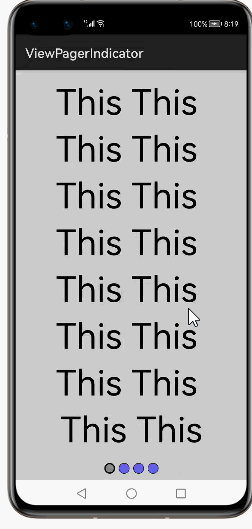
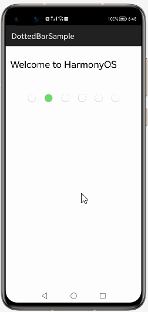
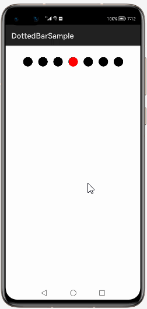

# How to use Dottedprogressbar.  Library for HarmonyOS: A developer’s Guide

## **1. Introduction**

Dotted progress bar. Use custom element or color to configure dots.

To get started right away, head on to [Gitee](https://gitee.com/HarmonyOS-tpc/dotted-progress-bar)


## **2. Typical Use Cases**
This library - com.trncic.dottedbarsample, is very useful in the development of applications which are in our daily use. Some of such examples mentioned below:


<center><table>
    <tr>
        <td>
            <ul><li><b>Circle Indicators</b></br>Create Circle Indicators for your beautiful aaplication between the two pages(Screen) </li><ul>
        </td>
       <td>
            <ul><li><b>ViewPager with Tab Title Dot Indicators</b></br>ViewPager is common among mobile developers, It is a group of multiple views connecting to each other with swipe effect.  </li><ul>
        </td>
    </tr>
    <tr>
        <td><center></center></td>
        <td><center></center></td>
    </tr>
</table></center>


## **3. Capability**
In this section, we can see the list of features which the library provides which makes the use of this library very easy and friendly. Primarily, this library supports customization of component attributes using the below mechanism.

* **Java APIs**</br>
Dotted Progress Bar  uses a simple fluent java API's that allows users to make most requests in a single line:
 
## **4. Features**
Features supported by this component includes the below:
* **Create dotted progress bar dynamically as per screen width.** </br>
Show dotted progress bar in portrait mode with element as resource. Number of dots should be dynamic as per the screen width.


## **5. Installation**
For using the library in your HarmonyOS mobile app, you need to first install it by following below methods.

* **Method 1:**  </br>
Generate the .har package through the library and add the .har package to the libs folder.Add the following code to the entry level build.gradle:
    <pre>
       <b style="color:green">
    implementation fileTree  (dir: 'libs', include: ['* .jar', '* .har'])
       </b>
</pre>

* **Method 2 :**  </br>
Copy the dependency from the gitee and add it to the entry level build.gradle:
<pre>
dependencies {
    implementation fileTree(dir: 'libs', include: ['*.har'])
    <b style="color:blue;">implementation 'io.openharmony.tpc.thirdlib:dotted-progress-bar:1.0.0'</b>
           }
</pre>


## **6. Usage**
This section will help us to understand the usage of the library as you use it in your Harmony-application developemnt project.

### **Step 1: Define layout via XML**
We are going to load list  into DottedProgressBar component using This  Library. So, add DottedProgressBar component into <strong>resource_file.xml</strong> file.

```xml
    <?xml version="1.0" encoding="utf-8"?>
    <DirectionalLayout
        xmlns:ohos="http://schemas.huawei.com/res/ohos"
        xmlns:app="http://schemas.huawei.com/hap/res-auto"
        ohos:height="match_parent"
        ohos:width="match_parent"
        ohos:orientation="vertical"
        ohos:background_element="#000000">
            
    <com.trncic.library.DottedProgressBar
      ohos:id="$+id:progress"
      ohos:width="match_parent"
      ohos:height="match_parent"
      ohos:padding="30vp"
      app:activeDot="$color:red"
      app:dotSize="29vp"
      app:inactiveDot="$color:black"
      app:jumpingSpeed="670"
      app:spacing="15vp" />
    </DirectionalLayout>
```
### **Step 2: Customize programmatically via Java API**
```java
   @Override
    public void onStart(Intent intent) {
        super.onStart(intent);
   DottedProgressBar progressBar = (DottedProgressBar) findComponentById(ResourceTable.Id_progress);
   progressBar.startProgress();
   progressBar.stopProgress();  

            }
```
### **List of XML attributes supported for DottedProgressBar**
Below is the list of XML attributes which are supported by the library.

<table>
	<tr><th>Name</th><th>Type</th><th width="100%">Info</th></tr>
	<tr><td>activeDot</td><td>image</td><td>To apply the image of the dotted-progress-bar</td></tr>
	<tr><td>dotSize</td><td>dimension </td><td>Size in dp of the dots (by default 16dp)</td></tr>
	<tr><td>inactiveDot</td><td>image</td><td>To apply the image of the dotted-progress-bar</td></tr>
	<tr><td>jumpingSpeed</td><td>integer</td><td>Size in dp of the speed between the dots </td></tr>
	<tr><td>spacing</td><td>dimension </td><td>Size in dp of the space between the dots (by default 4dp)</td></tr>
	</table>
	
### **List of public APIs for app-developer**

The public methods below will help us to operate on the component at runtime.

**DottedProgressBar  Methods**
<table>
<tr>
    <td>
        <ul>
            <li>startProgress()</li>
            <li>stopProgress() </li>
			 <li>onDraw(Component component, Canvas canvas) </li>
        </ul>
    </td>
  
</tr>
</table>

## **8. API usage examples**
In this section, we can have a look at some the examples where the APIs of this library is put to use and the results which we can acheive.

**Example1: Dotted Progressbar  should be  Displayed**
<table>
    <tr>
        <td >
        <b><u>Layout.xml</u>:</b>
        <pre>
&ltcom.trncic.library.DottedProgressBar
   ohos:id="$+id:progress"
   ohos:width="match_parent"
   ohos:height="match_parent"
   ohos:padding="30vp"
   app:activeDot="$media:active_dot"
   app:dotSize="29vp"
   app:inactiveDot="$media:inactive_dot"
   app:jumpingSpeed="670"
   app:spacing="15vp" />
</br>
</pre>
<b><u>Java Slice</u>:</b>
<pre>
 DottedProgressBar bar = (DottedProgressBar) 
 findComponentById(ResourceTable.Id_progress);
  if(bar == null) {
 System.out.println("DottedProgressBar
 activeDot and inactiveDot params not set for Component");
 return;
 }
  Runnable run = () -> startProgress();
 EventHandler han = new EventHandler
 (EventRunner.getMainEventRunner());
 han.postTask(run, delay);
        </pre>
        </td>
        <td >
        <center></center>
        </td>
    </tr>
</table>


**Example2: Dotted Progressbar  should be  Displayed with Custom Color**
<table>
    <tr>
        <td >
        <b><u>Layout.xml</u>:</b>
        <pre>
&ltcom.trncic.library.DottedProgressBar
   ohos:id="$+id:progress"
   ohos:width="match_parent"
   ohos:height="match_parent"
   ohos:padding="30vp"
   app:activeDot="$color:red"
   app:dotSize="25vp"
   app:inactiveDot="$color:black"
   app:jumpingSpeed="670"
   app:spacing="15vp" />
</br>
</pre>
<b><u>Java Slice</u>:</b>
<pre>
 DottedProgressBar bar = (DottedProgressBar) 
 findComponentById(ResourceTable.Id_progress);
  if(bar == null) {
 System.out.println("DottedProgressBar
 activeDot and inactiveDot params not set for Component");
 return;
 }
  Runnable run = () -> startProgress();
 EventHandler han = new EventHandler
 (EventRunner.getMainEventRunner());
 han.postTask(run, delay);
 <b style="color:DarkCyan;">  app:activeDot="$color:red"
   app:inactiveDot="$color:black",</b> 
        </pre>
        </td>
        <td >
        <center></center>
        </td>
    </tr>
</table>


## ** 9. Conclusion**
Dotted Progress Bar is a very easy to use and very powerful library.The performance of the library is very good even when it works on one of the latest operating systems in the world, which is HarmonyOS!

* For more exciting libraries to develop your app, peep into third-party-components at </br>
[OpenHarmony-TPC](https://gitee.com/openharmony-tpc)

* To know more about the developement work happening on harmony aaplication layer, and even be part of the exciting stuff, watch this space of [Application Library Engineering Group](https://github.com/applibgroup)