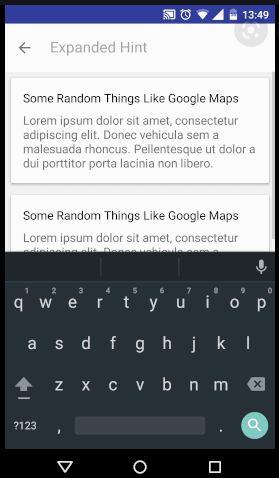
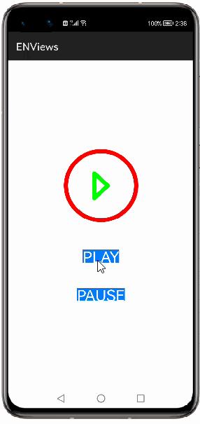
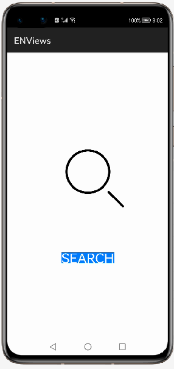

# 1. How to use ENViews Library for HarmonyOS: A developer’s Guide
## **1. Introduction**
ENViews is a lightweight useful library which provides different animation views used in our daily life like 
 1. search view
 2. refresh view 
 3. download view
 4. scroll view
 5. play view
 6. loading view
 7. volume view

To get started right away, head on to [Gitee](https://gitee.com/HarmonyOS-tpc/ENViews)

## **2. Typical Use Case**
This library - moe.codeest.enviews, is very useful in the development of application's feature requiring instant use. Couple of such examples are mentioned below:

<table>
    <tr>
        <td>
            <ul><li><b>search view</b> </li><ul>
        </td>
    </tr>
    <tr>
        <td>

</td>
    </tr>
</table>

## **3. Capability**
In this section, we can see the list of features which the library provides which makes the use of this library very easy and friendly. Primarily, this library supports customization of component attributes using the below mechanisms.

* **XML layout inflation** 
With the help of xml layout inflation, the library is so easy to use such that, we can put the component to action without even writing a single line of code. This will be so useful for quick development, as well as for beginners who are starting with mobile-app development. On how to use the XML Layout Inflation can be seen in the coming sections of the tutorial.

* **Customization via Java APIs** 
In case we need to customize the component during run time, we also have the flexibility to do that using the JAVA APIs which the library exposes. The APIs will also help us to utilize the features provided from its **7** view classes **ENDownloadView , ENPlayView , ENLoadingView , ENRefreshView , ENScrollView , ENSearchView , ENVolumeView** . 

## **4. Features**
Features supported by this component includes the below:

* **Search View :** 
Search view has animation for search operation.

* **Refresh View :** 
Refresh view animation is used for webpage refresh, mailbox refresh etc.

* **Download View:** 
Download view animation is used for any type of file download along with its download progress value.

* **Scroll View:** 
Scroll view animation is used as switch enable/disable.

* **Play View** 
Play view is used to play/stop any audio/video , start/resume/pause game etc.

* **Loading View** 
Loading action comes to picture when there is need of some time to load info completely. 

* **Volume View** 
Volume animation is used to increase ,decrease or to mute sound.

## **5. Installation**
For using the library in your HarmonyOS mobile app, you need to first install it by adding the below dependency in your entry/build.gradle file.
<pre>
dependencies {
    implementation fileTree(dir: 'libs', include: ['*.har'])
    <b style="color:blue;">implementation 'io.openharmony.tpc.thirdlib:ENViews:1.0.1'</b>
    testCompile 'junit:junit:4.12'
}
</pre>

## **6. Usage**
This section will help us to understand the usage of the library as you use it in your Harmony-application developement project.

### **Step 1: Define layout via XML**

    <?xml version="1.0" encoding="utf-8"?>
    <DirectionalLayout
        xmlns:ohos="http://schemas.huawei.com/res/ohos"
        xmlns:app="style"
        ohos:height="match_parent"
        ohos:width="match_parent"
        ohos:orientation="vertical"
        ohos:background_element="#000000">
            <moe.codeest.enviews.ENDownloadView         
                ohos:id="$+id:view_download"
                ohos:height="50vp"
                ohos:width="50vp"
                ohos:top_margin="50vp"
                ohos:layout_alignment="horizontal_center"
                app:download_line_color="#00ff00"
                app:download_bg_line_color="#3a3f45"
                app:download_text_color="#ff0000"
                app:download_line_width="9vp"
                app:download_bg_line_width="9vp"
                app:download_text_size="15vp">
            </moe.codeest.enviews.ENDownloadView>
    </DirectionalLayout>

### **Step 2: Customize programmatically via Java API**

    @Override
    public void onStart(Intent intent) {
        super.onStart(intent);
        super.setUIContent(ResourceTable.Layout_NewSilce);
        ENDownloadView downloadView;
        downloadView = (ENDownloadView)findComponentById(ResourceTable.Id_view_download);
        downloadView.start();
    }

### **List of XML attributes supported**
Below is the list of XML attributes which are supported by the library.

**Download View**

* download_line_color - To specify download progress color.
* download_bg_line_color - To specify background color of download view.
* download_text_color - To specify download size text color. 
* download_line_width - To specify width of download progress.
* download_bg_line_width - To specify background width of download view.
* download_text_size - To specify download size text size.
	
**Play View**

* play_line_color - To specify line color of play/pause icon.
* play_bg_line_color - To specify background color of play view.
* play_line_width - To specify line width of play/pause icon.
* play_bg_line_width - To specify background line width of play view.

**Refresh View**

* refresh_line_color - To specify refresh view line color.
* refresh_line_width - To specify refresh view line width.

**Scroll View**

* scroll_line_color - To specify the line color when selected.
* scroll_bg_line_color - To specify the scroll view line color.
* scroll_line_width - To specify line width when selected.
* scroll_bg_line_width - To specify the scroll view line width.
* scroll_is_selected - To specify boolean value for selection status.
* scroll_view_translation_x - To specify x-direction translation value.

**Search View**

* search_line_color - To specify search view line color.
* search_line_width - To specify search view line width.
* search_dot_size - To specify dot size for search animation.

**Volume View**

* volume_line_color - To specify volume view line color when tuned.
* volume_line_width - To specify volume view line width when tuned.
* volume_bg_line_color - To specify volume view background line color.
* volume_bg_line_width - To specify volume view background line width.

### **List of public APIs for app-developer**
The public methods below will help us to operate on the component at runtime.

**Public Methods**

**1. Download View Class / ENDownloadView Class**

<table>
<tr>
    <td>
        <ul>
            <li>start()</li>
            <li>reset()</li>
            <li>setgetCurrentState</li>
            <li>setBgLineColor()</li>
            <li>setBgLineWidth()</li>
            <li>setDownloadConfig()</li>
        </ul>
    </td>
    <td>
        <ul>
            <li>setSize())</li>
            <li>setTextColor()</li>
            <li>setLineColor()</li>
            <li>setTextSize()</li>
            <li>setLineWidth()</li>
            <li>setOnDownloadStateListener()</li>
        </ul>
    </td>
</tr>
</table>

**2. Play View Class / ENPlayView Class**

<table>
<tr>
    <td>
        <ul>
            <li>play()</li>
            <li>pause()</li>
            <li>setBgLineColor()</li>
            <li>setBgLineWidth()</li>
        </ul>
    </td>
    <td>
        <ul>
            <li>setDuration()</li>
            <li>setLineColor()</li>
            <li>setLineWidth()</li>
        </ul>
    </td>
</tr>
</table>

**3. Loading View Class / ENLoadingView Class**

<table>
<tr>
    <td>
        <ul>
            <li>hide()</li>
            <li>show()</li>
        </ul>
    </td>
</tr>
</table>

**4. Refresh View Class / ENRefreshView Class**

<table>
<tr>
    <td>
        <ul>
            <li>setDuration()</li>
            <li>startRefresh()</li>
        </ul>
    </td>
</tr>
</table>

**5. Scroll View Class / ENScrollView Class**

<table>
<tr>
    <td>
        <ul>
            <li>isSelected()</li>
            <li>select()</li>
        </ul>
    </td>
    <td>
        <ul>
            <li>setDuration()</li>
            <li>unSelect()</li>
        </ul>
    </td>
</tr>
</table>

**6. Search View Class / ENSearchView Class**

<table>
<tr>
    <td>
        <ul>
            <li>start()</li>
        </ul>
    </td>
</tr>
</table>

**7. Volume View Class / ENVolumeView Class**

<table>
<tr>
    <td>
        <ul>
            <li>updateVolumeValue()</li>
        </ul>
</tr>
</table>

## **7. API usage examples**
In this section, we can have a look at some of the examples where the APIs of this library is put to use and the results which we can achieve.

**Example1: Color customization for play view line and background line color when play/pause**

In this example, the play view is in default paused state with black background line color and gray line color set from layout.xml and same can be set from java api as mentioned .The color code is in [RGB-format](https://htmlcolorcodes.com/)
<table>
    <tr>
        <td>
        <pre>
<b><u>Layout.xml</u>:</b>
&ltmoe.codeest.enviews.ENPlayView
    ohos:id="$+id:view_play"
    ohos:height="150vp"
    ohos:width="150vp"
    ohos:top_margin="20vp"
    ohos:layout_alignment="horizontal_center"
    ohos:top_padding="10vp"
    <b style="color:blue;">app:play_line_color="#0ff0f0"</b>/>
    <b style="color:blue;">app:play_bg_line_color="#ff00ff"</b>/>
    <b style="color:blue;">app:play_line_width="5vp"</b>/>
    <b style="color:blue;">app:play_bg_line_width="4vp"</b>/>
 
<b><u>Java Slice</u>:</b>
ENPlayView playview;
playview = (ENPlayView)findComponentById(ResourceTable.Id_view_play);
<b style="color:blue;">playview.play();</b>
<b style="color:blue;">playview.pause();</b>
<b style="color:blue;">playView.setBgLineColor(Color.RED.getValue());</b>
<b style="color:blue;">playView.setLineColor(Color.GREEN.getValue());</b>
        </pre>
        </td>
        <td>
        

        </td>
    </tr>
</table>

**Example2: Customizing search view**
<table>
    <tr>
        <td>
        <pre>
<b><u>Layout.xml</u>:</b>
&ltmoe.codeest.enviews.ENSearchView
    ohos:id="$+id:view_search"
    ohos:height="150vp"
    ohos:width="150vp"
    ohos:top_margin="10vp"
    ohos:layout_alignment="horizontal_center"
    app:search_line_color="#000000"
    app:search_line_width="5vp"
    app:search_dot_size="2vp"/>
 
<b><u>Java Slice</u>:</b>
ENSearchView searchView 
searchView = findComponentById(ResourceTable.Id_view_search);
<b style="color:blue;">searchView.start();</b>
        </pre>
        </td>
        <td>
        

        </td>
    </tr>
</table>

## **8. Conclusion**
ENViews lib is user friendly and powerful library.The performance of the library is excellent when works on one of the latest operating systems in the world, which is HarmonyOS!

* For more exciting libraries to develop your app, peep into third-party-components at  
[OpenHarmony-TPC](https://gitee.com/openharmony-tpc)

* To know more about the development work happening on harmony aaplication layer, and even be part of the exciting stuff, watch this space of [Application-Library Engineering Group](https://github.com/applibgroup)