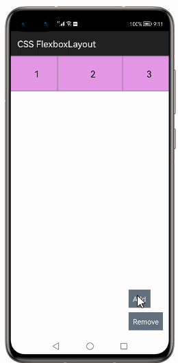

# How to use FlexboxLayout  Library for HarmonyOS: A developer’s Guide

## **1. Introduction**

The Flexbox layout model aims to offer more efficient ways to lay out flex items in a flex container even if flex item's size are unknown. Thus it offers more efficient ways to achieve responsive UI than with existing layouts.

FlexboxLayout is a library project which brings the similar capabilities of CSS Flexible Box Layout Module to openharmony.
In the flex layout model, the children of a flex container can be laid out in any direction, and can “flex” their sizes, either growing to fill unused space or shrinking to avoid overflowing the parent.
Both horizontal and vertical alignment of the children can be easily manipulated.

To get started right away, head on to [Gitee](https://gitee.com/HarmonyOS-tpc/flexbox-layout)

## **2. Typical Use Cases**
This library - com.google.harmony.flexbox.FlexboxLayout, is very useful in the development of applications which are in our daily use. Some of such examples mentioned below:


<div align="center">
<table>
    <tr>
        <td>
            <ul><li><b>CSS Flexible Box Layout</b></br>The flexbox or flexible box model in CSS is a one-dimensional layout model</li><ul>
        </td>
       <td>
            <ul><li><b>RecyclerView FlexBoxLayout</b></br> RecyclerView items with FlexboxLayoutManager</li><ul>
        </td>
    </tr>
    <tr>
        <td width="50%"><p align="center"></p></td>
        <td width="50%"><p align="center"></p></td>
    </tr>
</table>
</div>

## **3. Capability**
In this section, we can see the list of features which the library provides which makes the use of this library very easy and friendly. Primarily, this library supports customization of component attributes using the below mechanism.

* **Java APIs**</br>
FlexboxLayout  uses a simple fluent java API's that allows users to make most requests in a single line:
 

## **4. Features**

- Creating Flexbox Layout with Flex Direction in `ROW`, `ROW_REVERSE`, `COLUMN` and `COLUMN_REVERSE`.
- Creating Flexbox Layout with Flex Wrap as `NO_WRAP,` `WRAP` and `WRAP_REVERSE`.
- Creating Flexbox Layout with Justify Content as `FLEX_START`, `FLEX_END`, `CENTER`, `SPACE_BETWEEN`, `SPACE_AROUND` and `SPACE_EVENLY`.
- Creating Flexbox Layout with Align Items as `FLEX_START`, `FLEX_END`, `CENTER`, `BASELINE`, and `STRETCH`.
- Creating Flexbox Layout with Align Content as `FLEX_START`, `FLEX_END`, `CENTER`, `SPACE_BETWEEN`, `SPACE_AROUND` and `STRETCH`.
- Updating attributes of Child view with order value.
- Updating attributes of Child view with flex grow and flex shrink values.
- Updating attributes of Child view with flex basis percent value.
- Updating attributes of Child view with width, height along with minimum and maximum values.
- Updating attributes of Child view with wrap before.
- Updating attributes of Child view with Align Self as `AUTO`, `FLEX_START`, `FLEX_END`, `CENTER`, `BASELINE`, and `STRETCH`.


## **5. Installation**
For using the library in your HarmonyOS mobile app, you need to first install it by following below methods.

* **Method 1:**  </br>
Generate the .har package through the library and add the .har package to the libs folder.Add the following code to the entry level build.gradle:
    <pre>
       <b style="color:green">
    implementation fileTree  (dir: 'libs', include: ['* .jar', '* .har'])
       </b>
</pre>

* **Method 2 :**  </br>
Copy the dependency from the gitee and add it to the entry level build.gradle:
<pre>
dependencies {
    implementation fileTree(dir: 'libs', include: ['*.har'])
    <b style="color:blue;">implementation 'io.openharmony.tpc.thirdlib:flexbox-layout:1.0.0'</b>
           }
</pre>

## **6. Usage**
This section will help us to understand the usage of the library as you use it in your Harmony-application developemnt project.

### **Step 1: Define layout via XML**

To include flexbox layout in your ability view, add the `com.google.harmony.flexbox.FlexboxLayout` to your layout XML file.

```XML
<com.google.harmony.flexbox.FlexboxLayout
        ohos:id="$+id:flexbox"
        ohos:height="match_parent"
        ohos:width="match_parent">
        <Text
            ohos:id="$+id:text_1"
            ohos:height="80vp"
            ohos:width="110vp"
            ohos:background_element="$graphic:flex_item_background"
            ohos:text_alignment="center"
            ohos:text="1"
            ohos:text_size="20fp" />
        <Text
            ohos:id="$+id:text_2"
            ohos:height="80vp"
            ohos:width="140vp"
            ohos:background_element="$graphic:flex_item_background"
            ohos:text_alignment="center"
            ohos:text="2"
            ohos:text_size="20fp" />
        <Text
            ohos:id="$+id:text_3"
            ohos:height="80vp"
            ohos:width="110vp"
            ohos:background_element="$graphic:flex_item_background"
            ohos:text_alignment="center"
            ohos:text="3"
            ohos:text_size="20fp" />
</com.google.harmony.flexbox.FlexboxLayout>
```

and access from code like this:

```java
FlexboxLayout flexLayout = ((FlexboxLayout) findComponentById(ResourceTable.Id_flexbox));
// To set Flex Direction
flexLayout.setFlexDirection(ROW);
...
// set other properties
```


### **List of public APIs for app-developer**
The public methods below will help us to operate on the component at runtime.

**FlexBoxLayout  Methods**
<table>
<tr>
    <td>
        <ul>
            <li>flexItem.setOrder(order)</li>
            <li>flexItem.setFlexGrow(flexGrow)</li> 
			<li>flexItem.setFlexShrink(flexShrink)</li>
			<li>flexItem.setFlexBasisPercent(flexBasisPercent)</li>
			<li>flexItem.setHeight(height)</li>
			<li>flexItem.setWidth(width)</li>
			<li>flexItem.setMaxHeight(maxHeight)</li>
			<li>flexItem.setMinHeight(minHeight)</li>
			<li>flexItem.setMaxWidth(maxWidth)</li>
			<li>flexItem.setMaxWidth(maxWidth)</li>
			<li>flexItem.setAlignSelf(alignSelf )</li>
			<li>flexItem.setWrapBefore(isWrapBefore)</li>
        </ul>
    </td>
  
</tr>
</table>


## **8. API usage examples**

## Example1 Attributes for the FlexboxLayout:


  ```java
  FlexboxLayout flexLayout = ((FlexboxLayout) findComponentById(ResourceTable.Id_flexbox));
  // To set Flex Direction
  flexLayout.setFlexDirection(ROW);
  // ... other required properties
  flexLayout.refresh();
  ```

    Flexbox Layout will be  created with flex direction in row mode. See screenshots below:
  
  <p align="center"></img></p>

## Example2 Fixelwrap for the FlexboxLayout:

  
  ```java
  FlexboxLayout flexLayout = ((FlexboxLayout) findComponentById(ResourceTable.Id_flexbox));
  // To set Flex Wrap
  flexLayout.setFlexWrap(WRAP);
  // ... other required properties
  flexLayout.refresh();
  ```

  Flexbox Layout will be created with flex wrap in wrap mode. See screenshots below:
  
  <p align="center"></img></p>
  
## Example3 justifyContent for the FlexboxLayout:

  
  
  Ex: Identify Flexbox Layout in Slice:

  ```java
  FlexboxLayout flexLayout = ((FlexboxLayout) findComponentById(ResourceTable.Id_flexbox));
  flexLayout.setFlexWrap(WRAP);
  // To set Justify Content
  flexLayout.setJustifyContent(FLEX_START);
  // ... other required properties
  flexLayout.refresh();
  ```
  
  Flexbox Layout will be  created with flex wrap in wrap and justify content with start. See screenshots below:
  
  <p align="center"></img></p>

## Example4 alignItems for the FlexboxLayout:

 

  Ex: Identify Flexbox Layout in Slice:

  ```java
  FlexboxLayout flexLayout = ((FlexboxLayout) findComponentById(ResourceTable.Id_flexbox));
  flexLayout.setFlexWrap(WRAP);
  // To set align items
  flexLayout.setAlignItems(FLEX_START);
  // ... other required properties
  flexLayout.refresh();
  ```

    Flexbox Layout will be  created with flex wrap in wrap and align items with flex start. See screenshots below:
  
  <p align="center"></img></p>

## Example5 alignContent for the FlexboxLayout:

 
  
  Ex: Identify Flexbox Layout in Slice:

  ```java
  FlexboxLayout flexLayout = ((FlexboxLayout) findComponentById(ResourceTable.Id_flexbox));
  flexLayout.setFlexWrap(WRAP);
  // To set align Content
  flexLayout.setAlignContent(FLEX_START);
  // ... other required properties
  flexLayout.refresh();
  ```
  
    Flexbox Layout will be  created with flex wrap in wrap and align content with `FLEX_START` views. See screenshots below:
  
  <p align="center"></img></p>
  

-


 
## **9. Conclusion**
StickyListHeaders is a very easy to use and very powerful library.The performance of the library is very good even when it works on one of the latest operating systems in the world, which is HarmonyOS!

* For more exciting libraries to develop your app, peep into third-party-components at </br>
[OpenHarmony-TPC](https://gitee.com/openharmony-tpc)

* To know more about the developement work happening on harmony aaplication layer, and even be part of the exciting stuff, watch this space of [Application Library Engineering Group](https://github.com/applibgroup)


