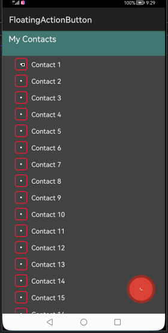
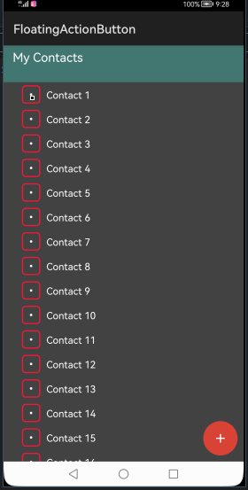
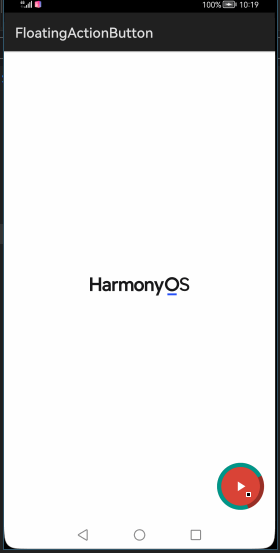
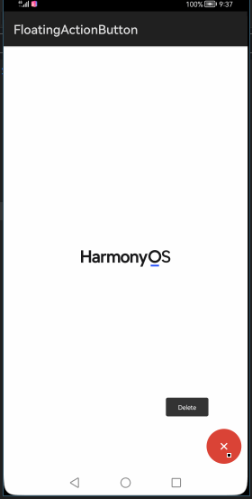

# How to use FloatingActionButton Library for HarmonyOS: A developer’s Guide

## **1. Introduction**
Yet another implementation of Floating Action Button for HMOS with lots of features.

To get started right away, head on to [Gitee](https://gitee.com/harmonyos-tpc/FloatingActionButton)


## **2. Typical Use Cases**
This library - com.github.clans.fab, is very useful in the development of applications which are in our daily use. Couple of such examples are mentioned below:

<center><table>
    <tr>
        <td>
            <ul><li><b>Contact List dial</b></br>Dailling the selected contact using Button</li><ul>
        </td>
        <td>
            <ul><li><b>Contact dial</b></br>Dailing the selected contact using menu</li><ul>
        </td>
    </tr>
    <tr>
        <td><center></center></td>
        <td><center></center></td>
    </tr>
</table></center>


## **3. Capability**
In this section, we can see the list of features which the library provides which makes the use of this library very easy and friendly. Primarily, this library supports customization of component attributes using the below mechanisms.

* **XML layout inflation**</br>
With the help of xml layout inflation, the library is so easy to use such that, we can put the component to action without even writing a single line of code. This will be so useful for quick development, as well as for beginners who are starting with mobile-app development. On how to use the XML Layout Inflation can be seen in the coming sections of the tutorial.

* **Customization via Java APIs**</br>
In case we need to customize the component during run time, we also have the flexibility to do that using the JAVA APIs which the library exposes. The APIs will also help us to utilize the features provided from its parent “Component” Class 

## **4. Features**
Features supported by this component includes the below:
* **Option to set custom normal/pressed colors**</br>
* **Option to set custom animations**</br>
* **Option to set custom icon drawable**</br>
* **Support for normal 56dp and mini 40dp button sizes**</br>
* **Custom FloatingActionMenu icon animations**</br>
* **Option to expand menu up and down**</br>
* **Option to show labels to the left and to the right of the menu**</br>
* **Option to show circle progress on FloactinActionButton**</br>
* **Option to add button to the FloatingActionMenu programmatically**</br>
* **Option to dim the FloatinActionMenu's background**</br>
* **Option to remove all buttons from the FloatingActionMenu**</br>
* **Option to set a label for the FloatingActionMenu's button**</br>

## **5. Installation**
For using the library in your HarmonyOS mobile app, you need to first install it by adding the below dependency in your entry/build.gradle file.

```groovy
dependencies {
    implementation 'io.openharmony.tpc.thirdlib:floatingactionbutton:1.0.0'
}
```

## **6. Usage**
This section will help us to understand the usage of the library as you use it in your Harmony-application developemnt project.

### **Step 1: Define layout via XML**
**Floating action Button**<br>
Add the <b style="color:blue;"> com.github.clans.fab.FloatingActionButton</b> to your layout XML file.
```xml
<StackLayout
    xmlns:ohos="http://schemas.huawei.com/res/ohos"
    ohos:id="$+id:parent"
    ohos:height="match_parent"
    ohos:width="match_parent">

    <com.github.clans.fab.FloatingActionButton
        ohos:id="$+id:fabBtn"
        ohos:height="match_content"
        ohos:width="match_content"
        ohos:bottom_margin="12vp"
        ohos:fab_elevation="4vp"
        ohos:image_src="$media:ic_menu"
        ohos:layout_alignment="bottom|right"
        ohos:right_margin="16vp"/>

</StackLayout>
```
### **Step 2: Customize programmatically via Java API**
```java
    @Override
    public void onStart(Intent intent) {
        super.onStart(intent);
        ComponentContainer root_layout = (ComponentContainer)LayoutScatter.getInstance(getContext()).parse(ResourceTable.Layout_slice_home, null, false);
        mFab = (FloatingActionButton) mRootId.findComponentById(ResourceTable.Id_fabBtn);
    }
```

**Floating action menu**<br>
Add the <b style="color:blue;"> com.github.clans.fab.FloatingActionMenu</b> to your layout XML file.
```xml
    <com.github.clans.fab.FloatingActionMenu
        ohos:id="$+id:menu_green"
        ohos:height="match_content"
        ohos:width="match_content"
        ohos:align_parent_bottom="true"
        ohos:align_parent_right="true"
        ohos:bottom_margin="10vp"
        ohos:left_margin="10vp"
        ohos:menu_animationDelayPerItem="500"
        ohos:menu_colorNormal="#43A047"
        ohos:menu_colorPressed="#2E7D32"
        ohos:menu_icon="$media:ic_star"
        ohos:right_margin="150vp"
        ohos:top_margin="10vp"
        >

        <com.github.clans.fab.FloatingActionButton
            ohos:height="match_content"
            ohos:width="match_content"
            ohos:fab_colorNormal="#43A047"
            ohos:fab_colorPressed="#2E7D32"
            ohos:fab_label="lorem_ipsum"
            ohos:fab_size="1"
            ohos:image_src="$media:ic_edit"/>

    </com.github.clans.fab.FloatingActionMenu>
```
### **Step 2: Customize programmatically via Java API**
```java
    @Override
    public void onStart(Intent intent) {
        super.onStart(intent);
        ComponentContainer root_layout = (ComponentContainer)LayoutScatter.getInstance(getContext()).parse(com.github.clans.fab.sample.ResourceTable.Layout_slice_menu, null, false);
        menuGreen = (FloatingActionMenu) root_layout.findComponentById(ResourceTable.Id_menu_green);
    }
```
### **List of XML attributes supported for Floating action Button**
Below is the list of XML attributes which are supported by the library.

<table>
	<tr><th>Name</th><th>Type</th><th width="100%">Info</th></tr>
	<tr><td>fab_colorNormal</td><td>Color</td><td>TOption to set custom normal colors</td></tr>
	<tr><td>fab_colorPressed</td><td>Color</td><td>Option to set custom pressed colors</td></tr>
    <tr><td>fab_colorDisabled</td><td>Color</td><td>Option to set custom disabled colors</td></tr>
	<tr><td>fab_showShadow</td><td>Boolean</td><td>Option to set custom shadow effect</td></tr>
	<tr><td>fab_shadowColor</td><td>Color</td><td>Option to set custom shadow color</td></tr>
	<tr><td>fab_shadowRadius</td><td>Dimension</td><td>Option to set custom shadow radius</td></tr>
	<tr><td>fab_shadowXOffset</td><td>Dimension</td><td>Option to set custom shadow Offset</td></tr>
    <tr><td>fab_shadowYOffset</td><td>Dimension</td><td>Option to set custom shadow Offset</td></tr>
	<tr><td>fab_size</td><td>Integer</td><td>Support for normal 56dp and mini 40dp button sizes</td></tr>
    <tr><td>fab_label</td><td>String</td><td>Option to set a label for the FloatingActionMenu's button</td></tr>
    <tr><td>fab_showAnimation</td><td>Boolean</td><td>Option to set custom animations</td></tr>
    <tr><td>fab_hideAnimation</td><td>Boolean</td><td>Option to hide animations</td></tr>
    <tr><td>fab_progress_indeterminate</td><td>Boolean</td><td>Option to show circle progress on FloactinActionButton</td></tr>
    <tr><td>fab_progress_color</td><td>color</td><td>Option to set color for the progress on FloactinActionButton</td></tr>
    <tr><td>fab_progress_backgroundColor</td><td>color</td><td>Option to set backgroundColor for the progress on FloactinActionButton</td></tr>
    <tr><td>fab_progress_max</td><td>Integer</td><td>Option to set max value for the progress on FloactinActionButton</td></tr>
    <tr><td>fab_progress_showBackground</td><td>Boolean</td><td>Option to set background for the progress on FloactinActionButton</td></tr>
    <tr><td>fab_progress</td><td>Integer</td><td>Option to set progress on FloactinActionButton</td></tr>
    <tr><td>fab_elevation</td><td>Dimension</td><td>Option to set elevation on FloactinActionButton</td></tr>
</table>

### **List of XML attributes supported for Floating action menus**
Below is the list of XML attributes which are supported by the library.

<table>
	<tr><th>Name</th><th>Type</th><th width="100%">Info</th></tr>
	<tr><td>menu_buttonSpacing</td><td>Dimension</td><td>Option to set button spacing</td></tr>
	<tr><td>menu_labels_margin</td><td>Dimension</td><td>Option to set margin for lables</td></tr>
    <tr><td>menu_labels_position</td><td>Integer</td><td>Option to set labels position</td></tr>
	<tr><td>menu_labels_paddingTop</td><td>Dimension</td><td>Option to set labels padding Top</td></tr>
	<tr><td>menu_labels_paddingRight</td><td>Dimension</td><td>Option to set labels padding Right</td></tr>
	<tr><td>menu_labels_paddingBottom</td><td>Dimension</td><td>Option to set labels padding Bottom</td></tr>
	<tr><td>menu_labels_paddingLeft</td><td>Dimension</td><td>Option to set labels padding Left</td></tr>
    <tr><td>menu_labels_textColor</td><td>Color</td><td>Option to set labels text color</td></tr>
	<tr><td>menu_labels_textSize</td><td>Dimension</td><td>Option to set labels text size</td></tr>
    <tr><td>menu_labels_cornerRadius</td><td>Dimension</td><td>Option to set labels corner radius</td></tr>
    <tr><td>menu_labels_showShadow</td><td>Boolean</td><td>Option to set labels shadow</td></tr>
    <tr><td>menu_labels_colorNormal</td><td>color</td><td>Option to set custom normal label color</td></tr>
    <tr><td>menu_labels_colorPressed</td><td>color</td><td>Option to hiset custom pressed label color</td></tr>
    <tr><td>menu_labels_colorRipple</td><td>color</td><td>Option to hiset custom ripple label color</td></tr>
    <tr><td>menu_showShadow</td><td>Boolean</td><td>Option to set shadow for the menu</td></tr>
    <tr><td>menu_shadowColor</td><td>color</td><td>Option to set shadow color for the menu</td></tr>
    <tr><td>menu_shadowRadius</td><td>Dimension</td><td>Option to set shadow radius for the menu</td></tr>
    <tr><td>menu_shadowXOffset</td><td>Dimension</td><td>Option to set shadow X Offset</td></tr>
    <tr><td>menu_shadowYOffset</td><td>Dimension</td><td>Option to set shadow Y Offset</td></tr>
    <tr><td>menu_colorNormal</td><td>Integer</td><td>Option to hiset custom normal color</td></tr>
    <tr><td>menu_colorPressed</td><td>String</td><td>Option to hiset custom pressed color</td></tr>
    <tr><td>menu_colorRipple</td><td>Boolean</td><td>Option to hiset custom ripple color</td></tr>
    <tr><td>menu_animationDelayPerItem</td><td>Integer</td><td>Option to set animations</td></tr>
    <tr><td>menu_icon</td><td>Icon</td><td>Option to set menu icon's</td></tr>
    <tr><td>menu_labels_singleLine</td><td>Boolean</td><td>Option to set single Line for labels</td></tr>
    <tr><td>menu_labels_ellipsize</td><td>Integer</td><td>Option to set labels ellip size</td></tr>
    <tr><td>menu_labels_maxLines</td><td>Integer</td><td>Option to set max Line's for labels</td></tr>
    <tr><td>menu_fab_size</td><td>Integer</td><td>Option to set custom size for the menu</td></tr>
    <tr><td>menu_labels_style</td><td>Integer</td><td>Option to set labels_style</td></tr>
    <tr><td>menu_openDirection</td><td>Integer</td><td>Option to set open direction for Floactin Action Menu</td></tr>
    <tr><td>menu_backgroundColor</td><td>color</td><td>Option to set backgroundColor for the Floactin Action Menu</td></tr>
    <tr><td>menu_fab_label</td><td>String</td><td>Option to set menu label</td></tr>
    <tr><td>menu_labels_padding</td><td>Dimension</td><td>Option to set menu labels padding</td></tr>
    <tr><td>menu_labels_customFont</td><td>String</td><td>Option to set menu labels custom Font</td></tr>
</table>


### **List of public APIs for app-developer**
The public methods below will help us to operate on the <b style="color:blue;">Floating Action Button</b> at runtime.

<table> 
	<tr>
		<th colspan="2"> Setter Methods </th>
	</tr>
	<tr>
		<th>name</th>
		<th width="100%">info</th>
	</tr>
	<tr>
		<td>setButtonSize() </td>
		<td>To specify the Floating Action Button size</td>
	</tr>
	<tr>
		<td>setColorNormal() </td>
		<td>To set color for Floating Action Button </td>
	</tr>
	<tr>
		<td>setColorNormalResId() </td>
		<td>To specify color from resource</td>
	</tr>
	<tr>
		<td>setColorPressed() </td>
		<td>Option to set custom pressed colors</td>
	</tr>
    <tr>
		<td>setColorPressedResId() </td>
		<td>Option to set custom pressed colors from resource</td>
	</tr>
	<tr>
		<td>setColorRipple() </td>
		<td>Option to set custom ripple colors</td>
	</tr>
	<tr>
		<td>setColorRippleResId() </td>
		<td>Option to set custom ripple colors from resource</td>
	</tr>
	<tr>
		<td>setColorDisabled() </td>
		<td>Option to set custom disabled colors</td>
	</tr>
    <tr>
		<td>setColorDisabledResId() </td>
		<td>Option to set custom disabled colors from resource</td>
	</tr>
	<tr>
		<td>setShowShadow() </td>
		<td>Option to set custom shadow effect</td>
	</tr>
	<tr>
		<td>setShadowRadius() </td>
		<td>Option to set custom shadow radius</td>
	</tr>
	<tr>
		<td>setShadowXOffset() </td>
		<td>Option to set custom shadow Offset</td>
	</tr>
    <tr>
		<td>setShadowYOffset() </td>
		<td>Option to set custom shadow Offset</td>
	</tr>
	<tr>
		<td>setShadowColorResource() </td>
		<td>Option to set custom shadow color from resource</td>
	</tr>
    <tr>
		<td>setShadowColor() </td>
		<td>Option to set custom shadow color</td>
	</tr>
	<tr>
		<td>show() </td>
		<td>Option to set custom animations</td>
	</tr>
	<tr>
		<td>hide() </td>
		<td>Option to hide animations</td>
	</tr>
    <tr>
		<td>toggle() </td>
		<td>toogle between show and hide animation</td>
	</tr>
    <tr>
		<td>setLabelText() </td>
		<td>Option to set a label for the FloatingActionMenu's button</td>
	</tr>
	<tr>
		<td>setShowAnimation() </td>
		<td>Option to set custom animations</td>
	</tr>
	<tr>
		<td>setHideAnimation() </td>
		<td>Option to hide animations</td>
	</tr>
	<tr>
		<td>setLabelVisibility() </td>
		<td>Option to set label visibility</td>
	</tr>
    <tr>
		<td>setElevationCompat() </td>
		<td>Option to set elevation on FloactinActionButton</td>
	</tr>
	<tr>
		<td>setIndeterminate() </td>
		<td>Option to show circle progress on FloactinActionButton</td>
	</tr>
	<tr>
		<td>setMax() </td>
		<td>Option to set max value for the progress on FloactinActionButton</td>
	</tr>
	<tr>
		<td>setProgress() </td>
		<td>Option to set color for the progress on FloactinActionButton</td>
	</tr>
    <tr>
		<td>setShowProgressBackground() </td>
		<td>Option to set background for the progress on FloactinActionButton</td>
	</tr>
</table>

<table> 
	<tr>
		<th colspan="2">Getter Methods of Floactin Action Button</th>
	</tr>
	<tr>
		<th>name</th>
		<th width="100%">info</th>
	</tr>
	<tr>
		<td>getButtonSize() </td>
		<td>Returns the Floating Action Button size</td>
	</tr>
	<tr>
		<td>getColorNormal() </td>
		<td>Returns color normal of Floating Action Button </td>
	</tr>
	<tr>
		<td>getColorPressed() </td>
		<td>Returns color pressed of Floating Action Button</td>
	</tr>
	<tr>
		<td>getColorRipple() </td>
		<td>Returns color ripple of Floating Action Button </td>
	</tr>
	<tr>
		<td>getColorDisabled() </td>
		<td>Returnst color disabled of Floating Action Button</td>
	</tr>
	<tr>
		<td>hasShadow() </td>
		<td>Returns if shadow is set for Floating Action Button </td>
	</tr>
	<tr>
		<td>getShadowRadius() </td>
		<td>Returns the Floating Action Button radius</td>
	</tr>
	<tr>
		<td>getShadowXOffset() </td>
		<td>Returns shadow x offset of Floating Action Button </td>
	</tr>
	<tr>
		<td>getShadowYOffset() </td>
		<td>Returns shadow y offset of Floating Action Button size</td>
	</tr>
	<tr>
		<td>getShadowColor() </td>
		<td>Returns shadow color of Floating Action Button </td>
	</tr>
	<tr>
		<td>isHidden() </td>
		<td>Returns boolean if the Floating Action Button is hidden</td>
	</tr>
	<tr>
		<td>getLabelText() </td>
		<td>Returns the Floating Action Button label</td>
	</tr>
	<tr>
		<td>getLabelVisibility() </td>
		<td>Returns if Floating Action Button label visibilty</td>
	</tr>
	<tr>
		<td>getMax() </td>
		<td>Returns max size of Floating Action Button </td>
	</tr>
    <tr>
		<td>getProgress() </td>
		<td>Returns the progress of Floating Action Button </td>
	</tr>
    <tr>
		<td>isProgressBackgroundShown() </td>
		<td>Returns if Floating Action Button progress background is shown</td>
	</tr>
</table>

The public methods below will help us to operate on the <b style="color:blue;">Floating Action Menu</b> at runtime.

<table> 
	<tr>
		<th colspan="2"> Setter Methods </th>
	</tr>
	<tr>
		<th>name</th>
		<th width="100%">info</th>
	</tr>
	<tr>
		<td>toggle() </td>
		<td>To specify the Floating Action Menu toggle action</td>
	</tr>
	<tr>
		<td>open() </td>
		<td>To open Floating Action Menu </td>
	</tr>
	<tr>
		<td>close() </td>
		<td>To open Floating Action Menu</td>
	</tr>
	<tr>
		<td>setIconAnimationInterpolator() </td>
		<td>Option to set Animation Interpolator for the Icon</td>
	</tr>
    <tr>
		<td>setIconAnimationOpenInterpolator() </td>
		<td>Option to set Animation Interpolator for the Icon while open</td>
	</tr>
	<tr>
		<td>setIconAnimationCloseInterpolator() </td>
		<td>Option to set Animation Interpolator for the Icon while close</td>
	</tr>
	<tr>
		<td>setAnimated() </td>
		<td>Option to set Animation for the Menu</td>
	</tr>
	<tr>
		<td>setAnimationDelayPerItem() </td>
		<td>Option to set custom Animation delay</td>
	</tr>
    <tr>
		<td>setIconAnimated() </td>
		<td>Option to set custom Icon</td>
	</tr>
	<tr>
		<td>setIconToggleAnimatorSet() </td>
		<td>Option to set custom Icon Toggle Animator Set</td>
	</tr>
	<tr>
		<td>setMenuButtonShowAnimation() </td>
		<td>Option to set Menu Button Show Animation</td>
	</tr>
	<tr>
		<td>setMenuButtonHideAnimation() </td>
		<td>Option to hide Menu Button Animation</td>
	</tr>
    <tr>
		<td>showMenu() </td>
		<td>Called to show the animation</td>
	</tr>
	<tr>
		<td>hideMenu() </td>
		<td>To hide the naimation</td>
	</tr>
    <tr>
		<td>toggleMenu() </td>
		<td>called to toggle</td>
	</tr>
	<tr>
		<td>showMenuButton() </td>
		<td>to show Menu</td>
	</tr>
	<tr>
		<td>hideMenuButton() </td>
		<td>to hide menu</td>
	</tr>
    <tr>
		<td>toggleMenuButton() </td>
		<td>toogle between show and hide Menu</td>
	</tr>
    <tr>
		<td>setClosedOnTouchOutside() </td>
		<td>Listernet to close the Menu when touched outside</td>
	</tr>
	<tr>
		<td>setMenuButtonColorNormalResId() </td>
		<td>Option to set custom Color Normal</td>
	</tr>
	<tr>
		<td>setMenuButtonColorPressed() </td>
		<td>Option to set custom Color Pressed</td>
	</tr>
	<tr>
		<td>setMenuButtonColorPressedResId() </td>
		<td>Option to set custom Color Pressed</td>
	</tr>
    <tr>
		<td>setMenuButtonColorRipple() </td>
		<td>Option to set custom Color Ripple</td>
	</tr>
	<tr>
		<td>setMenuButtonColorRippleResId() </td>
		<td>Option to set custom Color Ripple</td>
	</tr>
	<tr>
		<td>addMenuButton() </td>
		<td>To add menu button</td>
	</tr>
	<tr>
		<td>removeMenuButton() </td>
		<td>To remove menu button</td>
	</tr>
    <tr>
		<td>removeAllMenuButtons() </td>
		<td>To remove all menu button</td>
	</tr>
    <tr>
		<td>setMenuButtonLabelText() </td>
		<td>to set label for menu</td>
	</tr>
    <tr>
		<td>setOnMenuButtonClickListener() </td>
		<td>Click listerner when menu is clicked</td>
	</tr>
    <tr>
		<td>setOnMenuButtonLongClickListener() </td>
		<td>Click listerner when menu is long clicked</td>
	</tr>
    <tr>
		<td>setOnMenuToggleListener() </td>
		<td>Click listerner when menu is toggled</td>
	</tr>
</table>

<table> 
	<tr>
		<th colspan="2">Getter Methods of Floactin Action Menu</th>
	</tr>
	<tr>
		<th>name</th>
		<th width="100%">info</th>
	</tr>
	<tr>
		<td>isOpened() </td>
		<td>Returns boolen when menu is opened</td>
	</tr>
	<tr>
		<td>isAnimated() </td>
		<td>Returns boolen when menu is animated </td>
	</tr>
	<tr>
		<td>getAnimationDelayPerItem() </td>
		<td>Returns animation delay</td>
	</tr>
	<tr>
		<td>isIconAnimated() </td>
		<td>Returns boolen if icon is animated </td>
	</tr>
	<tr>
		<td>getMenuIconView() </td>
		<td>Returns icon view</td>
	</tr>
	<tr>
		<td>getIconToggleAnimatorSet() </td>
		<td>Returns Icon Toggle Animator Set </td>
	</tr>
	<tr>
		<td>isMenuHidden() </td>
		<td>Returns boolen if menu is hidden</td>
	</tr>
	<tr>
		<td>isMenuButtonHidden() </td>
		<td>Returns boolen if menu button is hidden </td>
	</tr>
	<tr>
		<td>getMenuButtonColorNormal() </td>
		<td>Returns menu color normal</td>
	</tr>
	<tr>
		<td>getMenuButtonColorPressed() </td>
		<td>Returns menu color pressed </td>
	</tr>
	<tr>
		<td>getMenuButtonColorRipple() </td>
		<td>Returns menu color ripple</td>
	</tr>
	<tr>
		<td>getMenuButtonLabelText() </td>
		<td>Returns menu label</td>
	</tr>
	<tr>
		<td>getLabelVisibility() </td>
		<td>Returns menu label visibility</td>
	</tr>
</table>

## **7. API usage examples**
In this section, we can have a look at some of the examples where the APIs of this library is put to use and the results which we can acheive.

**Example1: Customising Floating action button**
Here are all the FloatingActionButton's xml attributes with their default values which means that you don't have to set all of them:

<table>
    <tr >
        <td width="50%">
        <b><u>Layout.xml</u>:</b>
        <pre >
&ltcom.github.clans.fab.FloatingActionButton
        ohos:id="$+id:fabBtn"
        ohos:height="match_content"
        ohos:width="match_content"
        ohos:bottom_margin="1vp"
        ohos:layout_alignment="bottom|right"
        ohos:right_margin="16vp"
        ohos:image_src="$media:ic_call_white_24dp"
        ohos:fab_colorNormal="#DA4336"
        ohos:fab_colorPressed="#E75043"
        ohos:fab_colorDisabled="#E75043"
        ohos:fab_showShadow="true"
        ohos:fab_shadowColor="#66000000"
        ohos:fab_shadowRadius="4dp"
        ohos:fab_shadowXOffset="1dp"
        ohos:fab_shadowYOffset="3dp"
        ohos:fab_size="normal"
        ohos:fab_label=""
        ohos:fab_progress_indeterminate="false"
        ohos:fab_progress_color="#FF009688"
        ohos:fab_progress_backgroundColor="#4D000000"
        ohos:fab_progress_max="100"
        ohos:fab_progress_showBackground="true"
        ohos:fab_progress="0"
        ohos:fab_elevation="4vp"/>
</br>
        </pre>
        </td>
        <td>
        <center></center>
        </td>
    </tr>
</table>

All of these FloatingActionButton's attributes has their corresponding getters and setters. So you can set them programmatically.

**Example2: Customising Floating action menu**

Here are all the FloatingActionMenu's xml attributes with their default values which means that you don't have to set all of them:

<table>
    <tr>
        <td width="50%">
        <b><u>Layout.xml</u>:</b>
        <pre>
&ltcom.github.clans.fab.FloatingActionMenu
        ohos:id="$+id:menu_red"
        ohos:height="match_content"
        ohos:width="match_parent"
        ohos:align_parent_bottom="true"
        ohos:align_parent_right="true"
        ohos:bottom_padding="10vp"
        ohos:right_margin="10vp"
        ohos:menu_backgroundColor="#ccffffff"
        ohos:menu_fab_size="normal"
        ohos:menu_showShadow="true"
        ohos:menu_shadowColor="#66000000"
        ohos:menu_shadowRadius="4dp"
        ohos:menu_shadowXOffset="1dp"
        ohos:menu_shadowYOffset="3dp"
        ohos:menu_colorNormal="#DA4336"
        ohos:menu_colorPressed="#E75043"
        ohos:menu_colorRipple="#99FFFFFF"
        ohos:menu_animationDelayPerItem="50"
        ohos:menu_icon="$media:/fab_add"
        ohos:menu_buttonSpacing="0dp"
        ohos:menu_labels_margin="0dp"
        ohos:menu_labels_paddingTop="4dp"
        ohos:menu_labels_paddingRight="8dp"
        ohos:menu_labels_paddingBottom="4dp"
        ohos:menu_labels_paddingLeft="8dp"
        ohos:menu_labels_padding="8dp"
        ohos:menu_labels_textColor="#FFFFFF"
        ohos:menu_labels_textSize="14sp"
        ohos:menu_labels_cornerRadius="3dp"
        ohos:menu_labels_colorNormal="#333333"
        ohos:menu_labels_colorPressed="#444444"
        ohos:menu_labels_colorRipple="#66FFFFFF"
        ohos:menu_labels_showShadow="true"
        ohos:menu_labels_singleLine="false"
        ohos:menu_labels_ellipsize="none"
        ohos:menu_labels_maxLines="-1"
        ohos:menu_labels_position="left"
        ohos:menu_openDirection="up"
        ohos:menu_fab_label="your_label_here">

		<com.github.clans.fab.FloatingActionButton
            ohos:id="$+id:fab1"
            ohos:height="match_content"
            ohos:width="match_content"
            ohos:fab_label="Call"
            ohos:fab_size="1"
            ohos:image_src="$media:ic_call_white_24dp"/>


        <com.github.clans.fab.FloatingActionButton
            ohos:id="$+id:fab2"
            ohos:height="match_content"
            ohos:width="match_content"
            ohos:fab_label="Message"
            ohos:fab_size="1"
            ohos:image_src="$media:ic_chat_white_24dp"/>

        <com.github.clans.fab.FloatingActionButton
            ohos:id="$+id:fab3"
            ohos:height="match_content"
            ohos:width="match_content"
            ohos:fab_label="Delete"
            ohos:fab_size="1"
            ohos:image_src="$media:ic_delete_forever_white_24dp"/>

</com.github.clans.fab.FloatingActionMenu>
</br>
        </pre>
        </td>
        <td >
        <center></center>
        </td>
    </tr>
</table>

## **8. Conclusion**
Floating Action Button is a very easy to use and very powerful library.The performance of the library is very good even when it works on one of the latest operating systems in the world, which is HarmonyOS!

* For more exciting libraries to develop your app, peep into third-party-components at </br>
[OpenHarmony-TPC](https://gitee.com/openharmony-tpc)

* To know more about the developement work happening on harmony aaplication layer, and even be part of the exciting stuff, watch this space of [Application Library Engineering Group](https://github.com/applibgroup)