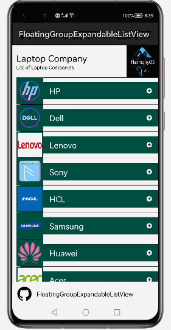
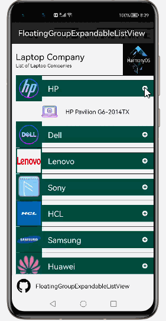
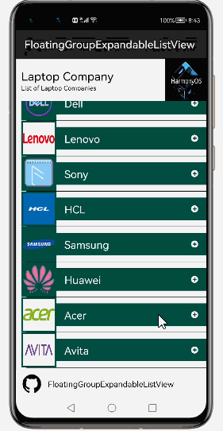
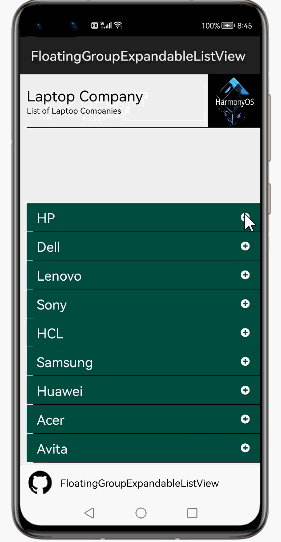
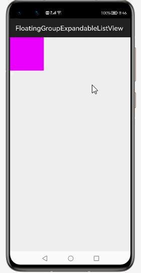

# How to use FloatingGroupExpandableListView  Library for HarmonyOS: A developer’s Guide

## **1. Introduction**

FloatingGroupExpandableListView is an open source library that provides a floating group list view using custom components with expand & collapse behavior.

## **2. Typical Use Cases**
This library - com.diegocarloslima.fgelv.lib, is very useful in the development of applications which are in our daily use. Some of such examples mentioned below:


<div align="center">
<table>
    <tr>
        <td>
            <ul><li><b>Group Items</b></br>The FloatingGroupExpandableListView displayed in a group items </li><ul>
        </td>
       <td>
            <ul><li><b>Child Items</b></br>The FloatingGroupExpandableListView displayed in a child items.</li><ul>
        </td>
    </tr>
    <tr>
        <td width="50%"><p align="center"></p></td>
        <td width="100%"><p align="center"></p></td>
    </tr>
</table>
</div>


## **3. Capability**
In this section, we can see the list of features which the library provides which makes the use of this library very easy and friendly. Primarily, this library supports customization of component attributes using the below mechanism.

* **Java APIs**</br>
FloatingGroupExpandableListView  uses a simple fluent java API's that allows users to make most requests in a single line:
 
## **4. Features**
Features supported by this component includes the below:
* **Works with list headers, footers, dividers and padding:** </br>
It should show the list items with name & images including header & footer view.

* **Works with partially transparent or hidden group views:**<br>
 
FloatingGroupExpandableListView Library should display with Set the parent iew vlayout params hieght to zero in your BaseExpandableListAdapter so that you can hide you parent
* **Handles touch events on the floating group view properly:**<br>
 Handling touch events in a FloatingGroup takes special care, because it's common for a FloatingGroup to have children that are targets for different touch events than the FloatingGroup itself. To make sure that each view correctly receives the touch events intended for it.
## **5. Installation**
For using the library in your HarmonyOS mobile app, you need to first install it by following below methods.

* **Method 1:**  </br>
Generate the .har package through the library and add the .har package to the libs folder.Add the following code to the entry level build.gradle:
    <pre>
       <b style="color:green">
    implementation fileTree  (dir: 'libs', include: ['* .jar', '* .har'])
       </b>
</pre>

* **Method 2 :**  </br>
Copy the dependency from the gitee and add it to the entry level build.gradle:
<pre>
dependencies {
    implementation fileTree(dir: 'libs', include: ['*.har'])
    <b style="color:blue;">implementation 'io.openharmony.tpc.thirdlib:FloatingGroupExpandableListView:1.0.1'</b>
           }
</pre>


## **6. Usage**
This section will help us to understand the usage of the library as you use it in your Harmony-application developemnt project.

### **Step 1: Define layout via XML**
We are going to load list  into FloatingGroupExpandableListView component using This  Library. So, add FloatingGroupExpandableListView component into <strong>resource_file.xml</strong> file.

```xml
    <?xml version="1.0" encoding="utf-8"?>
    <DirectionalLayout
        xmlns:ohos="http://schemas.huawei.com/res/ohos"
        xmlns:app="http://schemas.huawei.com/hap/res-auto"
        ohos:height="match_parent"
        ohos:width="match_parent"
        ohos:orientation="vertical"
        ohos:background_element="#000000">
            
       <com.diegocarloslima.fgelv.lib.FloatingGroupExpandableListView
                ohos:id="$+id:lcGroupItems"
                ohos:height="match_content"
                ohos:width="match_parent"
                ohos:above="$id:footerContainer"
                ohos:start_margin="$float:margin_10vp"/>
    </DirectionalLayout>
```
### **Step 2: Customize programmatically via Java API**
```java
   @Override
    public void onStart(Intent intent) {
        super.onStart(intent);
        DirectionalLayout dividerLayout = (DirectionalLayout)findComponentById(ResourceTable.Id_divider);
        dividerLayout.setBackground(getShapeElement(Color.BLACK.getValue()));
        mGroupContainer = (FloatingGroupExpandableListView)findComponentById(ResourceTable.Id_lcGroupItems);
        prepareExpandableListAdapter();
        mGroupContainer.setAdapter(expandableListAdapter);

    }
```

### **List of public APIs for app-developer**
The public methods below will help us to operate on the component at runtime.

**FloatingGroupExpandableListView  Methods**
<table>
<tr>
    <td>
        <ul>
            <li>setAdapter(ExpandableListAdapter adapter)</li>
            <li>setItemProvider(BaseItemProvider itemProvider)</li>
        </ul>
    </td>
  
</tr>
</table>

## **8. API usage examples**
In this section, we can have a look at some the examples where the APIs of this library is put to use and the results which we can acheive.

**Example1: FloatingGroupExpandableListView with Group and Child Icons & Text**
<table>
    <tr>
        <td width=700px">
        <b><u>Layout.xml</u>:</b>
        <pre>
&ltcom.diegocarloslima.fgelv.lib.FloatingGroupExpandableListView
                    ohos:id="$+id:lcGroupItems"
                    ohos:height="match_content"
                    ohos:width="match_parent"
                    ohos:above="$id:footerContainer"/>
</br>
</pre>
<b><u>Java Slice</u>:</b>
<pre>
FloatingGroupExpandableListView fv;
fv = (FloatingGroupExpandableListView)
 findComponentById(ResourceTable.Id_lcGroupItems);
<b style="color:DarkCyan;">
         getGroupItems();
         getGroupIcons();</b>
  prepareHeaderFooterView(rootView);
 ScrollView parentLayout = (ScrollView) 
findComponentById(ResourceTable.Id_root);
   parentLayout.setBackground(getShapeElement
(ResUtil.getColor(this, ResourceTable.Color_back_gray)));
 DirectionalLayout dividerLayout = (DirectionalLayout)
findComponentById(ResourceTable.Id_divider);
 dividerLayout.setBackground
(getShapeElement(Color.BLACK.getValue()));
 prepareExpandableListAdapter();
        </pre>
        </td>
        <td width=300px">
        <center></center>
        </td>
    </tr>
</table>


**Example2: FloatingGroupExpandableListView Without Group and Child Icons**
<table>
    <tr>
        <td width=700px">
        <b><u>Layout.xml</u>:</b>
        <pre>
&ltcom.diegocarloslima.fgelv.lib.FloatingGroupExpandableListView
                    ohos:id="$+id:lcGroupItems"
                    ohos:height="match_content"
                    ohos:width="match_parent"
                    ohos:above="$id:footerContainer"/>
</br>
</pre>
<b><u>Java Slice</u>:</b>
<pre>
FloatingGroupExpandableListView fv;
fv = (FloatingGroupExpandableListView)
 findComponentById(ResourceTable.Id_lcGroupItems);
<b style="color:DarkCyan;">prepareExpandableListAdapter();;</b>
        mGroupContainer.setAdapter(expandableListAdapter);
        </pre>
        </td>
        <td width=300px">
        <center></center>
        </td>
    </tr>
</table>


**Example3: FloatingGroupExpandableListView with SlidingDrawer****
<table>
    <tr>
        <td width=700px">
        <b><u>Layout.xml</u>:</b>
        <pre>
&ltcom.diegocarloslima.fgelv.lib.FloatingGroupExpandableListView
                    ohos:id="$+id:lcGroupItems"
                    ohos:height="match_content"
                    ohos:width="match_parent"
                    ohos:above="$id:footerContainer"/>
</br>
</pre>
<b><u>Java Slice</u>:</b>
<pre>
SlidingDrawer drawer;
drawer= (SlidingDrawer)
findComponentById(ResourceTable.Id_slide); 
FloatingGroupExpandableListView fv;
fv = (FloatingGroupExpandableListView)
 findComponentById(ResourceTable.Id_lcGroupItems);
<b style="color:DarkCyan;">drawer.setOnDrawerScrollListener(this);
        drawer.setOnDrawerOpenListener(this);
        drawer.setOnDrawerCloseListener(this);</b>
        mGroupContainer.setAdapter(expandableListAdapter);
        </pre>
        </td>
        <td width=300px">
        <center></center>
        </td>
    </tr>
</table>


## **9. Conclusion**
FloatingGroupExpandableListView is a very easy to use and very powerful library.The performance of the library is very good even when it works on one of the latest operating systems in the world, which is HarmonyOS!

* For more exciting libraries to develop your app, peep into third-party-components at </br>
[OpenHarmony-TPC](https://gitee.com/openharmony-tpc)

* To know more about the developement work happening on harmony aaplication layer, and even be part of the exciting stuff, watch this space of [Application Library Engineering Group](https://github.com/applibgroup)
