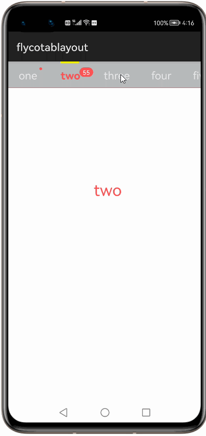

# How to use FlycoTabLayout Library for HarmonyOS: A developer’s Guide

## **1. Introduction**

A Harmony TabLayout Lib has 3 kinds of TabLayout at present.

* **SlidingTabLayout**

* **CommonTabLayout**

* **SegmentTabLayout like CommonTabLayout**

## **2. Typical Use Cases**
This library - FlycoTabLayout, is very useful in the development of applications which are in our daily use. we can create tabbed layouts with the help of this library. We can used to create different pages which changes based on the tab selection as shown below.

<div align="center">
<table>
    <tr>
        	<td width="50%"><p align="center"></p></td>
    </tr>
</table>
</div>


## **3. Capability**
In this section, we can see the list of features which the library provides which makes the use of this library very easy and friendly. Primarily, this library supports customization of component attributes using the below mechanism.

* **Java APIs**</br>
FlycoTabLayout  uses a simple fluent java API's that allows users to create more flexible tablayouts:
 
## **4. Features**
Features supported by this component includes the below:
* **SlidingTabLayout:** </br>
It supports SlidingTabLayout with below fetaures

    * new added attribute

    * new added kinds of indicators

    * new added unread msg tip

    * new added method for convenience

* **CommonTabLayout:**</br>
Supports CommonTabLayout with below fetaures.

    * support kinds of indicators and indicator animation

    * support unread msg tip

    * support icon and icon gravity.
    
    * new added method for convenience
* **SegmentTabLayout like CommonTabLayout:**<br>


## **5. Installation**
For using the library in your HarmonyOS mobile app, you need to first install it by following below methods.

* **Method 1:**  </br>
Generate the .har package through the library and add the .har package to the libs folder.Add the following code to the entry level build.gradle:
    <pre>
       <b style="color:green">
    implementation fileTree  (dir: 'libs', include: ['* .jar', '* .har'])
       </b>
</pre>

* **Method 2 :**  </br>
Copy the dependency from the gitee and add it to the entry level build.gradle:
<pre>
dependencies {
    implementation fileTree(dir: 'libs', include: ['*.har'])
    <b style="color:blue;">implementation 'io.openharmony.tpc.thirdlib:FlycoTabLayout:1.0.2'</b>
           }
</pre>


## **6. Usage**
This section will help us to understand the usage of the library as you use it in your Harmony-application developemnt project.

### **Step 1: Define layout via XML**
We need to add FlycoTabLayout component into <strong>resource_file.xml</strong> file.

```xml
<?xml version="1.0" encoding="utf-8"?>
<DirectionalLayout
    xmlns:ohos="http://schemas.huawei.com/res/ohos"
    xmlns:tl="style"
    ohos:id="$+id:common_tab"
    ohos:height="match_parent"
    ohos:width="match_parent"
    ohos:orientation="vertical">

    <com.flyco.tablayout.CommonTabLayout
        ohos:id="$+id:common1"
        ohos:height="60vp"
        ohos:width="match_parent"
        />

    <PageSlider
        ohos:id="$+id:vp"
        ohos:height="100vp"
        ohos:width="match_parent"/>

    <com.flyco.tablayout.CommonTabLayout
        ohos:id="$+id:common2"
        ohos:height="60vp"
        ohos:width="match_parent"
        />

    <com.flyco.tablayout.CommonTabLayout
        ohos:id="$+id:common3"
        ohos:height="60vp"
        ohos:width="match_parent"
        />

    <com.flyco.tablayout.CommonTabLayout
        ohos:id="$+id:common4"
        ohos:height="60vp"
        ohos:width="match_parent"
        tl:tl_indicator_color="#00ff88"
        tl:tl_indicator_style="2"
        tl:tl_textSelectColor="#ff5454"
        tl:tl_textUnselectColor="#66000000"
        tl:tl_textsize="16vp"
        tl:tl_underline_color="#dddddd"
        tl:tl_underline_height="1vp"
        tl:tl_iconVisible="false"
        tl:tl_indicator_margin_left="5vp"
        tl:tl_indicator_margin_right="5vp"
        tl:tl_indicator_corner_radius="10vp"
        />
</DirectionalLayout>
```
### **Step 2: Customize programmatically via Java API**
```java
   @Override
    protected void onStart(Intent intent) {
        super.onStart(intent);
        setUIContent(ResourceTable.Layout_layout_common_tab);
        PageSlider pageSlider = (PageSlider) findComponentById(ResourceTable.Id_vp);
        CommonTabLayout commonTabLayout = (CommonTabLayout) findComponentById(ResourceTable.Id_common1);
        for (int i = 0; i < mTitles.length; i++) {
            mTabEntities.add(new TabEntity(mTitles[i], mIconSelectIds[i], mIconUnselectIds[i]));
        }
        CommonTabLayout.CommonTabLayoutConfig commonTabLayoutConfig = commonTabLayout.new CommonTabLayoutConfig();
        commonTabLayoutConfig.indicatorColor = 0xff2c97de;
        commonTabLayoutConfig.textSelectColor = 0xff2c97de;
        commonTabLayoutConfig.textUnselectColor = 0x66000000;
        commonTabLayoutConfig.underlineColor = 0xffdddddd;
        commonTabLayoutConfig.underlineHeight = 1;
        commonTabLayoutConfig.indicatorStyle = CommonTabLayout.STYLE_NORMAL;
        commonTabLayoutConfig.underlineGravity = CommonTabLayout.GRAVITY_BOTTOM;
        commonTabLayoutConfig.indicatorHeight = 2f;
        commonTabLayoutConfig.iconWidth = 20;
        commonTabLayoutConfig.iconHeight = 20;
        commonTabLayout.setConfig(commonTabLayoutConfig);
        commonTabLayout.setTabData(mTabEntities);
        pageSlider.setProvider(new MyPagerAdapter(mTitles));
        commonTabLayout.setViewPager(pageSlider);

        commonTabLayout.showDot(2);
        commonTabLayout.showMsg(0, 33);
        commonTabLayout.setMsgMargin(0, -5, 5);
        commonTabLayout.setMsgMargin(2, -5, 5);

        CommonTabLayout commonTabLayout2 = (CommonTabLayout) findComponentById(ResourceTable.Id_common2);
        CommonTabLayout.CommonTabLayoutConfig commonTabLayoutConfig2 = commonTabLayout2.new CommonTabLayoutConfig();
        commonTabLayoutConfig2.indicatorColor = 0xff2c97de;
        commonTabLayoutConfig2.textSelectColor = 0xff2c97de;
        commonTabLayoutConfig2.textUnselectColor = 0x66000000;
        commonTabLayoutConfig2.underlineColor = 0xffdddddd;
        commonTabLayoutConfig2.underlineHeight = 1;
        commonTabLayoutConfig2.iconGravity = CommonTabLayout.GRAVITY_LEFT;
        commonTabLayoutConfig2.indicatorStyle = CommonTabLayout.STYLE_TRIANGLE;
        commonTabLayoutConfig2.indicatorHeight = 5f;
        commonTabLayoutConfig2.indicatorWidth = 10f;
        commonTabLayout2.setConfig(commonTabLayoutConfig2);
        commonTabLayout2.setTabData(mTabEntities);

        commonTabLayout2.showDot(2);
        commonTabLayout2.showMsg(0, 33);

        CommonTabLayout commonTabLayout3 = (CommonTabLayout) findComponentById(ResourceTable.Id_common3);
        CommonTabLayout.CommonTabLayoutConfig commonTabLayoutConfig3 = commonTabLayout3.new CommonTabLayoutConfig();
        commonTabLayoutConfig3.textSelectColor = 0xffff5454;
        commonTabLayoutConfig3.textUnselectColor = 0x66000000;
        commonTabLayoutConfig3.underlineColor = 0xffdddddd;
        commonTabLayoutConfig3.underlineHeight = 1;
        commonTabLayoutConfig3.textsize = 16f;
        commonTabLayoutConfig3.indicatorColor = 0xff00ff88;
        commonTabLayoutConfig3.indicatorStyle = CommonTabLayout.STYLE_BLOCK;
        commonTabLayoutConfig3.iconVisible = false;
        commonTabLayoutConfig3.indicatorMarginLeft = 5f;
        commonTabLayoutConfig3.indicatorMarginRight = 5f;
        commonTabLayoutConfig3.indicatorCornerRadius = 10f;
        commonTabLayout3.setConfig(commonTabLayoutConfig3);
        commonTabLayout3.setTabData(mTabEntities);

        commonTabLayout3.showDot(2);
        commonTabLayout3.showMsg(0, 33);
        commonTabLayout3.setMsgMargin(0, 0, 10);
        commonTabLayout3.setMsgMargin(2, 0, 5);

        CommonTabLayout commonTabLayout4 = (CommonTabLayout) findComponentById(ResourceTable.Id_common4);
        commonTabLayout4.setTabData(mTabEntities);
        commonTabLayout4.showDot(2);
        commonTabLayout4.showMsg(0, 222);
        commonTabLayout4.setMsgMargin(0, 0, 10);
        commonTabLayout4.setMsgMargin(2, 0, 5);
    }

    private class MyPagerAdapter extends PageSliderProvider {
        String[] titles;

        private MyPagerAdapter(String[] titles) {
            this.titles = titles;
        }

        @Override
        public int getCount() {
            if (titles == null) {
                return 0;
            } else {
                return titles.length;
            }
        }

        @Override
        public Object createPageInContainer(ComponentContainer componentContainer, int i) {
            Text text = new Text(getContext());
            text.setWidth(ComponentContainer.LayoutConfig.MATCH_PARENT);
            text.setHeight(ComponentContainer.LayoutConfig.MATCH_PARENT);
            text.setTextAlignment(TextAlignment.CENTER);
            text.setText(titles[i]);
            text.setTextColor(new Color(0xffff5454));
            text.setTextSize(30, Text.TextSizeType.VP);
            componentContainer.addComponent(text);
            return componentContainer;
        }

        @Override
        public void destroyPageFromContainer(ComponentContainer componentContainer, int i, Object o) {
            componentContainer.removeAllComponents();
        }

        @Override
        public boolean isPageMatchToObject(Component component, Object o) {
            return false;
        }
    }
```

### **List of public APIs for app-developer**
The public methods below will help us to operate on the component at runtime.

**FlycoTabLayout  Methods**
<table>
<tr>
    <td>
        <ul>
            <li>setConfig(CommonTabLayoutConfig config)</li>
            <li>setTabData(ArrayList<CustomTabEntity> tabEntitys)</li> 
			<li>notifyDataSetChanged()</li>
			<li>onUpdate(AnimatorValue animatorValue, float v)</li>
			<li>setViewPager(PageSlider viewPager)</li>
			<li>setCurrentTab(int currentTab)</li>
			<li>setIndicatorStyle(int indicatorStyle)</li>
			<li>setTabPadding(float tabPadding)</li>
			<li>setTabSpaceEqual(boolean tabSpaceEqual)</li>
            <li>setDividerWidth(float dividerWidth)</li>
            <li>setDividerPadding(float dividerPadding)</li>
            <li>setTextsize(float textsize)</li>
            <li>setTextSelectColor(int textSelectColor)</li>
            <li>setTextBold(int textBold)</li>
            <li>setIconVisible(boolean iconVisible)</li>
            <li>setIconGravity(int iconGravity)</li>
            <li>setIconWidth(float iconWidth)</li>
            <li>setIconHeight(float iconHeight)</li>
            <li>setIconMargin(float iconMargin)</li>
        </ul>
    </td>
   <td>
        <ul>
            <li>setTabWidth(float tabWidth)</li>
            <li>setIndicatorColor(int indicatorColor)</li> 
			<li>setIndicatorHeight(float indicatorHeight)</li>
			<li>setIndicatorWidth(float indicatorWidth)</li>
			<li>setIndicatorCornerRadius(float indicatorCornerRadius)</li>
			<li>setIndicatorGravity(int indicatorGravity)</li>
			<li>setIndicatorAnimDuration(long indicatorAnimDuration)</li>
			<li>setIndicatorAnimEnable(boolean indicatorAnimEnable)</li>
			<li>setIndicatorBounceEnable(boolean indicatorBounceEnable)</li>
            <li>setUnderlineColor(int underlineColor)</li>
            <li>setUnderlineHeight(float underlineHeight)</li>
            <li>setUnderlineGravity(int underlineGravity)</li>
            <li>setDividerColor(int dividerColor)</li>
            <li>showMsg(int position, int num)</li>
            <li>showDot(int position)</li>
            <li>hideMsg(int position)</li>
            <li>setMsgMargin(int position, float leftPadding, float bottomPadding)</li>
            <li>getMsgView(int position)</li>
        </ul>
    </td>
</tr>
</table>

## **8. API usage examples**
In this section, we can have a look at some the examples where the APIs of this library is put to use and the results which we can acheive.

**Example1: SlidingTabLayout**
<table>
    <tr>
        <td width=600px">
        <b><u>Layout.xml</u>:</b>
        <pre>
 
<com.flyco.tablayout.SlidingTabLayout
    ohos:id="$+id:sliding6"
    ohos:height="50vp"
    ohos:width="match_content"
    tl:tl_divider_color="#1A000000"
    tl:tl_divider_padding="13vp"
    tl:tl_divider_width="1vp"
    tl:tl_indicator_color="#000000"
    tl:tl_indicator_height="1.5vp"
    tl:tl_indicator_width_equal_title="true"
    tl:tl_tab_padding="22vp"
    tl:tl_tab_space_equal="true"
    tl:tl_textSelectColor="#000000"
    tl:tl_textUnselectColor="#66000000"
    tl:tl_underline_color="#1A000000"
    tl:tl_underline_height="1vp"
/>
</br>
</pre>
<b><u>Java Slice</u>:</b>
<pre>
ScrollView scrollView6 = 
(ScrollView) findComponentById(ResourceTable.Id_sc6);
SlidingTabLayout slidingTabLayout6 = 
(SlidingTabLayout) findComponentById(ResourceTable.Id_sliding6);
slidingTabLayout6.setScrollView(scrollView6);
slidingTabLayout6.setViewPager(pageSlider, mTitles);
 </pre>
 </td>
  <td width=300px>
        <center></center>
  </td>
    </tr>
</table>


**Example2: CommonTabLayout**
<table>
    <tr>
        <td width=600px>
        <b><u>Layout.xml</u>:</b>
        <pre>
&com.flyco.tablayout.CommonTabLayout
    ohos:id="$+id:common4"
    ohos:height="60vp"
    ohos:width="match_parent"
    tl:tl_indicator_color="#00ff88"
    tl:tl_indicator_style="2"
    tl:tl_textSelectColor="#ff5454"
    tl:tl_textUnselectColor="#66000000"
    tl:tl_textsize="16vp"
    tl:tl_underline_color="#dddddd"
    tl:tl_underline_height="1vp"
    tl:tl_iconVisible="false"
    tl:tl_indicator_margin_left="5vp"
    tl:tl_indicator_margin_right="5vp"
    tl:tl_indicator_corner_radius="10vp"
/>
</br>
</pre>
<b><u>Java Slice</u>:</b>
<pre>
CommonTabLayout commonTabLayout4 = 
(CommonTabLayout) findComponentById(ResourceTable.Id_common4);    
commonTabLayout4.setTabData(mTabEntities);
commonTabLayout4.showDot(2);
commonTabLayout4.showMsg(0, 222);
commonTabLayout4.setMsgMargin(0, 0, 10);
commonTabLayout4.setMsgMargin(2, 0, 5);
        </pre>
        </td>
        <td width=300px>
        <center></center>
        </td>
    </tr>
</table>


**Example3: SegmentTabLayout like CommonTabLayout**
<table>
    <tr>
        <td width=600px>
        <b><u>Layout.xml</u>:</b>
        <pre>
&com.flyco.tablayout.SegmentTabLayout
ohos:top_margin="20vp"
ohos:layout_alignment="horizontal_center"
ohos:height="40vp"
ohos:id="$+id:segment6"
ohos:width="match_parent"
tl:tl_indicator_anim_enable="true"
tl:tl_indicator_bounce_enable="false"
tl:tl_indicator_margin_bottom="2vp"
tl:tl_indicator_margin_left="2vp"
tl:tl_indicator_margin_right="2vp"
tl:tl_indicator_margin_top="2vp"
tl:tl_tab_space_equal="true"
/>
</br>
</pre>
<b><u>Java Slice</u>:</b>
<pre>
SegmentTabLayout segmentTabLayout6 = 
(SegmentTabLayout) findComponentById(ResourceTable.Id_segment6);
segmentTabLayout6.setTabData(mTitles_3);
        </pre>
        </td>
        <td width=300px>
        <center></center>
        </td>
    </tr>
</table>

 
## **9. Conclusion**
FlycoTabLayout is a very good library , which will help in creating the tab layouts .The performance of the library is very good even when it works on one of the latest operating systems in the world, which is HarmonyOS!

* For more exciting libraries to develop your app, peep into third-party-components at </br>
[OpenHarmony-TPC](https://gitee.com/openharmony-tpc)

* To know more about the developement work happening on harmony aaplication layer, and even be part of the exciting stuff, watch this space of [Application Library Engineering Group](https://github.com/applibgroup)
