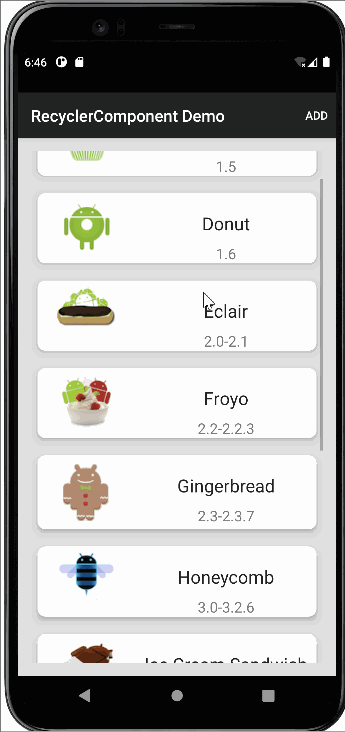
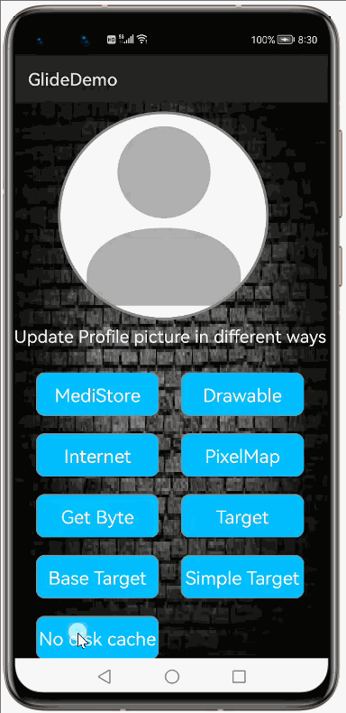
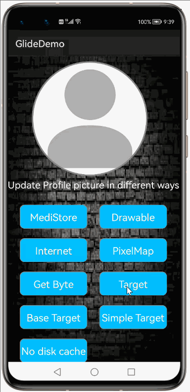

# How to use Glide Library for HarmonyOS: A developer’s Guide

## **1. Introduction**

Displaying images is one of the most common tasks for any mobile applications, but it can become challenging to manage for a variety of reasons.
The process requires loading and displaying the image, handling caches and image manipulations, loading the correct size of the image in the memory, handling network requests if you are loading the image from the internet, much testing, and many other nightmares.
Fortunately, we can save time and accelerate the development process without writing any boilerplate code by using well-tested libraries. Glide is one of the libraries that Harmony recommends for image loading.

### **What is Glide**

Glide is a fast and efficient image loading library for openharmony focused on smooth scrolling. Glide offers an easy to use API, a performant and extensible resource decoding pipeline and automatic resource pooling.

Glide primary focus is on making scrolling any kind of a list of images as smooth and fast as possible, but Glide is also effective for almost any case where you need to fetch, resize, and display a remote image.

To get started right away, head on to [Gitee](https://gitee.com/openharmony-tpc/glide)

## **2. Typical Use Cases**
This library - com.bumptech.glide, is very useful in the development of applications which are in our daily use. Some of such examples mentioned below:

<table>
    <tr>
        <td>
            <ul><li><b>Image Gallery</b> Grid display for a motor bike image gallery</li><ul>
        </td>
       <td>
            <ul><li><b>RecyclerComponent Image</b> Image and title are displaying with recycler component..</li><ul>
        </td>
    </tr>
    <tr>
        <td>

</td>
        <td>

</td>
    </tr>
</table>

## **3. Capability**
In this section, we can see the list of features which the library provides which makes the use of this library very easy and friendly. Primarily, this library supports customization of component attributes using the below mechanism.

* **Java APIs** 
Glide uses a simple fluent java API's that allows users to make most requests in a single line:
 
## **4. Features**
Features supported by this component includes the below:
* **Load Image from Different sources**  
With Glide you can load images a variety of sources: internet, URIs,harmony resources, mediastore,pixelmap  etc. For each, the syntax stays the same. We just use the load() method to receive the image in one of these other formats.

* **Disk caching:** 
Glide downloads the image from the given URL, resize it to the size of the image component where you want to display the image and stores it to the disk cache. Glide will store two different copies of same image if you are putting the same image in two different Image Components. That will increase the disk cache size, but it will increase the processing speed.

<!---* **Adding placeholder and error** 
Adding a placeholder for an image is always a nice option because there may arise a case when the internet speed is slow and in that condition, your image will not be loaded in few seconds. So, to handle those situations we use some placeholder that will be displayed until your original image will be loaded.Also if there is some error during the image fetching then the user should know that some error has occurred. That error may arise due to the wrong URL or due to no internet connectivity.

* **Support GIFs**  
With Glide, you can also load GIF image files, and the process for loading these files is essentially the same as the one we use to load other images.
Something to note here—say we want to display a GIF from an internet URL, but this URL doesn’t return a GIF, but a standard image instead. Even so, Glide will display the GIF and try to play it as intended!
To make sure the GIF is displayed as intended, we can add a check with the asGif() method, which tells Glide to check whether the image is a GIF or not. If not, the error() method gets called. 

* **Scale and Resize image** 
You can also scale your image with general transformations, which you can apply directly to Glide’s requests,and can resize an image using the override() method that will take the final dimensions of the image. -->

* **Support targets** 
Targets in Glide act as mediators between requests and requestors. Targets are responsible for displaying placeholders, loaded resources, and determining the appropriate dimensions for each request.Users can also implement their own Targets, or subclass any of the available base classes.

## **5. Installation**
For using the library in your HarmonyOS mobile app, you need to first install it by following below methods.

* **Method 1:**   
Generate the .har package through the library and add the .har package to the libs folder.Add the following code to the entry level build.gradle:
    <pre>
       <b style="color:green">
    implementation fileTree  (dir: 'libs', include: ['* .jar', '* .har'])
       </b>
</pre>

* **Method 2 :**   
Copy the dependency from the gitee and add it to the entry level build.gradle:
<pre>
dependencies {
    implementation fileTree(dir: 'libs', include: ['*.har'])
    <b style="color:green;">implementation 'io.openharmony.tpc.thirdlib:glide:1.1.2'
</b>
}
</pre>

## **6. Add internet permission**

Since we are going to do network operations, we need to add internet permission in <strong>config.json</strong> file 

<pre>
  "module": {
    "package": "com.example.glide",
    "name": ".MyApplication",
    "reqCapabilities": [
      "video_support"
    ],
    "deviceType": [
      "phone"
    ],
    "distro": {
      "deliveryWithInstall": true,
      "moduleName": "entry",
      "moduleType": "entry"
    },
    "abilities": [
      {
        "skills": [
          {
            "entities": [
              "entity.system.home"
            ],
            "actions": [
              "action.system.home"
            ]
          }
        ],
        "orientation": "unspecified",
        "name": "com.example.glide.MainAbility",
        "icon": "$media:icon",
        "description": "$string:mainability_description",
        "label": "$string:app_name",
        "type": "page",
        "launchType": "standard"
      }
    ],
    <b style="color:green">"reqPermissions": [
      {
        "name": "ohos.permission.INTERNET"
      }
    ]</b>
  }
</pre>

## **7. Usage**
The Glide library makes it simple to load an image. It requires, at minimum, just three parameters:   
<b style="color:red">The Context </b> — Passed through the with() function. Glide requires an harmony  context object to complete the internal processes needed for image loading.   
<b style="color:skyblue">The Image</b> — Passed through the load() function. You can specify which image should be loaded—it can be an internet URL, harmony resource, local file, or a URI.  
<b style="color:purple">The Target</b> — Passed through the into() function. This parameter will represent the Image components and Targets where your image is assumed to be displayed in. 

Here’s a code snippet that loads an image found on the internet in an Image component:

### **Step 1: Define layout via XML**
We are going to load image into Image component using Glide Library. So, add Image component into <strong>ability_main.xml</strong> file.

    <?xml version="1.0" encoding="utf-8"?>
    <DirectionalLayout
        xmlns:ohos="http://schemas.huawei.com/res/ohos"
        xmlns:app="http://schemas.huawei.com/hap/res-auto"
        ohos:height="match_parent"
        ohos:width="match_parent"
        ohos:orientation="vertical"
        ohos:background_element="#000000">
            
       <Image
        ohos:id="$+id:imageid"
        ohos:width="match_content"
        ohos:height="match_content"/>
    </DirectionalLayout>

### **Step 2: Getting reference to the image component from the layout.xml**

At first, get the reference to component where you want to show image. Here, we are showing image into Image Component.
 <pre> 
    //Initialize Image Component
    Image image=(Image) findComponentById(ResourceTable.Id_imageid);
</pre>
After you have the reference to Image component, you can write code to load image into Image component.

### Step 3: Loading image into Image component from image source

You may load image into Image component present in different locations, e.g. image may be present in resource folder or present in certain url location etc. We can load these images as follow.

* **Loading image present in server** 
Get the url where image is present and show it into Image component, You need to write the code as below.
<pre>
//Loading image from url into Image component 
Glide.with(this)
    .load("IMAGE URL HERE")
    .into(imageComponent);
</pre>
For demo purposes, we are showing an image present in https://picsum.photos/600 url. However, you can choose any image url of your own choice. so, MainAbilitySlice.java code will be like below.

* **MainAbilitySlice.java code** 
<pre class="brush: java; title: ; notranslate" title="">
public class MainAbilitySlice extends AbilitySlice                              
  {                 
    private String url="https://picsum.photos/600";   

    @Override               
    public void onStart(Intent intent) {            
        super.onStart(intent);                  
        super.setUIContent(ResourceTable.Layout_ability_main);

        //Initialize Image Component

        Image image=(Image) findComponentById(ResourceTable.Id_imageid);

       //Loading image from url into Image component

        Glide.with(this)
        .load(url)
        .into(image);
    }
}

</pre>

### **List of public APIs for app-developer**
The public methods below will help us to operate on the component at runtime.

**Glide  Methods**
<table>
<tr>
    <td>
        <ul>
            <li>with(Context context)</li>
            <li>load(String string)</li>
            <li>load(PixelMap map)</li>
            <li>load(Uri uri)</li>
            <li>load(Integer resourceId)</li>
            <li>load(URL url) </li>
        </ul>
    </td>
    <td>
        <ul>
            <li>load(Uri uri)</li>
            <li>into(Image component) </li>
            <li>into(int width, int height)</li>
            <li>into(Y target)</li>
            <li>diskCacheStrategy(DiskCacheStrategy strategy)</li>
            <li>asBitmap()</li>
        </ul>
    </td>
</tr>
</table>

## **8. API usage examples**
In this section, we can have a look at some of the examples where the APIs of this library is put to use and the results which we can acheive.

### **Example1: Loading Image from Different sources**

You can load images from different sources into image component using this library.

#### **<b>Loading image from res/drawable folder</b>** 
<table  width="700">
    <tr>
        <td width="60%">
        <pre>
<b><u>Layout.xml</u>:</b> 
&ltImage
        ohos:id="$+id:component_id"
        ohos:width="match_content"
        ohos:height="match_content"/>  

<b><u>Java Slice</u>:</b> 
//Here we are loading desert image file from resource  
 Glide.with(this)
      .load(ResourceTable.Media_desert)
      .into(image_component);
        </pre>
        </td>
        <td width="40%">
        

        </td>
    </tr>
</table>

#### **<b>Loading image from PixelMap</b>**
<table style="width: 100%; backgrund">
    <colgroup>
       <col span="1" style="width: 60%;">
       <col span="1" style="width: 40%;">
    </colgroup>
    <tr>
        <td width="60%">
        <pre>
<b><u>Layout.xml</u>:</b> 
&ltImage
        ohos:id="$+id:component_id"
        ohos:width="match_content"
        ohos:height="match_content"/> 
<b><u>Java Slice</u>:</b> 
 PixelMap pixelMap = 
 getPixelMap(this, ResourceTable.Media_jellyfish);
 Glide.with(classcontext)
      .load(pixelMap)
      .into(image_component);

</pre>
</td>
    <td width="100%">
        

    </td>
    </tr>
</table> 

To create pixelmap for the image we have to do the following things

<pre>
 public static PixelMap getPixelMap(Context context, int resId) {
        Optional<PixelMap> optional = decodePixelMap(context, resId);
        return optional.get();
    }
    public static Optional<PixelMap> decodePixelMap(Context context, int id) {
        String path = getPathById(context, id);
        RawFileEntry assetManager = context.getResourceManager().getRawFileEntry(path);
        ImageSource.SourceOptions options = new ImageSource.SourceOptions();
        options.formatHint = "image/png";
        ImageSource.DecodingOptions decodingOptions = new ImageSource.DecodingOptions();
        try {
            Resource asset = assetManager.openRawFile();
            ImageSource source = ImageSource.create(asset, options);
            return Optional.ofNullable(source.createPixelmap(decodingOptions));
        } catch (IOException e) {
            LogUtil.error(TAG, "getPixelMap -> IOException");
        }
        return Optional.empty();
    }
    public static String getPathById(Context context, int id) {
        String path = "";
        if (context == null) {
            LogUtil.error(TAG, "getPathById -> get null context");
            return path;
        }
        ResourceManager manager = context.getResourceManager();
        if (manager == null) {
            LogUtil.error(TAG, "getPathById -> get null ResourceManager");
            return path;
        }
        try {
            path = manager.getMediaPath(id);
        } catch (IOException e) {
            LogUtil.error(TAG, "getPathById -> IOException");
        } catch (NotExistException e) {
            LogUtil.error(TAG, "getPathById -> NotExistException");
        } catch (WrongTypeException e) {
            LogUtil.error(TAG, "getPathById -> WrongTypeException");
        }
        return path;
    }
</pre>

 #### <b>Loading image from MediaStore</b> 
   <table style="width: 100%;">
    <colgroup>
       <col span="1" style="width: 60%;">
       <col span="1" style="width: 40%;">
    </colgroup>
    <tr>
        <td>
        <pre>
<b><u>Layout.xml</u>:</b> 
&ltImage
    ohos:id="$+id:component_id"
    ohos:width="match_content"
    ohos:height="match_content"/>  
<b><u>Java Slice</u>:</b> 
//To load image from device internal storage,
we have to get the path of the image like below. 
String Media_uri="dataability:///<b style="color:green">media/
external/images/media/21";</b>
Uri uri=Uri.parse(Media_uri);
Glide.with(classcontext)
     .load(uri)
     .into(medistoreimg);
        </pre>
        </td>
        <td>
        

        </td>
    </tr>
</table>

### **Example2: Disk Cache** 

Bydefault disk cache will be enabled.In the following example disk cache disbaled, So every time when glide hits the network url instead of taking from the cache. In Demo we can see the image is taking some time to load into image component and other image is loading very fastly.  
Here’s a code snippet that tells Glide to not cache the loaded images on the disk cache:
<table style="width: 100%;">
    <colgroup>
       <col span="1" style="width: 60%;">
       <col span="1" style="width: 40%;">
    </colgroup>
    <tr>
        <td>
        <pre>
<b><u>Layout.xml</u>:</b> 
&ltImage
        ohos:id="$+id:component_id"
        ohos:width="match_content"
        ohos:height="match_content"/>
  
<b><u>Java Slice</u>:</b> 
Glide.with(this)
     .load("https://wallpapercave.com/wp/wp3788238.jpg")
     .diskCacheStrategy(DiskCacheStrategy.NONE)
     .into(diskcachingimg);
 
</pre>
  </td>
     <td>
        

    </td>
</tr>
</table> 

#### <u> <b>Disk caches variants</b></u> 

Glide has more than one choice for the disk cache behavior. Here’s a full list:

<b>DiskCacheStrategy.NONE:</b> This option caches nothing, as discussed in the section on skipping the disk cache. 
<b>DiskCacheStrategy.DATA:</b>  This option caches only the original full resolution image. 
<b>DiskCacheStrategy.RESOURCE:</b>  This option, on the contrary caches only the final result image, after reducing the resolution. 
<b>DiskCacheStrategy.ALL:</b>  This option caches all versions of the image. 
<b>DiskCacheStrategy.AUTOMATIC:</b>  This is the default option, which intelligently chooses a cache strategy based on the nature of the resource (i.e. if it’s a remote or local resource).

### **<b>Example3: Targets</b>** 
We have different types of targets available in harmony glide library.

#### Loading from Target 
<table style="width: 100%;">
    <colgroup>
       <col span="1" style="width: 60%;">
       <col span="1" style="width: 40%;">
    </colgroup>
    <tr>
        <td>
        <pre>
<b><u>Layout.xml</u>:</b>
&ltImage
        ohos:id="$+id:component_id"
        ohos:width="match_content"
        ohos:height="match_content"/>
 
<b><u>Java Slice</u>:</b>
Target<Element> target3 = new Target<Element>(){
        @Override
        public void onStart() {
        }
        @Override
        public void onStop() {
        }
        @Override
        public void onDestroy() {
        }
        @Override
        public void onLoadStarted( Element placeholder) {
        }
        @Override
        public void onLoadFailed( Element errorDrawable) {
        }
        @Override
        public void onResourceReady( Element bitmap,
        Transition<? super Element> transition)
        {
        // do something with the bitmap
        // for demonstration purposes, 
        let's set it to an image component
        image.setImageElement(bitmap);
        }
        @Override
        public void onLoadCleared(Element placeholder) {
        }
        @Override
        public void getSize(SizeReadyCallback cb) {
        cb.onSizeReady(850, 850);
        }
        @Override
        public void removeCallback(SizeReadyCallback cb) {}
        @Override
        public void setRequest(Request request) {
        }
        @Override
        public Request getRequest() {
        return null;
        }
    };

Glide.with(this)
         .load(ResourceTable.Media_tiger)
         .into(target3);
        </pre>
        </td>
        <td>
        

        </td>
    </tr>
</table>

#### Loading from BaseTarget 
<table style="width: 100%;">
    <colgroup>
       <col span="1" style="width: 60%;">
       <col span="1" style="width: 40%;">
    </colgroup>
    <tr>
        <td>
        <pre>
<b><u>Layout.xml</u>:</b>
&ltImage
        ohos:id="$+id:component_id"
        ohos:width="match_content"
        ohos:height="match_content"/>
 
<b><u>Java Slice</u>:</b>
BaseTarget<Element> target2 =
    new BaseTarget<Element>() {
    @Override
    public void onResourceReady(
    Element bitmap, Transition<? super Element> transition) {
    // do something with the bitmap
    // for demo,let's set it to an image component
    image.setImageElement( bitmap);
    }
    @Override
    public void getSize(SizeReadyCallback cb) {
    cb.onSizeReady(SIZE_ORIGINAL, SIZE_ORIGINAL);
    }
    @Override
    public void removeCallback(SizeReadyCallback cb) {}
    };

  Glide.with(this)
        .load(ResourceTable.Media_jellyfish)
        .into(target2);
 </pre>
        </td>
        <td>
        

        </td>
    </tr>
</table>

#### Loading from SimpleTarget 

<table style="width: 100%;">
    <colgroup>
       <col span="1" style="width: 60%;">
       <col span="1" style="width: 40%;">
    </colgroup>
    <tr>
        <td>
        <pre>
<b><u>Layout.xml</u>:</b> 
&ltImage
        ohos:id="$+id:component_id"
        ohos:width="match_content"
        ohos:height="match_content"/>
  
<b><u>Java Slice</u>:</b> 
Glide.with(this)
     .load(ResourceTable.Media_rainbow)
     .into(new SimpleTarget<Element>() {
    @Override
    public void onResourceReady(Element element, 
    Transition<? super Element> transition) {
        simpletargetimg.setImageElement(element);
     }
});
        </pre>
        </td>
        <td>
        

        </td>
    </tr>
</table>

## **9. Conclusion**
Properly and efficiently handling images in HarmonyOS can be a nightmare if you decide to do it on your own. Fortunately, libraries like Glide can save you a ton of time and give you the power of working with images in an optimized manner. With this extra development time, you can focus more directly on your application’s core functionalities.
Even though this article only worked through the basics, Glide offers much more than that.

* For more exciting libraries to develop your app, peep into third-party-components at  
[OpenHarmony-TPC](https://gitee.com/openharmony-tpc)

* To know more about the developement work happening on harmony aaplication layer, and even be part of the exciting stuff, watch this space of [Application-Library Engineering Group](https://github.com/applibgroup)
