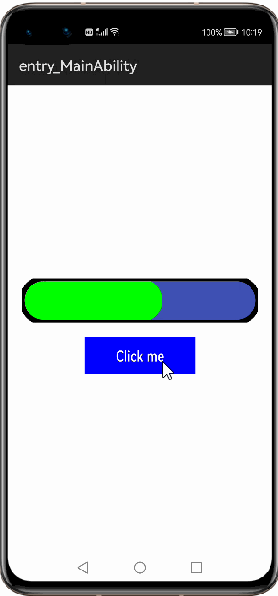
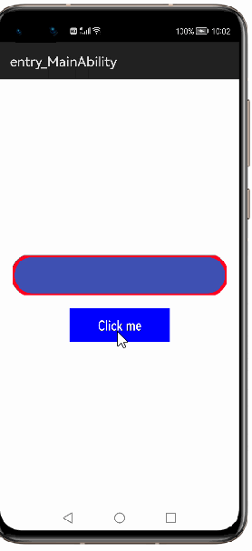
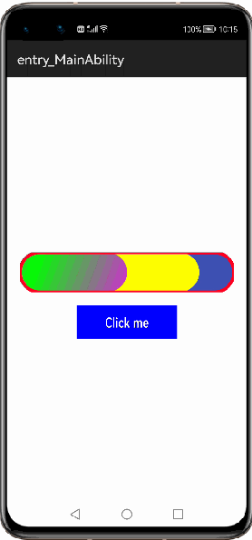

# How to use HorizontalProgressBar Library for HarmonyOS: A developer’s Guide

## **1. Introduction**
Horizontal progress bar is library which indictes the progress of an ongoing task. This is useful for the user to estimate the remaining time for the completion of ongoing activities.

To get started right away, head on to [Gitee](https://github.com/applibgroup/ZzHorizontalProgressBar)

## **2. Typical Use Case**
This library - me.zhouzhuo.zzhorizontalprogressbar, is very useful in the development of applications which are in our daily use. An example of such case is mentioned below:

<table>
    <tr>
        <td>
            <ul><li><b>Download Status</b> The Progress/percentage of files (of total size) while downloading.</li><ul>
        </td>
        <td>
            <ul><li><b>Upload Status</b> The Progress/percentage of files uploaded.</li><ul>
        </td>
    </tr>
    <tr>
        <td width="50%">

</td>
        <td width="100%">

</td>
    </tr>
</table>

## **3. Capability**
In this section, we can see the list of features which the library provides which makes the use of this library very easy and friendly. Primarily, this library supports customization of component attributes using the below mechanisms.

* **XML layout inflation** 
With the help of xml layout inflation, the library is so easy to use such that, we can put the component to action without even writing a single line of code. This will be so useful for quick development, as well as for beginners who are starting with mobile-app development. On how to use the XML Layout Inflation can be seen in the coming sections of the tutorial.

* **Customization via Java APIs** 
In case we need to customize the component during run time, we also have the flexibility to do that using the JAVA APIs which the library exposes. The APIs will also help us to utilize the features provided from its parent “ZzHorizontalProgressBar” Class 

## **4. Features**
Features supported by this component includes the below:
* **Setting Progress and background Color** 
We can configure the progress bar color, background color , border width and overlay parameter using these properties. Often setting the right border properties for a horizontal progress-bar makes a whole lot of difference in the way the progress bar appeals to audience.

* **Setting custom gradient progress** 
Using this library, we can customize gradient color of the progress.

* **Setting second level progress bar and color** 
Using this library, we can customize second-level progress color and the progress value can also be set.

## **5. Installation**
For using the library in your HarmonyOS mobile app, you need to first install it by adding the below dependency in your entry/build.gradle file.
<pre>
dependencies {
    implementation fileTree(dir: 'libs', include: ['*.jar', '*.har'])
    <b style="color:blue;">implementation 'dev.applibgroup:zzhorizontalprogressbar:1.0.0'</b>
    testCompile 'junit:junit:4.13'
}
</pre>

## **6. Usage**
This section will help us to understand the usage of the library as you use it in your Harmony-application developement project.

### **Step 1: Define layout via XML**

    <?xml version="1.0" encoding="utf-8"?>
    <DirectionalLayout
        xmlns:ohos="http://schemas.huawei.com/res/ohos"
        xmlns:custom="http://schemas.huawei.com/hap/res-auto"
        ohos:height="match_parent"
        ohos:width="match_parent"
        ohos:orientation="vertical"
        ohos:background_element="#000000">
        <me.zhouzhuo.zzhorizontalprogressbar.ZzHorizontalProgressBar
            ohos:height="60vp"
            ohos:width="match_parent"
            ohos:id="$+id:hpb"
            ohos:left_margin="20vp"
            ohos:top_margin="20vp"
            ohos:right_margin="20vp"
            ohos:padding="20vp"
            custom:zpb_draw_border="true"
            custom:zpb_border_width="10"
            custom:zpb_show_second_point_shape="line"
            custom:zpb_max="60"
            custom:zpb_progress="40"/> 
    </DirectionalLayout>

### **Step 2: Customize programmatically via Java API**

    @Override
    public void onStart(Intent intent) {
        super.onStart(intent);
        super.setUIContent(ResourceTable.Layout_NewSilce);
        ZzHorizontalProgressBar horizontalProgressBar;
        horizontalProgressBar = findComponentById(ResourceTable.Id_hpb);
        horizontalProgressBar.setBgColor(Color.GREEN.getValue());
    }

### **List of XML attributes supported**
Below is the list of XML attributes which are supported by the library.

* zpb_draw_border
* zpb_border_width
* zpb_show_second_point_shape
* zpb_padding
* zpb_second_pb_color
* zpb_bg_color
* zpb_pb_color
* zpb_max
* zpb_progress
* zpb_second_progress
* zpb_open_gradient
* zpb_gradient_from
* zpb_gradient_to
* zpb_show_second_progress
* zpb_open_second_gradient
* zpb_second_gradient_from
* zpb_second_gradient_to
* zpb_show_mode
* zpb_round_rect_radius
* zpb_border_color
* civ_color - To specify the border color.
* civ_border_width - To specify border width.
* civ_bg_color - To specify a background color

### **List of public APIs for app-developer**
st of public APIs for app-developer**
The public methods below will help us to operate on the component at runtime.

**Setter Methods**
<table>
<tr>
    <td>
        <ul>
            <li>setBgColor()</li>
			<li>setBorderColor()</li>
			<li>setGradientColor()</li>
			<li>setGradientColorAndBorderColor()</li>
			<li>setMax()</li>
			<li>setOnProgressChangedListener()</li>
			<li>setOpenGradient()</li>
			<li>setOpenSecondGradient()</li>
			<li>setPadding()</li>
        </ul>
    </td>
    <td>
        <ul>
            <li>setProgress()</li>
			<li>setProgressColor()</li>
			<li>setSecondGradientColor()</li>
			<li>setSecondProgress()</li>
			<li>setSecondProgressColor()</li>
			<li>setSecondProgressShape()</li>
			<li>setShowMode()</li>
			<li>setShowSecondProgress()</li>
        </ul>
    </td>
</tr>
</table>

**Getter Methods**

<table>
<tr>
    <td>
        <ul><li>getBgColor()</li>
			<li>getBorderColor()</li>
			<li>getGradientFrom()</li>
			<li>getGradientTo()</li>
			<li>getHandlezpbshowmode()</li>
			<li>getHandlezpbshowssecondpointshape()</li>
			<li>getMax()</li>
			<li>getPercentage()</li>
			<li>getPercentageFloat()</li>
			<li>getProgress()</li>
        </ul>
    </td>
    <td>
        <ul>
            <li>getProgressBarPadding()</li>
			<li>getProgressColor()</li>
			<li>getSecondGradientFrom()</li>
			<li>getSecondGradientTo()</li>
			<li>getSecondProgress()</li>
			<li>getSecondProgressColor()</li>
			<li>getSecondProgressShape()</li>
			<li>isOpenGradient()</li>
			<li>isOpenSecondGradient()</li>
			<li>isShowSecondProgress()</li>
        </ul>
    </td>
</tr>
</table>

## **7. API usage examples**
In this section, we can have a look at some the examples where the APIs of this library is put to use and the results which we can acheive.

**Example1: Setting progress and background color**

In this example, first the background-color of the bar is set to grey color in layout.xml so that progress color which is set to green is clearly observable. The color code is in [RGB-format](https://htmlcolorcodes.com/)
<table>
    <tr>
        <td width=700px>
        <pre>
<b><u>Layout.xml</u>:</b>
&ltme.zhouzhuo.zzhorizontalprogressbar.ZzHorizontalProgressBar
    ohos:id="$+id:hpb"
    ohos:height="290vp"
    ohos:width="290vp"
    ohos:orientation="vertical"
    ohos:layout_alignment="center"
    ohos:top_padding="10"
    custom:zpb_border_width="4vp"
    <b style="color:blue;">custom:zpb_bg_color="#d8d8d8"</b>/>
 
<b><u>Java Slice</u>:</b>
ZzHorizontalProgressBar horizontalProgressBar;
horizontalProgressBar = findComponentById(ResourceTable.Id_hpb);
<b style="color:blue;">horizontalProgressBar.setBgColor(Color.GREEN.getValue());</b>
        </pre>
        </td>
        <td width=300px>
        

        </td>
    </tr>
</table>

**Example2: Customising border related attributes**
<table>
    <tr>
        <td width=700px>
        <pre>
<b><u>Layout.xml</u>:</b>
&ltme.zhouzhuo.zzhorizontalprogressbar.ZzHorizontalProgressBar
    ohos:id="$+id:hpb"
    ohos:height="290vp"
    ohos:width="290vp"
    ohos:orientation="vertical"
    ohos:layout_alignment="center"
    ohos:top_padding="10vp"
    custom:zpb_border_width="4vp"
    custom:zpb_bg_color="#d8d8d8"
    custom:zpb_pb_color="#FF4CB862"
    custom:zpb_border_color="#85ff00"/>
 <b><u>Java Slice</u>:</b>
ZzHorizontalProgressBar horizontalProgressBar;
horizontalProgressBar = findComponentById(ResourceTable.Id_hpb)
<b style="color:blue;">horizontalProgressBar.setBorderColor(Color.BLACK.getValue());
</b>
        </pre>
        </td>
        <td width=300px>
        

        </td>
    </tr>
</table>

**Example3: Setting gradient progress**
<table>
    <tr>
        <td width=700px>
        <pre>
<b><u>Layout.xml</u>:</b>
&lt&ltme.zhouzhuo.zzhorizontalprogressbar.ZzHorizontalProgressBar
    ohos:id="$+id:hpb"
    ohos:height="290vp"
    ohos:width="290vp"
    ohos:orientation="vertical"
    ohos:layout_alignment="center"
    ohos:top_padding="10"
    custom:zpb_draw_border="true"
    custom:zpb_border_width="10"
    custom:zpb_show_second_point_shape="line"
    <b style="color:blue;"></b>
 <b><u>Java Slice</u>:</b>
ZzHorizontalProgressBar horizontalProgressBar;
horizontalProgressBar = findComponentById(ResourceTable.Id_hpb);
<b style="color:blue;">horizontalProgressBar.setOpenGradient(true);
horizontalProgressBar.setProgress(30);
horizontalProgressBar.setGradientColor(0xFFFF0000,0xFF00FF00);
</b></pre>
        </td>
        <td width=300px>
        

        </td>
    </tr>
</table>

**Example4: Setting second-level progress**
<table>
    <tr>
        <td width=700px>
        <pre>
<b><u>Layout.xml</u>:</b>
&lt&ltme.zhouzhuo.zzhorizontalprogressbar.ZzHorizontalProgressBar
    ohos:id="$+id:hpb"
    ohos:height="290vp"
    ohos:width="290vp"
    ohos:orientation="vertical"
    ohos:layout_alignment="center"
    ohos:top_padding="10"
    custom:zpb_draw_border="true"
    custom:zpb_border_width="10"
    custom:zpb_show_second_point_shape="line"
    <b style="color:blue;"></b>
 <b><u>Java Slice</u>:</b>
ZzHorizontalProgressBar horizontalProgressBar;
horizontalProgressBar = findComponentById(ResourceTable.Id_hpb);
<b style="color:blue;">horizontalProgressBar.setOpenSecondGradient(true);
horizontalProgressBar.setProgress(80);
horizontalProgressBar.setShowSecondProgress(true);
horizontalProgressBar.setSecondProgress(50);
horizontalProgressBar.setSecondProgressColor(Color.GRAY.getValue());
horizontalProgressBar.setProgressColor(Color.YELLOW.getValue());
horizontalProgressBar.setSecondGradientColor(Color.GREEN.getValue(),Color.MAGENTA.getValue());
</b></pre>
        </td>
        <td width=300px>
        

        </td>
    </tr>
</table>

## **8. Conclusion**
ZzHorizontalProgressBar is a very easy to use and very powerful library.The performance of the library is very good even when it works on one of the latest operating systems in the world, which is HarmonyOS!

* For more exciting libraries to develop your app, peep into third-party-components at  
[OpenHarmony-TPC](https://gitee.com/openharmony-tpc)

* To know more about the developement work happening on harmony aaplication layer, and even be part of the exciting stuff, watch this space of [ALEG](https://github.com/applibgroup)
