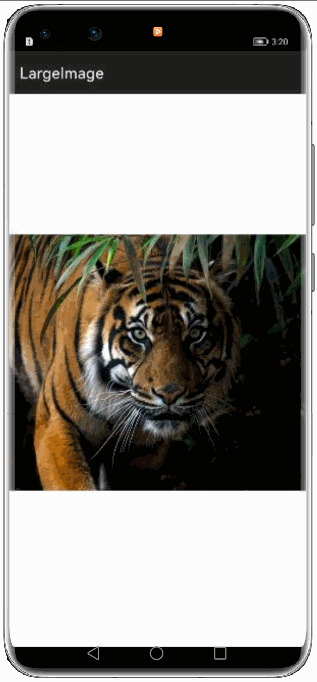
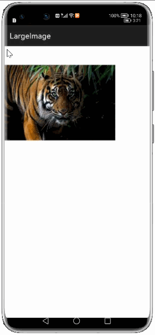

# How to use LargeImage Library for HarmonyOS: A developer’s Guide

## **1. Introduction**
An HarmonyOS library which provides the Image viewing features such as Basic image view where you can view an image without any zoom in and zoom out feature,zoom in and zoom out image view ,Scroll view feature along with zoom in and zoom out where you can scroll the image which can be zoomed in and zoomed out. 

Large image library also supports many image formats like Bitmap image file where BMP is an image file format that contains bitmap graphics data. BMP images are device independent and require no graphics adapter to display them. 
Image data in BMP files are usually uncompressed or compressed with a lossless compression.

It also supports jpeg,png,gif's and svg image formats where JPEG and PNG both are a type of image format to store images. JPEG uses lossy compression algorithm and image may lost some of its data whereas PNG uses lossless compression algorithm and no image data loss is present in PNG format.

## **2. Typical Use Cases**
This large image lirary is very useful in loading the image which can be zoomed in and zoomed out along with the scroll view. Some of such examples mentioned below:

<div align="center">
<table>
    <tr>
        <td>
            <ul><li><b>Basic Image View</b></br>The Basic image cannot be zoomed in or zoomed out</li><ul>
        </td>
       <td>
            <ul><li><b>Zoom_In and Zoom_out Image View</b></br>In this image view Zoom_In and Zoom_out features are enabled</li><ul>
        </td>
    </tr>
    <tr>
        <td width="50%"><p align="center"></p></td>
        <td width="50%"><p align="center"></p></td>
    </tr>
    
</table>
</div>

<div align="center">
<table>
    <tr>
        <td>
            <ul><li><b></b></br>Zoom_In and Zoom_out Image View with scroll view</b></br>In this image view Zoom_In and Zoom_out features are enabled along with scroll view attribute.</li><ul>
        </td>
    </tr>
    <tr>
        <td width="100%"><p align="center"></p></td>
</tr>
</table>
</div>

## **3. Capability**
In this section, we can see the list of features which the library provides which makes the use of this library very easy and friendly. Primarily, this library supports customization of component attributes using the below mechanism.

* **JavaScript APIs**</br>
LargeImage uses a simple fluent js API's that allows users to view images which can be zoomed in amd zoomed out:
 
## **4. Features**

Features supported by this component includes the below:
* **Basic Image View:** </br>
Both zoomEnabled and scrollEnabled attributes are disabled here.

* **Zoom_In and Zoom_out Image View:** </br>
zoomEnabled attribute is enabled here.


* **Zoom-In & Zoom-Out With Scroll:** </br>
Both zoomEnabled and scrollEnabled attributes are enabled here.

## **5. Installation**
For using LargeImage module in sample application, include the below dependency in entry <span style="color: blue;">package.json</span>. Before this add LargeImage module in project root directory.

```groovy
{
    "dependencies": {
        "LargeImage": "file:../largeimage",
    }
}
```

## **6. Usage**
This section will guide us in comprehending how to use the library in Harmony app development project.

### **Step 1: Import LargeImage dependencies into sample app**
``
import {LargeImage} from "../largeimage/LargeImage.ets";
import {LargeImageAttribute} from "../largeimage/utils/LargeImageAttribute.ets";
``

1. For using basic image view :
```
@State attributes: LargeImageAttribute =
    {
      imageSource: $r('app.media.tiger'),
      size: { width: 300, height: 300 },
      zoomEnabled: false,
      scrollEnabled: false,
    };

  build() {
    Flex({ direction: FlexDirection.Column, alignItems: ItemAlign.Center, justifyContent: FlexAlign.SpaceBetween }) {
      LargeImage({ largeImageAttribute: $attributes })
    }
  }
```

2. For using image view with zoom-in and zoom-out :
```
@State attributes: LargeImageAttribute =
    {
      imageSource: $r('app.media.tiger'),
      size: { width: 300, height: 300 },
      zoomEnabled: true,
      scrollEnabled: false,
    };

  build() {
    Flex({ direction: FlexDirection.Column, alignItems: ItemAlign.Center, justifyContent: FlexAlign.SpaceBetween }) {
      LargeImage({ largeImageAttribute: $attributes })
    }
  }
```

3. For using image view with zoom-in and zoom-out with scroll :
```
@State attributes: LargeImageAttribute =
    {
      imageSource: $r('app.media.tiger'),
      size: { width: 300, height: 300 },
      zoomEnabled: true,
      scrollEnabled: true,
    };

  build() {
    Flex({ direction: FlexDirection.Column, alignItems: ItemAlign.Center, justifyContent: FlexAlign.SpaceBetween }) {
      LargeImage({ largeImageAttribute: $attributes })
    }
  }
```
### **Step 2: Define storage permissions in config.json of sample app**
```java
  "reqPermissions": [
          {
          "name": "ohos.permission.INTERNET",
          "reason": "Api call",
          "usedScene": {
          "ability": [
             "com.shizhefei.view.largeimage_test.MainAbility"
          ],
          "when": "always"
           }
         }
        ]
```

## **7. Conclusion**
LargeImage is a very good library , which will help in viewing different types of images. The performance of the library is very good even when it works on one of the latest operating systems in the world, which is HarmonyOS!

* For more exciting libraries to develop your app, peep into third-party-components at </br>
[OpenHarmony-TPC](https://gitee.com/openharmony-tpc)

* To know more about the developement work happening on harmony aaplication layer, and even be part of the exciting stuff, watch this space of [Application Library Engineering Group](https://github.com/applibgroup)
