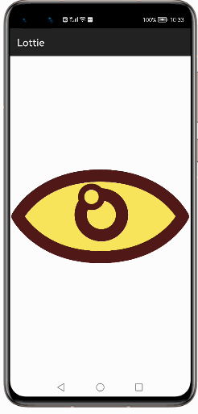
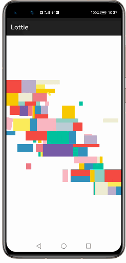
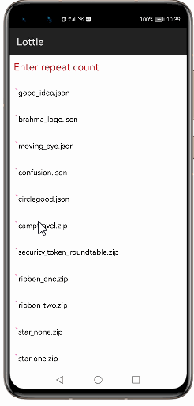
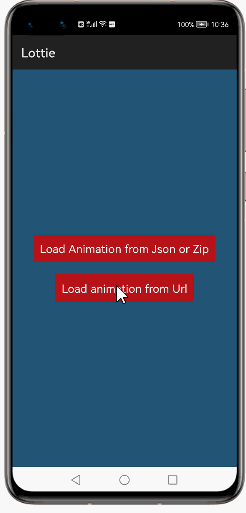
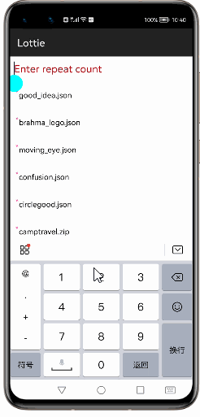

# How to use Lottie Library for HarmonyOS: A developer’s Guide

## **1. Introduction**

Enhancing the User Experience of an application is one of the priorities for any developer. Providing Animations for certain descriptions always enhances the User Experience of an application when compared to images and text descriptions!

Lottie is one of the libraries which is used in mobile applications that helps in providing animations in a simpler way.
  Harmony recommends for Loading animations.

### **What is Lottie**

Lottie is an open-source animation library developed by Airbnb. It renders Adobe After Effects with BodyMovin. BodyMovin is an Adobe After Effects plugin that exports animations to a JSON file. ... Lottie is supported on mobile (Android, iOS,Harmony and React Native), web, and desktop applications

To get started right away, head on to [Gitee](https://gitee.com/openharmony-tpc/lottie-ohos)

## **2. Typical Use Cases**
This library - com.airbnb.lottie, is very useful in the development of applications which are in our daily use. Some of such examples mentioned below:

<table>
    <tr>
        <td>
            <ul><li><b>Single Lottie</b> The lottie displayed in a single lottieanimationview</li><ul>
        </td>
       <td>
            <ul><li><b>Multiple Lottie Animations</b> Animations are displaying with Multiple LottieAnimationView..</li><ul>
        </td>
    </tr>
    <tr>
        <td>

</td>
        <td>

</td>
    </tr>
</table>

## **3. Capability**
In this section, we can see the list of features which the library provides which makes the use of this library very easy and friendly. Primarily, this library supports customization of component attributes using the below mechanism.

* **Java APIs** 
Lottie uses a simple fluent java API's that allows users to make most requests in a single line:
 
## **4. Features**
Features supported by this component includes the below:
* **Loading animations using json,zip and url:**  
With Lottie  you can load animations a variety of extension: 
JSON,ZIP ad URL
 etc. For each, the syntax stays the same. We just pass different json or zip files to check if animation is loaded properly.

* **To change the animation repetition count:** 
 
Lottie library should display animation according to the repetition count specified. For Example we can pass the set repetition count like (1,2,3..etc).

## **5. Installation**
For using the library in your HarmonyOS mobile app, you need to first install it by following below methods.

* **Method 1:**   
Generate the .har package through the library and add the .har package to the libs folder.Add the following code to the entry level build.gradle:
    <pre>
       <b style="color:green">
    implementation fileTree  (dir: 'libs', include: ['* .jar', '* .har'])
       </b>
</pre>

* **Method 2 :**   
Copy the dependency from the gitee and add it to the entry level build.gradle:
<pre>
dependencies {
    implementation fileTree(dir: 'libs', include: ['*.har'])
    <b style="color:red;">implementation 'io.openharmony.tpc.thirdlib:lottie-ohos:1.0.4'</b>

}
</pre>

## **6. Add internet permission**

Since we are going to do network operations, we need to add internet permission in <strong>config.json</strong> file 

<pre>
{
  "app": {
    "bundleName": "com.example.lottie",
    "vendor": "example",
    "version": {
      "code": 1000000,
      "name": "1.0"
    },
    "apiVersion": {
      "compatible": 5,
      "target": 5,
      "releaseType": "Beta1"

    }
  },
  "deviceConfig": {
    "default": {
      "network": {
        "cleartextTraffic": true
      }
    }
  },
  "module": {
    "package": "com.example.lottie",
    "name": ".MyApplication",
    "reqCapabilities": [
      "video_support"
    ],
    "deviceType": [
      "phone"
    ],
    "distro": {
      "deliveryWithInstall": true,
      "moduleName": "entry",
      "moduleType": "entry"
    },
    "abilities": [
      {
        "skills": [
          {
            "entities": [
              "entity.system.home"
            ],
            "actions": [
              "action.system.home"
            ]
          }
        ],
        "orientation": "unspecified",
        "name": "com.example.lottie.MainAbility",
        "icon": "$media:icon",
        "description": "$string:mainability_description",
        "label": "$string:app_name",
        "type": "page",
        "launchType": "standard"
      }
    ],
    "reqPermissions": [
      {
       <b style="color:orange"> "name": "ohos.permission.INTERNET"</b>
      }
    ]
  }
}
</pre>

## **7. Usage**
The Harmony library makes it simple to load an lottie animation. It requires, at minimum, just three parameters:   
<b style="color:red">The String URL </b> — Passed through the setFilename() function. where string is the url to json which needs to be loaded   
<b style="color:skyblue">The Repeat Count</b> — Passed setRepeatCount the  function.Lottie library should display animation according to the repetition count specified.  
<b style="color:purple">The Target</b> — Passed through the setAnimationData() function. This parameter will represent the LottieAnimationView components and Targets where your lottie animation is assumed to be displayed in. 

Here’s a code snippet that loads an lottie json  found on the internet in an LottieAnimationView component:

### **Step 1: Define layout via XML**
We are going to load animation into LottieAnimationView component using Lottie Library. So, add LottieAnimationView component into <strong>resource_file.xml</strong> file.

    <?xml version="1.0" encoding="utf-8"?>
    <DirectionalLayout
        xmlns:ohos="http://schemas.huawei.com/res/ohos"
        xmlns:app="http://schemas.huawei.com/hap/res-auto"
        ohos:height="match_parent"
        ohos:width="match_parent"
        ohos:orientation="vertical"
        ohos:background_element="#000000">
            
       <com.airbnb.lottie.LottieAnimationView
        ohos:id="$+id:animationView"
        ohos:width="match_parent"
        ohos:height="match_parent"
        />
    </DirectionalLayout>

### **Step 2: Add code in MainAbilitySlice to load animation into LottieAnimationView component**
You may load animationinto LottieAnimationView component present in different locations, e.g. LottieAnimationView may be present in resource/raw folder, animation may be present in certain url location etc. We can load these animations as follow.

* **Get the reference to LottieAnimationView Component**  
At first, get the reference to component where you want to show and. Here, we are showing animation into  LottieAnimationView. 
 <pre> 
    //Initialize LottieAnimationView Component

     LottieAnimationView lv = (LottieAnimationView)rootLayout.findComponentById(ResourceTable.Id_animationView);

</pre>
Since you have the reference to LottieAnimationView component, you can write code to load animation into LottieAnimationView component.

* **Loading lottieJson  present in server** 
Get the url where animation is present and show it into LottieAnimationView component, You need to write the code as below.
<pre>
//Loading animation from url into LottieAnimationView component
LottieAnimationViewData data = new LottieAnimationViewData();
 data.setFilename(url);
 data.autoPlay = true;
 data.setRepeatCount(repeatCount); // specify repetition count
 lv.setAnimationData(data);
</pre>
For demo purposes, we are showing an lottie animation present in https://lottiefiles.com/4199-location-search url. However, you can choose any lottie json url of your own choice. so, MainAbilitySlice.java code will be like below.

* **MainAbilitySlice.java code** 
<pre class="brush: java; title: ; notranslate" title="">
public class MainAbilitySlice extends AbilitySlice {
    ComponentContainer rootLayout;
    private String KEY_JSON_STRING = "fileName";
    private String KEY_URL = "https://assets7.lottiefiles.com/packages/lf20_90ZmDV.json";
    private String KEY_REPEAT_COUNT = "repeatCount";

    @Override
    protected void onStart(Intent intent) {
        super.onStart(intent);
        String jsonString = null;
        String url = null;
        int repeatCount = -1;
        rootLayout = (ComponentContainer) LayoutScatter.getInstance(this)
                .parse(ResourceTable.Layout_animation_slice, null, false);
       
                url = intent.getStringParam(KEY_URL);
                initLottieViews(url, KEY_URL, repeatCount);
          
        }
        super.setUIContent(rootLayout);
    }

    private void initLottieViews(String string, String bundleKey, int repeatCount) {
        L.setTraceEnabled(true);
        LottieAnimationView lv = (LottieAnimationView)rootLayout.findComponentById(ResourceTable.Id_animationView);
        lv.setContentPosition((float)50.0,(float)50.0);
        LottieAnimationViewData data = new LottieAnimationViewData();
        if(bundleKey.equals(KEY_JSON_STRING) && string!=null) {
            data.setFilename(string);
        }
        else {
            data.setUrl(string);
        }
        data.setRepeatCount(repeatCount);
        data.autoPlay = true;
        lv.setAnimationData(data);
    }
}

</pre>

### **List of public APIs for app-developer**
The public methods below will help us to operate on the component at runtime.

**Lottie  Methods**
<table>
<tr>
    <td>
        <ul>
            <li>setContentPosition(float x, float y) </li>
            <li>setAnimationData(LottieAnimationViewData data) </li>
            <li>setRepeatCount(int count) </li>
            <li>setFilename(String name) </li>
            <li>setUrl(String url) </li>
            <li> setResId(int id) </li>
        </ul>
    </td>
  
</tr>
</table>

## **8. API usage examples**
In this section, we can have a look at some the examples where the APIs of this library is put to use and the results which we can acheive.

### **Example1: Loading Animation from Different sources**

You can load animation from different sources into LottieAnimationView component using this library.

#### **Loading lottie animation from res/raw folder** 
<table>
    <tr>
        <td>
        <pre>
<b><u>Layout.xml</u>:</b> 
&ltcom.airbnb.lottie.LottieAnimationView
        ohos:id="$+id:animationView"
        ohos:width="match_parent"
        ohos:height="match_parent"/>  

<b><u>Java Slice</u>:</b>

  LottieAnimationViewData data = new LottieAnimationViewData();
            data.setUrl(string);
        data.setRepeatCount(repeatCount);
        data.autoPlay = true;
        lv.setAnimationData(data);
        </pre>
        </td>
        <td>
        

        </td>
    </tr>
</table>

#### **Loading Animation from ZIP**
<table>
    <tr>
        <td>
        <pre>
<b><u>Layout.xml</u>:</b>
&ltcom.airbnb.lottie.LottieAnimationView
        ohos:id="$+id:animationView"
        ohos:width="match_parent"
        ohos:height="match_parent"/>  
<b><u>Java Slice</u>:</b>
  L.setTraceEnabled(true);
        LottieAnimationView lv = (LottieAnimationView)rootLayout.findComponentById(ResourceTable.Id_animationView);
        LottieAnimationViewData data = new LottieAnimationViewData();
         data.setFilename(zipstring);
        data.setRepeatCount(repeatCount);
        data.autoPlay = true;
        lv.setAnimationData(data);
</pre>
</td>
</tr>
<tr>
        <td>
        
The following animation shows loading animation from the ZIP

        

        </td>
    </tr>
</table> 

 #### Loading animation from URL 
   <table>
    <tr>
        <td>
        <pre>
<b><u>Layout.xml</u>:</b> 
&ltcom.airbnb.lottie.LottieAnimationView
        ohos:id="$+id:animationView"
        ohos:width="match_parent"
        ohos:height="match_parent"/>  
<b><u>Java Slice</u>:</b> 
LottieAnimationViewData data = new LottieAnimationViewData();
         data.setUrl(stringURL);
        data.setRepeatCount(repeatCount);
        data.autoPlay = true;
        lv.setAnimationData(data);
        </pre>
        </td>
        <td>
        

        </td>
    </tr>
</table>

### **Example2: Repeat Count ** 

To change the animation repetition count.,In the following example Lottie library should display animation according to the repetition count specified
<table>
    <tr>
        <td>
        <pre>
<b><u>Layout.xml</u>:</b> 
&ltcom.airbnb.lottie.LottieAnimationView
        ohos:id="$+id:animationView"
        ohos:width="match_parent"
        ohos:height="match_parent"/>  
<b><u>Java Slice</u>:</b> 
LottieAnimationViewData data = new LottieAnimationViewData();
         data.setUrl(stringURL);
        data.setRepeatCount(2);
        data.autoPlay = true;
        lv.setAnimationData(data);
 
</pre>
  </td>
     <td>
        

    </td>
</tr>
</table> 

## **9. Conclusion**
Properly and efficiently loading animations in HarmonyOS can be a nightmare if you decide to do it on your own. Fortunately, libraries like Lottie can save you a ton of time and give you the power of working with lottie animations in an optimized manner. With this extra development time, you can focus more directly on your application’s core functionalities.
Even though this article only worked through the basics, Lottie offers much more than that.

* For more exciting libraries to develop your app, peep into third-party-components at  
[OpenHarmony-TPC](https://gitee.com/openharmony-tpc)

* To know more about the developement work happening on harmony aaplication layer, and even be part of the exciting stuff, watch this space of [Application-Library Engineering Group](https://github.com/applibgroup)
