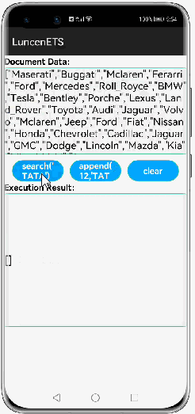

# How to use LUCENE Library for HarmonyOS: A developer’s Guide

## **1. Introduction**
When it comes to raw search speed LUCENE provides flexible search capabilities like multi-field search, phonetic transformations or partial matching.


## **2. Typical Use Cases**
1> Index is a flat high performance index which stores id-content-pairs.

2>Worker/WorkerIndex is also a flat index which stores id-content-pairs but runs in background as a dedicated worker thread.

3>Document is multi-field index which can store complex

<div align="center">
<table>
    <tr>
        <td>
            <ul><li><b>Index Search </b></br>Index Searches particular index of the element.</li><ul>
        </td>
        <td>
            <ul><li><b>Document Search</b></br>Document Search,Searches the field from the Document.</li><ul>
        </td>
    </tr>
    <tr>
        <td width="50%"><p align="center"></p></td>
        <td width="100%"><p align="center"></p></td>
    </tr>
</table>
</div>
<div align="center">
<table>
    <tr>
        <td>
            <ul><li><b>Worker Index </b></br>Asynchronous processing model as workers to perform any updates or queries on the index in parallel</li><ul>
        </td>
        <td>
            <ul><ul>
        </td>
    </tr>
    <tr>
        <td><center></center></td>
        <td></td>
    </tr>
</table>
</div>


# **3. Capability**


Capabilities and Features supported by Lucene includes the below:
# Index Search</br>
 Index is a flat high performance index which stores id-content-pairs.

 The index is a pure (flat) implementation, greatly optimized to perform fast. The document usually exists of multiple indexes (for each field in document).

In a document every field/index can have its own configuration including a custom encoder for each field.

You can use an instance of Index directly.


1. `memory` (primary optimize for memory)
2. `performance` (primary optimize for performance)
3. `match` (primary optimize for matching)
4. `score` (primary optimize for scoring)
5. `default` (the default balanced profile)

# Document Search</br>
Document is multi-field index which can store complex JSON documents (could also exist of worker indexes).

One of the key improvements is how documents will be indexed and processed. Such an index is getting its own class Document which contains instances of Index for each field under the hood. One advantage is you can query every Index of a document directly if you like. That comes close to the old "tag" feature, but runs significantly faster, e.g. when just query against one field. This way using a document can logically divide and distribute your contents through multiple indexes and is performing faster when query against one field compared to a non-document approach where you put in all your data to one index. Of course, a query through more than one field can't beat the non-document index performance-wise.

Every document needs an ID. When your documents has no ID, then you need to create one by passing an index or count or something else as an ID. Those IDs are unique references to a given content. This is important when you update or adding over content through existing IDs.

```js
const index = new Document({
    document: {
        id: "id",
        index: ["content"]
    }
});

index.add({ 
    id: 0, 
    content: "some text"
});
```

# Worker / WorkerIndex Search</br>
Worker / WorkerIndex is also a flat index which stores id-content-pairs but runs in background as a dedicated worker thread.

The worker inherits from type Index and does not inherit from type Document. Therefore, a WorkerIndex basically works like a standard Lucene Index. Worker-Support in documents needs to be enabled by just passing the appropriate option during creation 

Every method called on a Worker index is treated as async. You will get back a Promise or you can provide a callback function as the last parameter alternatively.

A worker will always perform as async. On a query method call you always should handle the returned promise (e.g. use await) or pass a callback function as the last parameter.


```groovy
const index = new Document({
    index: ["tag", "name", "title", "text"],
    worker: true
});
```

## **5. Installation**
For using Lucene module in sample application, include the below dependency in entry <span style="color: blue;">package.json</span>. Before this add Lucene module in project root directory.

```groovy
{
    "dependencies": {
        "Lucene": "file:../Lucene",
    }
}
```


## **6. API Usage With Example**
This section will help us to understand the usage of the library as you use it in your Harmony-application developemnt project.


### **Adding element in Single Field Search**


Element can be added to defined index.


<table style="width: 100%">
    <tr>
    <td width="50%">
    <pre>
<b style="color:lightcyan;">//Give the index and the element to be added</b>
model.addIndex(26, 'z zz zzz')
     
<b style="color:lightcyan;">//provide the data to index in given dataset</b>
    index.add(id, content);
 </pre>  
    </td>
    <td width="50%">
<p align="center"></p>
    </td>
    </tr>
</table>

### **Removing element from index search field**

Remove the data in the provided index

<table style="width: 100%">
    <tr>
    <td width="50%">
    <pre>
<b style="color:lightcyan;">//Give the index from where data should be removed</b>
model.deleteIndex(0);

<b style="color:lightcyan;">//remove it from provided dataset</b>
 index.remove(id);
 </pre>  
    </td>
    <td width="50%">
<p align="center"></p>
    </td>
    </tr>
</table>

### **Update element in the provided index**

Update the element in the provided index given


<table style="width: 100%">
    <tr>
    <td width="50%">
    <pre>
 <b style="color:lightcyan;"> //Provide the element and the index in which the element has to be updated</b>
 model.updateIndex(1, 'nb nbb nbbb');

 <b style="color:lightcyan;"> //update the element in the provided dataset index provided</b>
 index.update(id, content);;
 </pre>  
    </td>
    <td width="50%">
<p align="center"></p>
    </td>
    </tr>
</table>

### **Single Element Search in Index**

Search for single element in the Index dataset


<table style="width: 100%">
    <tr>
    <td width="50%">
    <pre>
<b style="color:lightcyan;"> //Provide the element to be searched for.</b>
 model.search('c');
     
  <b style="color:lightcyan;">//Search the element in the index dataset</b>
  index.search(text); 
 </pre>  
    </td>
    <td width="50%">
<p align="center"></p>
    </td>
    </tr>
</table>

### **Appending the element in Index search**


Appending the elemnet in the index to search


<table style="width: 100%">
    <tr>
    <td width="50%">
    <pre>
 <b style="color:lightcyan;"> //Provide the index and the element for appending.</b>
model.appendIndex(26,' append ')
     
  <b style="color:lightcyan;">//append in the dataset</b>
   index.append(id, content);
 </pre>  
    </td>
    <td width="50%">
<p align="center"></p>
    </td>
    </tr>
</table>

### **Export index dataset in using keyvalue pair**

Index data set can be exported using key value pair of element in the index

<table style="width: 100%">
    <tr>
    <td width="50%">
    <pre>
 <b style="color:lightcyan;"> //export the dataset</b>
model.exportIndex();;
     
  <b style="color:lightcyan;">//Use keyvalue pair to export the dataset</b>
 index.export(function (key, data) {
    exportedData[key] = data;
    logDebug('exportIndex success, key = ', key);
    logDebug('exportIndex success, data = ', data);
  });
 </pre>  
    </td>
    <td width="50%">
<p align="center"></p>
    </td>
    </tr>
</table>

### **Import index dataset in using keyvalue pair**


Import the dataset in keyvalue pair.
 

  <table style="width: 100%">
    <tr>
    <td width="50%">
    <pre>
 <b style="color:lightcyan;">//import the datset to model</b>
 model.importIndex();
     
 <b style="color:lightcyan;">//import the data in key value pair</b>
   const index2 = new Index(options);
  Object.keys(exportedData).forEach(function (key) {
    logDebug('importIndex success, key = ', key);
    logDebug('importIndex success, data = ', exportedData[key]);
    index2.import(key, exportedData[key]);
 </pre>  
    </td>
    <td width="50%">
<p align="center"></p>
    </td>
    </tr>
</table>


### **Single field search in Index for Document**

Search single filed in document index for content.

  <table style="width: 100%">
    <tr>
    <td width="50%">
    <pre>
  <b style="color:lightcyan;">//Search the element in document with url and content  </b>
index.search('Technology', {
    limit: 100,
    offset: 0,
    suggest: false,
    index: 'content',
    tag: false,
    enrich: true
  });
 </pre>  
    </td>
    <td width="50%">
<p align="center"></p>
    </td>
    </tr>
</table>

### **Multifield search for Document**

Multifield search as in title and content to be searched.
 
 <table style="width: 100%">
    <tr>
    <td width="50%">
    <pre>
 <b style="color:lightcyan;">//Serach in multifield below you can see in index title and content the word company would be searched</b>
 index.search('company', {
    limit: 100,
    offset: 0,
    suggest: false,
    index: ['title', 'content'],
    tag: false,
    enrich: false,
    bool: 'or'
  });
     
 </pre>  
    </td>
    <td width="50%">
<p align="center"></p>
    </td>
    </tr>
</table>


### **Search by Tag in the document**

In document search the url index by giving the tag from the page.
 
<table style="width: 100%">
    <tr>
    <td width="50%">
    <pre>
 <b style="color:lightcyan;">//in below two tags are used to be searched from the document</b>
index.search({ tag: ['Toyota', 'mercedes'] });
     
 </pre>  
    </td>
    <td width="50%">
<p align="center"></p>
    </td>
    </tr>
</table>

### **Page Based Serach in the document**

In page based search the element will get serached and the offset page will not appera again.
 

<table style="width: 100%">
    <tr>
    <td width="50%">
    <pre>
 <b style="color:lightcyan;">//Provide the pageno of the offset to start</b>
paginationQuery(this.pageNo)
pageNo++;

 <b style="color:lightcyan;">//Provide the element to be searched and remove the already serach page</b>
 return index.search('company', { limit: 100, offset: offset, suggest: false });
     
 </pre>  
    </td>
    <td width="50%">
<p align="center"></p>
    </td>
    </tr>
</table>

### **Remove Url from the document**


Remove the page from the document using async search by the lbrary.
 

<table style="width: 100%">
    <tr>
    <td width="50%">
    <pre>
  <b style="color:lightcyan;">//provide the page url to be removed</b>
  index.removeAsync('url1').then(function () {
    console.log('remove url1 success');
    store_getTest();
  });

 <b style="color:lightcyan;">//After removing store the content in the dataset</b>
 let stores = [];
  for (var i = 1; i <= docs.length; i++) {
stores[i] = index.get('urleng' + i);
console.log("removeasync"+stores[i]);
  }
 </pre>  
    </td>
    <td width="50%">
<p align="center"></p>
    </td>
    </tr>
</table>

### **Update URL in the document**

Update the URL title content and title for the provide url in the library.
 
<table style="width: 100%">
    <tr>
    <td width="50%">
    <pre>
  <b style="color:lightcyan;">//update the url2 with new tag title and content</b>
index.updateAsync({
    url: 'url2',
    tag: 'Maserati',
    title: 'Maserati S.p.A. is an Italian luxury vehicle manufacturer',
    content: 'Discover the exclusive Maserati world and the beautiful range of luxury car models: a combination of Italian elegance, style, passion and performance'
  }).then(function () {
    console.log('update url2 success');
    store_getTest();
  });
 <b style="color:lightcyan;">//After store store the content in the dataset</b>
let stores = [];
  for (var i = 1; i <= docs.length; i++) {

stores[i] = index.get('urleng' + i);
  }
 </pre>  
    </td>
    <td width="50%">
<p align="center"></p>
    </td>
    </tr>
</table>


### **Set an new URL page**

Adding new set of data/page/url for given data set.
 
<table style="width: 100%">
    <tr>
    <td width="50%">
    <pre>
 <b style="color:lightcyan;">//add new Url and provoide the data</b>
index.set('url1', { 'url': 'url1', 'tag': 'maserati', 'title': 'Luxurycar Maserati, this data has been changed on url1' });
  return index.get('url1');
 </pre>  
    </td>
    <td width="50%">
<p align="center"></p>
    </td>
    </tr>
</table>

### **List of public APIs for app-developer**
The public methods accessible for developers to use the Lucene library.

| Features                  |          API       
|------------------------|-----------|
| **Index**       | <ul><li>Index.__add__(id, string) *</li><li>Index.__append__(id, string) *</li><li>Index.__update__(id, string) *)</li><li>Index.__remove__(id) *</li><li>Index.__search__(string, \<limit\>, \<options\>) *</li><li>Index.__search__(options) *</li><li>_async_ Index.__export__(handler)</li><li> _async_ Index.__import__(key, data)</li>||------------------------|-----------|--------------------------------------------------------|
| **Document**       | <ul><li>Document.__add__(\<id\>, document) *</li><li>Document.__append__(\<id\>, document) *</li><li>Document.__update__(\<id\>, document) *</li><li>Document.__remove__(\<id\>document) *</li><li> Document.__search__(string, \<limit\>, \<options\>) *</li><li> Document.__search__(options) *</li><li>_async_ Document.__export__(handler)</li><li>_async_ Document.__import__(key, data)</li>||------------------------|-----------|--------------------------------------------------------|
| **WorkerIndex**       | <ul><li>_async_ Index.__add__(id, string)*</li><li>_async_ Index.__append__(id, string)</li><li>_async_ Index.__update__(id, string)</li><li>_async_ Index.__remove__(id)</li><li>_async_ Index.__search__(string, \<limit\>, \<options\>)</li><li>_async_ Index.__search__(options)</li>
| **Asynchronous version**       | <ul><li>_async_ .__addAsync__( ... , \<callback\>)</li><li>_async_ .__appendAsync__( ... , \<callback\>)</li><li>_async_ .__updateAsync__( ... , \<callback\>)</li><li>_async_ .__removeAsync__( ... , \<callback\>)</li><li>_async_ .__searchAsync__( ... , \<callback\>)||------------------------|-----------|--------------------------------------------------------|


### **Language Packs:**


In the migration library, you need to import the charset and lang objects, and then use the object values. For example,
<pre>
import charset_cjk from "flexsearch/src/lang/cjk/default.js";

const index = new Document({

    rtl: charset_cjk.rtl,
    tokenize: charset_cjk.tokenize,
    encode: function(str){ return str.replace(/[\x00-\x7F]/g, "").split(""); },
    worker: true
});
  </pre> 


## **8. Conclusion**
LUCENE is a very easy to use and very powerful library.The performance of the library is very good even when it works on one of the latest operating systems in the world, which is HarmonyOS!

* For more exciting libraries to develop your app, peep into third-party-components at </br>
[OpenHarmony-TPC](https://gitee.com/openharmony-tpc)

* To know more about the developement work happening on harmony aaplication layer, and even be part of the exciting stuff, watch this space of [Application-Library Engineering Group](https://github.com/applibgroup)
