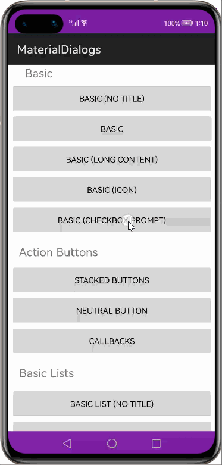

# How to use Material Dialog Library for HarmonyOS: A developer’s Guide

## **1. Introduction**

Dialogs are components, typically with modal windows, that are displayed in front of app content. They are used to inform users about a task that may contain critical information and/or require a decision. They purposefully interrupt the current flow and remain on screen until dismissed or action has been taken, so they should be used sparingly.

### **What is Material Dialog**

Material Dialog is a combination of various types of dialog supported by openharmony APIs. It has approx all the UI components with multiple test cases which includes dialog with Text, Image, Buttons, ListContainer items, Color Palette, Custom Views & Progressbar.

<h4>Modules:</h4>
Typically the library provides two modules that are core and common.

<h5>Core:</h5>
The core module contains all the major classes of this library, including <b>MaterialDialog</b>. You can create basic, list, single/multi choice, progress, input, etc. dialogs with core.

<h5>Common</h5>

The commons module contains extensions to the library. This includes the ColorChooserDialog, FolderChooserDialog, the Material Preference classes, and MaterialSimpleListAdapter/MaterialSimpleListItem.

To get started right away, head on to [Gitee](https://gitee.com/HarmonyOS-tpc/material-dialogs)

## **2. Typical Use Cases**
This library - com.afollestad.materialdialogs, is very useful in the development of applications which are in our daily use. Some of such examples mentioned below:

<table>
    <tr>
        <td>
            <ul><li><b>Custom Dialogs</b> Containing actions that require a series of tasks to complete.</li><ul>
        </td>
       <td>
            <ul><li><b>Confirmation dialog</b> Confirmation dialogs require users to confirm a choice before the dialog is dismissed.</li><ul>
        </td>
    </tr>
    <tr>
        <td width="50%">

</td>
        <td width="100%">

</td>
    </tr>
</table>

## **3. Capability**
In this section, we can see the list of features which the library provides which makes the use of this library very easy and friendly. Primarily, this library supports customization of component attributes using the below mechanism.

* **Java APIs** 
Material dialog uses a simple fluent java API's that allows users to display dialogs on screen.
 
## **4. Features**
Features supported by this component includes the below:
* **Basic Dialogs**  
Baic dialog is a simple dialog which will display a dialog with title, content , positive and negative buttons. 
* **Displaying an Icon** 
MaterialDialog supports the display of an icon just like the stock AlertDialog; it will go to the left of the title.You can limit the maximum size of the icon using the limitIconToDefaultSize().

* **Stacked Action Buttons** 
If you have multiple action buttons that together are too wide to fit on one line, the dialog will stack the buttons to be vertically oriented.

* **Neutral Action Button**  
You can specify neutral text in addition to the positive and negative text. It will show the neutral action on the far left. 

* **Callbacks** 
To know when the user selects an action button, you set callbacks.If you are listening for all three action buttons, you could just use onAny(). The which ( DialogAction) parameter will tell you which button was pressed.
If autoDismiss is turned off, then you must manually dismiss the dialog in these callbacks. Auto dismiss is on by default.

* **CheckBox Prompts** 
 Checkbox prompts can be used together with any other dialog type, it gets shown in the same view which shows the action buttons.

* **List Dialogs**  
Creating a list dialog only requires passing in an array of strings. The callback ( itemsCallback) is also very simple.

* **Single Choice List Dialogs** 
Single choice list dialogs are almost identical to regular list dialogs. The only difference is that you use itemsCallbackSingleChoice to set a callback rather than itemsCallback.  
That signals the dialog to display radio buttons next to list items.
If you want to preselect an item, pass an index 0 or greater in place of -1 in itemsCallbackSingleChoice(). Later, you can update the selected index using setSelectedIndex(int) on the MaterialDialog instance, if you're not using a custom adapter. 
If you do not set a positive action button using positiveText(), the dialog will automatically call the single choice callback when user presses the positive action button. 
The dialog will also dismiss itself, unless auto dismiss is turned off. 
If you make a call to alwaysCallSingleChoiceCallback(), the single choice callback will be called every time the user selects/unselects an item.

* **Multi Choice List Dialogs**  
Multiple choice list dialogs are almost identical to regular list dialogs. The only difference is that you use itemsCallbackMultiChoice to set a callback rather than itemsCallback.  
That signals the dialog to display check boxes next to list items, and the callback can return multiple selections. 
If you want to preselect any items, pass an array of indices (resource or literal) in place of null in itemsCallbackMultiChoice(). Later, you can update the selected indices using setSelectedIndices(Integer[]) on the MaterialDialog instance, if you're not using a custom adapter. 
If you do not set a positive action button using positiveText(), the dialog will automatically call the multi choice callback when user presses the positive action button. The dialog will also dismiss itself, unless auto dismiss is turned off. 
If you make a call to alwaysCallMultiChoiceCallback(), the multi choice callback will be called every time the user selects/unselects an item.

* **Custom List Dialogs** 
Like Harmony's native dialogs, you can also pass in your own adapter via .baseItemProvider() to customize exactly how you want your list to work.

* **Custom Views**  
A lot of the included extensions use custom views, such as the color chooser dialog.
If wrapInScrollView is true, then the library will place your custom view inside of a ScrollView for you. This allows users to scroll your custom view if necessary (small screens, long content, etc.). However, there are cases when you don't want that behavior.  
This mostly consists of cases when you'd have a ScrollView in your custom layout, including ListViews, WebViews, GridViews, etc. 
Your custom view will automatically have padding put around it when wrapInScrollView is true. Otherwise you're responsible for using padding values that look good with your content.

* **Progress Dialogs**  
In this module we have progressbar  with horizintal & circular.

* **Input Dialog**  
The input module contains extensions to the core module, such as a text input dialog.

* **Color**  
The color module contains extensions to the core module, such as a color chooser. We can also change the color from the custom color section which has SeekBar to change the ARGB color.

* **Files** 
The file module contains extensions to the core module, such as a file and folder chooser. Using this we can select file & folder from the local storage.

## **5. Installation**
For using the library in your HarmonyOS mobile app, you need to first install it by following below methods.

* **Method 1:**   
Generate the .har package through the library and add the .har package to the libs folder.Add the following code to the entry level build.gradle:
    <pre>
       <b style="color:green">
    implementation fileTree  (dir: 'libs', include: ['* .jar', '* .har'])
       </b>
</pre>

* **Method 2 :**   
Copy the dependency from the gitee and add it to the entry level build.gradle:
<pre>
dependencies {
    implementation fileTree(dir: 'libs', include: ['*.har'])
    <b style="color:green;">implementation 'io.openharmony.tpc.thirdlib:material-dialogs:1.0.2'
</b>
}
</pre>

## **6. Usage**
The Material library makes it simple to display a dialog on screen. To display material dialog we have to create the object of MaterialDialog.Builder()  

Here’s a code snippet that display a dialog on screen:

### **Step 1: Define layout via XML**
We are going to display a basic dialog on top of the components. So, add button component into <strong>ability_main.xml</strong> file.

    <?xml version="1.0" encoding="utf-8"?>
    <DirectionalLayout
        xmlns:ohos="http://schemas.huawei.com/res/ohos"
        xmlns:app="http://schemas.huawei.com/hap/res-auto"
        ohos:height="match_parent"
        ohos:width="match_parent"
        ohos:orientation="vertical"
        ohos:background_element="#000000">
            
       <Button
        ohos:id="$+id:basic"
        ohos:width="match_parent"
        ohos:height="43vp"
        ohos:text_size="14fp"
        ohos:top_margin="10vp"
        ohos:text_color="#000000"
        ohos:text="Basic Dialog"/>
    </DirectionalLayout>

### **Step 2: Getting reference to the button component from the layout.xml**

At first, get the reference to component. Here, we are showing a basic dialog when clicked on button.
 <pre> 
    //Initialize Button Component
    Button btnBasic=(Button) findComponentById(ResourceTable.Id_basic);
</pre>
After you have the reference to button component, you can write code to display a dialog on top of button.

### Step 3: Display dialog  box on top of button
To display a dialog we need the object of MaterialDialog.Builder(this), and then we have to call appropriate methods to display the dialog box.

so, MainAbilitySlice.java code will be like below.

* **MainAbilitySlice.java code** 
<pre class="brush: java; title: ; notranslate" title="">
public class MainAbilitySlice extends AbilitySlice                              
  {                 
    @Override               
    public void onStart(Intent intent) 
    {            
        super.onStart(intent);                  
        super.setUIContent(ResourceTable.Layout_ability_main);

        //Initialize Button Component
        Button btnBasic=(Button) findComponentById(ResourceTable.Id_basic);

        btnBasic.setClickedListener(new Component.ClickedListener()
        {
            @Override
            public void onClick(Component component) 
            {
                //Displaying dialog when clicked on button

                new MaterialDialog.Builder(MainAbilitySlice.this)
                        .title(ResourceTableString_useGoogleLocationServices)
                        .content(ResourceTableString_useGoogleLocationServicesPrompt)
                        .positiveText(ResourceTable.String_agree)
                        .negativeText(ResourceTable.String_disagree)
                        .show();
            }
        
        });
    }
}

</pre>

### **List of public APIs for app-developer**
The public methods below will help us to operate on the component at runtime.

**Core Module  Methods**

The below methods are the core module methods which are implemented under MaterialDialog.Builder class.

<table>
<tr>
    <td>
        <ul>
            <li>title(int titleRes)</li>
            <li>titleGravity(GravityEnum gravity)</li>
            <li>titleColor(int color)</li>
            <li>icon(int iconRes)</li>
            <li>content(int contentRes)</li>
            <li>contentColor(int color) </li>
            <li>contentGravity(GravityEnum gravity)</li>
            <li>items(CharSequence... items)</li>
            <li>itemsCallback(ListCallback callback)</li>
            <li>itemsLongCallback(ListLongCallback callback)</li>
            <li>itemsCallbackSingleChoice(int selectedIndex, ListCallbackSingleChoice callback)</li>
            <li>itemsCallbackMultiChoice(
                Integer[] selectedIndices, ListCallbackMultiChoice callback)</li>
            <li>itemsDisabledIndices(Integer... disabledIndices)</li>
            <li>alwaysCallMultiChoiceCallback()</li>
            <li>showListener(OnShowListener listener)</li>
            <li>dismissListener(OnDismissListener listener)</li>
            <li>cancelListener(OnCancelListener listener)</li>
            <li>stackingBehavior(StackingBehavior behavior)</li>
             <li>input(int hint,int prefill, boolean allowEmptyInput,InputCallback callback)</li>
            <li>inputType(int type)</li>
             <li>inputRange(int minLength, int maxLength)</li>
            <li>inputRange(int minLength,int maxLength,int errorColor)</li>
        </ul>
    </td>
    <td>
        <ul>
            <li>alwaysCallInputCallback()</li>
            <li>tag(Object tag)</li>
            <li>build()</li>
            <li>show()</li>
            <li>positiveText(int positiveRes)</li>
            <li>positiveColor(int colorStateList)</li>
            <li>neutralText(int neutralRes)</li>
            <li>negativeColor(int colorStateList)</li>
            <li>negativeText(int negativeRes)</li>
            <li>btnSelector(int selectorRes, DialogAction which)</li>
            <li>btnStackedGravity(GravityEnum gravity)</li>
            <li>checkBoxPrompt(
                int prompt, boolean initiallyChecked,
                Checkbox.CheckedStateChangedListener checkListener)</li>
            <li>customView(int layoutRes, boolean wrapInScrollView)</li>
            <li>customView(Component view, boolean wrapInScrollView)</li>
            <li>progress(boolean indeterminate, int max)</li>
            <li>progress(boolean indeterminate, int max, boolean showMinMax)</li>
            <li>progressIndeterminateStyle(boolean horizontal)</li>
            <li>dividerColor(int color)</li>
            <li>backgroundColor(int color)</li>
            <li>onPositive(SingleButtonCallback callback)</li>
            <li>onNeutral(SingleButtonCallback callback)</li>
            <li>onAny(SingleButtonCallback callback)</li>
            <li>autoDismiss(boolean dismiss)</li>
            <li>baseItemProvider(BaseItemProvider baseItemProvider)</li>
            <li>limitIconToDefaultSize()</li>
        </ul>
    </td>
</tr>
</table>

**Common Module methods**

The below methods are the  commons module methods which are implemented under ColorChooserDialog.Builder class.

<table>
    <tr>
        <td>
            <ul>
                <li>titleSub(int titleSub)</li>
                <li>tag(String tag)</li>
                <li>preselect(int preselect)</li>
                <li>accentMode(boolean accentMode)</li>
                <li>doneButton(int text)</li>
                <li>build()</li>
                <li>show()</li>
            </ui>
        </td>
        <td>
            <ul>
                <li>backButton(int text)</li>
                <li>cancelButton(int text)</li>
                <li>preselect(int preselect)</li>
                <li>presetsButton(int text)</li>
                <li>dynamicButtonColor(boolean enabled)</li>
                <li>customColors(Color[] topLevel, Color[][] subLevel)</li>
            </ui>
        </td>
    </tr>
</table>

The below methods are the  commons module methods which are implemented under FolderChooserDialog.Builder class.

<table>
    <tr>
        <td>
            <ul>
                <li>chooseButton(int text)</li>
                <li>typeface(String medium, String regular)</li>
                <li>cancelButton(int text)</li>
                <li>goUpLabel(String text)</li>
                <li>build()</li>
            </ui>
        </td>
        <td>
            <ul>
                <li>initialPath(String initialPath)</li>
                <li>tag(String tag)</li>
                <li>show()</li>
                <li>allowNewFolder(boolean allow, int buttonLabel)</li>
            </ui>
        </td>
    </tr>
</table>

The below methods are the  commons module methods which are implemented under FileChooserDialog.Builder class.

<table>
    <tr>
        <td>
            <ul>
                <li>extensionsFilter(String... extensions)</li>
                <li>typeface(String medium, String regular)</li>
                <li>cancelButton(int text)</li>
                <li>mimeType(String type)</li>
                <li>build()</li>
            </ui>
        </td>
        <td>
            <ul>
                <li>initialPath(String initialPath)</li>
                <li>tag(String tag)</li>
                <li>show()</li>
                <li>goUpLabel(String text)</li>
            </ui>
        </td>
    </tr>
</table>

## **7. API usage examples**
In this section, we can have a look at some of the examples where the APIs of this library is put to use and the results which we can acheive.

### Example1: Display Dialog with title,content and buttons 

You can display a dialog with title, content and positive and negative buttons.

<table>
<tr>
<td width=700px>
<pre>
<b><u>Java Slice</u>:</b> 
new MaterialDialog.Builder(this)
    <b style="color:green;">.title(ResourceTable.String_useGoogleLocationServices)
    .content(ResourceTable.String_useGoogleLocationServicesPrompt)
    .positiveText(ResourceTable.String_agree)
    .negativeText(ResourceTable.String_disagree)</b>
    .show();
</pre>
</td>
<td width=300px>
    

</td>
</tr>
</table>

### Example2: Display Dialog with icon
<table>
    <tr>
        <td width=700px>
        <pre>
<b><u>Java Slice</u>:</b> 
new MaterialDialog.Builder(this)
    <b style="color:green;">.icon(ResourceTable.Media_ic_launcher)</b>
    <b style="color:blue;">//Make the icon to default size</b>
    .limitIconToDefaultSize()  
    .title(ResourceTable.String_useGoogleLocationServices)
    .content(ResourceTable.String_useGoogleLocationServicesPrompt)
    .positiveText(ResourceTable.String_agree)
    .negativeText(ResourceTable.String_disagree)
    .show();

</pre>
</td>
    <td width=300px>
        

    </td>
    </tr>
</table> 

 ### Example3: Display Dialog with CheckBox Prompt
   <table>
    <tr>
        <td width=700px>
        <pre>
<b><u>Java Slice</u>:</b> 
new MaterialDialog.Builder(this)
    .icon(ResourceTable.Media_ic_launcher)
    .limitIconToDefaultSize()
    .title(ResourceTable.String_permissionSample)
    .positiveText(ResourceTable.String_allow)
    .negativeText(ResourceTable.String_deny)
    .onAny((dialog, which) -> showToast("Prompt checked? " 
    +dialog.isPromptCheckBoxChecked()))
    <b style="color:green;">.checkBoxPrompt(ResourceTable.String_dont_ask_again, false, 
    new AbsButton.CheckedStateChangedListener() 
    {
        @Override
        public void onCheckedChanged(AbsButton absButton, 
        boolean checked) 
        {
            if (checked) 
            {
                <b style="color:blue">//when checked setting background element</b>
                setAbsButtonBackgroundElement(absButton, 
                ResourceTable.Media_abc_btn_check_to_on_mtrl_015);
            } 
            else
            {
                <b style="color:blue">//When unchecked setting background element</b>
                setAbsButtonBackgroundElement(absButton, 
                ResourceTable.Media_abc_btn_check_to_on_mtrl_000);
            }
        }
    })
    </b>.show();
        </pre>
        </td>
        <td width=300px>
        

        </td>
    </tr>
</table>

### Example4: Display action buttons in stacked behaviour 

This library providing is providing 3 types of stacking behaviors,these enumerations are provding by the <b>StackingBehavior</b> enum. those are:  
<b>ALWAYS:</b> The action buttons are always stacked vertically. 
<b>ADAPTIVE:</b> The action buttons are stacked vertically IF it is necessary for them to fit in the dialog. 
<b>NEVER:</b> The action buttons are never stacked, even if they should be. 

And also it is providing action buttons stacked gravity by <b>GravityEnum.</b> 
<b>START</b> : It will arrange buttons from left of the dialog box. 
<b>CENTER</b>: It will arrange buttons from center of the dialog box. 
<b>END</b>: It will arrange buttons from end of the dialog box.

<table>
    <tr>
        <td width=700px>
        <pre>
<b><u>Java Slice</u>:</b> 
 new MaterialDialog.Builder(this)
    .title(ResourceTable.String_useGoogleLocationServices)
    .content(ResourceTable.String_useGoogleLocationServicesPrompt)
    .positiveText(ResourceTable.String_speedBoost)
    .negativeText(ResourceTable.String_noThanks)
    <b style="color:green">.btnStackedGravity(GravityEnum.END)
    .stackingBehavior(StackingBehavior.ALWAYS)</b>
    .show();
 
</pre>
  </td>
     <td width=300px>
        

    </td>
</tr>
</table> 

### Example5: Displaying list of items in dialog
Material Dialogs providing  different types of lists i.e., normal list, single choice list and multichoice list.And also we can create our own custom list items in dialog.

#### Normal list in dialog
<table>
    <tr>
        <td width=700px>
        <pre>
<b><u>Java Slice</u>:</b> 
 new MaterialDialog.Builder(this)
        .title(ResourceTable.String_states)
        <b style="color:blue"> // to display list of items in dialog, 
        we need to call items() method by passing 
        array of strings(items in string array).</b>
        <b style="color:green">.items(new String[]{"Alabama", "Alaska", 
            "American Samoa",  "Arizona", "Arkansas", 
            "California", "Colorado", "Connecticut", "Delaware"})
         <b style="color:blue">//this itemcallback method will 
         display item name as toast when clicked on given items</b>
        .itemsCallback((dialog, view, which, text) -> 
                      showToast(which + ": " + text))</b>
        .positiveText(ResourceTable.String_cancel)
        .show();  
        </pre>
        </td>
        <td width=300px>
        

        </td>
    </tr>
</table>

#### Single choice List in dialog
<table>
    <tr>
        <td width=700px>
        <pre>
<b><u>Java Slice</u>:</b> 
 new MaterialDialog.Builder(this)
        .title(ResourceTable.String_socialNetworks)
        <b style="color:green">.items(new String[]{"Twitter", "Google", 
            "Instagram", "Facebook"})
        <b style="color:blue">//Sets indices of items that are not clickable.</b> 
        .itemsDisabledIndices(1, 3)
        <b style="color:blue">//itemsCallbackSingleChoice method will 
        create readio buttons on left side of each 
        item in the list.</b> 
        .itemsCallbackSingleChoice(2, (dialog, view,which, 
        text) -> {
            showToast(which + ": " + text);
            return true; // allow selection
        })</b>
        .positiveText(ResourceTable.String_md_choose_label)
        .show();
 </pre>
        </td>
        <td width=300px>
        

        </td>
    </tr>
</table>

#### MultiChoice list in dialog 

<table>
    <tr>
        <td width=700px>
        <pre>
<b><u>Java Slice</u>:</b> 
 new MaterialDialog.Builder(this)
    .title(ResourceTable.String_socialNetworks)
    <b style="color:green">.items(new String[]{"Twitter","Google","Instagram","Facebook"})
    <b style="color:blue">//itemsCallbackMultiChoice method will 
        create check boxes on left side of each item in the list.</b>
    .itemsCallbackMultiChoice(new Integer[]{1}, (dialog, which, 
    text) -> 
    {
       <b style="color:blue"> // limit selection to 2, the new (un)selection 
       is included in the which array</b>
        boolean allowSelectionChange = which.length <= 2;
        if (!allowSelectionChange) {
            showToast(ResUtil.getString(this, ResourceTable.
            String_selection_limit_reached));
        }
        return allowSelectionChange;
    })</b>
    .positiveText(ResourceTable.String_dismiss)
   <b style="color:blue"> // the callback will always be called, 
    to check if (un)selection is still allowed</b>
    .alwaysCallMultiChoiceCallback() 
    .show();
        </pre>
        </td>
        <td width=300px>
        

        </td>
    </tr>
</table>

#### Custom list items in dialog 

<table>
    <tr>
        <td width=700px>
        <pre>
<b><u>Java Slice</u>:</b> 
<b style="color:blue">//First we need create MaterialSimpleListAdapter
 which is provided by the library,
 we can create our own adapters also</b>

 final MaterialSimpleListAdapter materialSimpleListAdapter=new                 
            MaterialSimpleListAdapter(this,(dialog, index1, 
            item) -> showToast(item.getContent().toString()));

materialSimpleListAdapter.add(
        new MaterialSimpleListItem.Builder(this)
                .content(ResUtil.getString(this, 
                ResourceTable.String_user_email1))
                .icon(ResourceTable.Media_ic_account_circle)
                .backgroundColor(Color.WHITE.getValue())
                .build());
materialSimpleListAdapter.add(
        new MaterialSimpleListItem.Builder(this)
                .content(ResUtil.getString(this, 
                ResourceTable.String_user_email2))
                .icon(ResourceTable.Media_ic_account_circle)
                .backgroundColor(Color.WHITE.getValue())
                .build());
materialSimpleListAdapter.add(
        new MaterialSimpleListItem.Builder(this)
                .content(ResourceTable.String_add_account)
                .icon(ResourceTable.Media_ic_content_add)
                .iconPadding(8)
                .build());

new MaterialDialog.Builder(this)
                    .title(ResourceTable.String_set_backup)
                    <b style="color:blue">//we need to pass our custome adapter 
                    to the baseItemProvider method></b>
                    <b style="color:green">.baseItemProvider(materialSimpleListAdapter)
                    .show();</b>
        </pre>
        </td>
        <td width=300px>
        

        </td>
    </tr>
</table>

### Example6: Displaying progressbar in dialog
Material Dialogs provding two types of progressbar i.e., circular and horizontal progressbar

#### Indetermine Circular progressbar

<table style="width: 100%;">
    <tr>
        <td width=700px>
        <pre>
<b><u>Java Slice</u>:</b> 
new MaterialDialog.Builder(this)
                .title(ResourceTable.String_progress_dialog)
                .content(ResourceTable.String_please_wait)
               <b style="color:green"> .progress(true, 0)
                .progressIndeterminateStyle(false)</b>
                .show();
        </pre>
        </td>
        <td width=300px>
        

        </td>
    </tr>
</table>

####  Horizontal progressbar

<table>
    <tr>
        <td width=700px>
        <pre>
<b><u>Java Slice</u>:</b> 
new MaterialDialog.Builder(this)
    .title(ResourceTable.String_progress_dialog)
    .content(ResourceTable.String_please_wait)
    .contentGravity(GravityEnum.CENTER)
    <b style="color:green">.progress(false, 150, true)</b>
    .showListener(
     dialogBase -> {
        final MaterialDialog dialog = (MaterialDialog) dialogBase;
        startThread(
        () -> {
        while (dialog.getCurrentProgress() != dialog
        .getMaxProgress()
        && !Thread.currentThread().isInterrupted())
        {
            try {
                Thread.sleep(50);
            } catch (InterruptedException e) {
                break;
            }
            dialog.incrementProgress(1);
        }
        getUITaskDispatcher().asyncDispatch(
                () -> {
                    thread = null;
                    dialog.setContent(ResUtil.getString(
                        MainAbilitySlice.this,
                    ResourceTable.String_md_done_label));
                });
        });
    }
    )
    .show();
        </pre>
        </td>
        <td width=300px>
        

        </td>
    </tr>
</table>

### Example7: Displaying color palette in dialog
 Material Dialog library providing built in color palette dialog and also we can create our own colors in the dialog.

#### Built in color palette
 
<table>
    <tr>
        <td width=700px>
        <pre>
<b><u>Java Slice</u>:</b> 
new ColorChooserDialog.Builder(this,ResourceTable.String_color_palette)
                .titleSub(ResourceTable.String_colors)
                .accentMode(true)
                .preselect(accentPreselect)
                .show();
        </pre>
        </td>
        <td width=300px>
        

        </td>
    </tr>
</table>

#### Custom color palette
 
<table>
    <tr>
        <td width=700px>
        <pre>
<b><u>Java Slice</u>:</b> 
Color[] customColorsNoSub = new Color[]{
new Color(0xFFF44336),new Color(0xFFE91E63),new Color(0xFF9C27B0),
new Color(0xFF673AB7),new Color(0xFF3F51B5),new Color(0xFF2196F3)};

new ColorChooserDialog.Builder(this, ResourceTable.
                                String_color_palette)
            .titleSub(ResourceTable.String_colors)
            .preselect(primaryPreselect)
           <b style="color:green"> .customColors(customColorsNoSub, null)</b>
            .show();
        </pre>
        </td>
        <td width=300px>
        

        </td>
    </tr>
</table>

## **8. Conclusion**
Even though this article only worked through the basics, this library offers much more than that.Please refer sample application in the gitee for more fetures and api implementations.

* For more exciting libraries to develop your app, peep into third-party-components at  
[OpenHarmony-TPC](https://gitee.com/openharmony-tpc)

* To know more about the developement work happening on harmony aaplication layer, and even be part of the exciting stuff, watch this space of [Application-Library Engineering Group](https://github.com/applibgroup)
