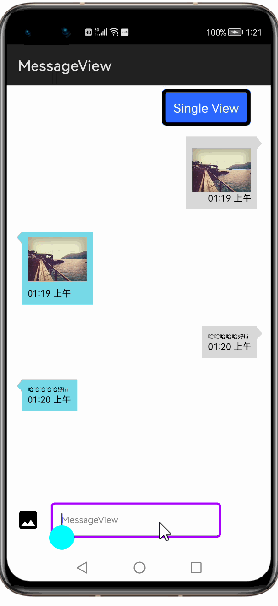

# How to use CircleImageView Library for HarmonyOS: A developer’s Guide

## **1. Introduction**
MessageView helps user to create chat message view or a social media message view quickly like a typical chatting application or social post view .Its a container view,so user can add any type of message or social post such as Text or any customize Text, Image, etc.

To get started right away, head on to [Gitee](https://codehub-y.huawei.com/Projects-OpenSource-Gitee/MessageView/files?ref=master)

## **2. Typical Use Cases**
This library - com.developer.messageview, is very useful in the development of applications which are in our daily use. Couple of such examples are mentioned below:

<table>
    <tr>
        <td>
            <ul><li><b>Messenger</b> Messages can be exchanged between sender and receiver</li><ul>
        </td>
    </tr>
    <tr>
        <td><ceter>
</td>
    </tr>
</table>

## **3. Capability**
In this section, we can see the list of features which the library provides which makes the use of this library very easy and friendly. Primarily, this library supports customization of component attributes using the below mechanisms.

* **XML layout inflation** 
With the help of xml layout inflation, the library is so easy to use such that, we can put the component to action without even writing a single line of code. This will be so useful for quick development, as well as for beginners who are starting with mobile-app development. On how to use the XML Layout Inflation can be seen in the coming sections of the tutorial.

* **Customization via Java APIs** 
In case we need to customize the component during run time, we also have the flexibility to do that using the JAVA APIs which the library exposes. The APIs will also help us to utilize the features provided from its parent “Image” Class 

## **4. Features**
Features supported by this component includes the below:
* **Customizing arrow gravity** 
We can configure the arrow gravity to start , end or center of the view. Often setting the right gravity for a message-view makes a whole lot of difference in the way the chat view appeals to audience.

* **Customizing arrow position** 
We can configure the arrow gravity to left , right , top or bottom of the view. Often setting the right position for a message-view makes a whole lot of difference in the way the chat view appeals to audience.

* **Setting background color** 
Using this library, we can set color to the message view normally r when the view is pressed. A suitable backgroud color for the message view can also be provided incase of using the component.

* **Configuring the padding** 
Padding is used to reserve some space on the sides of the component drawn by the library. We can define how much such space should be on the left, top, right & bottom side of the component.

## **5. Installation**
For using the library in your HarmonyOS mobile app, you need to first install it by adding the below dependency in your entry/build.gradle file.
<pre>
dependencies {
    implementation fileTree(dir: 'libs', include: ['*.har'])
    </b>implementation project(path: ':library')</b>
    }
</pre>

## **6. Usage**
This section will help us to understand the usage of the library as you use it in your Harmony-application developement project.

### **Step 1: Define layout via XML**

    <?xml version="1.0" encoding="utf-8"?>
    <DirectionalLayout
        xmlns:ohos="http://schemas.huawei.com/res/ohos"
        xmlns:app="http://schemas.huawei.com/hap/res-auto"
        ohos:height="match_parent"
        ohos:width="match_parent"
        ohos:orientation="vertical"
        ohos:background_element="#000000">
        <com.developer.messageview.MessageView
                ohos:id="$+id:chatMessageView"
                ohos:height="290vp"
                ohos:width="290vp"
                ohos:image_src="$media:profilepic"
                ohos:orientation="vertical"
                ohos:layout_alignment="center"
                ohos:top_padding="10vp"
                app:arrowGravity="start"
                app:arrowPosition="left"
                app:backgroundColor="#42a5f5"
                app:backgroundColorPressed="#f05f12"
                app:padding="50vp"
                app:radius="40vp"
                app:showArrow="true"> 
        </com.developer.messageview.MessageView>        
    </DirectionalLayout>

### **Step 2: Customize programmatically via Java API**

    @Override
    public void onStart(Intent intent) {
        super.onStart(intent);
        super.setUIContent(ResourceTable.Layout_NewSilce);
        MessageView msgView
        msgView = findComponentById(ResourceTable.Id_chatMessageView);
        msgView.setArrowPosition(MessageView.ArrowPosition.TOP);
    }

### **List of XML attributes supported**
Below is the list of XML attributes which are supported by the library.

* app:arrowGravity - To specify the arrow gravity to start , end or center of the view.
* app:arrowPosition - To specify arrow position to left , right , top or bottom.
* app:backgroundColor - To specify a background color of the message view.
* app:backgroundColorPressed - To specify a backgound color of the message view when view pressed.
* app:padding - To reserve some space on the sides of the component drawn by the library.
* app:radius - To specify the radius of message view.
* app:showArrow - To specify boolean value to display or hide arrow.

### **List of public APIs for app-developer**
The public methods below will help us to operate on the component at runtime.

<table>
<tr>
    <td>
        <ul>
            <li>setArrowPosition()</li>
            <li>setArrowGravity()</li>
            <li>setBackgroundColor()</li>
            <li>isShowArrow()</li>
        </ul>
    </td>
</tr>
</table>

## **7. API usage examples**
In this section, we can have a look at some the examples where the APIs of this library is put to use and the results which we can acheive.

**Example1: **

In this example, first the background-color of the circleImageView is set to red color in layout.xml so that transparency is clearly observable. The color code is in [RGB-format](https://htmlcolorcodes.com/)
<table>
    <tr>
        <td width=700px>
        <pre>
<b><u>Layout.xml</u>:</b>
&ltcom.developer.messageview
    ohos:id="$+id:msgview"
    ohos:height="290vp"
    ohos:width="290vp"
    ohos:image_src="$media:profilepic"
    ohos:orientation="vertical"
    ohos:layout_alignment="center"
    ohos:top_padding="10vp"
    <b style="color:blue;">app:civ_bg_color="#FF0000"</b>/>
 
<b><u>Java Slice</u>:</b>
CircleImageView civ;
civ = (CircleImageView)
findComponentById
(ResourceTable.Id_tempciv);
<b style="color:blue;">civ.setAlpha(0.5f);</b>
        </pre>
        </td>
        <td width=300px>
        

        </td>
    </tr>
</table>

**Example2: Customising border related attributes**

## **8. Conclusion**
MessageView is a very easy to use and very powerful library.The performance of the library is very good even when it works on one of the latest operating systems in the world, which is HarmonyOS!

* For more exciting libraries to develop your app, peep into third-party-components at  
[OpenHarmony-TPC](https://gitee.com/openharmony-tpc)

* To know more about the developement work happening on harmony aaplication layer, and even be part of the exciting stuff, watch this space of [ALEG](https://github.com/applibgroup)
