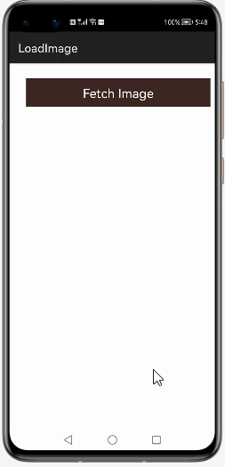
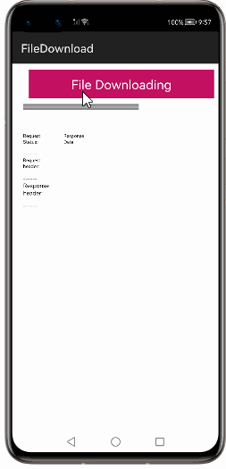
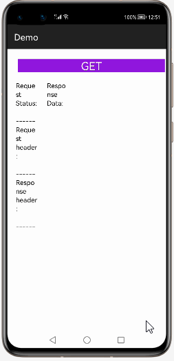
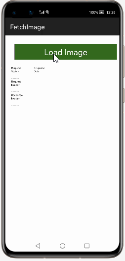
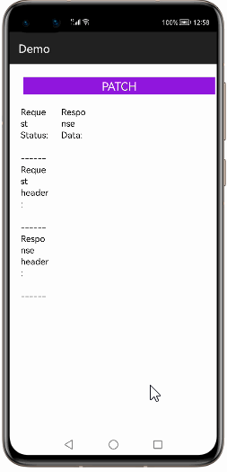

# How to use okhttp-OkGo  Library for HarmonyOS: A developer’s Guide

## **1. Introduction**

OkGo - 3.0 is based on the Http protocol and encapsulates OkHttp's network request framework. It is easier to use than Retrofit, supports RxJava, RxJava2, and supports custom caching. Batch breakpoint download management and batch upload management
Stars
## **2. Typical Use Cases**
This library - com.lzy.demo, is very useful in the development of applications which are in our daily use. Some of such examples mentioned below:


<center><table>
    <tr>
        <td>
            <ul><li><b>Load Image</b></br>Load from image from server using OkhttpokGo Library  I prefer always to download photos in background, to do so using OkHttpClient, you should use callback:</li><ul>
        </td>
       <td>
            <ul><li><b>File Download</b></br>There are many ways to download files. Following I will post most common ways; it is up to you to decide which method is better for your app.</li><ul>
        </td>
    </tr>
    <tr>
        <td><center></center></td>
        <td><center></center></td>
    </tr>
</table></center>


## **3. Capability**
In this section, we can see the list of features which the library provides which makes the use of this library very easy and friendly. Primarily, this library supports customization of component attributes using the below mechanism.

* **Java APIs**</br>
okhttp-OkGo  uses a simple fluent java API's that allows users to make most requests in a single line:
 
## **4. Features**
Features supported by this component includes the below:
* **Support for RxJava & RxJava2:** </br>
Implementing applications that deal with complex concurrent behavior has always been a challenging aspect of programming.
 Various paradigms exist that promise a solution to this problem in different ways.
 RxJava is a Java library that enables Functional Reactive Programming in Harmony development.
* **custom cache policies.:**<br>
Caches HTTP and HTTPS responses to the filesystem so they may be reused, saving time and bandwidth.
* **download management :**<br>
Interceptors are simpler. An executor for switching threads and a listener for progress monitoring are passed in from the constructor. By setting this interceptor, the download process is intercepted in our custom DowloadResponseBody.
* **upload management.:**<br>
Support  file upload and download, upload progress callback, download progress callback.
 form upload (multiple files and multi-parameter upload together)
## **5. Installation**
For using the library in your HarmonyOS mobile app, you need to first install it by following below methods.

* **Method 1:**  </br>
Generate the .har package through the library and add the .har package to the libs folder.Add the following code to the entry level build.gradle:
    <pre>
       <b style="color:green">
    implementation fileTree  (dir: 'libs', include: ['* .jar', '* .har'])
       </b>
</pre>

* **Method 2 :**  </br>
Copy the dependency from the gitee and add it to the entry level build.gradle:
<pre>
dependencies {
    implementation fileTree(dir: 'libs', include: ['*.har']) 
    <b style="color:blue;">implementation 'COM.LZY.NET : out OkGo: 3.0 . . 4'</b>
           }
</pre>
## **6. Add internet permission**
<p>Since we are going to do network operations, we need to add internet permission in <strong>config.json</strong> file </p>

<pre>
{
  "app": {
    "bundleName": "com.example.okhttpokGo",
    "vendor": "example",
    "version": {
      "code": 1000000,
      "name": "1.0"
    },
    "apiVersion": {
      "compatible": 5,
      "target": 5,
      "releaseType": "Beta1"

    }
  },
  "deviceConfig": {
    "default": {
      "network": {
        "cleartextTraffic": true
      }
    }
  },
  "module": {
    "package": "com.example.okhttpokGo",
    "name": ".MyApplication",
    "reqCapabilities": [
      "video_support"
    ],
    "deviceType": [
      "phone"
    ],
    "distro": {
      "deliveryWithInstall": true,
      "moduleName": "entry",
      "moduleType": "entry"
    },
    "abilities": [
      {
        "skills": [
          {
            "entities": [
              "entity.system.home"
            ],
            "actions": [
              "action.system.home"
            ]
          }
        ],
        "orientation": "unspecified",
        "name": "com.example.okhttpokGo.MainAbility",
        "icon": "$media:icon",
        "description": "$string:mainability_description",
        "label": "$string:app_name",
        "type": "page",
        "launchType": "standard"
      }
    ],
    "reqPermissions": [
      {
       <b style="color:orange"> "name": "ohos.permission.INTERNET"</b>
      }
    ]
  }
}
</pre>

## **7. Usage**
This section will help us to understand the usage of the library as you use it in your Harmony-application developemnt project.

### **Step 1: Define layout via XML**
We are going to load list  into Button component using This  Library. So, add Button component into <strong>resource_file.xml</strong> file.

```xml
    <?xml version="1.0" encoding="utf-8"?>
    <DirectionalLayout
        xmlns:ohos="http://schemas.huawei.com/res/ohos"
        xmlns:app="http://schemas.huawei.com/hap/res-auto"
        ohos:height="match_parent"
        ohos:width="match_parent"
        ohos:orientation="vertical"
        ohos:background_element="#000000">
            
      <Button
            ohos:id="$+id:get"
            ohos:height="30vp"
            ohos:width="100vp"
            ohos:background_element="#888"
            ohos:left_margin="20vp"
            ohos:text="GET"/>
    </DirectionalLayout>
```
### **Step 2: Customize programmatically via Java API**
```java
   @Override
    public void onStart(Intent intent) {
        super.onStart(intent);
	    setUIContent(ResourceTable.Layout_layout_base_details);

         OkGo.<String>get("https://httpbin.org/get")
                .tag(this)
                .execute(new StringCallback() {
                    @Override
                    public void onSuccess(Response<String> response) {
                        OkLogger.e("GET Response" + response.body());
                        handleResponse(response);
                    }
                });;

    }
```

### **List of public APIs for app-developer**
The public methods below will help us to operate on the component at runtime.

**okhttpokGo  Methods**
<table>
<tr>
    <td>
        <ul>
            <li>OkGo.patch(String url)</li>
            <li>OkGo.post(String url)</li>
			 <li>OkGo.get(String url)</li>
			  <li>OkGo.put(String url)</li>
			 <li>OkGo.trace(String url)</li>
              <li>OkGo.patch(String url)</li> 
           </ul>
            </td>
			<td>
			<ul>
			  <li>OkGo.delete(String url)</li>
			  <li>OkGo.head(String url)</li>
			 <li>OkGo.options(String url)</li>
			 <li>OkGo.cancelAll()</li>
			 <li>OkGo.cancelTag()</li>	  
        </ul>
    </td>
  
</tr>
</table>

## **8. API usage examples**
In this section, we can have a look at some the examples where the APIs of this library is put to use and the results which we can acheive.

**Example1: okhttp-OkGo with Get Method**
<table>
    <tr>
        <td >
        <b><u>Layout.xml</u>:</b>
        <pre>
       &ltButton
            ohos:id="$+id:Get"
            ohos:height="30vp"
            ohos:width="match_parent"
            ohos:background_element="#9017DD"
            ohos:left_margin="5vp"
            ohos:right_margin="5vp"
            ohos:text="GET" 
            ohos:text_color="white"
            ohos:text_size="25fp"
             ohos:top_margin="6vp"/>

</br>
</pre>
<b><u>Java Slice</u>:</b>
<pre>
   //GET
  private void getMethod() {
   OkGo.<String>
 get("https://demonuts.com/Demonuts/JsonTest/Tennis/json_parsing.php")
  .tag(this)
  .execute(new StringCallback() {
  @Override
  public void onSuccess(Response<String> response) {
   OkLogger.e("GET Response:" + response.body());
    handleResponse(response);
            }
              });
    }
        </pre>
        </td>
        <td >
        <center></center>
        </td>
    </tr>
</table>


**Example2: okhttp-OkGo With Download Method **
<table>
    <tr>
        <td >
        <b><u>Layout.xml</u>:</b>
        <pre>
       &ltButton
            ohos:id="$+id:post"
            ohos:height="30vp"
            ohos:width="100vp"
            ohos:background_element="#888"
            ohos:left_margin="20vp"
            ohos:text="Download"/>

</br>
</pre>
<b><u>Java Slice</u>:</b>
<pre>
//Download 
 private void downloadMethod() {
        
 OkGo.<PixelMap>
 get("https://www.simplifiedcoding.net//demos//marvel//spiderman.jpg")
 .tag(this)
  .headers("header1", "headerValue1")
  .params("param1", "paramValue1")
  .execute(new BitmapCallback() {
   @Override
  public void onSuccess(Response<PixelMap> response) {
  downImage.setPixelMap(response.body());
   handleResponse(response);
          }
           });
    }
        </pre>
        </td>
        <td >
        <center></center>
        </td>
    </tr>
</table>


**Example3: okhttp-OkGo with PATCH Method****
<table>
    <tr>
        <td >
        <b><u>Layout.xml</u>:</b>
        <pre>
       &ltButton
          ohos:id="$+id:patch"
          ohos:height="30vp"
          ohos:width="match_parent"
          ohos:background_element="#9017DD"
          ohos:left_margin="5vp"
          ohos:right_margin="5vp"
          ohos:text="PATCH"
          ohos:text_color="white"
          ohos:text_size="20fp"
          ohos:top_margin="6vp"
          ohos:visibility="visible"/>

</br>
</pre>
<b><u>Java Slice</u>:</b>
<pre>
 private void patchMethod() {
        // PATCH
        OkGo.<String>patch("https://httpbin.org/patch")
         .execute(new StringCallback() {
         @Override
         public void onSuccess(Response<String> response) {
          OkLogger.e("PATCH Response:---" + response.body());
                        handleResponse(response);
                    }
                });
    }
        </pre>
        </td>
        <td >
        <center></center>
        </td>
    </tr>
</table>


## **9. Conclusion**
okhttp-OkGo is a very easy to use and very powerful library.The performance of the library is very good even when it works on one of the latest operating systems in the world, which is HarmonyOS!

* For more exciting libraries to develop your app, peep into third-party-components at </br>
[OpenHarmony-TPC](https://gitee.com/openharmony-tpc)

* To know more about the developement work happening on harmony aaplication layer, and even be part of the exciting stuff, watch this space of [Application Library Engineering Group](https://github.com/applibgroup)