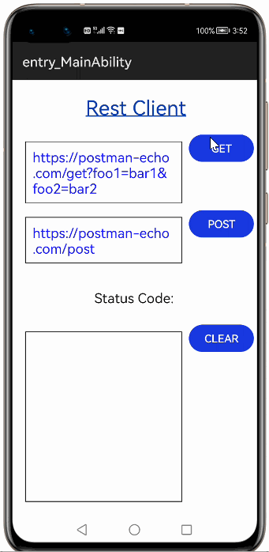
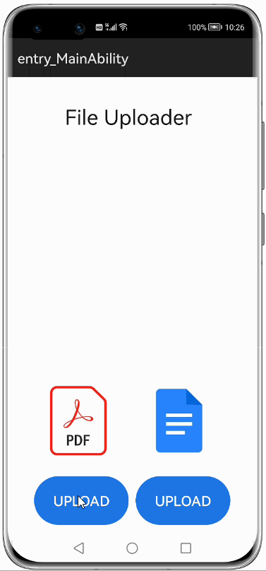
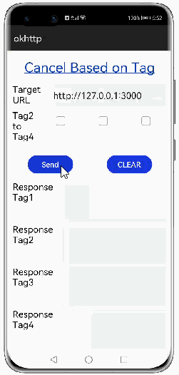
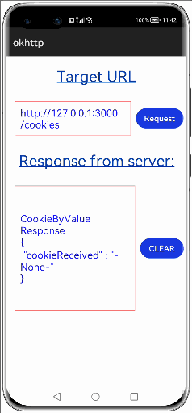

# How to use OkHttp Library for HarmonyOS: A developer’s Guide

## **1. Introduction**
Hyper Text transfer protocol(http) is an application level protocol which requires a client and a server to transfer data on the web. The data can be in any format like plain text,audio file, hyper text, video file etc.

Okhttp is a library for HarmonyOS which provides most of the functionality similar to the http client. This library can be used in many modern day applications to exchange data very easily in a more efficient and faster way.</br>

This library makes it easy to make multiple http requests like get,post,put and delete.</br>
We can also cancel these requests based on the tags.</br>
Multiple files and parameters can be added to the request at a time. </br>
Reconnection feature is also available in this library where reconnection happens when there is a common network problem.</br>

The Library also supports the redirection feature where there is a redirect response to the request sent and redirected to the location.</br>

With the use of this library, converting the network request callback interface to a required type to facilitate subsequent data processing becomes easier.</br> 
This library supports features like encoding and decoding gzip files.</br> 

Cookies can be sent in Http header and they will be saved in system’s shared preference. The cookie policy can be configured globally with the help of the library.</br>


## **2. Typical Use Cases**
<span style="color: purple;">Okhttp</span> library, is quite beneficial in the development of apps that we use on a regular basis. Some of the typical use cases are mentioned below:

<div align="center">
<table>
    <tr>
        <td width=333px>
            <ul><li><b>REST Client</b></br>This use case performs functionality of Http GET and POST methods. It gets the content from the specified URL and posts the content to the URL given.</li><ul>
        </td>
        <td width=333px>
            <ul><li><b>File Uploader</b></br>The uploader component allows you to upload the files asynchronously. The upload process requires save and remove action URL to manage the upload process in the server. The name attribute must match the name of a parameter in the POST method.</li><ul>
        </td>
        <td width=333px>
            <ul><li><b>Image Previewer</b></br>This use case makes it easy and faster way to download images of any format from the specified URL.</li><ul>
        </td>
    </tr>
    <tr>
        <td width=333px><p align="center"></p></td>
        <td width=333px><p align="center"></p></td>
        <td width=333px><p align="center"></p></td>
    </tr>
</table>
</div>

## **3. Capability and Features**
This section of the document lists the features and capabilities of the Okhttp library, that makes using it simple and user friendly.
The features are as follows:

* **Converts the default network request callback into the required type.**</br>
  * Converts the network request callback interface to a required type. 
  * FileCallBack, for example can be used to facilitate subsequent data processing.</br></br>
* **Supports global configuration.**</br>
  * Supports global configuration of the debugging switch, timeout interval, public request header, and request parameters.
  * Debug mode can be set using the method setdebugmode as either true or false.
  * Default user agent can be set using the method setDefaultUserAgent.
  * Timeout intervals like read and write timeout can be set.
  * Default content can also be set using method setDefaultContentType.</br></br>
* **Canceling requests based on tags**</br>
  * A parameter tag can be set for the request, which can be used to cancel the current request.
  * The API cancelRequestByTag search for all the queued calls and running calls and mark the call as canceled if found.
  * Later network operations and sending information to application for that particular request is also stopped.
  * If tag not specified then automatic tag will be generated and used by request object.</br></br>
* **Supports the use of custom task schedulers.**</br>
  * Maintenance Task Queue Processing Synchronous Asynchronous Requests.
  * HttpClient processes requests synchronously and asynchronously using a task scheduler.
  * The request is processed asynchronously using the enqueue function.
  * The execute function of HttpClient employs a task scheduler to handle requests synchronously.</br></br>
* **Uploading multiple files and multiple parameters in a unified form**</br>
  * Multiple files and parameters can be added to a request at a time.
  * The key-value paired parameters are sent to the server and these parameters are appended to URL while sending.
  * URL query parameters can be added to the website URLs which helps us to filter and organize content or track information.
  * File parameters can be added to send single or multiple files to the server. Multiple files can be sent to the server simultaneously.</br></br>
* **Custom interceptors**</br>
  * Custom interceptors can be set. Intercept requests, print request parameters, and automatically add tokens to request headers.
  * Use and eject APIs can be used in this feature to add a request/response to interceptor list and eject the request respectfully.</br></br>
* **Reconnection**</br>
  * Requests that fail due to common network problems can be automatically retried.
  * The API retryOnConnectionFailure acts as a switch for this feature. If it is set true then connection is retried else it is not.
  * We can also set the maximum number of times the retrying happens using retryMaxLimit.</br></br>
* **Redirection**</br>
  * Automatically build new Http request completion redirects.
  * In request followRedirects API is set to true then the client supports redirection. If it is set to false then the client does not support redirection. 
  * If it is not set to any boolean value then default behavior is supported for redirection. 
  * We can also set the maximum number of times the redirection can happen by using API redirectMaxLimit.</br></br>
* **GZip support**</br>
  * Automates Gzip compression/decompression of request and response data, saving traffic.
  * This feature involves encoding and decoding the content.
  * The content is zipped(gzip) before sending request body to server and unzipped(ungzip) after getting response body from server.</br></br>
* **Automatic processing of request information and response results**</br>
  * Converts user-constructed requests into requests sent to the server, and converts server responses into user-friendly responses.
  * A custom object is sent to the server and when response body received from server the custom object has to be recreated. 
  * This means converting custom object to response object using JSON and then convert the response body to custom object using JSON.</br></br>
* **Multiple cookie management policies**</br>
  * Cookies function as a little backup system on the client side, and they are provided by the server to store crucial data on the client side. 
  * Each cookie is associated with a url, and the httpclient sends all cookies back to the server in the response header for that url. 
  * Each cookie has a set period for which it must be saved in persistent memory. 
  * CookiePolicy is a property of HttpClient that specifies how cookies should be received. It is of type ACCEPT_ALL, ACCEPT_NONE and ACCEPT_ORIGINAL_SERVER. .</br></br>
* **Time out Intervals**</br>
  * Connection timeout interval - for connecting to the target URL, that is, the maximum duration from the time when the client sends a request to the time when the client establishes a connection with the target URL. If no connection is established within this time range,
The connectionTimeOut exception is thrown.
  * Read Timeout - Set the timeout interval for reading data from the server.
  * Write Timeout - Set the timeout interval for writing data from the server.</br></br>
* **Test capability of the three-way and four-way library**</br>
  * Provides XTS test cases or demos to cover the basic capabilities of the third-party library.Preferentially use XTS cases to cover the interface capability of the three-square-party database.
  * If XTS cases cannot be used to cover the test, use demos to cover the test and provide demo test instructions.</br></br>
* **Multiple Request modes**</br>
  * Multiple request modes like GET,PUT,POST and DELETE are supported.
  * GET can be used to obtain data from the requested URL.
  * PUT can be used to upload the data to the specified URL.
  * POST can be used to send data to the specified URL.
  * DELETE can be used to delete certain data in the specified URL.</br></br>
* **Chained invocation**</br>
  * Client supports interfaces similar to the builder design pattern, allowing for easy method chaining without the need for typecasting or numerous constructors.
  * The feature has some of the APIs like OkHttp, OkHttp Builder class, Request and Request builder class.

## **5. Installation**
For using okhttp_ohos module in sample application, include the below dependency in entry <span style="color: blue;">package.json</span>. Before this add okhttp_ohos module in project root directory.

```groovy
{
    "dependencies": {
        "okhttp_ohos": "file:../okhttp_ohos",
    }
}
```

## **6. Usage**
This section will guide us in comprehending how to use the library in Harmony app development project.

### **Step 1: Import Okhttp dependencies into sample app**
```javascript
    import okhttp from 'okhttp_ohos';
```
### **Step 2: Define storage permissions in config.json of sample app**
```java
  "reqPermissions": [
          {
          "name": "ohos.permission.INTERNET",
          "reason": "Api call",
          "usedScene": {
          "ability": [
             "com.openharmony.okhttpohos.sample.MainAbility"
          ],
          "when": "always"
           }
         }
        ]
```
### **List of API supported**
Below is the list of API which are supported:

| Features                  | API        | Information                                                   |
|------------------------|-----------|--------------------------------------------------------|
| Multiple request modes <li>GET</li><li>PUT</li><li>POST</li><li>DELETE</li>        | <ul><li>GET</li><li>PUT</li><li>POST</li><li>DELETE</li><li>addHeader</li><li>url</li><li>params</li></ul>   |<ul><li>GET - retrieve information from the specified url.</li><li>PUT - request the server to store the included body at a specified URL </li><li>POST - used when you want to send some data to the server </li><li>DELETE - used to request the server to delete content at specified URL</li><li>addHeader - different headers can be added while sending request.</li><li>url -  any URL can be specified to send a request.</li><li>params - key value pair parameters can be added while sending a request.</li></ul> |
| Chained invocation         | <ul><li>OkHttp APIs </li><li>OkHttp Builder class APIs  </li><li>Request APIs</li><li>Request builder class APIs</li></ul>   | Httpclient exposes interfaces like buider design pattern so that chaining of methods can be done easily and no need typecasting and no need multiple constructors | 
| Cookies          | <ul><li>setCookiePolicy </li><li>CookieStore  </li><li>setCookieStore</li><li>cookieJar</li><li>cookieManager</li></ul>      |  <ul><li>setCookiePolicy - HttpClient has CookiePolicy which defines how cookies to be accepted.CookiePolicy is of type ACCEPT_ALL, ACCEPT_NONE and ACCEPT_ORIGINAL_SERVER. Cookie policy defines the type of policy by which cookies are stored and retrieved and resend.  </li><li>CookieStore -  For saving the cookies in persistent storage, we have to create a CookieStore and same will be used along with cookiejar  </li><li>cookieManager - CookieManager is the manager for handling cookies. CookieManager takes cookie policy to act on. Applications need to set CookieManager and CookieJar to httpRequest using cookieManager() and cookieJar() APIs.</li></ul>                  |
| Redirection          | <ul><li>followRedirects</li><li>redirectMaxLimit</li><li>redirectionCount</li></ul>   |  <ul><li>followRedirects - enables and disables the redirection</li><li>redirectMaxLimit - maximum times redirection can happen</li><li>redirectionCount - number of times redirection should happen</li></ul> | 
| Uploading multiple files and multiple parameters in a unified form.          | <ul><li>params</li><li>addUrlParams</li><li>addFileparams</li></ul>   | <ul><li>params - The parameters are sent to the server using key-value kind of a pair and these parameters when sending to network are appended to url.</li><li>addUrlParams - URL parameters are elements inserted in your URLs to help you filter and organize content or track information on your website. URL parameters are a way to pass information about a click using the URL itself.</li><li>addFileparams - File parameters can be sent to send single or multiple files to the server. We can also send multiple files to the server simultaneously.</li></ul>  | 
| Custom Request |<ul><li>create</li><li>Author</li> |Author is a custom object and this object to be sent to server( that means convert Author object to response object using Json) and when response body received from server Author object has to be recreated ( convert response body to Author object using Json) |
| Canceling requests based on tags.         | <ul><li>cancelRequestByTag</li><li>tag</li></ul>   | <ul><li>cancelRequestByTag - This api will search for the all the calls in the queued calls and running calls and mark the call as ‘canceled’ if found and further network operations are stopped and stops sending info to application for that particular request.</li><li>tag - can specify tag name</li></ul> |
| GZip     | <ul><li>gZipString</li><li>ungZipString</li><li>gZipFile</li><li>ungZipFile</li></ul>  | <ul><li>gZipString - convert a String value to its gzip value and returns its value as string</li><li>ungZipString - convert a gzip String value to its original value and returns its value as string</li><li>gZipFile - Writes string to file and compresses it to gzip file.</li><li>ungZipFile - decode from gzip file to text file</li></ul>                         |
| Custom task schedulers <li>Maintenance Task </li><li>Queue Processing </li><li>Synchronous </li><li>Asynchronous Requests</li> |  <ul><li>enqueue </li><li>execute  </li></ul>   | <ul><li>enqueue - HttpClient uses task scheduler to process the requests synchronously and Asynchronously. It uses enqueue method to process the request asynchronously </li><li>execute - HttpClient uses task scheduler to process the requests synchronously by using execute method.  </li></ul>                   |
| Custom interceptors         | <ul><li>use</li><li>eject</li></ul>      | <ul><li>use - Add a request/response to interceptorList</li><li>eject - Eject the request</li></ul> |
| Supports global configuration.         | <ul><li>setdebugmode</li><li>setDefaultUserAgent</li><li>setDefaultContentType</li></ul>   | <ul><li>setdebugmode - we can set the debug mode to either true or false.</li><li>setDefaultUserAgent - we can set the default user agent.</li><li>setDefaultContentType - we can set the default content type.</li></ul> |
| Reconnect    | <ul><li>retryOnConnectionFailure</li><li>retryMaxLimit</li><li>retryConnectionCount</li></ul>     | <ul><li>retryOnConnectionFailure - enables and disables the reconnection</li><li>retryMaxLimit - maximum times reconnection can happen</li><li>retryConnectionCount - number of times it should try to reconnect</li></ul> |
| ConnectionTimeout      | setConnectTimeout | <ul><li>Connection to the server should be established within the specified setConnectTimeout duration.</li><li>The default value is 10 seconds.</ul>                       |
| ReadTimeout          | setReadTimeout    | <ul><li>After the connection has been established within the setConnectTimeout duration,now the response from the server should be sent within the setReadTimeout duration period.</li><li>The default value is 10 seconds.</ul>                |
|WriteTimeout          | setWriteTimeout    | <ul><li>The write timeout is applied when writing the data to the server.</li><li>The write timeout is applied for individual write IO operations.</ul>                  |

## **7. API usage examples**
In this part, we'll look at a few instances of how the APIs in this library are used and the outcomes that may be produced.

**Example1**  
In this example, we can see Global Parameter functionality.
<table>
    <tr>
        <td  width=700px>
        <pre>
        <b style="color:DarkCyan;">
let request = new okhttp.Request.Builder()
              .GET("http://127.0.0.1:3000/")
              .params("testKey1", "testValue1")
              .params("testKey2", "testValue2")
              .setDefaultUserAgent("Setting Default user agent")
              .setDefaultConfig(defaultConfigJSON)
              .build();
        </pre>
        </td>
        <td  width=300px>
        <p align="center"></p>
        </td>
    </tr>
</table>

**Example2**  
In this example, we can see Cancel Based on Tag functionality.
<table>
    <tr>
        <td  width=700px>
        <pre>
        <b style="color:DarkCyan;">
let request1 = new okhttp.Request.Builder()
            .GET("http://127.0.0.1:3000/")
            .tag("tag1")
            .params("testKey1", "testValue1")
            .params("testKey2", "testValue2")
            .build();
        </pre>
        </td>
        <td  width=300px>
        <p align="center"></p>
        </td>
    </tr>
</table>

**Example3**  
In this example, we can see Cookies functionality.
<table>
    <tr>
        <td  width=700px>
        <pre>
        <b style="color:DarkCyan;">
var cookiejar = new okhttp.CookieJar();
var cookiemanager = new okhttp.CookieManager();
cookiemanager.setCookiePolicy(okhttp.CookiePolicy.ACCEPT_ALL);
new  okhttp.CookieStore()
   .then((store) => {
     cookiejar.setCookieStore(store);
     let request1 = new okhttp.Request.Builder()
                    .GET("http://127.0.0.1:3000/cookies")
                    .tag("tag_cookie1")
                    .cookieJar(cookiejar)
                    .cookieManager(cookiemanager)
                    .addHeader("Content-Type", "application/json")
                    .build();
        </pre>
        </td>
        <td  width=300px>
        <p align="center"></p>
        </td>
    </tr>
</table>


 **8. Conclusion**

<span style="color: purple;">Okhttp</span> is a simple-to-use yet extremely powerful library. Even while running on HarmonyOS, one of the world's newest operating systems, the library's performance is excellent!

* For more exciting libraries to develop your app, peep into third-party-components at </br>
[OpenHarmony-TPC](https://gitee.com/openharmony-tpc)

* To know more about the developement work happening on harmony aaplication layer, and even be part of the exciting stuff, watch this space of [Application Library Engineering Group](https://github.com/applibgroup)
