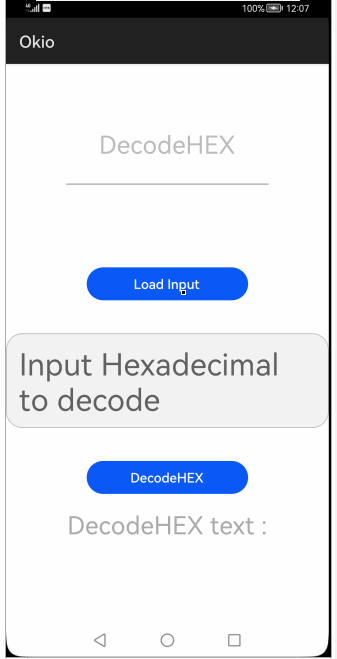

# How to use Okio Library for HarmonyOS: A developer’s Guide

## **1. Introduction**
A modern I/O library for HarmonyOS</br>
<span style="color: purple;">Okio</span> is a library that simplifies and simultaneously enriches the usage of InputStream and OutputStream classes from the standard nativ io package.

To get started right away, head on to [Gitee](https://gitee.com/openharmony-tpc/)


## **2. Typical Use Cases**
This library - <span style="color: purple;">Okio</span>, is very useful in the development of applications which are in our daily use. Couple of such examples are mentioned below:

<div align="center">
<table>
    <tr>
        <td>
            <ul><li><b>Write and read contents to/from file</b></br>Write contents to file and read contents from file</li><ul>
        </td>
        <td>
            <ul><li><b>Write and read encrypted contents to/from file</b></br>Write encrypted contents to file and read encrypted contents from file</li><ul>
        </td>
    </tr>
    <tr>
        <td width="50%"><p align="center"></p></td>
        <td width="100%"><p align="center"></p></td>
    </tr>
</table>
</div>


## **3. Capability and Features**
In this section, we can see the list of features which the library provides which makes the use of this library very easy and friendly. Primarily, this library supports.

* **ByteStrings**</br>
<span style="color: purple;">Okio</span> is built around two types that pack a lot of capability into a straightforward API:</br>
<span style="color: purple;">ByteString</span> is an immutable sequence of bytes. For character data, String is fundamental. ByteString is String’s long-lost brother, making it easy to treat binary data as a value. This class is ergonomic: it knows how to encode and decode itself as hex, base64, and UTF-8.</br>
* **Buffers**</br>
<span style="color: purple;">Buffer</span> is a mutable sequence of bytes. Like ArrayList, you don’t need to size your buffer in advance. You read and write buffers as a queue: write data to the end and read it from the front. There’s no obligation to manage positions, limits, or capacities.</br></br>
Buffer is implemented as a linked list of segments. When you move data from one buffer to another, it reassigns ownership of the segments rather than copying the data across. This approach is particularly helpful for multithreaded programs: a thread that talks to the network can exchange data with a worker thread without any copying or ceremony.</br></br>
Internally, ByteString and Buffer do some clever things to save CPU and memory. If you encode a UTF-8 string as a ByteString, it caches a reference to that string so that if you decode it later, there’s no work to do.

* **Sources and Sinks**</br>
An elegant part of the native io design is how streams can be layered for transformations like encryption and compression. Okio includes its own stream types called <span style="color: purple;">Source</span> and <span style="color: purple;">Sink</span> that work like <span style="color: purple;">InputStream</span> and <span style="color: purple;">OutputStream</span></br></br>
<span style="color: purple;">Sources</span> and <span style="color: purple;">sinks</span> interoperate with <span style="color: purple;">InputStream</span> and <span style="color: purple;">OutputStream</span>. You can view any <span style="color: purple;">Source</span> as an <span style="color: purple;">InputStream</span>, and you can view any <span style="color: purple;">InputStream</span> as a <span style="color: purple;">Source</span>. Similarly for <span style="color: purple;">Sink</span> and <span style="color: purple;">OutputStream</span>.

## **5. Installation**
For using okio_ohos module in sample application, include the below dependency in entry <span style="color: blue;">package.json</span>. Before this add okio module in project root directory.

```groovy
"dependencies": {
    "okio": "file:../okio"
  }
```

## **6. Usage**
This section will help us to understand the usage of the library as you use it in your Harmony-application developemnt project.

### **Step 1: Import Okio dependencies into sample app**
```javascript
    import okio from 'okio';
```
### **Step 2: Define storage permissions in config.json of sample app**
```java
   "reqPermissions": [
      {
        "name": "ohos.permission.WRITE_USER_STORAGE",
        "reason": "Storage",
        "usedScene": {
          "when": "always",
          "ability": [
            "com.openharmony.okioapplication.MainAbility"
          ]
        }
      },
      {
        "name": "ohos.permission.READ_USER_STORAGE",
        "reason": "Storage",
        "usedScene": {
          "when": "always",
          "ability": [
            "com.openharmony.okioapplication.MainAbility"
          ]
        }
      },
      {
        "name": "ohos.permission.WRITE_EXTERNAL_MEDIA_MEMORY",
        "reason": "Storage",
        "usedScene": {
          "when": "always",
          "ability": [
            "com.openharmony.okioapplication.MainAbility"
          ]
        }
      }
    ]
    }
```
### **List of API supported from Buffer**
Below is the list of API which are supported from Buffer.

| name                   | type      | info                                                   |
|------------------------|-----------|--------------------------------------------------------|
| writeString          | string   | To write the String to buffer
| writeSubString    | string, beginIndex, endIndex     | To write the SubString to buffer |
| writeUtf8          | string     | To write the UTF8 to buffer                                     |
| writeUtf8BeginEndIndex | string, beginIndex, endIndex | To write the Utf8 Begin and End Index to buffer                    |
| writeShort     | int | To write the short int to buffer                        |
| writeShortLe     | int | To write the short Le to buffer                       |
| writeInt          | int     | To write the int to buffer                |
| writeIntLe          | int     | To write the int Le to buffer                 |
| writeByte          | byte     | To write the Byte to buffer                 |
| writeUtf8CodePoint          |     int     | To write the Utf8 CodePoint  to buffer                 |

### **List of API supported from ByteString**
Below is the list of API which are supported from ByteString.

| name                   | type      | info                                                   |
|------------------------|-----------|--------------------------------------------------------|
| decodeHex          | HexaDecimal     | To decode HexaDecimal                |
| decodeBase64          | base64-encode     | Decode base 64 encoded data              |
| encodeUtf8          | string     | To encode into UTF8                |
| of          | data     |          To get byte String containing a clone of the bytes of data       |


### **List of Getter API supported from Buffer**
Below is the list of Getter API which are supported from Buffer.


|Getter Methods|
|--|
|<table> <tr><th>name</th><th>info</th></tr><tr><td>readShort</td><td>To read the short int from Buffer </td></tr><tr><td>readInt </td><td>To read the int from Buffer </td></tr><tr><td>readShortLe </td><td>To read the short Le int from Buffer</td></tr><tr><td>readIntLe </td><td>To read the int Le from Buffer</td></tr> <tr><td>readString </td><td>To read the string from Buffer</td></tr><tr><td>readUtf8 </td><td>To read the UTF8 from Buffer </td></tr><tr><td>readUtf8ByteCount </td><td>To read the UTF8 Byte Code from Buffer</td></tr><tr><td>readByte </td><td>To read byte from Buffer</td></tr><tr><td>readUtf8CodePoint </td><td>To read the Utf8CodePoint  from Buffer</td></tr></table>| 

### **List of API supported from Sink**
Below is the list of API which are supported from Sink.

<table> <tr><th>name</th><th>info</th></tr><tr><td>write</td><td>To write contents to the file </td></tr></table>

### **List of API supported from Source**
Below is the list of API which are supported from Source.

<table> <tr><th>name</th><th>info</th></tr><tr><td>read</td><td>To read contents from the file </td></tr></table>

## **7. API usage examples**
In this section, we can have a look at some of the examples where the APIs of this library is put to use and the results which we can acheive.

**Example1: Sink write and Source read API**  

In this example, we will see writing contents to the file
<table>
    <tr>
        <td width=700px>
        <pre>
<b style="color:DarkCyan;">
var sink = new okio.Sink(this.fileUri);
sink.write(this.Value,false);</b>
        </pre>
        <pre>
        <b style="color:DarkCyan;">
var source = new okio.Source(this.fileUri);
source.read().then(function (data) { 
context.readValue = data;
    }).catch(function (error) 
    {
console.log("error=>"+error);
    });</b>
        </pre>
        </td>
        <td width=300px>
        <p align="center"></p>
        </td>
    </tr>
</table>

**Example2: ByteString decodeBase64 API**  
In this example, we will see decoding base64
<table>
    <tr>
        <td width=700px>
        <pre>
        <b style="color:DarkCyan;">
let decodeBase64 = byteStringObj.decodeBase64(this.Value);
this.readValue = JSON.stringify(decodeBase64);
        </pre>
        </td>
        <td width=300px>
        <p align="center"></p>
        </td>
    </tr>
</table>

**Example3: ByteString decodeHex API**  

In this example, we will see decoding decodeHex
<table>
    <tr>
        <td width=700px>
        <pre>
        <b style="color:DarkCyan;">
let decodehex = byteStringObj.decodeHex(this.Value);
this.readValue = JSON.stringify(decodehex);</b>
        </pre>
        </td>
        <td width=300px>
        <p align="center"></p>
        </td>
    </tr>
</table>

**Example4: ByteString encodeUtf8 API**  

In this example, we will see encoding UTF8
<table>
    <tr>
        <td width=700px>
        <pre>
        <b style="color:DarkCyan;">
let encodeUtf8 = byteStringObj.encodeUtf8(this.Value);
this.readValue = JSON.stringify(encodeUtf8);</b>
        </pre>
        </td>
        <td width=300px>
        <p align="center"></p>
        </td>
    </tr>
</table>

 **8. Conclusion**</br>
<span style="color: purple;">Okio</span> is a very easy to use and very powerful library.The performance of the library is very good even when it works on one of the latest operating systems in the world, which is HarmonyOS!

* For more exciting libraries to develop your app, peep into third-party-components at </br>
[OpenHarmony-TPC](https://gitee.com/openharmony-tpc)

* To know more about the developement work happening on harmony aaplication layer, and even be part of the exciting stuff, watch this space of [Application Library Engineering Group](https://github.com/applibgroup)
