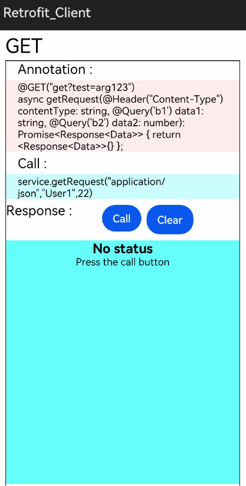
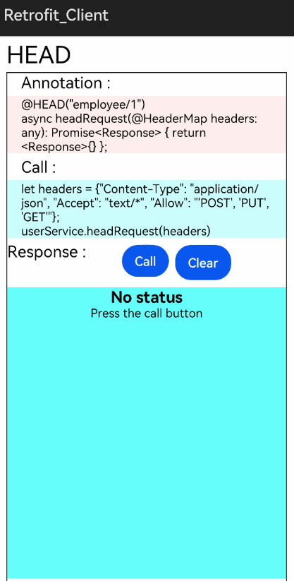
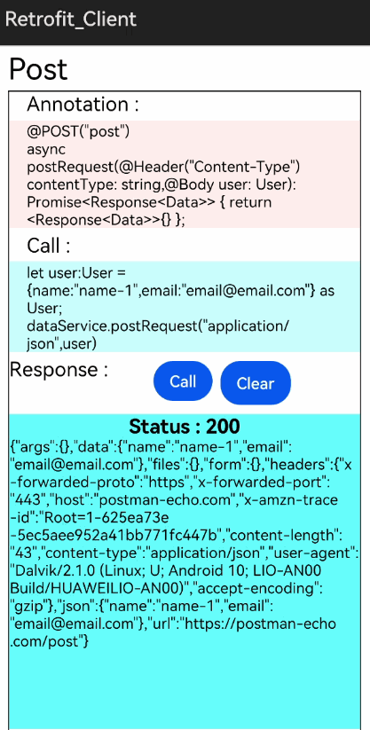
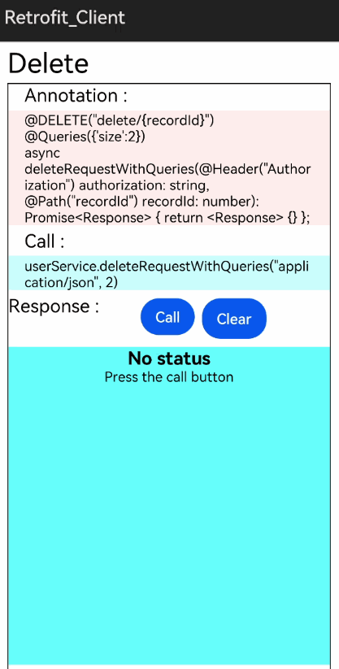
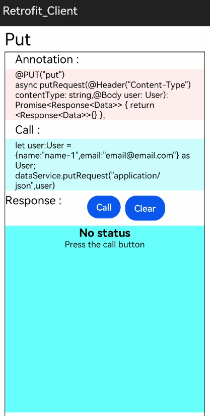
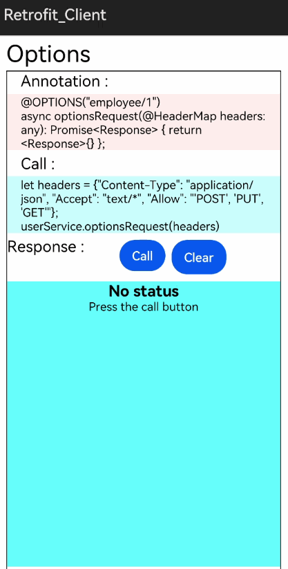

# How to use Retrofit Library for HarmonyOS: A developer’s Guide

## **1. Introduction**

Retrofit is a HTTP client for openharmony ETS platform.

Retrofit supports API declaration with Decorators, for example to make "GET" api call use @GET.

Retrofit is a library for HarmonyOS which provides most of the functionality similar to the http client. This library can be used in many modern day applications to exchange data very easily in a more efficient and faster way.</br>

This library makes it easy to make http requests like get,post,put, add multiple parameters to a request at a time.</br>

With the use of this library, converting the network request callback interface to a required type to facilitate subsequent data processing becomes easier.


## **2. Typical Use Cases**
<span style="color: purple;">Retrofit</span> library, is quite beneficial in the development of apps that we use on a regular basis. Some of the typical use cases are mentioned below:

<center><table>
    <tr>
        <td>
            <ul><li><b>REST Client</b></br>This use case performs functionality of Http GET and POST methods using annotations. It gets the content from the specified URL and posts the content to the URL given.</li><ul>
        </td>
    </tr>
    <tr>
        <td><center></center></td>   
    </tr>
</table></center>

## **3. Capability and Features**
This section of the document lists the features and capabilities of the Retrofit library, that makes using it simple and user friendly.
The features are as follows:

* **Converts the default network request callback into the required type.**</br>
  Converts the network request callback interface to a required type, for example, FileCallBack, to facilitate subsequent data processing.</br></br>
* **Multiple Request modes**</br>
Multiple request modes like GET, HEAD, PUT, POST, DELETE and OPTIONS are supported.</br></br>
* **Time out Intervals**</br>
  * Read Timeout - Set the timeout interval for reading data from the server.
  * Write Timeout - Set the timeout interval for writing data from the server.</br></br>


## **5. Installation**
* As Retrofit uses okhttp library as http client, Copy okhttp_ohos library folder to root directory of app project.
* Copy retrofit_ohos library folder to Project root folder along with okhttp_ohos.
and add local dependencies to /package.json as below.

```groovy
{
    "dependencies": { "retrofit_ohos": "file:./retrofit_ohos" }
}
```

## **6. Usage**
This section will guide us in comprehending how to use the library in Harmony app development project.

### **Step 1: Import Retrofit dependencies into sample app**
```javascript
    import {BaseService,ServiceBuilder,GET,POST,DELETE,PUT,Path,Body,BasePath,Response,Header,Query} from 'retrofit_ohos';
```
### **Step 2: Define Internet permission in config.json of sample app**
```java
  "reqPermissions": [
        {
          "name": "ohos.permission.INTERNET",
          "reason": "Api call",
          "usedScene": {
            "ability": [
              "com.openharmony.retrofitohos.MainAbility"
            ],
            "when": "always"
          }
        }
      ]
```
### **List of API supported**
Below is the list of API which are supported:

| Decorators       | Information        |
|------------------------|-----------|
| @GET 		|	GET HTTP method Decorator |
| @POST  		|	POST HTTP method Decorator |
| @PUT  		|	PUT HTTP method Decorator |
| @DELETE 	|	DELETE HTTP method Decorator |
| @HEAD     	|	HEAD HTTP method Decorator |
| @OPTIONS  	|	OPTIONS HTTP method Decorator |
| @BasePath 	|	BasePath Decorator for appending base path |
| @Path      	|	Path Decorator |
| @Body      	|	Body Decorator for passing body |
| @Headers   	|	Headers Decorator for setting Headers |
| @Header    	|	Header Decorator for setting an header |
| @HeaderMap 	|	HeaderMap Decorator for setting header as map object |
| @Queries   	|	Queries Decorator for setting query list |
| @Query     	|	Query Decorator for setting query |
| @QueryMap  	|	QueryMap Decorator for setting query in map |
| @FormUrlEncoded  | FormUrlEncoded Decorator for enabling formurlencoding |
| @Field       |   Field Decorator for setting a field for post method |
| @FieldMap    |  FieldMap Decorator for setting fields with Map object |
| @ReadTimeout |   Timeout Decorator for setting read timeout in millisecond |
| @ConnectTimeout | Timeout Decorator for setting connection timeout in millisecond |

## **7. API usage examples**
In this part, we'll look at a few instances of how the APIs in this library are used and the outcomes that may be produced.

**Example1**  
In this example, we can see @GET functionality.
<table style="width: 100%">
    <tr>
        <td width="50%">
        <pre>
        <b style="color:DarkCyan;">
@BasePath("/")
class Service extends BaseService{
 @GET("get?test=arg123")
 async getRequest(@Header("Content-Type") contentType: string, 
 @Query('b1') data1: string, @Query('b2') data2: number): 
 Promise<Response<Data>> { return <Response<Data>>{} };
}

const service = new ServiceBuilder()
      .setEndpoint("https://postman-echo.com")
      .build(Service);

service.getRequest("application/json","User1",22).then((resp)=>{
  this.status = "Status : " + resp.responseCode.toString();
  console.log("Response message=" + resp.message());
  console.log("Response code=" + resp.code());                  
  this.content = JSON.stringify(resp.result);                 
})
        </pre>
        </td>
        <td width="50%">
        <p align="center"></p>
        </td>
    </tr>
</table>

**Example2**  
In this example, we can see @HEAD functionality.
<table style="width: 100%">
    <tr>
        <td width="50%">
        <pre>
        <b style="color:DarkCyan;">
@BasePath("/")
class UserService extends BaseService {
 @HEAD("employee/1")
 async headRequest(@HeaderMap headers: any): Promise<Response> { return <Response>{} };
}

const userService = new ServiceBuilder()
    .setEndpoint("https://dummy.restapiexample.com/api/v1")
    .build(UserService);

let headers = {"Content-Type": "application/json", "Accept": 
"text/*", "Allow": "'POST', 'PUT', 'GET'"};
userService.headRequest(headers).then((resp)=>{
    this.status = "Status : " + resp.responseCode.toString();
    console.log("Response message=" + resp.message());
    console.log("Response code=" + resp.code());
    this.content = JSON.stringify(resp.result);
    this.responseHeader = JSON.stringify(resp.header);
})
        </pre>
        </td>
        <td width="50%">
        <p align="center"></p>
        </td>
    </tr>
</table>

**Example3**  
In this example, we can see @POST functionality.
<table style="width: 100%">
    <tr>
        <td width="50%">
        <pre>
        <b style="color:DarkCyan;">
@BasePath("/")
class DataService extends BaseService{
 @POST("post")
 async postRequest(@Header("Content-Type") contentType: string,
 @Body user: User): Promise<Response<Data>> { return <Response<Data>>{} };
}

const dataService = new ServiceBuilder()
      .setEndpoint("https://postman-echo.com")
      .build(DataService);

let user:User = {name:"name-1",email:"email@email.com"} as User;
dataService.postRequest("application/json",user).then((resp)=>{
    this.status = "Status : " + resp.responseCode.toString();
    console.log("Response message=" + resp.message());
    this.content = JSON.stringify(resp.result);
    this.responseHeader = JSON.stringify(resp.header);
})
        </pre>
        </td>
        <td width="50%">
        <p align="center"></p>
        </td>
    </tr>
</table>

**Example4**  
In this example, we can see @DELETE functionality.
<table style="width: 100%">
    <tr>
        <td width="50%">
        <pre>
        <b style="color:DarkCyan;">
@BasePath("/")
class UserService extends BaseService {
 @DELETE("delete/{recordId}")
 @Queries({'size':2})
 async deleteRequestWithQueries(@Header("Authorization") 
 authorization: string, @Path("recordId") recordId: number): 
 Promise<Response> { return <Response> {} };
}

const userService = new ServiceBuilder()
    .setEndpoint("https://dummy.restapiexample.com/api/v1")
    .build(UserService);

userService.deleteRequestWithQueries("application/json", 2)
.then((resp)=>{
    this.status = "Status : " + resp.responseCode.toString();
    this.content = JSON.stringify(resp.result);
    this.responseHeader = JSON.stringify(resp.header);
})
        </pre>
        </td>
        <td width="50%">
        <p align="center"></p>
        </td>
    </tr>
</table>

**Example5**  
In this example, we can see @PUT functionality.
<table style="width: 100%">
    <tr>
        <td width="50%">
        <pre>
        <b style="color:DarkCyan;">
@BasePath("/")
class DataService extends BaseService {
 @PUT("put")
 async putRequest(@Header("Content-Type") contentType: string,
 @Body user: User): Promise<Response<Data>> { return <Response<Data>>{} };
}

const dataService = new ServiceBuilder()
      .setEndpoint("https://postman-echo.com")
      .build(DataService);

let user:User = {name:"name-1",email:"email@email.com"} as User;
dataService.putRequest("application/json",user).then((resp)=>{
    this.status = "Status : " + resp.responseCode.toString();
    this.content = JSON.stringify(resp.result);
    this.responseHeader = JSON.stringify(resp.header);
})
        </pre>
        </td>
        <td width="50%">
        <p align="center"></p>
        </td>
    </tr>
</table>

**Example6**  
In this example, we can see @OPTIONS functionality.
<table style="width: 100%">
    <tr>
        <td width="50%">
        <pre>
        <b style="color:DarkCyan;">
@BasePath("/")
class UserService extends BaseService {
 @OPTIONS("employee/1")
 async optionsRequest(@HeaderMap headers: any): Promise<Response> 
 { return <Response>{} };
}

const userService = new ServiceBuilder()
    .setEndpoint("https://dummy.restapiexample.com/api/v1")
    .build(UserService);

let headers = {"Content-Type": "application/json", 
    "Accept": "text/*", "Allow": "'POST', 'PUT', 'GET'"};
userService.optionsRequest(headers).then((resp)=>{
    this.status = "Status : " + resp.responseCode.toString();
    this.content = JSON.stringify(resp.result);
    this.responseHeader = JSON.stringify(resp.header);
    var data: Data = resp.result;
})
        </pre>
        </td>
        <td width="50%">
        <p align="center"></p>
        </td>
    </tr>
</table>

 **8. Conclusion**
<span style="color: purple;">Retrofit</span> is a simple-to-use yet extremely powerful library. Even while running on HarmonyOS, one of the world's newest operating systems, the library's performance is excellent!

* For more exciting libraries to develop your app, peep into third-party-components at </br>
[OpenHarmony-TPC](https://gitee.com/openharmony-tpc)

* To know more about the developement work happening on harmony aaplication layer, and even be part of the exciting stuff, watch this space of [Application Library Engineering Group](https://github.com/applibgroup)