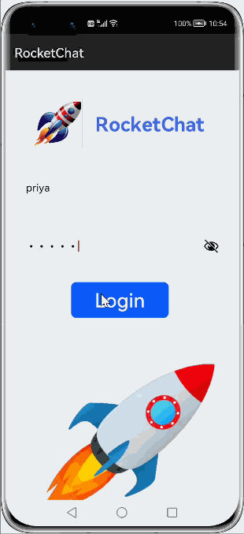

# How to use RocketChat Library for HarmonyOS: A developer’s Guide
   
## **1. Introduction**
<b>RocketChat</b> is an
 application interface for server methods and message stream subscriptions. Using this package, third party apps can control and query a Rocket.Chat server instance, via REST APIs.
Designed especially for chat automation, this library makes it easy for application developers to provide the best solutions and experience for their community.
<br>  

This library facilitates communication among colleagues, students, clients, organizations, and others by offering public and private channels (groups) as well as one-on-one conversations.
It allows you to manage users, visitors, public channels, and private groups.
The <b>RocketChat</b> Library's features enable us to build a powerful and flexible communication platform.

## **2. Typical Use Cases**
<b>RocketChat</b> library, is quite beneficial in the development of apps that we use on a regular basis. It is highly useful for everyday use because we need chat platforms like this for communication, whether it's within organizations or with friends. Some of the typical use cases are mentioned below:

* **Chat Application use case**: </br>This use case makes it easy to click on a created / joined channel to see previously posted messages or send new ones. This can be achieved using the <b>postMessageChat</b> API. Here the messages are differentiated into 2 colors, one color for messages sent by you and another color for  messages sent by others.
<center></center>

## **3. Capability and Features**
This section of the document lists the features of <b>RocketChat</b> which makes the library easy and useful for communication.
REST APIs of RocketChat are grouped into the following categories:

* **Channel Endpoints**: These are REST APIs related to public channel. It can be used for creating a channel, leaving a channel, retrieving the history of channel , archiving/Unarchiving the channel etc.

* **Group Endpoints**: These endpoints include REST APIs of private channel/group. It is Used for creating a private channel or leaving a private channel. It also supports other functionalities like groupCreate, groupinvite, groupLeave and groupList etc

* **Visitor endpoints**: These are REST APIs associated with the Livechat visitor. They are used for visitor registration, deleting visitor, retrieving the visitor info and setting the status of the visitor.

* **Users endpoints**: These are user related APIs that provide functionality like creating users with admin rights, listing all users, deleting users and retrieving user information etc.

* **Authentication Endpoints**: These are the APIs related to login and logout of the users. It generates an authentication token at the time of login and also takes care of invalidating the token at the time of logout.

## **4. Installation**
For using rocketchat module in sample application, add rocketchat library in project root directory and include the below dependency in entry <b>package.json</b>.
```groovy
{
  "dependencies": {
    "rocketchat_ohos": "file:../rocketchat_ohos"
  }
}
```

## **5. Usage**
This section will guide us in understanding how to use the library in Harmony app development project.

### **Step 1: Import rocketchat dependencies into sample app**
```javascript   
    import {RestAPI} from 'rocketchat_ohos';
```

### **Step 2: Define Internet permissions in config.json of sample app**
```java
  "reqPermissions": [
      {
        "name": "ohos.permission.INTERNET",
        "reason": "Api call",
        "usedScene": {
          "ability": [
            "com.openharmony.rocketchat.MainAbility"
          ],
          "when": "always"
        }
      }
    ]
```

### **List of APIs supported**
Below is the list of APIs which are supported:


| Feature        | &emsp; API             | &emsp;Information                                                         |
|:---------------|:----------------|:--------------------------------------------------------------|
| Livechat - Page Visited Endpoint              | &emsp;  &nbsp;   pageVisited(pageData)   | &emsp; &nbsp; pageVisited - To Send Visitor navigation history |
|Livechat - Visitors Endpoints       | <ul><li>visitorRegistration(visitor)</li><li>visitor(token)</li><li>visitorDelete(token)</li><li>setVisitorStatus(visitor)</li></ul>   |  <ul><li>visitorRegistration - Registers a new visitor</li><li>visitor - Retrieves a visitor</li><li>visitorDelete - Deletes a visitor</li><li>setVisitorStatus - Sets visitor status</li></ul>|
|Channels Endpoints         | <ul><li>addAllChannel(roomId,activeUsersOnly})</li><li>addLeaderChannel(leaderData)</li><li>addModeratorChannel(moderatorData)</li><li>addOwnerChannel(ownerData)</li><li>archiveChannel(roomId)</li><li>closeChannel(roomId)</li><li>createChannel(name, members: Array<string>,readOnly:boolean)</li><li>deleteChannel(roomId,roomName)</li><li>getUserAllMentionByChannel(roomId)</li><li>filesChannel(roomId,roomName)</li><li>getIntegrationChannel(roomId)</li><li>historyChannel(roomId,optionalParams)</li><li>infoChannel(roomId,roomName)</li><li>inviteChannel(data)</li><li>joinChannel(roomId,JoinCode)</li><li>kickChannel(roomId,userId)</li><li>leaveChannel(roomId)</li><li>listChannel()</li><li>joinListChannel()</li><li>membersChannel(roomId,roomName)</li><li>messageChannel(roomId,roomName)</li><li>onlineChannel(roomId)</li><li>openChannel(roomId)</li><li>removeLeaderChannel(roomId, userId)</li><li>removeModerator(roomID,userID)</li><li>removeOwnerChannel(roomId,userId)</li><li>renameChannel(roomId,name)</li><li>rolesChannel(roomId,roomName)</li><li>setCustomFieldsChannel(roomId,roomName,<br>customField:Object) </li><li>setDefaultChannel(roomId,default)</li><li>setJoinCodeChannel(roomId, joinCode)</li><li>setPurposeChannel(roomId,Purpose)</li><li>setReadOnlyChannel(roomId,readOnly)</li><li>setTopicChannel(roomId,topic)</li><li>setTypeChannel(roomId,roomName, channelType)</li><li>unArchiveChannel(roomId)</li><li>postMessageChat(postMessageData)</li></ul>     |  <ul><li>addAllChannel - Adds all of the users on the server to a channel </li><li>addLeaderChannel - Gives the role of Leader for a user in the current channel </li><li>addModeratorChannel - Gives the role of moderator to a user in a channel </li><li>addOwnerChannel - Gives the role of owner to a user in a channel </li><li>archiveChannel - Archives a channel </li><li>closeChannel - Removes a channel from a user's list of channels </li><li>createChannel - Creates a new channel </li><li>deleteChannel - Removes a channel </li><li>getUserAllMentionByChannel - Retrieves all the mentions of a channel </li><li>filesChannel - Retrieves a list of files from a channel </li><li>getIntegrationChannel - Retrieves the channel's integration</li><li>historyChannel - Retrieves the messages from a channel </li><li>infoChannel - Gets a channel's information </li><li>inviteChannel - Adds a user to a channel</li><li>joinChannel - Joins yourself to a channel</li><li>kickChannel - Removes a user from a channel</li><li>leaveChannel - Removes the calling user from a channel</li><li>listChannel - Retrieves all of the channels from the serve </li><li>joinListChannel - Retrieves only the channels the calling user has joined </li><li>membersChannel - Retrieves all channel users </li><li>messageChannel - Retrieves all channel messages </li><li>onlineChannel - Lists all online users of a channe</li><li>openChannel - Adds the channel back to the user's list of channel</li><li>removeLeaderChannel - Removes the role of Leader for a user in the current channel</li><li>removeModerator - Removes the role of moderator from a user in the current channel</li><li>removeOwnerChannel - Removes the role of moderator from a user in a channel</li><li>renameChannel - Changes a channel's name</li><li>rolesChannel - Gets the user's roles in the channel</li> <li>setCustomFieldsChannel - Sets a channel's custom fields </li><li>setDefaultChannel - Sets whether the channel is a default channel or not</li><li>setJoinCodeChannel - Sets the channel's code required to join it.</li><li>setPurposeChannel - Sets the description for the channel (the same as channels.setDescription, obsolete) </li><li>setReadOnlyChannel - Sets whether a channel is read-only or not </li><li>setTopicChannel - Sets a channel's topic</li><li>setTypeChannel - Sets the type of room the channel should be</li><li>unArchiveChannel - Unarchives a channel</li><li>postMessageChat - Posts a new chat message </li></ul>|
|Groups Endpoints      | <ul><li>groupAddLeader(groupID: string, userId: string)</li><li>groupAddModerator(roomId,userId)</li><li>groupAddOwner(roomId,userId)</li><li>groupArchive(groupID)</li><li>groupsClose(roomId)</li><li>groupCreate(name: string, members: Array<string>,readOnly: boolean)</li><li>groupHistory(roomId,optionalParams)</li><li>groupsInfo(roomId, roomName)</li><li>groupInvite(groupID: string, userId: string)</li><li>groupKick(roomId,userId)</li><li>groupLeave(groupID: string)</li><li>groupList()</li><li>groupOpen(roomId)</li><li>groupRemoveModerator(roomId,userId)</li><li>groupRemoveOwner(roomId,userId)</li><li>groupRename(roomId,name)</li><li>groupSetDescription(roomId,description)</li><li>groupSetPurpose(roomId,purpose)</li><li>groupSetReadOnly(roomId,readOnly)</li><li>groupSetTopic(groupID,groupTopic)</li><li>groupSetType(roomId,type)</li></ul>   |  <ul><li>groupAddLeader - Gives the role of Leader for a user in the current group </li><li>groupAddModerator - Gives the role of moderator to a user in a group </li><li>groupAddOwner - Gives the role of owner to a user in a group </li><li>groupArchive - Archives a private group </li><li>groupsClose - Removes a private group from the list of groups </li><li>groupCreate - Creates a new private group </li><li>groupHistory - Retrieves the messages from a private group </li><li>groupsInfo - Retrieves the information about a private group </li><li>groupInvite - Adds a user to the private group </li><li>groupKick - Removes a user from a private group</li><li>groupLeave - Removes the calling user from the private group</li><li>groupList - Lists the private groups the caller is part of</li><li>groupOpen - Adds the private group back to the list of groups </li><li>groupRemoveModerator - Removes the role of moderator from a user in a group </li><li>groupRemoveOwner - Removes the role of owner from a user in a group </li><li>groupRename - Changes the name of the private group</li><li>groupSetDescription - Sets a private group's description </li><li>groupSetPurpose - Sets a private group's purpose </li><li>groupSetReadOnly - Sets whether the room is read-only or not </li><li>groupSetTopic - Sets a private group's topic </li><li>groupSetType - Sets the type of room this group will be</li></ul>  | 
| Settings Endpoints      |&emsp;  &nbsp;  publicSettings(query)  | &emsp;  &nbsp;  publicSettings - Lists all public settings | 
| Users Endpoints      | <ul><li>userCreate(data)</li><li>userDelete(data)</li><li>usersInfo(userId,userName)</li><li>usersList(data)</li><li>setAvatar(avatarData)</li><li>usersPresence(data)</li></ul>   |  <ul><li>userCreate - Creates a new user </li><li>userDelete - Deletes an existing user </li><li>usersInfo - Retrieves information about a user </li><li>usersList - Retrieves all of the users in the system and their information </li><li>setAvatar - Sets avatar </li><li>usersPresence - Gets a user's presence if the query string userId or username is provided, otherwise it gets the callee's</li></ul> | 
| Authentication Endpoints      | <ul><li>login()</li><li>logout()</li></ul>   |  <ul><li>login - Authenticate using username and password with the REST API </li><li>logout - Invalidate your REST API authentication token</li></ul> | 


**************


## **6. API usage examples**
In this section, we can have a look at some of the examples where the APIs of this library is put to use and the results which we can achieve.

**Example 1**  
In this example, we can see login functionality.
<table style="width: 100%">
    <tr>
        <td width="75%">
        <pre>
        <b style="color:DarkCyan;">
TextInput({ placeholder: 'Username/email' })
   ...
   .onChange((value: string) => {
        this.userName = value
})
<br.>
TextInput({ placeholder: 'Password' })
   ...
   .onChange((value: string) => {
        this.userPassword = value
})
<br.>
restAPI = new RestAPI("https://open.rocket.chat/api/v1/",
this.userName,this.userPassword);
restAPI.login().then(function (data) {
    console.info("onClickLogin data:" + JSON.stringify(data));
    authToken = data.data.authToken;
    userId = data.data.userId;
    that.showToast("Login Successful");
}).catch(function (error) {
    that.showToast("Error :" + error);
    console.info("onClickLogin error:" + error);
});
        </pre>
        </td>
        <td width="50%">
        <p align="center"></p>
        </td>
    </tr>
</table>


**Example 2**  
In this example, we can see groupCreate functionality.
<table style="width: 100%">
    <tr>
        <td width="75%">
        <pre>
        <b style="color:DarkCyan;">
let groupName = "Squad"
var readOnly = false;
let filtered_Ulist = ["Vicky", "Mathew", "Rachel"]
restAPI.groupCreate (groupName,filtered_Ulist,readOnly).
then(function (data) {
    console.info("restApiSample groupCreate data:" + JSON.stringify(data));
    groupID = data.group._id;
    console.info('groupCreate data:' + JSON.stringify(data));
    console.info('groupCreate groupID:' + groupID);
    that.showToast("Success - group Created" + JSON.stringify(data));
}).catch(function (error) {
    that.showToast("Error :" + error);
    console.info("groupCreate error:" + error);
});
        </pre>
        </td>
        <td width="50%">
        <p align="center"></p>
        </td>
    </tr>
</table>

**Example 3**  
In this example, we can see listChannel functionality.
<table style="width: 100%">
    <tr>
        <td width="75%">
        <pre>
        <b style="color:DarkCyan;">
restAPI.listChannel().then(function (data) {
    console.info("listChannel data:" + JSON.stringify(data));
    that.showToast("Success");
}).catch(function (error) {
    that.showToast("Error :" + error);
    console.info("listChannel error:" + error);
});    
        </pre>
        </td>
        <td width="50%">
        <p align="center"></p>
        </td>
    </tr>
</table>

## **7. Conclusion**
<br><b>RocketChat</b> is a simple-to-use yet very powerful communication platform. The performance of the library is very good even when it works on one of the latest operating systems in the world, which is HarmonyOS!

* For more exciting libraries to develop your app, peep into third-party-components at </br>
[OpenHarmony-TPC](https://gitee.com/openharmony-tpc)

* To know more about the development work happening on harmony application layer, and even be part of the exciting stuff, watch this space of [Application Library Engineering Group](https://github.com/applibgroup)


