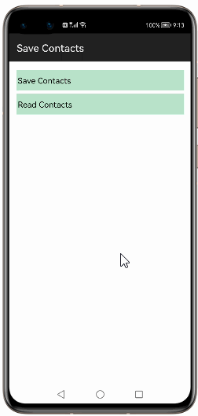
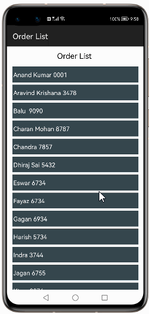
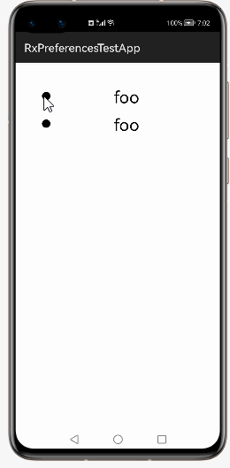
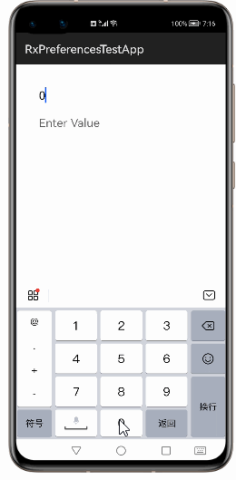

# How to use RxPreferences  Library for HarmonyOS: A developer’s Guide

## **1. Introduction**

Reactive SharedPreferences for OpenHarmony.

To get started right away, head on to [Gitee](https://gitee.com/HarmonyOS-tpc/rx-preferences)

## **2. Typical Use Cases**
This library - com.f2prateek.rx.preferences3, is very useful in the development of applications which are in our daily use. Some of such examples mentioned below:


<div align="center">
<table>
    <tr>
        <td>
            <ul><li><b>Save ContactNumber</b></br>Simply an easy way to save new contacts. - Launch New Contact, input a name/number and hit save. The contact will be added to your phone's contacts </li><ul>
        </td>
       <td>
            <ul><li><b>Order List</b></br>OrderList App Want to organize your computer parts purchase history into a purchase order statement</li><ul>
        </td>
    </tr>
    <tr>
        <td width="50%"><p align="center"></p></td>
        <td width="100%"><p align="center"></p></td>
    </tr>
</table>
</div>


## **3. Capability**
In this section, we can see the list of features which the library provides which makes the use of this library very easy and friendly. Primarily, this library supports customization of component attributes using the below mechanism.

* **Java APIs**</br>
RxPreferences  uses a simple fluent java API's that allows users to make most requests in a single line:
 
## **4. Features**
Features supported by this component includes the below:
* **writing and Reading the data from preference** </br>
HarmonyOS provides many ways of storing data of an application. One of this way is called RXShared Preferences. 
Shared Preferences allow you to save and retrieve data in the form of key,value pair.


## **5. Installation**
For using the library in your HarmonyOS mobile app, you need to first install it by following below methods.

* **Method 1:**  </br>
Generate the .har package through the library and add the .har package to the libs folder.Add the following code to the entry level build.gradle:
    <pre>
       <b style="color:green">
    implementation fileTree  (dir: 'libs', include: ['* .jar', '* .har'])
       </b>
</pre>

* **Method 2 :**  </br>
Copy the dependency from the gitee and add it to the entry level build.gradle:
<pre>
dependencies {
    implementation fileTree(dir: 'libs', include: ['*.har'])
    <b style="color:blue;">implementation 'io.openharmony.tpc.thirdlib:rx-preferences:1.0.3'</b>
           }
</pre>


## **6. Usage**
This section will help us to understand the usage of the library as you use it in your Harmony-application developemnt project.

### **Step 1: Define layout via XML**
We are going to load list  into Checkbox&Text component using This  Library. So, add Checkbox&Text component into <strong>resource_file.xml</strong> file.

```xml
    <?xml version="1.0" encoding="utf-8"?>
    <DirectionalLayout
        xmlns:ohos="http://schemas.huawei.com/res/ohos"
        xmlns:app="http://schemas.huawei.com/hap/res-auto"
        ohos:height="match_parent"
        ohos:width="match_parent"
        ohos:orientation="vertical"
        ohos:background_element="#000000">
            
        <Checkbox
        ohos:id="$+id:foo_2"
        ohos:height="match_content"
        ohos:width="match_parent"
        ohos:bottom_margin="10vp"
        ohos:text="foo"
        ohos:text_size="30vp"
        />

    <TextField
        ohos:id="$+id:text_1"
        ohos:height="match_content"
        ohos:width="match_parent"
        ohos:hint="Enter name"
        ohos:text_input_type="pattern_text"
        ohos:text_size="20vp"
        />

    </DirectionalLayout>
```
### **Step 2: Customize programmatically via Java API**
```java
   @Override
    public void onStart(Intent intent) {
        super.onStart(intent);
     Preferences preferences = new DatabaseHelper(this).getPreferences("rx_preferences");
    RxSharedPreferences rxPreferences = RxSharedPreferences.create(preferences);
	
    Preference<String> username = rxPreferences.getString("username");
     Preference<Boolean> showWhatsNew = rxPreferences.getBoolean("show-whats-new", true);
    }
```

### **List of public APIs for app-developer**
The public methods below will help us to operate on the component at runtime.

**RxPreferences  Methods**
<table>
<tr>
    <td>
        <ul>
            <li>create()</li>
            <li>getString(@NonNull String key)</li> 
			<li>getStringSet(@NonNull String key) </li>
			<li>getObject()</li>
			<li> getLong(@NonNull String key)</li>
			<li>getInteger(@NonNull String key)</li>
			<li>getFloat(@NonNull String key)</li>
			<li>getEnum()</li>
			<li> getBoolean(@NonNull String key)</li>
        </ul>
    </td>
  
</tr>
</table>

## **8. API usage examples**
In this section, we can have a look at some the examples where the APIs of this library is put to use and the results which we can acheive.


**Example1: RxPreferences to store & retrieve boolean values into  RXSharedPreferences**
<table>
    <tr>
        <td width=700px>
        <b><u>Layout.xml</u>:</b>
        <pre>
&ltCheckbox
        ohos:id="$+id:foo_1"
        ohos:height="match_content"
        ohos:width="match_parent"
        ohos:bottom_margin="10vp"
        ohos:text="foo"
        ohos:text_size="30vp"
        />

    <Checkbox
        ohos:id="$+id:foo_2"
        ohos:height="match_content"
        ohos:width="match_parent"
        ohos:bottom_margin="10vp"
        ohos:text="foo"
        ohos:text_size="30vp"
        />
</br>
</pre>
<b><u>Java Slice</u>:</b>
<pre>
 void bindPreference(final Checkbox checkBox, Preference<Boolean> preference) {
        // Bind the preference to the checkbox.
        disposables.add(preference.asObservable()
                .observeOn(OpenHarmonySchedulers.mainThread())
                .subscribe(checkBox::setChecked));
        // Bind the checkbox to the preference.
        disposables.add(RxAbsButton.checkedStateChanges(checkBox)
                .skip(1) // First emission is the original state.
                .subscribe(preference.asConsumer()));
    }
<b style="color:DarkCyan;">fooBoolPreference = rxPreferences.getBoolean("fooBool");
</b>
        </pre>
        </td>
        <td width=300px>
        <p align="center"></p>
        </td>
    </tr>
</table>


**Example2: RxPreferences to store & retrieve String values into  RXSharedPreferences**
<table>
    <tr>
        <td width=700px>
        <b><u>Layout.xml</u>:</b>
        <pre>
&ltTextField
        ohos:id="$+id:text_1"
        ohos:height="match_content"
        ohos:width="match_parent"
        ohos:hint="Enter name"
        ohos:text_input_type="pattern_text"
        ohos:text_size="20vp"
        />

    <TextField
        ohos:id="$+id:text_2"
        ohos:height="match_content"
        ohos:width="match_parent"
        ohos:hint="Enter Value"
        ohos:text_input_type="pattern_text"
        ohos:text_size="20vp"
        ohos:top_margin="20vp"
        />
</br>
</pre>
<b><u>Java Slice</u>:</b>
<pre>
<b><u>Java Slice</u>:</b>
<pre>
    void bindPreference(final TextField editText, Preference<String> preference) {
        disposables.add(preference.asObservable()
                .observeOn(OpenHarmonySchedulers.mainThread())
                .filter(s -> !editText.isFocused())
                .subscribe(editText::setText));
        disposables.add(RxText.textUpdateEvents(editText)
                .skip(1) // First emission is the original state.
                .debounce(500, TimeUnit.MILLISECONDS) 
                .map(e -> e.text())
                .subscribe(preference.asConsumer()));
    }
<b style="color:DarkCyan;">fooTextPreference = rxPreferences.getString("fooText");
        fooTextPreference = rxPreferences.getString("fooText");
</b>
        </pre>
        </td>
        <td width=300px>
        <p align="center"></p>
        </td>
    </tr>
</table>


 
## **9. Conclusion**
RxPreferences   is a very easy to use and very powerful library.The performance of the library is very good even when it works on one of the latest operating systems in the world, which is HarmonyOS!

* For more exciting libraries to develop your app, peep into third-party-components at </br>
[OpenHarmony-TPC](https://gitee.com/openharmony-tpc)

* To know more about the developement work happening on harmony aaplication layer, and even be part of the exciting stuff, watch this space of [Application Library Engineering Group](https://github.com/applibgroup)
