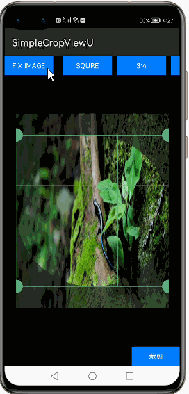
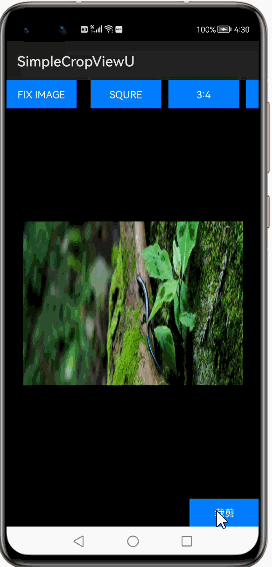
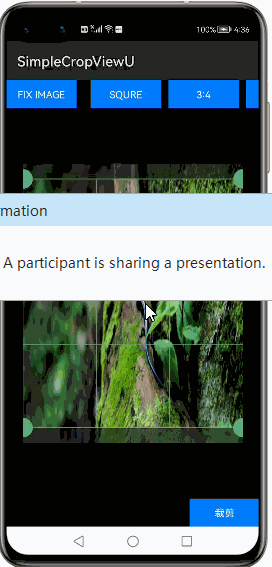
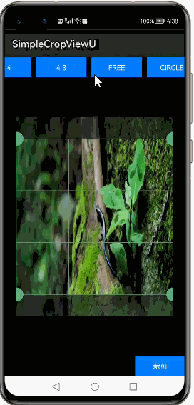
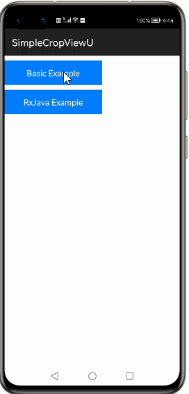

# How to use SimpleCropView Library for HarmonyOS: A developer’s Guide

## **1. Introduction**

The SimpleCropView is an image cropping library for Harmony.
It simplifies your code for cropping image and provides an easily customizable UI.

### **What is SimpleCropView**

SimpleCropView provides a very rich picture interception and cropping function, covering commonly used basic needs functions, such as proportional interception of pictures (4: 3, 16: 9, 7: 5, etc.), interception into a circle, free cropping, locking ratio Cropping, square cropping,etc.

<h4>Modules:</h4>
The library provides one modules that is simplecropview.

<h5>Core:</h5>
The simple module contains all the major classes of this library, including <b>CropImageView</b>. <b>LoadRequest</b>, <b>SaveRequest</b>and <b>ropRequest</b>

## **2. Typical Use Cases**
This library - com.isseiaoki.simplecropview, is very useful in the development of applications which needs image trimming or croping. Some of such examples mentioned below:

<table>
    <tr>
        <td>
            <ul><li><b>Trimming</b> Trimming can be done in format 4:3,3:4,16:9,9:16,FREE,Circle,Square,Fix image.</li><ul>
        </td>
       <td>
            <ul><li><b>Cropping</b> Cropping of the image in formats 4:3,3:4,FREE,Circle,Square,Fix image or free hand crop</li><ul>
        </td>
    </tr>
    <tr>
        <td width="50%">

</td>
        <td width="100%">

</td>
    </tr>
</table>

## **3. Capability**
In this section, we can see the list of features which the library provides which makes the use of this library very easy and friendly. Primarily, this library supports customization of component attributes using the below mechanism.

* **Java APIs** 
SimpleCropView provides a well defined Java Apis to perform Trimming and Cropping activities.
 
## **4. Features**
Features supported by this library includes the below:
* **Rect CropMode**  
Rectangle crop mode can be defines as option for image cropping frame which is generally in X:Y ratio.the supported frames available for rect are 3:4,4:3,square.
. 
* **Circle CropMode** 
Frame initial will be in rectangle but the unshadowed area selected will select circle and same will be cropped.

* **Frame Customzation** 
The Frame can be customized in Frame size as the width of the frame and inital frame scale which is the area the frame covers to crop.

* **Handle customization**  
Handle which is the dots in the corner of the frame used to move in selecting the image.Sizee,colour and show mode can be customized.

* **Guide for image scalling** 
Guide support is provided inside the frame which helps in precies image selection and Guides can be customized for colour,size and show mode.

* **Colour customiation**  
Handle,background,guide and guide stroke colour can be customized.
* **Loading of images** 
Loading of image can be done either from the device or from the url.Or other supporting librares can be used for Loading e.g picasso or glide. 
This library also supports RXjava for loading.

* **Support for RxJava**  
Library supports Rxjava for event based and asynchronus loading of images by observable emmiting images and subscriber consuming it.
* **Image Saving** 
Once the image is cropped the image can be saved in bitmap format in the device location

* **Support for JPG/PNG image**  
Library supports all type of JPEG and PNG cropping,processing and for saving of images PNG is used.

## **5. Installation**
For using the library in your HarmonyOS mobile app, you need to first install it by following below methods.

* **Method 1:**   
Generate the .har package through the library and add the .har package to the libs folder.Add the following code to the entry level build.gradle:
    <pre>
       <b style="color:green">
    implementation fileTree  (dir: 'libs', include: ['* .jar', '* .har'])
       </b>
</pre>

* **Method 2 :**   
Copy lib project from the gitee and add to the project and add it to the entry level build.gradle:
<pre>
dependencies {
    implementation fileTree(dir: 'libs', include: ['*.har'])
    <b style="color:green;">implementation project(path: ':simplecropview')
</b>
}
</pre>

## **6. Usage**
The SimpleCropView library makes it simple to crop image.This cropping can be achived by loading the image ,selecting the trimming metgod of image,cropping the image and finally saving it 

Here’s a code snippet that does the above operations:

### **Step 1: Load image**

The First thing we need is image it can be loaded from either a location on device or url link set the image to uri 
 <pre> 
    cropImageView.load(uri).execute(new LoadCallback() {
                @Override
                public void onSuccess(PixelMap PixelMap) {
                }

                @Override
                public void onError(Throwable e) {
                }
            });
</pre>
If using Rxjava use below:
<pre>
Observable<Integer> observable = Observable.create(emitter -> {
            cropImageView.load(uri).executeAsCompletable();
        });
        observable.subscribe(new Consumer<Integer>() {
            @Override
            public void accept(Integer integer) throws Exception {

            }
        });
</pre>

### **Step 2: Define layout via XML**
If we are going to do operation on the image using the XML layout below parameters can be used

     <?xml version="1.0" encoding="utf-8"?>
        <DependentLayout
            xmlns:ohos="http://schemas.huawei.com/res/ohos"
            xmlns:custom="http://schemas.huawei.com/hap/res-auto"
            ohos:height="match_parent"
            ohos:width="match_parent"
            ohos:background_element="$graphic:black_element"
            ohos:orientation="vertical">
            
                <com.isseiaoki.simplecropview.CropImageView
                    ohos:id="$+id:cropImageView"
                    ohos:height="400vp"
                    ohos:width="480vp"
                    ohos:center_in_parent="true"
                    custom:scv_crop_mode="circle"
                    custom:scv_frame_color="#5DAC81"
                    custom:scv_frame_stroke_weight="1vp"
                    custom:scv_guide_color="#5DAC81"
                    custom:scv_guide_show_mode="show_always"
                    custom:scv_guide_stroke_weight="1vp"
                    custom:scv_handle_color="#5DAC81"
                    custom:scv_handle_show_mode="show_always"
                    custom:scv_handle_size="14vp"
                    custom:scv_img_src="$media:sample1.png"
                    custom:scv_min_frame_size="50vp"
                    custom:scv_overlay_color="#AA1C1C1C"
                    custom:scv_touch_padding="8vp"
    </DirectionalLayout>
### **Step 3: Trimming of image**
Once the image is loaded we can trim the image manually or at runntime for this some predefined trimming methods are already available also free hand trimming can also be performed.
Use below code snippet to trim.

<pre>
cropImageView.setCropMode(CropImageView.CropMode.SQUARE);
</pre>

For Predefined Cropmodes FIT_IMAGE、RATIO_4_3、RATIO_3_4、SQUARE、RATIO_16_9、RATIO_9_16、FREE、CIRCLE、 CIRCLE_SQUARE supports.
### **Step 4: Saving of Image**
Once image is cropped then image can be saven in device loaction in PNG format.
For Java:
<pre>
 cropImageView.crop(uri).execute(new CropCallback() {
                        @Override
                        public void onSuccess(PixelMap 
                        cropped) {
                        final String uriPath = "file://"+getContext().getFilesDir()+"/test33.jpg";
                        cropImageView.save(cropped)
                        .execute(Uri.parse(uriPath), new SaveCallback() {
                        @Override
                        public void onSuccess(Uri uri) {
                        LogUtil.error("test","裁剪保存成功:"+uri.toString());
</pre>
For RxJava:
<pre>
 .doOnSubscribe(new Consumer<Disposable>() {
                           @Override
                           public void accept(@io.reactivex.
                           annotations.NonNull Disposable 
                           disposable)
                           throws Exception {
                           showProgress();
                           }
                          })
                         .doFinally(new Action() {
                           @Override
                           public void run() throws Exception 
                            dismissProgress();
                           }
                           })
                          .subscribeOn(Schedulers.newThread())
                           .subscribe(new Consumer<Uri>() {
                           @Override
                           public void accept(@io.reactivex.annotations.NonNull Uri uri11) throws Exception {
                               File file = new File(uri11.getDecodedPath());
                               emitter.onComplete();

                           }
                       }, new Consumer<Throwable>() {
                           @Override
                           public void accept(@io.reactivex.annotations.NonNull Throwable throwable)
                                   throws Exception {
                               emitter.onComplete();
                           }
                       });
           });
</pre>
### **List of public APIs for app-developer**
The public methods below will help us to operate on the component at runtime.

**Core Module  Methods**

The below methods are used for image manipulation xml attributes and corresponding java Apis.

| XML Attribute (custom:) | Related Method | Description |
|:---|:---|:---|
| scv_img_src | setImageResource(int resId) | Set source image. |
| scv_crop_mode | setCropMode(CropImageView.CropMode mode) | Set crop mode. |
| scv_overlay_color | setOverlayColor(int overlayColor) | Set image overlay color. |
| scv_frame_color | setFrameColor(int frameColor) | Set the image cropping frame color. |
| scv_handle_color | setHandleColor(int frameColor) | Set the handle color. |
| scv_guide_color | setGuideColor(int frameColor) | Set the guide color. |
| scv_guide_show_mode | setGuideShowMode(CropImageView.ShowMode mode) | Set guideline show mode. |
| scv_handle_show_mode | setHandleShowMode(CropImageView.ShowMode mode) | Set handle show mode. |
| scv_handle_size | setHandleSizeInDp(int handleDp) | Set handle radius in density-independent pixels. |
| scv_touch_padding | setTouchPaddingInDp(int paddingDp) | Set the image cropping frame handle touch padding(touch area) in density-independent pixels. |
| scv_min_frame_size | setMinFrameSizeInDp(int minDp) | Set the image cropping frame minimum size in density-independent pixels. |
| scv_frame_stroke_weight | setFrameStrokeWeightInDp(int weightDp) | Set frame stroke weight in density-independent pixels. |
| scv_guide_stroke_weight | setGuideStrokeWeightInDp(int weightDp) | Set guideline stroke weight in density-independent pixels. |
| scv_crop_enabled | setCropEnabled(boolean enabled) | Set whether to show the image cropping frame. |
| scv_initial_frame_scale | setInitialFrameScale(float initialScale) | Set Set initial scale of the frame.(0.01 ~ 1.0) |
| scv_handle_shadow_enabled | setHandleShadowEnabled(boolean handleShadowEnabled) | Set whether to show handle shadows. |

## **7. API usage examples**
In this section, we can have a look at some of the examples where the APIs of this library is put to use and the results which we can acheive.

### Example1: Rect Image crop and save
Image can be cropped in Rect with predefined aspect ratio.FIT_IMAGE、RATIO_4_3、RATIO_3_4、SQUARE、RATIO_16_9、RATIO_9_16、FREE

<table style="width: 100%">
<tr>
<td width=700px>
<pre>
<b><u>Java Slice</u>:</b> 
<b style="color:green;">//Load the image</b>
cropImageView.load(uri).execute(new LoadCallback()

<b style="color:green;">//Trim/Crop the image</b>
<b style="color:green;">//Aspect ratio Image can be cropped in Rect with predefined aspect ratio.
FIT_IMAGE、RATIO_4_3、RATIO_3_4、SQUARE、RATIO_16_9、RATIO_9_16、FREE
can be selected.</b>
cropImageView.setCropMode(CropImageView.CropMode.RATIO_3_4);
<b style="color:green;">//Save the image</b>
  cropImageView.save(cropped)
                                .execute(Uri.parse(uriPath), new SaveCallback() {
                                    @Override
                                    public void onSuccess(Uri uri) {
                                    }

</pre>
</td>
<td width=300px>
    

</td>
</tr>
</table>

### Example2: Circle Image crop and save
Image can be cropped in Circle with predefined methods.CIRCLE、 CIRCLE_SQUARE
<table style="width: 100%; backgrund">
    <tr>
        <td width=700px>
        <pre>
<b><u>Java Slice</u>:</b> 
<b style="color:green;">//Load the image</b>
cropImageView.load(uri).execute(new LoadCallback()
   <b style="color:green;">//Trim/Crop the image</b>
<b style="color:green;">//Aspect ratio Image can be cropped in Rect with predefined aspect 
ratio.CIRCLE、 CIRCLE_SQUARE.</b>
cropImageView.setCropMode(CropImageView.CropMode.CIRCLE);
<b style="color:green;">//Save the image</b>
  cropImageView.save(cropped)
                    .execute(Uri.parse(uriPath), new 
                    SaveCallback() {
                                    @Override
                                    public void 
                                    onSuccess(Uri uri) {
                                    }
</pre>
</td>
    <td width=300px>
        

    </td>
    </tr>
</table> 

 ### Example3: Operation on image using XML parameter
 Set of operation on image can also be performed on XML parameters for handle,guide stroke,background colour,default trim mode etc
 
<table style="width: 100%; backgrund">
    <tr>
        <td width=700px>
        <pre>
<b><u>Java Slice</u>:</b> 
<b style="color:green;">//Load the image</b>
cropImageView.load(uri).execute(new LoadCallback() 

<b><u>XML Layout</u>:</b> 
   <b style="color:green;">//Use below properties for doing operation og the loaded image using XML,</b> 

 
<DependentLayout
    xmlns:ohos="http://schemas.huawei.com/res/ohos"
   xmlns:custom="http://schemas.huawei.com/hap/res-auto"
            ohos:height="match_parent"
            ohos:width="match_parent"
            ohos:background_element="$graphic:black_element"
            ohos:orientation="vertical">  
            <b style="color:cyan;">     
                <com.isseiaoki.simplecropview.CropImageView
                    ohos:id="$+id:cropImageView"
                    ohos:height="400vp"
                    ohos:width="480vp"
                    ohos:center_in_parent="true"
                    custom:scv_crop_mode="circle"
                    custom:scv_frame_color="#5DAC81"
                    custom:scv_frame_stroke_weight="1vp"
                    custom:scv_guide_color="#5DAC81"
                    custom:scv_guide_show_mode="show_always"
                    custom:scv_guide_stroke_weight="1vp"
                    custom:scv_handle_color="#5DAC81"
                    custom:scv_handle_show_mode="show_always"
                    custom:scv_handle_size="14vp"
                    custom:scv_img_src="$media:sample1.png"
                    custom:scv_min_frame_size="50vp"
                    custom:scv_overlay_color="#AA1C1C1C"
                    custom:scv_touch_padding="8vp"</b>
    </DirectionalLayout>
   
</pre>
</td>
    <td width=300px>
        

    </td>
    </tr>
</table> 

  

### Example4: SimpleCropView Using RxJava 

Library supports Rxjava for event based and asynchronus loading of images by observable emmiting images and subscriber consuming it.
<table style="width: 100%;">
    <tr>
        <td width=700px>
        <pre>
<b><u>Java Slice</u>:</b> 

               cropImageView.crop(uri)
                    .executeAsSingle()
                    .flatMap(new Function<PixelMap, 
                    SingleSource<Uri>>() {
                    @Override
                    public SingleSource<Uri> 
                    apply(@io.reactivex.annotations.NonNull PixelMap 
                    bitmap)
                    throws Exception {
                    cropImageView.getContext().getUITaskDispatcher().asyncDispatch(new Runnable() {
                                @Override
                                public void run() {
                                image1.setPixelMap(bitmap);
                                image1.
                                setVisibility(Component.VISIBLE);
                                cropImageView.
                                setVisibility(Component.INVISIBLE);
                                   }
                               });
                               return cropImageView.save(bitmap)         
                                .executeAsSingle(Uri.parse(uriPath));
                           }
                       })
                             .doOnSubscribe(new Consumer<Disposable>() {
                             @Override
                             public void accept(@io.reactivex.annotations.NonNull Disposable disposable)
       
                    .
                       .subscribeOn(Schedulers.newThread())
                       .subscribe(new Consumer<Uri>() {
                           @Override
                           public void accept(@io.reactivex.annotations.NonNull Uri uri11) throws Exception {
                               File file = new File(uri11.getDecodedPath());
                               emitter.onComplete();

                           }
                       }, new Consumer<Throwable>() {
                           @Override
                           public void accept(@io.reactivex.annotations.NonNull Throwable throwable)
                                   throws Exception {
                               emitter.onComplete();
                           }
                       });
           });

           observable.subscribe(new Consumer<Integer>() {
               @Override
               public void accept(Integer integer) throws Exception {

               }
           });
 
</pre>
  </td>
     <td width=300px>
        

    </td>
</tr>
</table> 

### Example5: Cusomizing Handle and Guide
Guide and Handle can be customized for better selection of the image which can be done either using cml layout or Java Api's

<table style="width: 100%">
<tr>
<td width=700px>
<pre>
<b><u>Java Slice</u>:</b> 
<b style="color:green;">//Load the image</b>
cropImageView.load(uri).execute(new LoadCallback()

<b><u>XML Layout</u>:</b> 
<b style="color:green;">//in XML layout change the handle,stroke and grid colours</b>

<com.isseiaoki.simplecropview.CropImageView
            ohos:id="$+id:cropImageView"
            ohos:height="400vp"
            ohos:width="480vp"
            ohos:center_in_parent="true"
            custom:scv_crop_mode="circle"
           <b style="color:cyan;">   custom:scv_frame_color="#FF0000"</b>
            custom:scv_frame_stroke_weight="1vp"
             <b style="color:cyan;"> 
            custom:scv_guide_color="#FFFF00"</b>
            custom:scv_guide_show_mode="show_always"
            custom:scv_guide_stroke_weight="1vp"
            <b style="color:cyan;"> custom:scv_handle_color="#00FF00"</b>
            custom:scv_handle_show_mode="show_always"
            custom:scv_handle_size="14vp"
            custom:scv_min_frame_size="50vp"
            custom:scv_overlay_color="#AA1C1C1C"
            custom:scv_touch_padding="8vp"
            />
<b style="color:green;">//select the trim mode.</b>
cropImageView.setCropMode(CropImageView.CropMode.RATIO_3_4);
<b style="color:green;">//Save the image</b>
  cropImageView.save(cropped)
                                .execute(Uri.parse(uriPath), new SaveCallback() {
                                    @Override
                                    public void onSuccess(Uri uri) {
                                    }

</pre>
</td>
<td width=300px>
    

</td>
</tr>
</table>

## **8. Conclusion**
Even though this article only worked through the basics, this library offers much more than that.Please refer sample application in the gitee for more fetures and api implementations.

* For more exciting libraries to develop your app, peep into third-party-components at  
[OpenHarmony-TPC](https://gitee.com/openharmony-tpc)

* To know more about the developement work happening on harmony aaplication layer, and even be part of the exciting stuff, watch this space of [Application-Library Engineering Group](https://github.com/applibgroup)
