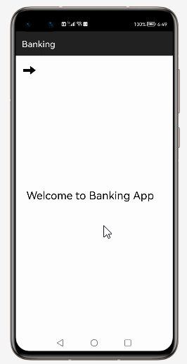
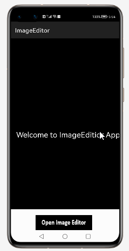
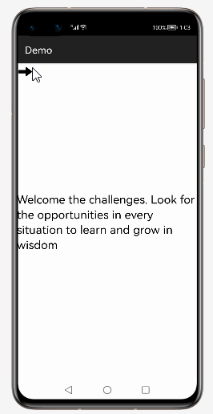
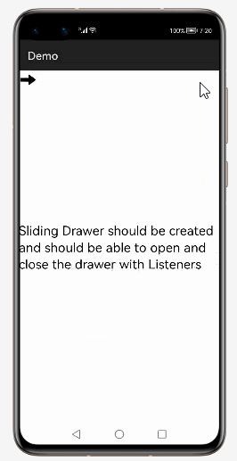
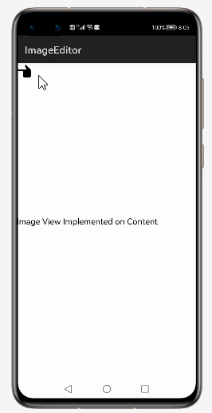

# How to use SlidingDrawer  Library for HarmonyOS: A developer’s Guide

## **1. Introduction**

SlidingDrawer hides content out of the screen and allows the user to drag a handle to bring the content on screen. SlidingDrawer can be used vertically or horizontally.
A special widget composed of two children views: the handle, that the users drags, and the content, attached to the handle and dragged with it.
SlidingDrawer should be used as an overlay inside layouts. This means SlidingDrawer should only be used inside of a FrameLayout or a RelativeLayout for instance.
The size of the SlidingDrawer defines how much space the content will occupy once slid out so SlidingDrawer should usually use match_parent for both its dimensions
## **2. Typical Use Cases**
This library - hollowsoft.demo.slidingdrawer, is very useful in the development of applications which are in our daily use. Some of such examples mentioned below:


<div align="center">
<table>
    <tr>
        <td>
            <ul><li><b>Banking</b></br>Internet Banking, is an electronic payment system </li><ul>
        </td>
       <td>
            <ul><li><b>ImageEditior</b></br>Images to be edited and also converted to different graphics formats</li><ul>
        </td>
    </tr>
    <tr>
        <td width="50%"><p align="center"></p></td>
        <td width="100%"><p align="center"></p></td>
    </tr>
</table>
</div>

## **3. Capability**
In this section, we can see the list of features which the library provides which makes the use of this library very easy and friendly. Primarily, this library supports customization of component attributes using the below mechanism.

* **Java APIs**</br>
SlidingDrawer  uses a simple fluent java API's that allows users to make most requests in a single line:
 
## **4. Features**
Features supported by this component includes the below:
* **Sliding Drawer Via Java & XML:** </br>
Sliding Drawer Should be created with the handle and content Components along with given Height/Width and background inputs

* **Customizing the Handle:**<br>
 Sliding Drawer should be created and the Handle should be customized with text view and Background color on it.

* **Customizing the Content:**<br>
Sliding Drawer should be created and the Content should be customized with you can add multiple views on it.

* **Supports Animate open & Animate Close:**<br>
Sliding Drawer should be created and can be able to open and close  the drawer by clicking on the handle 

* **Supports Call back functions:**<br>
Sliding Drawer should be created and should be able to open and close the drawer with Listeners

* **Sliding Horizontal and Vertical:**<br>
Sliding Drawer should be created and should be able to slide the drawer Vertically and Horizontally.


## **5. Installation**
For using the library in your HarmonyOS mobile app, you need to first install it by following below methods.

* **Method 1:**  </br>
Generate the .har package through the library and add the .har package to the libs folder.Add the following code to the entry level build.gradle:
    <pre>
       <b style="color:green">
    implementation fileTree  (dir: 'libs', include: ['* .jar', '* .har'])
       </b>
</pre>

* **Method 2 :**  </br>
Copy the dependency from the gitee and add it to the entry level build.gradle:
<pre>
dependencies {
    implementation fileTree(dir: 'libs', include: ['*.har'])
    <b style="color:blue;">implementation 'io.openharmony.tpc.thirdlib:SlidingDrawer:1.0.2'</b>
           }
</pre>


## **6. Usage**
This section will help us to understand the usage of the library as you use it in your Harmony-application developemnt project.

### **Step 1: Define layout via XML**
We are going to load list  into SlidingDrawer component using This  Library. So, add SlidingDrawer component into <strong>resource_file.xml</strong> file.

```xml
    <?xml version="1.0" encoding="utf-8"?>
    <DirectionalLayout
        xmlns:ohos="http://schemas.huawei.com/res/ohos"
        xmlns:app="http://schemas.huawei.com/hap/res-auto"
        ohos:height="match_parent"
        ohos:width="match_parent"
        ohos:orientation="vertical"
        ohos:background_element="#000000">
            
        <hollowsoft.slidingdrawer.SlidingDrawer
        ohos:id="$+id:slide" xmlns:ohos="http://schemas.huawei.com/res/ohos"
        ohos:height="match_parent"
        ohos:width="match_content"
        ohos:orientation="horizontal">
       <Component ohos:width="100vp"
               ohos:height="100vp"
               ohos:text="Click"
               ohos:id="$+id:handle"
               ohos:background_element="#EB00FF"/>      
	 </hollowsoft.slidingdrawer.SlidingDrawer>

    </DirectionalLayout>
```
### **Step 2: Customize programmatically via Java API**
```java
   @Override
    public void onStart(Intent intent) {
        super.onStart(intent);
       SlidingDrawer drawer1 = (SlidingDrawer) findComponentById(ResourceTable.Id_slide);
        drawer1.setClickedListener(new Component.ClickedListener() {
            @Override
            public void onClick(Component component) {
                drawer1.animateOpen();
            }
        });

        PositionLayout drawerMain = (PositionLayout) findComponentById(ResourceTable.Id_main);
        SlidingDrawer drawer = new SlidingDrawer(this);
        drawer.setOrientation(Component.VERTICAL);
        Component viewHandle = new Component(this);
        PositionLayout.LayoutConfig drawerConfig = new DirectionalLayout.LayoutConfig(100, 200);
        viewHandle.setLayoutConfig(drawerConfig);
        drawer.setHandle(viewHandle);

    }
```

### **List of public APIs for app-developer**
The public methods below will help us to operate on the component at runtime.

**SlidingDrawer  Methods**
<table>
<tr>
    <td>
        <ul>
            <li>open()</li>
            <li>animateOpen()</li> 
			<li>animateOpen()</li>
			<li>onDraw(Component component, Canvas canvas)()</li>
			<li>close()</li>
			<li>animateClose()</li>
			<li>setHandle(Component handle)</li>
			<li>setHolder(Component holder)</li>
			<li>animate(final float position, int time)</li>
        </ul>
    </td>
   <td>
        <ul>
            <li>setOnDrawerOpenListener(OnDrawerOpenListener onDrawerOpenListener)</li>
            <li>setOnDrawerCloseListener(OnDrawerCloseListener onDrawerCloseListener)</li> 
			<li>setOnDrawerScrollListener(OnDrawerScrollListener onDrawerScrollListener)</li>
			<li>getCurrentPosition</li>
			<li>scrollLock()</li>
			<li>scrollUnlock()</li>
			<li>updateBounds()</li>
			<li>setHolder(Component holder)()</li>
			<li>close()</li>
        </ul>
    </td>
</tr>
</table>

## **8. API usage examples**
In this section, we can have a look at some the examples where the APIs of this library is put to use and the results which we can acheive.

**Example1: Sliding with Customizing the Content**
<table>
    <tr>
        <td width=700px">
        <b><u>Layout.xml</u>:</b>
        <pre>
&lthollowsoft.slidingdrawer.SlidingDrawer
        ohos:id="$+id:slide"
        ohos:height="match_parent"
        ohos:width="match_content"
        ohos:orientation="horizontal"
		
	 <Text
        ohos:id="$+id:text_helloworld"
        ohos:height="match_parent"
        ohos:width="match_content" 
        ohos:multiple_lines="true"
        ohos:text="Hi SlidingDrawer"
        ohos:text_size="23fp" >
</br>
</pre>
<b><u>Java Slice</u>:</b>
<pre>
  SlidingDrawer drawer = new SlidingDrawer(this);
   DirectionalLayout viewHandle = new DirectionalLayout(this);
PositionLayout.LayoutConfig l =
 new DirectionalLayout.LayoutConfig(200, 200);
viewHandle.setLayoutConfig(l);
 drawer.setHandle(viewHandle);
   ShapeElement dynamic = new ShapeElement();
  dynamic.setRgbColor(RgbColor.fromArgbInt(0xFFD52828));
   viewHandle.setBackground(dynamic);
        </pre>
        </td>
        <td width=300px">
        <p align="center"></p>
        </td>
    </tr>
</table>


**Example2: SlidingDrawer With Support Callback**
<table>
    <tr>
        <td width=700px">
        <b><u>Layout.xml</u>:</b>
        <pre>
&lthollowsoft.slidingdrawer.SlidingDrawer
        ohos:id="$+id:slide"
        ohos:height="match_parent"
        ohos:width="match_content"
        ohos:orientation="horizontal">
</br>
</pre>
<b><u>Java Slice</u>:</b>
<pre>
SlidingDrawer drawer = new SlidingDrawer(this);
 DirectionalLayout viewHandle =
 new DirectionalLayout(this);
PositionLayout.LayoutConfig l =
 new DirectionalLayout.LayoutConfig(200, 200);
 viewHandle.setLayoutConfig(l);
 drawer.setHandle(viewHandle);
 ShapeElement dynamic = new ShapeElement();
 dynamic.setRgbColor(RgbColor.fromArgbInt(0xff00ff5e));
 viewHandle.setBackground(dynamic);;
<b style="color:DarkCyan;"> drawer.setOnDrawerOpenListener(this);
        drawer.setOnDrawerCloseListener(this);
        drawer.setOnDrawerScrollListener(this); </b>
        </pre>
        </td>
        <td width=300px">
        <p align="center"></p>
        </td>
    </tr>
</table>


**Example3: SlidingDrawer with Customizing the Handle****
<table>
    <tr>
        <td width=700px">
        <b><u>Layout.xml</u>:</b>
        <pre>
&lthollowsoft.slidingdrawer.SlidingDrawer
        ohos:id="$+id:slide"
        ohos:height="match_parent"
        ohos:width="match_content"
        ohos:orientation="horizontal"
		
		
		<Image
            ohos:height="70vp"
            ohos:width="match_parent"
            ohos:background_element="$media:handle">
</br>
</pre>
<b><u>Java Slice</u>:</b>
<pre>
 SlidingDrawer drawer = new SlidingDrawer(this);
  DirectionalLayout viewHandle = 
  new DirectionalLayout(this);
 PositionLayout.LayoutConfig l
 = new DirectionalLayout.LayoutConfig(200, 200);
 viewHandle.setLayoutConfig(l);
 drawer.setHandle(viewHandle);
 ShapeElement dynamic = new ShapeElement();
 dynamic.setRgbColor(RgbColor.fromArgbInt(0xFFD52828));
 viewHandle.setBackground(dynamic);
 ////Customizing handle with image
    Image image = new Image(this);
    image.setPixelMap(ResourceTable.Media_arrow_icon);
    viewHandle.setOrientation(Component.VERTICAL);
    viewHandle.addComponent(image);
        </pre>
        </td>
        <td width=300px">
        <p align="center"></p>
        </td>
    </tr>
</table>

 
## **9. Conclusion**
SlidingDrawer is a very easy to use and very powerful library.The performance of the library is very good even when it works on one of the latest operating systems in the world, which is HarmonyOS!

* For more exciting libraries to develop your app, peep into third-party-components at </br>
[OpenHarmony-TPC](https://gitee.com/openharmony-tpc)

* To know more about the developement work happening on harmony aaplication layer, and even be part of the exciting stuff, watch this space of [Application Library Engineering Group](https://github.com/applibgroup)
