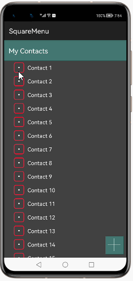
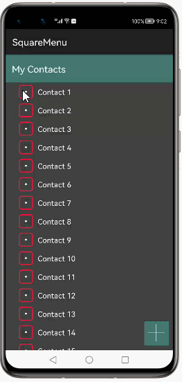
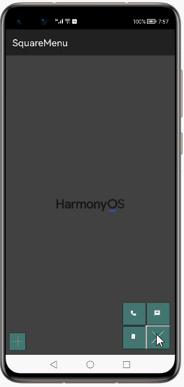
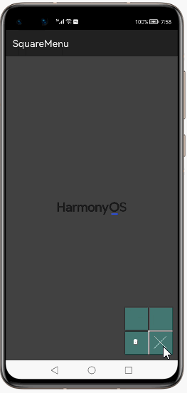
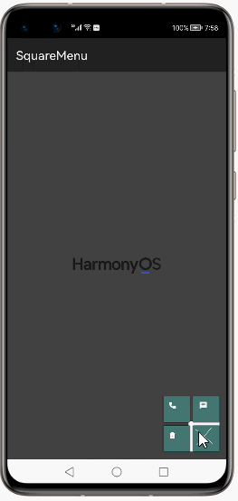
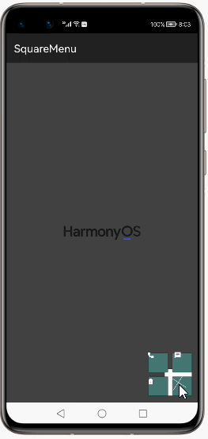
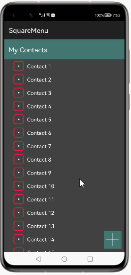
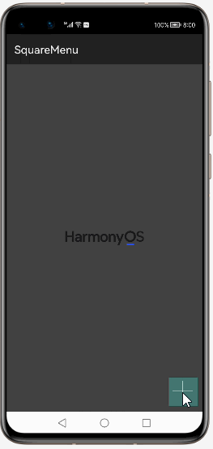

# How to use SquareMenu Library for HarmonyOS: A developer’s Guide

## **1. Introduction**
SquareMenu library provides you a seamless and hassle-free development experience to display a custom Floating Action Button with a different shape from traditional FABs and with three sub menuComponent address.

To get started right away, head on to [Gitee](https://gitee.com/openharmony-tpc/SquareMenu)


## **2. Typical Use Cases**
This library - com.devs.squaremenu.SquareMenu, is very useful in the development of applications which are in our daily use. Couple of such examples are mentioned below:

<div align="center">
<table>
    <tr>
        <td width="50%">
            <ul><li><b>Contact List delete</b></br>Deleting the selected contact using sub menu</li><ul>
        </td>
        <td width="100%">
            <ul><li><b>Contact dial</b></br>Dailing the selected contact using sub menu</li><ul>
        </td>
    </tr>
    <tr>
        <td width="50%"><p align="center"></center></td>
        <td width="100%"><p align="center"></center></td>
    </tr>
</table>
</div>


## **3. Capability**
In this section, we can see the list of features which the library provides which makes the use of this library very easy and friendly. Primarily, this library supports customization of component attributes using the below mechanisms.

* **XML layout inflation**</br>
With the help of xml layout inflation, the library is so easy to use such that, we can put the component to action without even writing a single line of code. This will be so useful for quick development, as well as for beginners who are starting with mobile-app development. On how to use the XML Layout Inflation can be seen in the coming sections of the tutorial.

* **Customization via Java APIs**</br>
In case we need to customize the component during run time, we also have the flexibility to do that using the JAVA APIs which the library exposes. The APIs will also help us to utilize the features provided from its parent “Component” Class 

## **4. Features**
Features supported by this component includes the below:
* **Customizing size property**</br>
We can configure the size of the squaremenu using these property. Often setting the right size property for a squaremenu makes a whole lot of difference in the way the menu appeals to audience.

* **Setting custom icon, icon for the sub menu**</br>
Using this library, we can set any custom icon into sub menu(menuComponent). The library supports a wide range of file types like *.jpg, *.png etc, whichever supported by the harmony platform.

* **Setting the color**</br>
The color of the menu can set from the library. It can be set by defining color code.

* **Configuring the open directions for squaremenu**</br>
Open direction for the squaremenu tells in what direction the menu should open. It can be customized with 4 ways that can be seen in the coming sections of the tutorial.

* **Auto close for squaremenu**</br>
We can configure the auto close of the squaremenu using these property. 

## **5. Installation**
For using the library in your HarmonyOS mobile app, you need to first install it by adding the below dependency in your entry/build.gradle file.

```groovy
dependencies {
    implementation fileTree(dir: 'libs', include: ['*.har'])
    implementation 'io.openharmony.tpc.thirdlib:squaremenu:1.0.0'
    testCompile 'junit:junit:4.12'
}
```

## **6. Usage**
This section will help us to understand the usage of the library as you use it in your Harmony-application developemnt project.

### **Step 1: Define layout via XML**
```xml
    <?xml version="1.0" encoding="utf-8"?>
    <DependentLayout
    xmlns:ohos="http://schemas.huawei.com/res/ohos"
    xmlns:app="http://schemas.ohos.com/apk/res-auto"
    ohos:height="match_parent"
    ohos:width="match_parent"
    ohos:padding="10vp">
        <com.devs.squaremenu.SquareMenu
            ohos:id="$+id:sm"
            ohos:width="match_content"
            ohos:height="match_content"
            app:squareFabSize="80"
            app:fabColor="#303F9F"
            app:autoClose="false"
            app:iconM1="$media:ic_delete_forever_white_24dp"
            app:iconM2="$media:ic_call_white_24dp"
            app:iconM3="$media:ic_chat_white_24dp"
            app:menuOpenDirection="top_right"
            ohos:align_parent_bottom="true"
            ohos:align_parent_left="true"/>
    </DependentLayout>
```
### **Step 2: Customize programmatically via Java API**
```java
    @Override
    public void onStart(Intent intent) {
        super.onStart(intent);
        super.setUIContent(ResourceTable.Layout_ability_main);
        SquareMenu mSquareMenu;
        mSquareMenu = (SquareMenu) findComponentById(ResourceTable.Id_sm);
        mSquareMenu.setFABColor(Color.GRAY);
        mSquareMenu.setAutoClose(true);
        mSquareMenu.setMenuOpenDirection("top_right");
    }
```
### **List of XML attributes supported**
Below is the list of XML attributes which are supported by the library.

<table>
	<tr><th>Name</th><th>Type</th><th width="100%">Info</th></tr>
	<tr><td>squareFabSize</td><td>dimension</td><td>To specify the sqauremenu size</td></tr>
	<tr><td>fabColor</td><td>color</td><td>To specify sqauremenu color</td></tr>
	<tr><td>autoClose</td><td>boolean</td><td>To set auto close for sqauremenu</td></tr>
	<tr><td>iconM1</td><td>icon</td><td>To specify icon for the sub menu 1</td></tr>
	<tr><td>iconM2</td><td>icon</td><td>To specify icon for the sub menu 2</td></tr>
	<tr><td>iconM3</td><td>icon</td><td>To specify icon for the sub menu 3</td></tr>
	<tr><td>menuOpenDirection</td><td>icon</td><td>To specify open direction for the sqauremenu. It takes 4 values ("top-left" and "top-right")</td></tr>
</table>


### **List of public APIs for app-developer**
The public methods below will help us to operate on the component at runtime.

<table> 
	<tr>
		<th colspan="2"> Setter Methods </th>
	</tr>
	<tr>
		<th>name</th>
		<th width="100%">info</th>
	</tr>
	<tr>
		<td>setFABColor() </td>
		<td>To specify the sqauremenu color </td>
	</tr>
	<tr>
		<td>setAutoClose() </td>
		<td>To set auto close for sqauremenu </td>
	</tr>
	<tr>
		<td>setMenuOpenDirection() </td>
		<td>To specify open direction for the sqauremenu. It takes - ("top-left" & "top-right")</td>
	</tr>
	<tr>
		<td>setOnMenuClickListener() </td>
		<td>To specify click listener's for squaremenu and 3 sub menu's </td>
	</tr> 
</table>


<table>
	<tr>
		<th colspan="2"> Getter Methods </th>
	</tr>
	<tr>
		<td width="50%">
			<div align="center">
			<table> 
					<th>name</th>
					<th>info</th>
				</tr>
				<tr>
					<td>getFABColor() </td>
					<td> Get the sqauremenu color</td>
				</tr> 
			</table>
			</div>
		</td>
		<td width="120%">
			<div align="center">
			<table>
				<tr>
					<th>name</th>
					<th>info</th>
				</tr>
				<tr>
					<td>getMenuOpenDirection()</td>
					<td>Get the menu open direction.</td>
				</tr>
			</table>
			</div>
		</td>
	</tr>
</table>

<table>
	<tr>
		<th>Interface</th>
		<th>Interface Methods</th>
	</tr>
	<tr>
		<td>
			<table> <tr><th>name</th><th width="100%">info</th></tr><tr><td>OnMenuClickListener </td><td>Implement click listerner to menu</td></tr> </table>
		</td>
		<td width="100%">
			<div align="center"><table> <tr><th>name</th><th>info</th></tr><tr><td>onMenuOpen()</td><td>when menu is opened</td></tr><tr><td>onMenuClose()</td><td>when menu is closed</td></tr><tr><td>onClickMenu1()</td><td>when menu 1 is opened</td></tr><tr><td>onClickMenu2()</td><td>when menu 2 is opened</td></tr><tr><td>onClickMenu2()</td><td>when menu 3 is opened</td></tr> </table></div>
		</td>
	</tr>
</table>

## **7. API usage examples**
In this section, we can have a look at some of the examples where the APIs of this library is put to use and the results which we can acheive.

**Example1: Customising squareFabSize attribute**  |
<table style="width: 100%">
    <tr >
        <td width="50%">
        <b><u>Layout.xml</u>:</b>
        <pre >
&ltcom.devs.squaremenu.SquareMenu
     ohos:id="$+id:sm"
     ohos:width="match_content"
     ohos:height="match_content"
     <b style="color:DarkCyan;">app:squareFabSize="80"                                       </b>
     app:fabColor="#303F9F"
     app:iconM1="$media:ic_delete"
     app:iconM2="$media:ic_call"
     app:iconM3="$media:ic_chat"
     ohos:align_parent_bottom="true"
     ohos:align_parent_left="true"/>
</br>
        </pre>
        </td>
        <td width="100%">
        <p align="center"></p>
        </td>
    </tr>
</table>

**Example2: Setting the icon for sub menu 1**
<table style="width: 100%">
    <tr>
        <td width="50%">
        <b><u>Layout.xml</u>:</b>
        <pre>
&ltcom.devs.squaremenu.SquareMenu
     ohos:id="$+id:sm"
     ohos:width="match_content"
     ohos:height="match_content"
     app:squareFabSize="80"                                       
     app:fabColor="#303F9F"
     <b style="color:DarkCyan;">app:iconM1="$media:ic_delete"</b>
     app:iconM2="$media:ic_call"
     app:iconM3="$media:ic_chat"
     ohos:align_parent_bottom="true"
     ohos:align_parent_left="true"/>
</br>
        </pre>
        </td>
        <td width="100%">
        <p align="center"></p>
        </td>
    </tr>
</table>

**Example3: Setting the icon for sub menu 2**
<table style="width: 100%">
    <tr>
        <td width="50%">
        <b><u>Layout.xml</u>:</b>
        <pre>
&ltcom.devs.squaremenu.SquareMenu
     ohos:id="$+id:sm"
     ohos:width="match_content"
     ohos:height="match_content"
     app:squareFabSize="80"                                       
     app:fabColor="#303F9F"
     app:iconM1="$media:ic_delete"
     <b style="color:DarkCyan;">app:iconM2="$media:ic_call"</b>
     app:iconM3="$media:ic_chat"
     ohos:align_parent_bottom="true"
     ohos:align_parent_left="true"/>
</br>
        </pre>
        </td>
        <td width="100%">
        <p align="center"></p>
        </td>
    </tr>
</table>

**Example4: Setting the icon for sub menu 3**
<table style="width: 100%">
    <tr>
        <td width="50%">
        <b><u>Layout.xml</u>:</b>
        <pre>
&ltcom.devs.squaremenu.SquareMenu
     ohos:id="$+id:sm"
     ohos:width="match_content"
     ohos:height="match_content"
     app:squareFabSize="80"                                       
     app:fabColor="#303F9F"
     app:iconM1="$media:ic_delete"
     app:iconM2="$media:ic_call"
     <b style="color:DarkCyan;">app:iconM3="$media:ic_chat"</b>
     ohos:align_parent_bottom="true"
     ohos:align_parent_left="true"/>
</br>
        </pre>
        </td>
        <td >
        <p align="center"></p>
        </td>
    </tr>
</table>

**Example5: Customizing fabColor attribute**


In this example, setting the color of the squaremenu to blue in layout.xml. The color code is in [RGB-format](https://htmlcolorcodes.com/)
<table style="width: 100%">
    <tr>
        <td width="50%">
        <b><u>Layout.xml</u>:</b>
        <pre>
&ltcom.devs.squaremenu.SquareMenu
     ohos:id="$+id:sm"
     ohos:width="match_content"
     ohos:height="match_content"
     app:squareFabSize="80"
     <b style="color:DarkCyan;">app:fabColor="#303F9F"</b>
     app:iconM1="$media:ic_delete"
     app:iconM2="$media:ic_call"
     app:iconM3="$media:ic_chat"
     ohos:align_parent_bottom="true"
     ohos:align_parent_left="true"/>
</br>
</pre>
<b><u>Java Slice</u>:</b>
<pre>
SquareMenu mSquareMenu;
mSquareMenu = (SquareMenu) findComponentById(ResourceTable.Id_sm);
<b style="color:DarkCyan;">mSquareMenu.setFABColor(Color.BLUE);</b>
        </pre>
        </td>
        <td width="50%">
        <p align="center"></p>
        </td>
    </tr>
</table>


**Example6: Setting the auto close property**
<table style="width: 100%">
    <tr>
        <td width="50%">
        <b><u>Layout.xml</u>:</b>
        <pre>
&ltcom.devs.squaremenu.SquareMenu
    ohos:id="$+id:sm"
    ohos:width="match_content"
    ohos:height="match_content"
    app:squareFabSize="80"
    app:fabColor="#303F9F"
    <b style="color:DarkCyan;">app:autoClose="true"</b>
    app:iconM1="$media:ic_delete"
    app:iconM2="$media:ic_call"
    app:iconM3="$media:ic_chat"
    ohos:align_parent_bottom="true"
    ohos:align_parent_left="true"/>
</br>
</pre>
<b><u>Java Slice</u>:</b>
<pre>
SquareMenu mSquareMenu;
mSquareMenu = (SquareMenu) findComponentById(ResourceTable.Id_sm);
<b style="color:DarkCyan;">mSquareMenu.setAutoClose(true);</b>
        </pre>
        </td>
        <td >
        <p align="center"></p>
        </td>
    </tr>
</table>

**Example7: Setting the menu open direction**
<table style="width: 100%">
    <tr>
        <td width="50%">
        <b><u>Layout.xml</u>:</b>
        <pre>
&ltcom.devs.squaremenu.SquareMenu
     ohos:id="$+id:sm"
     ohos:width="match_content"
     ohos:height="match_content"
     app:squareFabSize="80"
     app:fabColor="#303F9F"
     app:iconM1="$media:ic_delete"
     app:iconM2="$media:ic_call"
     app:iconM3="$media:ic_chat"
     <b style="color:DarkCyan;">app:menuOpenDirection="top_left"</b>
     ohos:align_parent_bottom="true"
     ohos:align_parent_left="true"/>
     </br>
     </pre>
<b><u>Java Slice</u>:</b>
<pre>
SquareMenu mSquareMenu;
mSquareMenu = (SquareMenu) findComponentById(ResourceTable.Id_sm);
<b style="color:DarkCyan;">mSquareMenu.setMenuOpenDirection("top_left");</b>
        </pre>
        </td>
        <td >
        <p align="center"></p>
        </td>
    </tr>
</table>

**Example8: Setting the Click Listener to the menu calling setOnMenuClickListener by passing the OnMenuClickListener interface and implementing the abstract methods**
<table style="width: 100%">
    <tr>
        <td width="50%">
<b><u>Java Slice</u>:</b>
<pre>
SquareMenu mSquareMenu;
mSquareMenu = (SquareMenu) findComponentById(ResourceTable.Id_sm);
<b style="color:DarkCyan;">mSquareMenu.setOnMenuClickListener(new OnMenuClickListener() {
    @Override
    public void onMenuOpen() {
        toast("Open");
    }
    @Override
    public void onMenuClose() {
        toast("Close");
    }
    @Override
    public void onClickMenu1() {
        toast("Menu1");
    }
    @Override
    public void onClickMenu2() {
        toast("Menu2");
    }
    @Override
    public void onClickMenu3() {
        toast("Menu3");
    }
    });</b>
        </pre>
        </td>
        <td width="50%">
        <p align="center"></p>
        </td>
    </tr>
</table>

## **8. Conclusion**
SqaueMenu is a very easy to use and very powerful library.The performance of the library is very good even when it works on one of the latest operating systems in the world, which is HarmonyOS!

* For more exciting libraries to develop your app, peep into third-party-components at </br>
[OpenHarmony-TPC](https://gitee.com/openharmony-tpc)

* To know more about the developement work happening on harmony aaplication layer, and even be part of the exciting stuff, watch this space of [Application Library Engineering Group](https://github.com/applibgroup)
