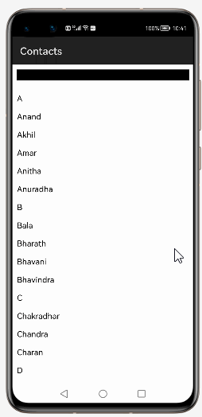
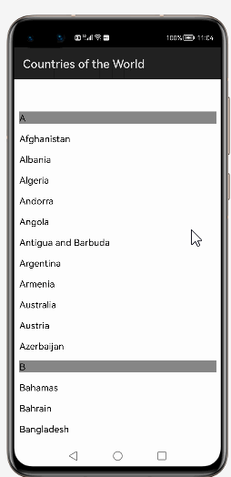
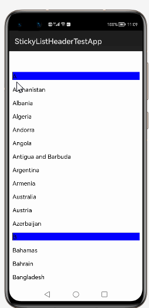
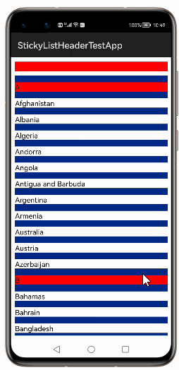

# How to use StickyListHeaders  Library for HarmonyOS: A developer’s Guide

## **1. Introduction**

StickyListHeaders makes it easy to integrate section headers in your ListContainer.These section headers stick to the top. The goal of this project is to deliver a high performance replacement to ListContainer.You should with minimal effort and time be able to add section headers to a list.
This should be done via a simple to use API without any special features.
## **2. Typical Use Cases**
This library - se.emilsjolander.stickylistheaders, is very useful in the development of applications which are in our daily use. Some of such examples mentioned below:


<center><table>
    <tr>
        <td>
            <ul><li><b>Contacts App</b></br>Contacts+ is the world’s leading contacts (phone book) and dialer app </li><ul>
        </td>
       <td>
            <ul><li><b>Countries of the World</b></br>With Country list app,The description of List of Countries of the world App</li><ul>
        </td>
    </tr>
    <tr>
        <td><center></center></td>
        <td><center></center></td>
    </tr>
</table></center>


## **3. Capability**
In this section, we can see the list of features which the library provides which makes the use of this library very easy and friendly. Primarily, this library supports customization of component attributes using the below mechanism.

* **Java APIs**</br>
StickyListHeaders  uses a simple fluent java API's that allows users to make most requests in a single line:
 
## **4. Features**
Features supported by this component includes the below:
* **Displays the section headers in your ListContainer.**</br>
* **Displays section headers stick to the top**</br>
* **Supports customized background color to sticky header background, header text and list container background.**</br>


## **5. Installation**
For using the library in your HarmonyOS mobile app, you need to first install it by following below methods.

* **Method 1:**  </br>
Generate the .har package through the library and add the .har package to the libs folder.Add the following code to the entry level build.gradle:
    <pre>
       <b style="color:green">
    implementation fileTree  (dir: 'libs', include: ['* .jar', '* .har'])
       </b>
</pre>

* **Method 2 :**  </br>
Copy the dependency from the gitee and add it to the entry level build.gradle:
<pre>
dependencies {
    implementation fileTree(dir: 'libs', include: ['*.har'])
    <b style="color:blue;">implementation 'io.openharmony.tpc.thirdlib:StickyListHeaders:1.0.1'</b>
           }
</pre>


## **6. Usage**
This section will help us to understand the usage of the library as you use it in your Harmony-application developemnt project.

### **Step 1: Define layout via XML**
We are going to load list  into ListContainer component using This  Library. So, add ListContainer component into <strong>resource_file.xml</strong> file.

```xml
    <?xml version="1.0" encoding="utf-8"?>
    <DirectionalLayout
        xmlns:ohos="http://schemas.huawei.com/res/ohos"
        xmlns:app="http://schemas.huawei.com/hap/res-auto"
        ohos:height="match_parent"
        ohos:width="match_parent"
        ohos:orientation="vertical"
        ohos:background_element="#000000">
            
       <ListContainer
        ohos:id="$+id:sample_list"
        ohos:height="match_parent"
        ohos:width="match_parent"
        ohos:bottom_margin="10vp"
        ohos:left_margin="10vp"
        ohos:right_margin="10vp"/>

    </DirectionalLayout>
```
### **Step 2: Customize programmatically via Java API**
```java
   @Override
    public void onStart(Intent intent) {
        super.onStart(intent);
     StickyListHeadersAdapter listItemProvider = new StickyListHeadersAdapter(this, mStickyList);
     listItemProvider.setResource(ResourceTable.Layout_list_item, ResourceTable.Id_item_name);
      listItemProvider.setColor(listItemProvider.DEFAULT_HEADER_BG_COLOR, listItemProvider.DEFAULT_LIST_BG_COLOR);
      mListContainer.setItemProvider(listItemProvider);

     Text headerName = (Text) mView.findComponentById(ResourceTable.Id_header_name);
     headerName.setBackground(ViewUtil.customElement(ViewUtil.DEFAULT_HEADER_TEXT_COLOR));
     headerName.setClickedListener(this);
    }
```

### **7 List of public APIs for app-developer**
The public methods below will help us to operate on the component at runtime.

**StickyListHeaders  Methods**
<table>
<tr>
    <td>
        <ul>
            <li>addComponent()</li>
            <li>addItemVisibilityChangedListener()</li> 
			<li>executeItemClick()</li>
			<li>removeAllComponents()</li>
			<li>removeComponent()</li>
			<li>setOrientation()</li>
			<li>setBoundary(Component handle)</li>
			<li>setFooterBoundarySwitch(Component holder)</li>
			<li>setHeaderBoundarySwitch()</li>
        </ul>
    </td>
   <td>
        <ul>
            <li>setBoundarySwitch()</li>
            <li>setBoundaryColor()</li> 
			<li>setSelectedItemIndex()</li>
			<li>setTextFilter()</li>
			<li>onItemSelected()</li>
			<li>onItemLongClicked()</li>
			<li>onItemClicked()</li>
			<li>onItemAdded()</li>
			<li>onItemRemoved ()</li>
        </ul>
    </td>
</tr>
</table>

## **8. API usage examples**
In this section, we can have a look at some the examples where the APIs of this library is put to use and the results which we can acheive.

**Example1:Harmony StickyListHeaders onItemClickListener**
<table>
    <tr>
        <td style="width:560px">
        <pre>
<b><u>Layout.xml</u>:</b>
&ltListContainer
        ohos:id="$+id:sample_list"
        ohos:height="match_parent"
        ohos:width="match_parent"
        ohos:bottom_margin="10vp"
        ohos:left_margin="10vp"
        ohos:right_margin="10vp"/>
</br>
</pre>
<b><u>Java Slice</u>:</b>
<pre>
   StickyListHeadersAdapter listItemProvider = 
   new StickyListHeadersAdapter
(this, mStickyList, new StickyListHeadersAdapter
.OnItemClicklistener() {
    @Override
public void onItemClick(String selectedItem, boolean isHeader){
if (isHeader) {
     itemType = "Header " + selectedItem;
    } else {
     itemType = "Item " + selectedItem + " clicked!";
      //present(new ContactsAppSlice(), new Intent());
     }
     Util.showTips(getContext(), itemType);
            }
        });
        </pre>
        </td>
        <td >
        <center></center>
        </td>
    </tr>
</table>


**Example2: Supports customized background color to sticky header background**
<table>
    <tr>
        <td style="width:560px">
        <pre>
<b><u>Layout.xml</u>:</b>
&ltListContainer
        ohos:id="$+id:sample_list"
        ohos:height="match_parent"
        ohos:width="match_parent"
        ohos:bottom_margin="10vp"
        ohos:left_margin="10vp"
        ohos:right_margin="10vp"/>
</br>
</pre>
<b><u>Java Slice</u>:</b>
<pre>
  listItemProvider.setResource(ResourceTable.Layout_list_item,
  ResourceTable.Id_item_name);
 listItemProvider.setColor(Color.YELLOW.getValue(), 
 Color.TRANSPARENT.getValue());
 mListContainer.setItemProvider(listItemProvider);
 if (mView.findComponentById(ResourceTable.Id_header_name)
 instanceof Text) {
 mHeaderName = (Text) mView.findComponentById
 (ResourceTable.Id_header_name);
 mHeaderName.setBackground(ViewUtil.customElement
 (Color.BLACK.getValue()));
 mHeaderName.setClickedListener(this);
        }
  mListContainer.setScrolledListener(this);
        super.setUIContent(mView);
        </pre>
        </td>
        <td >
        <center></center>
        </td>
    </tr>
</table>


 
## **9. Conclusion**
StickyListHeaders is a very easy to use and very powerful library.The performance of the library is very good even when it works on one of the latest operating systems in the world, which is HarmonyOS!

* For more exciting libraries to develop your app, peep into third-party-components at </br>
[OpenHarmony-TPC](https://gitee.com/openharmony-tpc)

* To know more about the developement work happening on harmony aaplication layer, and even be part of the exciting stuff, watch this space of [Application Library Engineering Group](https://github.com/applibgroup)