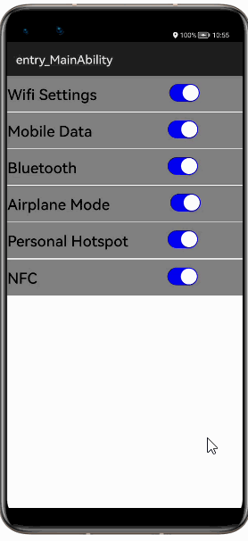
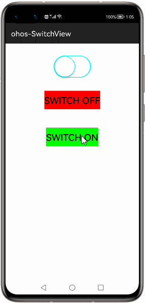
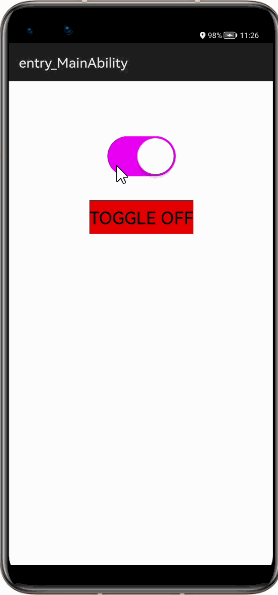

# 1. How to use SwitchView Library for HarmonyOS: A developer’s Guide
## **1. Introduction**
SwitchView is a lightweight library which allows user to enable, disable,toggle and check switch status.

To get started right away, head on to [Gitee](https://gitee.com/openharmony-tpc/ohos-SwitchView)

## **2. Typical Use Case**
This library - vn.luongvo.widget.ohos-switchview, is very useful in the development of application's feature requiring instant use. Couple of such examples are mentioned below:

<table>
    <tr>
        <td>
            <ul><li><b>System Settings in phone</b> </li><ul>
        </td>
    </tr>
    <tr>
        <td>

</td>
    </tr>
</table>

## **3. Capability**
In this section, we can see the list of features which the library provides which makes the use of this library very easy and friendly. Primarily, this library supports customization of component attributes using the below mechanisms.

* **XML layout inflation** 
With the help of xml layout inflation, the library is so easy to use such that, we can put the component to action without even writing a single line of code. This will be so useful for quick development, as well as for beginners who are starting with mobile-app development. On how to use the XML Layout Inflation can be seen in the coming sections of the tutorial.

* **Customization via Java APIs** 
In case we need to customize the component during run time, we also have the flexibility to do that using the JAVA APIs which the library exposes. The APIs will also help us to utilize the features provided from its parent “SwitchView” Class 

## **4. Features**
Features supported by this component includes the below:
* **Enable setting** 
This feature enables switch to **ON** mode.

* **Disable setting** 
This feature enables switch to **OFF** mode.

* **Toggle setting** 
This feature enables switch from **ON** to **OFF** mode and vice-versa.

* **Customize switch ON/OFF color** 
Often setting the right color property for a switch-view makes a whole lot of difference in the way the switch appeals to audience.
We can customize the switch **ON/OFF** color property to make the look beautiful and unique
.
If no customization is done the switch view takes default color from library.

## **5. Installation**
For using the library in your HarmonyOS mobile app, you need to first install it by adding the below dependency in your entry/build.gradle file.
<pre>
dependencies {
    implementation fileTree(dir: 'libs', include: ['*.har'])
    <b style="color:blue;">implementation 'io.openharmony.tpc.thirdlib:ohos-SwitchView:1.0.2'</b>
    testCompile 'junit:junit:4.12'
}
</pre>

## **6. Usage**
This section will help us to understand the usage of the library as you use it in your Harmony-application developemnt project.

### **Step 1: Define layout via XML**

    <?xml version="1.0" encoding="utf-8"?>
    <DirectionalLayout
        xmlns:ohos="http://schemas.huawei.com/res/ohos"
        xmlns:app="http://schemas.huawei.com/hap/res-auto"
        ohos:height="match_parent"
        ohos:width="match_parent"
        ohos:orientation="vertical"
        ohos:background_element="#000000">
            <vn.luongvo.widget.iosswitchview.SwitchView
                ohos:id="$+id:switchview
                ohos:height="50vp
                ohos:width="80vp"
                ohos:margin="10vp"
                ohos:orientation="vertical"
                ohos:layout_alignment="center"
                ohos:top_padding="10vp"
                app:checked="true"
                app:color_on="#ff0000"
                app:color_off="#ff00ff"
                /> 
    </DirectionalLayout>

### **Step 2: Customize programmatically via Java API**

    @Override
    public void onStart(Intent intent) {
        super.onStart(intent);
        super.setUIContent(ResourceTable.Layout_NewSilce);
        SwitchView sv;
        sv = (SwitchView)findComponentById(ResourceTable.Id_switchview);
        sv.setChecked(true);
    }

### **List of XML attributes supported**
Below is the list of XML attributes which are supported by the library.

* checked - To check the status of switch.
* color_on - To specify color in switch on-state.
* color_off - To specify color in switch on-state.

### **List of public APIs for app-developer**
The public methods below will help us to operate on the component at runtime.

**Public Methods**
<table>
<tr>
    <td>
        <ul>
            <li>setChecked()</li>
            <li>isChecked()</li>
            <li>toggle()</li>
            <li>setOnCheckedChangeListener()
        </ul>
    </td>
</table>

## **7. API usage examples**
In this section, we can have a look at some of the examples where the APIs of this library is put to use and the results which we can acheive.

**Example1: Setting the contour color when switch is off/on**

In this example, first the switch staus is set to **false** in layout.xml so that switching on can be clearly observable.The color code is in [RGB-format](https://htmlcolorcodes.com/)
<table>
    <tr>
        <td width="75%">
        <pre>
<b><u>Layout.xml</u>:</b>
&ltvn.luongvo.widget.iosswitchview.SwitchView
    ohos:id="$+id:switchview
    ohos:height="290vp"
    ohos:width="290vp"
    ohos:orientation="vertical"
    ohos:layout_alignment="center"
    ohos:top_padding="10vp"
    app:checked="false"
    <b style="color:blue;">app:color_on="#0FFFFF"</b>/>
    <b style="color:blue;">app:color_off="#FF00FF"</b>/>
 
<b><u>Java Slice</u>:</b>
SwitchView sv;
sv = (SwitchView)
findComponentById
(ResourceTable.Id_switchview);
<b style="color:blue;">sv.setChecked(false);</b>
<b style="color:blue;">sv.setChecked(true);</b>
        </pre>
        </td>
        <td width="100%">
        

        </td>
    </tr>
</table>

**Example2: Customizing toggle switch view**
<table>
    <tr>
        <td width="75%">
        <pre>
<b><u>Layout.xml</u>:</b>
&ltvn.luongvo.widget.iosswitchview.SwitchView
    ohos:id="$+id:switchview"
    ohos:height="290vp"
    ohos:width="290vp"
    ohos:orientation="vertical"
    ohos:layout_alignment="center"
    ohos:top_padding="10vp"
    app:checked="true"/>
 
<b><u>Java Slice</u>:</b>
SwitchView sv;
sv = (SwitchView)
findComponentById
(ResourceTable.Id_switchview);
<b style="color:blue;">sv.toggle(false);
</b>
        </pre>
        </td>
        <td width="100%">
        

        </td>
    </tr>
</table>

## **8. Conclusion**
SwitchView lib is user friendly and powerful library.The performance of the library is excellent when works on one of the latest operating systems in the world, which is HarmonyOS!

* For more exciting libraries to develop your app, peep into third-party-components at  
[OpenHarmony-TPC](https://gitee.com/openharmony-tpc)

* To know more about the developement work happening on harmony aaplication layer, and even be part of the exciting stuff, watch this space of [Application-Library Engineering Group](https://github.com/applibgroup)
