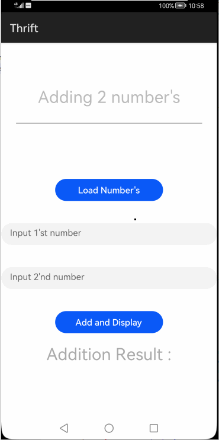
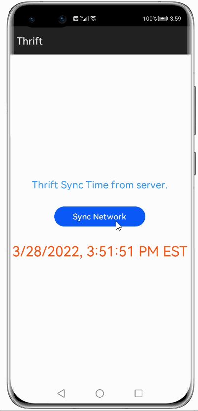
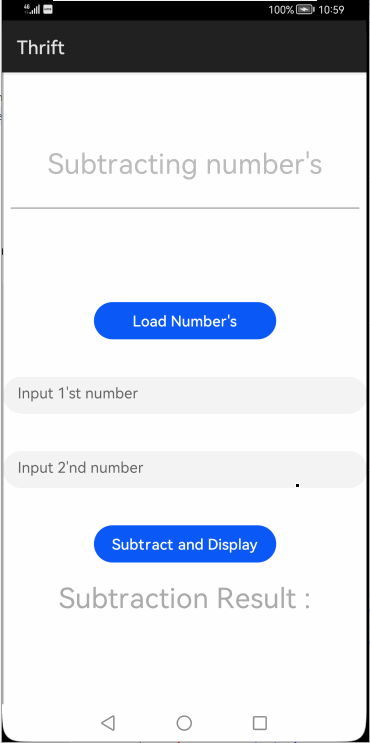

# How to use Thrift Library for HarmonyOS: A developer’s Guide

## **1. Introduction**
<span style="color: purple;">Thrift</span> is a lightweight, language-independent software stack for point-to-point RPC implementation. Thrift provides clean abstractions and implementations for data transport, data serialization, and application level processing. The code generation system takes a simple definition language as input and generates code across programming languages that uses the abstracted stack to build interoperable RPC clients and servers.

To get started right away, head on to [Gitee](https://gitee.com/openharmony-tpc/)


## **2. Typical Use Cases**
This library - <span style="color: purple;">Thrift</span>, is very useful in the development of applications which are in our daily use. For example as mentioned below:

<center><table>
    <tr>
        <td>
            <ul><li><b>Thrift Service for Calculator.</b></br>Create simple Thrift Service which implements various functions of a Calculator.</li><ul>
        </td>
        <td>
            <ul><li><b>Thrift time sync from server.</b></br>Sync time from live server</li><ul>
        </td>
         </tr>
    <tr>
        <td><center></center></td>
        <td><center></center></td>
    </tr>
</table></center>


## **3. Capability and Features**
In this section, we can see step by step process to Create simple Thrift Service which implements various functions of a Calculator which makes the use of this library very easy and friendly. Primarily, this library supports.

* **Transport**</br>
Transport layer performs byte level I/O between RPC clients and servers.</br>
Transport object should be created when user needs to establish a connection between client and server based on the server IP.</br>

* **TJSONProtocol**</br>
Apache Thrift TJSONProtocol perform serialization which enables cross language RPC.</br>
For cross language RPC which perform serialization TJSONProtocol can be used.</br>

## **4. Installation**
For using thrift_ohos module in sample application,include the below dependency in entry <span style="color: blue;">package.json</span> after adding thrift_ohos module in project root directory. Before this add thrift_ohos module in project root directory.

```groovy
"dependencies": {
    "thrift_ohos": "file:../thrift_ohos"
  }
```

## **5. Thrift usage:**
### **Step 1: Create a Project Directory:**
```groovy
$mkdir calculator-thrift-service
$cd calculator-thrift-service
```

### **Step 2: Define the Prototype of the Calculator Service: fileName.thrift File**
Similar to how we define the API Routes for a service,This file contains the list of methods with their arguments which can be called by a Client.</br>
Let's look at the service definition of our Calculator Service.</br>
* **Create a helper file:**
```groovy
    calculator-thrift-service$ touch shared.thrif
```
```java
   /**
 * This Thrift file can be included by other Thrift files that want to share
 * these definitions.
 */

 namespace cl shared
 namespace cpp shared
 namespace d share // "shared" would collide with the eponymous D keyword.
 namespace dart shared
 namespace java shared
 namespace perl shared
 namespace php shared
 namespace haxe shared
 namespace netstd shared
 
 
 struct SharedStruct {
   1: i32 key
   2: string value
 }
 
 service SharedService {
   SharedStruct getStruct(1: i32 key)
 }
```
* **Create a calculator_service file:**

* **Define the functions that we want to expose as APIs:**
```groovy
    calculator-thrift-service$ touch calculator_service.thrif
```
```java
  * Included objects are accessed using the name of the .thrift file as a
 * prefix. i.e. shared.SharedObject
 */
 include "shared.thrift"

 /**
  * Thrift files can namespace, package, or prefix their output in various
  * target languages.
  */
 
 namespace cl tutorial
 namespace cpp tutorial
 namespace d tutorial
 namespace dart tutorial
 namespace java tutorial
 namespace php tutorial
 namespace perl tutorial
 namespace haxe tutorial
 namespace netstd tutorial
 
 /**
  * Thrift lets you do typedefs to get pretty names for your types. Standard
  * C style here.
  */
 typedef i32 MyInteger
 
 /**
  * Thrift also lets you define constants for use across languages. Complex
  * types and structs are specified using JSON notation.
  */
 const i32 INT32CONSTANT = 9853
 const map<string,string> MAPCONSTANT = {'hello':'world', 'goodnight':'moon'}
 
 /**
  * You can define enums, which are just 32 bit integers. Values are optional
  * and start at 1 if not supplied, C style again.
  */
 enum Operation {
   ADD = 1,
   SUBTRACT = 2,
   MULTIPLY = 3,
   DIVIDE = 4
 }
 
 /**
  * Structs are the basic complex data structures. They are comprised of fields
  * which each have an integer identifier, a type, a symbolic name, and an
  * optional default value.
  *
  * Fields can be declared "optional", which ensures they will not be included
  * in the serialized output if they aren't set.  Note that this requires some
  * manual management in some languages.
  */
 struct Work {
   1: i32 num1 = 0,
   2: i32 num2,
   3: Operation op,
   4: optional string comment,
 }
 
 /**
  * Structs can also be exceptions, if they are nasty.
  */
 exception InvalidOperation {
   1: i32 whatOp,
   2: string why
 }
 
 /**
  * Ahh, now onto the cool part, defining a service. Services just need a name
  * and can optionally inherit from another service using the extends keyword.
  */
 service Calculator extends shared.SharedService {
 
   /**
    * A method definition looks like C code. It has a return type, arguments,
    * and optionally a list of exceptions that it may throw. Note that argument
    * lists and exception lists are specified using the exact same syntax as
    * field lists in struct or exception definitions.
    */
 
    void ping(),
 
    i32 add(1:i32 num1, 2:i32 num2),
 
    i32 calculate(1:i32 logid, 2:Work w) throws (1:InvalidOperation ouch),
 
    /**
     * This method has a oneway modifier. That means the client only makes
     * a request and does not listen for any response at all. Oneway methods
     * must be void.
     */
    oneway void zip()
 
 }
 
 /**
  * That just about covers the basics. Take a look in the test/ folder for more
  * detailed examples. After you run this file, your generated code shows up
  * in folders with names gen-<language>. The generated code isn't too scary
  * to look at. It even has pretty indentation.
  */
```
### **Step 3: Code Generation using thrift compiler**</br>
After creating a .thrift file can run Thrift in order to generate code in your targeted languages. The usage of thrift command is:

**example :- thrift -r --gen language[java/js/py etc] filename.thrift**

```groovy
    $thrift --gen js calculator_service.thrift
    $ls
    calculator_service.thrift    gen-js
```
1.For using thrift in sample application ,can use the compilers and tools 
2.Wrapper tools are created for windows(powershell) and linux to generate open harmony JS files corresponding to .thrift file.

* **Linux Usage**</br>
1.Keep the compiler and thrift_ohos.sh in same folder
2.run the thrift_ohos.sh with input .thrift file
3.find the JS and ohos folder for corresponding files (eg. gen-ohos)
```groovy
./thrift_ohos.sh  tutorial.thrift
```
* **Windows usage**</br>
1.Open powershell
2.open PowerShell ISE ( execute PowerShell ISE in powershell prompt)
3.from below command line go to the folder where thrift_ohos.ps1 and thrift compiler .exe present
4.run tool with input .thrift file
5.find the JS and ohos folder for corresponding files (eg. gen-ohos)
```groovy
.\thrift_ohos.ps1 eg.thrift
```
### **Step 4:Write the script to start the actual Thrift Server.**</br>
* **Create the server file.**
```groovy
calculator-thrift-service$touch calculator-server.py
```
```groovy
import glob
import sys
sys.path.append('gen-py')

from tutorial import Calculator
from tutorial.ttypes import InvalidOperation,Operation

from shared.ttypes import SharedStruct
from thrift.transport import TSocket
from thrift.transport import TTransport
from thrift.protocol import TBinaryProtocol
from thrift.server import TServer
from thrift.protocol import TJSONProtocol
from thrift.server import THttpServer

class CalculatorHandler:
    def __init__(self):
        self.log = {}

    def ping(self):
        print('ping()')

    def add(self, n1, n2):
        return n1 + n2

    def calculate(self, logid, work):
        if work.op == Operation.ADD:
            val = work.num1 + work.num2
        elif work.op == Operation.SUBTRACT:
            val = work.num1 - work.num2
        elif work.op == Operation.MULTIPLY:
            val = work.num1 * work.num2
        elif work.op == Operation.DIVIDE:
            if work.num2 == 0:
                raise InvalidOperation(work.op, 'Cannot divide by 0')
            val = work.num1 / work.num2
        else:
            raise InvalidOperation(work.op, 'Invalid operation')

        log = SharedStruct()
        log.key = logid
        log.value = '%d' % (val)
        self.log[logid] = log

        return val


    def getStruct(self, key):
        return self.log[key]

    def zip(self):
        print('zip()')


if __name__ == '__main__':
    handler = CalculatorHandler()
    processor = Calculator.Processor(handler)
    protoFactory = TJSONProtocol.TJSONProtocolFactory()
    port = 9090
    server = THttpServer.THttpServer(processor, ("ip", port), protoFactory)
    print("Python server running on port " + str(port))
    server.serve()
```
### **Step 5:Start the server !!.**</br>
```groovy
calculator-thrift-service$ python calculator_server.py
```

### **Step 6: Define the Client App.**</br>
* **Create a Harmoney project in DevEco and inclide <span style="color: purple;">thrift_ohos</span> library. refer section <span style="color: purple;">4 Installation adding dependency.</span>**

* **Include the <span style="color: purple;">gen-ohos</span> files which is auto generated by the thrift compiler under path  <span style="color: purple;">src/main/js/default/common</span>. refer section <span style="color: purple;">Code Generation using thrift compiler.</span>**

* **Importing <span style="color: purple;">thrift</span> library and <span style="color: purple;">calculator services</span> from gen-ohos in sample app.**
```groovy
import {Thrift} from 'thrift_ohos'
import {CalculatorClient} from '../../common/gen-ohos/Calculator';
```
* **Initialize <span style="color: purple;">Transport object</span> by passing the server URL along with port**

* **Get <span style="color: purple;">TJSONProtocol object</span> by passing the Transport object got from above step**
<table style="width: 100%">
    <tr>
        <td width="50%">
        <pre>
        <b style="color:DarkCyan;">
var transport = new Thrift.Transport("http://IP:port/");
var protocol = new Thrift.TJSONProtocol(transport);
        </pre>
        </td>
        <td width="50%">
        <p align="center"></p>
        </td>
    </tr>
</table>

* **Get <span style="color: purple;">CalculatorClient object</span> by passing the TJSONProtocol object got from above step**</br>
This is required to intereact with thrift IDL and trigger the server logic and get response from it.
```java
var client = new CalculatorClient(protocol);
```

* **Call the methods of the server using the CalculatorClient object and get the response from the server.**
<table style="width: 100%">
    <tr>
        <td width="50%">
        <pre>
        <b style="color:DarkCyan;">
var workAdd = new Work()
workAdd.num1 = 1;
workAdd.num2 = 15;
workAdd.op = Operation.ADD;
client.calculate(1, workAdd, function (result) {
if (result) {
    this.add = result;
    }
});
var workSubtract = new Work()
workSubtract.num1 = 25;
workSubtract.num2 = 15;
workSubtract.op = Operation.SUBTRACT;
client.calculate(1, workSubtract, function (result) {
if (result) {
    this.subtract = result;
    }
});
var workMultiply = new Work()
workMultiply.num1 = 1;
workMultiply.num2 = 15;
workMultiply.op = Operation.MULTIPLY;
client.calculate(1, workMultiply, function (result) {
if (result) {
    this.multiply = result;
    }
});
var workDivide = new Work()
workDivide.num1 = 15;
workDivide.num2 = 0;
workDivide.op = Operation.DIVIDE;
client.calculate(1, workDivide, function (result) {
if (result) {
    this.divide = result;
    }
});
        </pre>
        </td>
        <td width="50%">
        <p align="center"></p>
        <p align="center"></p>
        </td>
    </tr>
</table>

 **7. Conclusion**
<span style="color: purple;">Thrift</span> is a very easy to use and very powerful library.The performance of the library is very good even when it works on one of the latest operating systems in the world, which is HarmonyOS!

* For more exciting libraries to develop your app, peep into third-party-components at </br>
[OpenHarmony-TPC](https://gitee.com/openharmony-tpc)

* To know more about the developement work happening on harmony aaplication layer, and even be part of the exciting stuff, watch this space of [Application Library Engineering Group](https://github.com/applibgroup)


