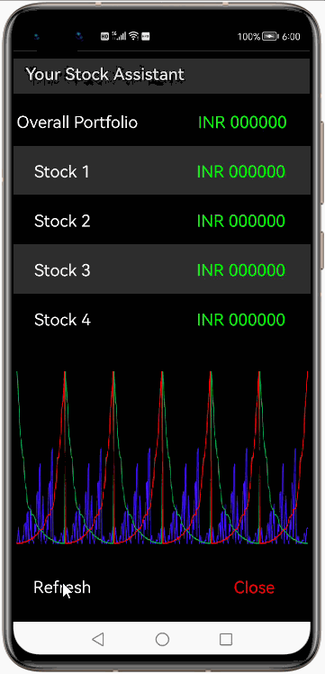
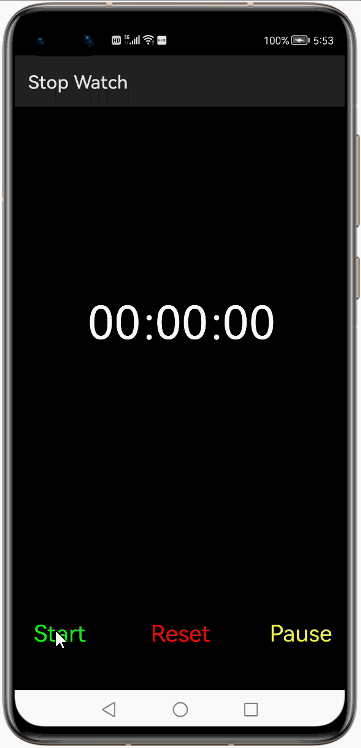
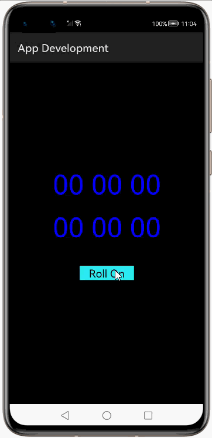
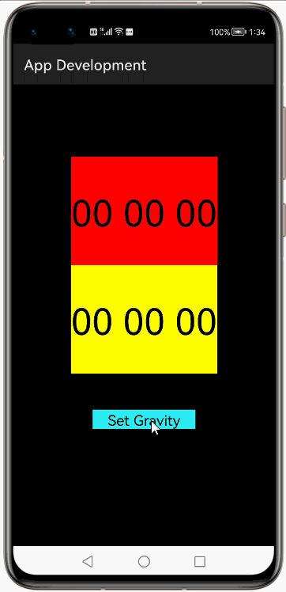
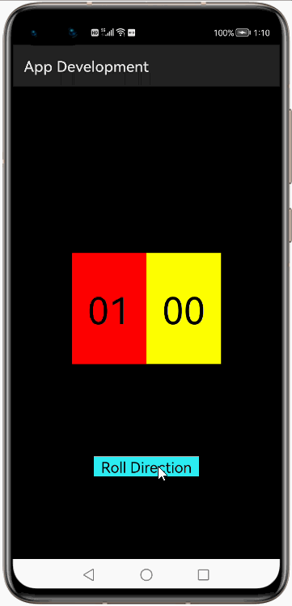

# How to use TickerView Library for HarmonyOS: A developer’s Guide

## **1. Introduction**
TickerView is a simple animation library which can be used to display rotating text on screen. It can be used to display numbers as well as characters in a rotating manner. The component provides support for customizing fonts and customizing animations.

In this guide, we can have a look at how this component can be used for a HarmonyOs app-developement. Very simple to mention, the library can be used to make apps like a stock-exchange-app or a time-piece-app, where there would be continuous changes in displayed values on screen.

To get started right away, head on to [Gitee](https://gitee.com/openharmony-tpc/ticker
)


## **2. Typical Use Cases**
This library - com.robinhood.ticker, is very useful in the development of applications which require rotating texts to be displayed on screen. Couple of such examples are mentioned below:

<div align="center">
<table>
    <tr>
        <td>
            <ul><li><b>Stock Assistant</b></br>Monitor stock price changes for selected scrips.</li><ul>
        </td>
        <td>
            <ul><li><b>Stop Watch</b></br>Stop watch to measure at second level ticks.</li><ul>
        </td>
    </tr>
    <tr>
        <td width="50%"><p align="center"></center></td>
        <td width="100%"><p align="center"></center></td>
    </tr>
</table>
</div>


## **3. Capability**
In this section, we can see the list of features which the library provides which makes the use of this library very easy and friendly. Primarily, this library supports customization of component attributes using the below mechanisms.

* **XML layout inflation**</br>
With the help of xml layout inflation, the library is so easy to use such that, we can put the component to action without even writing a single line of code. This will be so useful for quick development, as well as for beginners who are starting with mobile-app development. On how to use the XML Layout Inflation can be seen in the coming sections of the tutorial.

* **Customization via Java APIs**</br>
In case we need to customize the component during run time, we also have the flexibility to do that using the JAVA APIs which the library exposes. The APIs will also help us to utilize the features provided from its parent "Component" Class 

## **4. Features**
Features supported by this component includes the below:
* **Setting animation properties**</br>
The animation related properties of the component can be configure via java-APIs or via the XML atrributes. Some of such properties are the animation duration, the direction of scroll etc.

* **Customizing ticker-text font**</br>
We can customize the font of the ticker text by configuring the XML-attribute or via java-APIs. The color, face style, size etc are some of such properties which are be customized for this component. 


## **5. Installation**
For using the library in your HarmonyOS mobile app, you need to first install it by adding the below dependency in your entry/build.gradle file.

```groovy
dependencies {
    implementation fileTree(dir: 'libs', include: ['*.har'])
    implementation 'io.openharmony.tpc.thirdlib:ticker:1.0.1'
}
```

## **6. Usage**
This section will help us to understand the usage of the library as you use it in your Harmony-application developemnt project.

### **Step 1: Define layout via XML**

```xml
    <?xml version="1.0" encoding="utf-8"?>
    <DirectionalLayout
        xmlns:ohos="http://schemas.huawei.com/res/ohos"
        xmlns:app="http://schemas.huawei.com/hap/res-auto"
        ohos:height="match_parent"
        ohos:width="match_parent"
        ohos:orientation="vertical"
        ohos:background_element="#000000">
            <com.robinhood.ticker.TickerView
                ohos:id="$+id:ticker1"
                ohos:height="50vp"
                ohos:width="match_parent"
                ohos:layout_alignment="center"
                ohos:text="$string:default1"
                ohos:text_color="#00FF00"
                app:text_size="20vp"
                app:ticker_animationDuration="500"
                app:ticker_defaultCharacterList="number"/> 
    </DirectionalLayout>
```

### **Step 2: Customize programmatically via Java API**

```java
    Button b = (Button)findComponentById(ResourceTable.Id_refresh);
        b.setClickedListener(new Component.ClickedListener() {
            @Override
            public void onClick(Component component) {
                if(counter == 0)
                {
                    ticker1.setText("INR 100000");
                    counter = 1;
                }
                else
                {
                    ticker1.setText("INR 000000");
                    counter = 0;
                }
            }
        });
```

### **List of XML attributes supported**
Below is the list of XML attributes which are supported by the library.

<table>
<tr>
    <td  width=500px">
        <ul>
            <li>text</li>
            <li>text_size</li>
            <li>text_color</li>
            <li>layout_alignment</li>
            <li>ticker_animationDuration</li>
            <li>ticker_defaultCharacterList</li>
        </ul>
    </td>
    <td width=500px">
        <ul>
            <li>shadowColor</li>
            <li>shadowDx</li>
            <li>shadowDy</li>
            <li>shadowRadius</li>
            <li>ticker_defaultPreferredScrollingDirection</li>
        </ul>
    </td>
</tr>
</table>

### **List of public APIs for app-developer**
The public methods below will help us to operate on the component at runtime.

**Setter Methods**
<table>
<tr>
    <td width=500px">
        <ul>
            <li>setAnimationDelay()</li>
            <li>setAnimationDuration()</li>
            <li>setAnimationInterpolator()</li>
            <li>setAnimateMeasurementChange()</li>
            <li>setPreferredScrollingDirection()</li>
            <li>setBlurMaskFilter()</li>
            <li>setCharacterLists()</li>
        </ul>
    </td>
    <td width=500px">
        <ul>
            <li>setGravity()</li>
            <li>setTextColor()</li>
            <li>setTextSize()</li>
            <li>setTypeface()</li>
            <li>setPaintFlags()</li>
            <li>addAnimatorListener()</li>
            <li>removeAnimatorListener()</li>
        </ul>
    </td>
</tr>
</table>

**Getter Methods**

<table>
<tr>
    <td width=500px">
        <ul>
            <li>getAnimateMeasurementChange()</li>
            <li>getAnimationDuration()</li>
            <li>getAnimationInterpolator()</li>
            <li>getAnimationDelay()</li>
            <li>getGravity()</li>
        </ul>
    </td>
    <td width=500px">
        <ul>
            <li>getText()</li>
            <li>getTextColor()</li>
            <li>getTextSize()</li>
            <li>getTypeface()</li>
            <li>isCharacterListsSet</li>
        </ul>
    </td>
</tr>
</table>

## **7. API usage examples**
In this section, we can have a look at some the examples where the APIs of this library is put to use and the results which we can acheive.The color code is in [RGB-format](https://htmlcolorcodes.com/)

**Example1: Setting ticker-text and its animation duration**


In this example, we are setting the initial text via the layout.xml
<table>
    <tr>
        <td width=500px">
        <pre>
<b><u>Layout.xml</u>:</b>
&ltcom.robinhood.ticker.TickerView
    ohos:id="$+id:ticker2"
    ohos:height="50vp"
    ohos:width="match_parent"
    ohos:layout_alignment="center"
    ohos:top_margin="30vp"
    ohos:text_color="#0000FF"
    <b style="color:blue;">app:text="00 00 00"
    app:text_size="50vp"
    app:ticker_defaultCharacterList="number"</b>/>
</br>
<b><u>Java Slice</u>:</b>
ticker1 = (TickerView)findComponentById(ResourceTable.Id_ticker1);
ticker2 = (TickerView)findComponentById(ResourceTable.Id_ticker2);
<b style="color:blue;">ticker1.setAnimationDuration(1000);
ticker2.setAnimationDuration(3000);</b>
Button b = (Button)findComponentById(ResourceTable.Id_RollOn);
b.setClickedListener(new Component.ClickedListener() {
    @Override
    public void onClick(Component component) {
        if(!flag){
            <b style="color:blue;">ticker1.setText("00 00 01");
            ticker2.setText("00 00 01");</b>
            flag = true;
        }
        else{
            ticker1.setText("00 00 00");
            ticker2.setText("00 00 00");
            flag = false;
        }
    }
});
        </pre>
        </td>
        <td width=500px">
        <center></center>
        </td>
    </tr>
</table>

**Example2: Aligning ticker-text within the  ticker component**
<table>
    <tr>
        <td width=500px">
        <pre>
<b><u>Layout.xml</u>:</b>
&ltcom.robinhood.ticker.TickerView
    ohos:id="$+id:ticker1"
    ohos:height="150vp"
    ohos:width="200vp"
    ohos:layout_alignment="center"
    <b style="color:blue;">ohos:background_element="#FF0000"//RED </b>
    app:text="00 00 00"
    ohos:text_color="#000000"//Black Text
    app:text_size="50vp"
    app:ticker_animationDuration="500"
    app:ticker_defaultCharacterList="number"/>
/*Repeat one more for a second ticker-view 
component with <b style="color:blue;">yellow</b> background color*/
</br>
<b><u>Java Slice</u>:</b>
Button b = (Button)findComponentById(ResourceTable.Id_RollOn);
b.setClickedListener(new Component.ClickedListener() {
    @Override
    public void onClick(Component component) {
        if(!flag){
            <b style="color:blue;">ticker1.setGravity(LayoutAlignment.BOTTOM);
            ticker2.setGravity(LayoutAlignment.TOP);</b>
            ticker1.setText("00 00 01");
            ticker2.setText("00 00 01");
            flag = true;
        }
        else{
            <b style="color:blue;">ticker1.setGravity(LayoutAlignment.CENTER);
            ticker2.setGravity(LayoutAlignment.CENTER);</b>
            ticker1.setText("00 00 00");
            ticker2.setText("00 00 00");
            flag = false;
        }
    }
});
</b>
        </pre>
        </td>
        <td width=500px">
        <center></center>
        </td>
    </tr>
</table>

**Example3: Changing scroll-direction & adding animation effect**
<table>
    <tr>
        <td width=500px">
        <pre>
<b><u>Layout.xml</u>:</b>
&ltcom.robinhood.ticker.TickerView
    ohos:id="$+id:ticker1"
    ohos:height="150vp"
    ohos:width="100vp"
    ohos:left_margin="80vp"
    ohos:layout_alignment="center"
    ohos:background_element="#FF0000"
    app:text="00"
    ohos:text_color="#000000"
    app:text_size="50vp"
    app:ticker_animationDuration="500"
    app:ticker_defaultCharacterList="number"/>
/*Repeat one more for a second ticker-view 
component with <b style="color:blue;">yellow</b> background color*/
</br>
<b><u>Java Slice</u>:</b>
t1 = (TickerView)findComponentById(ResourceTable.Id_t1);
t2 = (TickerView)findComponentById(ResourceTable.Id_t2);
t2.setAnimationDuration(3000);
t1.setAnimationDuration(3000);
<b style="color:blue;">TickerView.ScrollingDirection Up, Dn;
Up = TickerView.ScrollingDirection.UP;
Dn = TickerView.ScrollingDirection.DOWN;
t1.setPreferredScrollingDirection(Up);
t2.setPreferredScrollingDirection(Dn);</b>
Button b = (Button)findComponentById(ResourceTable.Id_RollOn);
b.setClickedListener(new Component.ClickedListener() {
    @Override
    public void onClick(Component component) {
        if(!flag)
        {
            t1.setText("01");
            t2.setText("00");
            flag = true;
        }
        else
        {
            t1.setText("00");
            t2.setText("01");
            flag = false;
        }
    }
});
        </pre>
        </td>
        <td width=500px">
        <center></center>
        </td>
    </tr>
</table>


## **8. Conclusion**
TickerView is a very easy to use and very powerful library.The performance of the library is very good even when it works on one of the latest operating systems in the world, which is HarmonyOS!

* For more exciting libraries to develop your app, peep into third-party-components at </br>
[OpenHarmony-TPC](https://gitee.com/openharmony-tpc)

* To know more about the developement work happening on harmony aaplication layer, and even be part of the exciting stuff, watch this space of [Application-Library Engineerin Group](https://github.com/applibgroup)
