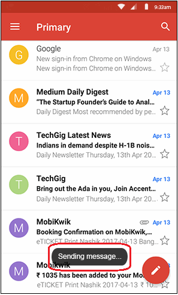
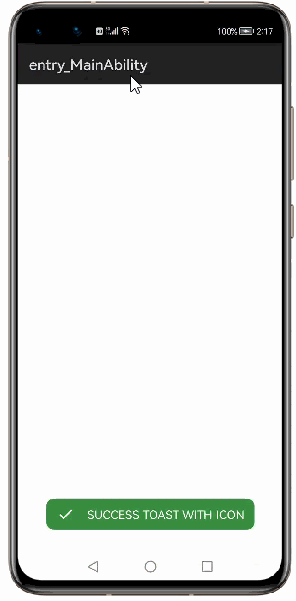

# 1. How to use Toasty Library for HarmonyOS: A developer’s Guide
## **1. Introduction**
Toasty library allows user to create customized toasts.

To get started right away, head on to [Gitee](https://codehub-y.huawei.com/opensource_insight/Toasty/files?ref=master)

## **2. Typical Use Case**
This library - es.dmoral.toasty , is very useful in the development of application's feature requiring instant use. Couple of such examples are mentioned below:

<table>
    <tr>
        <td>
            <ul><li><b>Sending message</li><ul>
        </td>
        <td>
            <ul><li><b>Sending message</li><ul>
        </td>
    </tr>
    <tr>
        <td width="50%">

</td>
    </tr>
</table>

## **3. Capability**
In this section, we can see the list of features which the library provides which makes the use of this library very easy and friendly. Primarily, this library supports customization of component attributes using the below mechanisms.

* **Customization via Java APIs** 
In case we need to customize the component during run time, we also have the flexibility to do that using the JAVA APIs which the library exposes. The APIs will also help us to utilize the features provided from its parent "Toasty" Class 

## **4. Features**
Features supported by this component includes the below:
* **Success Toast** 
The toast is used to display a success message.

* **Error Toast** 
The toast is used to display a error message.

* **Info Toast** 
The toast is used to display a information like message.

* **Warning Toast** 
The toast is used to display a warning like message.

* **Custom Toast** 
The toast is used to display a customized message like text with image , text with different font style/color/size etc.

## **5. Installation**
For using the library in your HarmonyOS mobile app, you need to first install it by adding the below dependency in your entry/build.gradle file.
<pre>
dependencies {
    implementation fileTree(dir: 'libs', include: ['*.har'])
    testCompile 'junit:junit:4.12'
}
</pre>

## **6. Usage**
This section will help us to understand the usage of the library as you use it in your Harmony-application developemnt project.

### **Step 1: Define layout via XML**

    <?xml version="1.0" encoding="utf-8"?>
    <DirectionalLayout
        xmlns:ohos="http://schemas.huawei.com/res/ohos"
        xmlns:app="http://schemas.huawei.com/hap/res-auto"
        ohos:height="match_parent"
        ohos:width="match_parent"
        ohos:orientation="vertical"
        ohos:background_element="#000000">
            <Button
                ohos:height="match_content"
                ohos:width="match_content"
                ohos:text_size="20fp"
                ohos:text="TOASTY"
                ohos:text_color="black"
                ohos:background_element="#007CFD"
                ohos:layout_alignment="center"
                ohos:id="$+id:libName_toasty"
                ohos:left_margin="10vp"
                ohos:right_margin="10vp"/>
    </DirectionalLayout>

### **Step 2: Customize programmatically via Java API**

    @Override
    public void onStart(Intent intent) {
        super.onStart(intent);
        super.setUIContent(ResourceTable.Layout_NewSilce);
        Toasty.success(TestCaseAbilitySlice.this,"SUCCESS TOAST WITH ICON",3000,true);
    }

### **List of public APIs for app-developer**
The public methods below will help us to operate on the component at runtime.

**Public Methods**
<table>
<tr>
    <td>
        <ul>
            <li>success()</li>
            <li>error()</li>
            <li>info()</li>
            <li>warning()</li>
            <li>normal()</li>
            <li>custom()</li>
        </ul>
    </td>
</table>

## **7. API usage examples**
In this section, we can have a look at some of the examples where the APIs of this library is put to use and the results which we can acheive.

**Example1: Display success toast**

In this example, a button is created in layout.xml and upon click success toast will be displayed.
<table>
    <tr>
        <td width=700px>
        <pre>
<b><u>Layout.xml</u>:</b>
&ltButton
    ohos:height="match_content"
    ohos:width="match_content"
    ohos:text_size="20fp"
    ohos:text="TOASTY"
    ohos:text_color="black"
    ohos:background_element="#007CFD"
    ohos:layout_alignment="center"
    ohos:id="$+id:libName_toasty"
    ohos:left_margin="10vp"
    ohos:right_margin="10vp"/>
 
<b><u>Java Slice</u>:</b>

<b style="color:blue;">Toasty.success(TestCaseAbilitySlice.this,
    "SUCCESS TOAST WITH ICON",3000,true);</b>
<b style="color:blue;">Toasty.error(TestCaseAbilitySlice.this,
    "ERROR TOAST MESSAGE WITH ICON",Toasty.LENGTH_LONG,true);</b>
<b style="color:blue;">Toasty.info(TestCaseAbilitySlice.this,
    "INFO TOAST MESSAGE WITH ICON",Toasty.LENGTH_LONG,true);</b>
<b style="color:blue;">Toasty.normal(TestCaseAbilitySlice.this,
    ResourceTable.String_normal_message_with_icon,icon);</b>
<b style="color:blue;">Toasty.custom(TestCaseAbilitySlice.this,
    "HELOOOOO!!!",custom_icon15,ResourceTable.Color_successColor,
    ResourceTable.Color_errorColor,Toasty.LENGTH_LONG,true,true);</b>
<b style="color:blue;">Toasty.warning(TestCaseAbilitySlice.this,
    "WARNING TOAST MESSAGE WITH ICON",Toasty.LENGTH_LONG,true);</b>
        </pre>
        </td>
        <td width=300px>
        

        </td>
    </tr>
</table>

## **8. Conclusion**
Toasty lib is user friendly and powerful library.The performance of the library is excellent when works on one of the latest operating systems in the world, which is HarmonyOS!

* For more exciting libraries to develop your app, peep into third-party-components at  
[OpenHarmony-TPC](https://gitee.com/openharmony-tpc)

* To know more about the developement work happening on harmony aaplication layer, and even be part of the exciting stuff, watch this space of [Application-Library Engineering Group](https://github.com/applibgroup)
