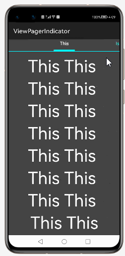

# How to use ViewPagerIndicator  Library for HarmonyOS: A developer’s Guide

## **1. Introduction**

Paging indicator widgets that are compatible with the PageSlider from
openharmony to improve discoverability of content.
## **2. Typical Use Cases**
This library - com.viewpagerindicator.sample, is very useful in the development of applications which are in our daily use. Some of such examples mentioned below:


<center><table>
    <tr>
        <td>
            <ul><li><b>WhatsApp</b></br>Your personal messages and calls to friends and family are end-to-end encrypted. No one outside of your chats, not even WhatsApp, can read or listen to them. </li><ul>
        </td>
       <td>
            <ul><li><b>Booking App</b></br>Save on your next trip with the Booking.com app! Find great hotel or apartment deals and book in just a few minutes. You can also book flights, rental cars, and more through the app. </li><ul>
        </td>
    </tr>
    <tr>
        <td><center></center></td>
        <td><center></center></td>
    </tr>
</table></center>


## **3. Capability**
In this section, we can see the list of features which the library provides which makes the use of this library very easy and friendly. Primarily, this library supports customization of component attributes using the below mechanism.

* **Java APIs**</br>
ViewPagerIndicator  uses a simple fluent java API's that allows users to make most requests in a single line:
 
## **4. Features**
Features supported by this component includes the below:
* **Circles**</br>

   * **Default**</br>
   * **Intial Page**</br>
   * **Styled Via Methods**</br>
   * **Styled Via Layouts**</br>
   * **With Listener**</br>
   
* **Icons**</br>
   * **Default**</br>
   
* **Lines**</br>
   * **Default**</br>
   * **Styled Via Methods**</br>
   * **Styled Via Layouts**</br>
   
* **Tabs**</br>
   * **Default**</br>
   * **With Icons**</br>
   
* **Titles**</br>

   * **Center Click Listener**</br>
   * **Default**</br>
   * **Default Bottom**</br>
   * **Styled Via Methods**</br>
   * **Styled Via Layouts**</br>   
   * **Triangle Style**</br>   
   * **With Listener**</br>   

* **Under Lines**</br>

   * **Default**</br>
   * **No Fade**</br>
   * **Styled Via Methods**</br>
   * **Styled Via Layouts**</br>   
   * **With Listener**</br>   
   
## **5. Installation**
For using the library in your HarmonyOS mobile app, you need to first install it by following below methods.

* **Method 1:**  </br>
Generate the .har package through the library and add the .har package to the libs folder.Add the following code to the entry level build.gradle:
    <pre>
       <b style="color:green">
    implementation fileTree  (dir: 'libs', include: ['* .jar', '* .har'])
       </b>
</pre>

* **Method 2 :**  </br>
Copy the dependency from the gitee and add it to the entry level build.gradle:
<pre>
dependencies {
    implementation fileTree(dir: 'libs', include: ['*.har'])
    <b style="color:blue;">implementation 'io.openharmony.tpc.thirdlib:viewpagerindicator:1.0.0'</b>
           }
</pre>


## **6. Usage**
This section will help us to understand the usage of the library as you use it in your Harmony-application developemnt project.

### **Step 1: Define layout via XML**
We are going to load list  into CirclePageIndicator & PageSlider component using This  Library. So, add CirclePageIndicator & PageSlider  component into <strong>resource_file.xml</strong> file.

```xml
    <?xml version="1.0" encoding="utf-8"?>
    <DirectionalLayout
        xmlns:ohos="http://schemas.huawei.com/res/ohos"
        xmlns:app="http://schemas.huawei.com/hap/res-auto"
        ohos:height="match_parent"
        ohos:width="match_parent"
        ohos:orientation="vertical"
        ohos:background_element="#000000">
            
      <PageSlider
            ohos:id="$+id:slider"
            ohos:width="match_parent"
            ohos:weight="1"
            ohos:height="0vp"

    />
    <com.viewpagerindicator.CirclePageIndicator
            ohos:id="$+id:indicator"
            ohos:width="match_content"
            ohos:height="match_content"
            ohos:padding="10vp"
            ohos:layout_alignment="center"
    />
    </DirectionalLayout>
```
### **Step 2: Customize programmatically via Java API**
```java
   @Override
    public void onStart(Intent intent) {
        super.onStart(intent);
        mPager = (PageSlider) mLayout.findComponentById(ResourceTable.Id_slider);
         initPager(Color.WHITE);
        mPager.setOrientation(Component.HORIZONTAL);
        mPager.setSlidingPossible(true);
        mIndicator.setPageSlider(mPager);
        mIndicator.setFooterColor(Color.CYAN.getValue());
        mIndicator.setTextColor(Color.CYAN.getValue())
        mDlViewRoot.setBackground(ResUtil.buildDrawableByColor(new Color(0xFFCCCCCC).getValue()));
        mPageViews = new ArrayList();
        mPageViews.add(new SamplePageView(this, pageText[0], color));
        mPageViews.add(new SamplePageView(this, pageText[1], color));
        mPageViews.add(new SamplePageView(this, pageText[2], color));
        mPageViews.add(new SamplePageView(this, pageText[3], color));
        pageViewAdapter = new PageViewAdapter(this, mPageViews);
        mPager.setProvider(pageViewAdapter)    }
```

### **List of public APIs for app-developer**
The public methods below will help us to operate on the component at runtime.

**ViewPagerIndicator  Methods**
<table>
<tr>
    <td>
        <ul>
            <li>setProvider(PageSliderProvider provider)</li>
            <li>addPageChangedListener(PageSlider.PageChangedListener listener)  </li> 
			<li>addPageChangedListener(PageSlider.PageChangedListener listener)  </li>
            <li>removePageChangedListener(PageSlider.PageChangedListener listener)  </li>
            <li>setOrientation(int orientation)  </li>
            <li>setPageMargin(int margin)   </li>
            <li>setPageCacheSize(int cacheSize)  </li>
            <li>setCurrentPage(int itemPos)  </li>
            <li>setCurrentPage(int itemPos, boolean smoothScroll)  </li>
            <li>setSlidingPossible(boolean enable)  </li>
            <li>setCircularModeEnabled(boolean enabled)  </li>
            <li>setReboundEffect(boolean enabled)  </li>
            <li>setPageSwitchTime(int durationMs)  </li>
            <li>onPageSliding(int var1, float var2, int var3);  </li>
            <li>onPageSlideStateChanged(int var1)  </li>
            <li>onPageChosen(int var1)  </li>
        </ul>
    </td>
  
</tr>
</table>

## **8. API usage examples**
In this section, we can have a look at some the examples where the APIs of this library is put to use and the results which we can acheive.

**Example1: ViewPagerIndicator with Circle Dots**
<table>
    <tr>
        <td >
        <b><u>Layout.xml</u>:</b>
        <pre>
&ltcom.viewpagerindicator.CirclePageIndicator
   ohos:id="$+id:indicator"
   ohos:width="match_content"
   ohos:height="match_content"
   ohos:padding="10vp"
   ohos:layout_alignment="center"
   ohos:indicator_normalColor="#FF888888"
   ohos:indicator_selectedColor="#88FF0000"
   ohos:indicator_strokeColor="#FF000000"
   ohos:indicator_normalStrokeWidth="1vp"
   ohos:indicator_selectedStrokeWidth="2vp"
   ohos:indicator_radius="10vp"
    />
</br>
</pre>
<b><u>Java Slice</u>:</b>
<pre>
  mDlViewRoot.setBackground(ResUtil.buildDrawableByColor
  ((Color.DKGRAY).getValue()));
  mPager = (PageSlider) 
  ResUtil.findComponentById(mLayout, ResourceTable.Id_slider).get();
  mIndicator = (CirclePageIndicator)
  ResUtil.findComponentById(mLayout, ResourceTable.Id_indicator).get();
   initPager(Color.WHITE);
   mPager.setOrientation(Component.HORIZONTAL);
   mPager.setSlidingPossible(true);
   mIndicator.setPageSlider(mPager);
   mIndicator.setItemOffset(17);
        </pre>
        </td>
        <td >
        <center></center>
        </td>
    </tr>
</table>


**Example2:  ViewPagerIndicator with Icons with data**
<table>
    <tr>
        <td >
        <b><u>Layout.xml</u>:</b>
        <pre>
&ltcom.viewpagerindicator.IconPageIndicator
   ohos:layout_alignment="horizontal_center"
   ohos:id="$+id:tlTabLayout"
   ohos:width="match_content"
   ohos:height="50vp"
</br>
</pre>
<b><u>Java Slice</u>:</b>
<pre>
mPageViews = new ArrayList();
 mPageViews.add(new SamplePageView(this, "Recent",
ResourceTable.Media_perm_group_calendar_normal,
ResourceTable.Media_perm_group_calendar_selected, Color.WHITE));
mPageViews.add(new SamplePageView(this, "Artists",
ResourceTable.Media_perm_group_camera_normal,
ResourceTable.Media_perm_group_camera_selected, Color.WHITE));
mPageViews.add(new SamplePageView(this, "Albums",
ResourceTable.Media_perm_group_device_alarms_normal,
ResourceTable.Media_perm_group_device_alarms_selected, Color.WHITE));
mPageViews.add(new SamplePageView(this, "Songs",
ResourceTable.Media_perm_group_location_normal,
ResourceTable.Media_perm_group_location_selected, Color.WHITE));
mPager.setProvider(new PageViewAdapter(this, mPageViews));
mPager.setOrientation(Component.HORIZONTAL);
mPager.setSlidingPossible(true);
        </pre>
        </td>
        <td >
        <center></center>
        </td>
    </tr>
</table>


**Example3: ViewPagerIndicator with Icons with Tabs**
<table>
    <tr>
        <td >
        <b><u>Layout.xml</u>:</b>
        <pre>
&ltcom.viewpagerindicator.TabPageIndicator
   ohos:id="$+id:tlTabLayout"
   ohos:width="match_parent"
   ohos:height="50vp"/>

</br>
</pre>
<b><u>Java Slice</u>:</b>
<pre>
  mPageViews = new ArrayList();
  mPageViews.add(new SamplePageView(this, "Recent",
  ResourceTable.Media_perm_group_calendar_normal,
  ResourceTable.Media_perm_group_calendar_selected, Color.BLACK));
  mPageViews.add(new SamplePageView(this, "Artists",
  ResourceTable.Media_perm_group_camera_normal,
  ResourceTable.Media_perm_group_camera_selected, Color.BLACK));
  mPageViews.add(new SamplePageView(this, "Albums",
  ResourceTable.Media_perm_group_device_alarms_normal,
  ResourceTable.Media_perm_group_device_alarms_selected, Color.BLACK));
  mPageViews.add(new SamplePageView(this, "Songs",
  ResourceTable.Media_perm_group_location_normal,
  ResourceTable.Media_perm_group_location_selected, Color.BLACK));
  mPager.setProvider(new PageViewAdapter(this, mPageViews));
  mPager.setOrientation(Component.HORIZONTAL);
  mPager.setSlidingPossible(true);
        </pre>
        </td>
        <td >
        <center></center>
        </td>
    </tr>
</table>

**Example4: ViewPagerIndicator with Titles Center OnClick**
<table>
    <tr>
        <td >
        <b><u>Layout.xml</u>:</b>
        <pre>
&ltcom.viewpagerindicator.TitlePageIndicator
   ohos:id="$+id:indicator"
   ohos:width="match_parent"
   ohos:height="40vp"
    />

</br>
</pre>
<b><u>Java Slice</u>:</b>
<pre>
    initPager(Color.WHITE);
    mPager.setOrientation(Component.HORIZONTAL);
   mPager.setSlidingPossible(true);
   mIndicator.setPageSlider(mPager);
   mIndicator.setFooterColor(Color.CYAN.getValue());
   mIndicator.setTextColor(Color.CYAN.getValue());
  mPager.setSlidingPossible(true);
   @Override
    public void onCenterItemClick(int position) {
     ResUtil.showToast(getContext(),
	 "You clicked the center title! ", 2000);
    }
        </pre>
        </td>
        <td >
        <center></center>
        </td>
    </tr>
</table>


**Example5: ViewPagerIndicator with Tabs with UnderLine**
<table>
    <tr>
        <td >
        <b><u>Layout.xml</u>:</b>
        <pre>
&ltcom.viewpagerindicator.UnderlinePageIndicator
   ohos:id="$+id:indicator"
                ohos:width="match_parent"
                ohos:height="match_content"
                ohos:indicator_normalColor="#FF888888"
                ohos:indicator_selectedColor="#88FF0000"
                ohos:indicator_height="5vp"
                />

</br>
</pre>
<b><u>Java Slice</u>:</b>
<pre>
  mPageViews = new ArrayList();
  mPageViews.add(new SamplePageView(this, "Recent",
  ResourceTable.Media_perm_group_calendar_normal,
  ResourceTable.Media_perm_group_calendar_selected, Color.BLACK));
  mPageViews.add(new SamplePageView(this, "Artists",
  ResourceTable.Media_perm_group_camera_normal,
  ResourceTable.Media_perm_group_camera_selected, Color.BLACK));
  mPageViews.add(new SamplePageView(this, "Albums",
  ResourceTable.Media_perm_group_device_alarms_normal,
  ResourceTable.Media_perm_group_device_alarms_selected, Color.BLACK));
  mPageViews.add(new SamplePageView(this, "Songs",
  ResourceTable.Media_perm_group_location_normal,
  ResourceTable.Media_perm_group_location_selected, Color.BLACK));
  mPager.setProvider(new PageViewAdapter(this, mPageViews));
  mPager.setOrientation(Component.HORIZONTAL);
  mPager.setSlidingPossible(true);
        </pre>
        </td>
        <td >
        <center></center>
        </td>
    </tr>
</table>

## ** 9. Conclusion**
ViewPagerIndicator is a very easy to use and very powerful library.The performance of the library is very good even when it works on one of the latest operating systems in the world, which is HarmonyOS!

* For more exciting libraries to develop your app, peep into third-party-components at </br>
[OpenHarmony-TPC](https://gitee.com/openharmony-tpc)

* To know more about the developement work happening on harmony aaplication layer, and even be part of the exciting stuff, watch this space of [Application Library Engineering Group](https://github.com/applibgroup)