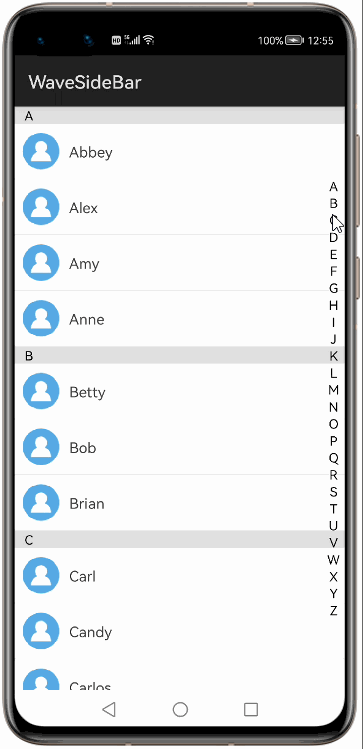
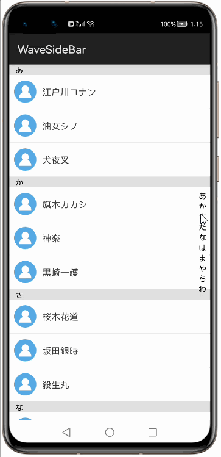
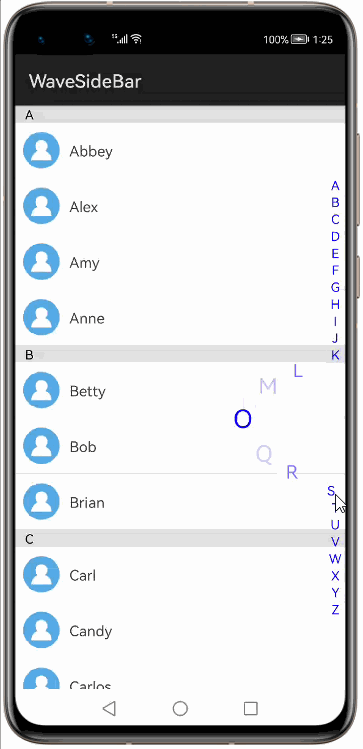
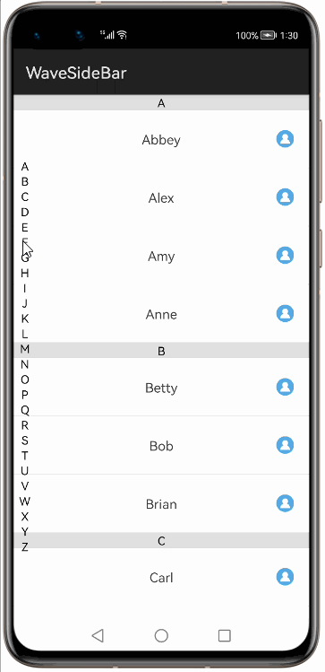
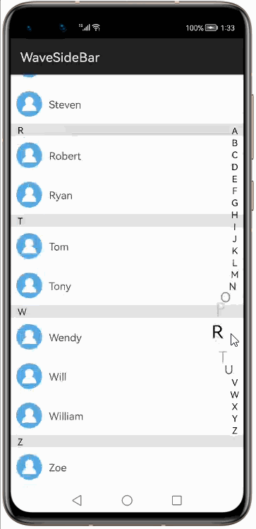
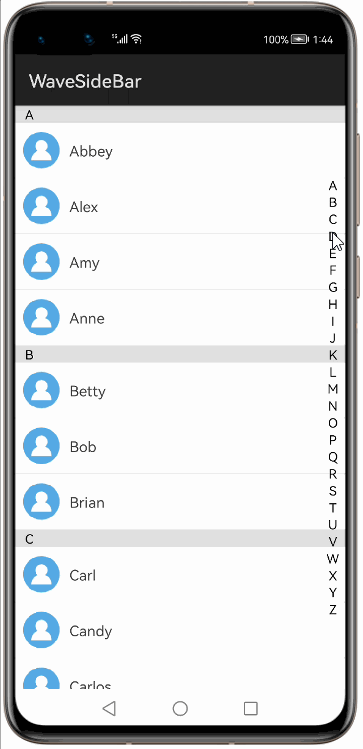
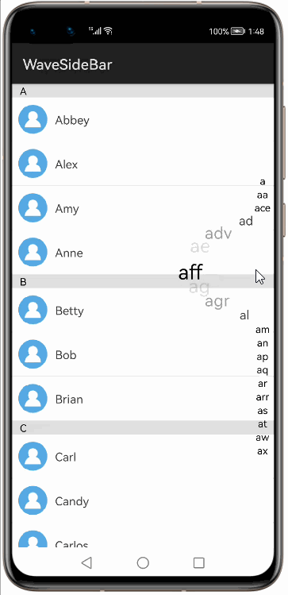
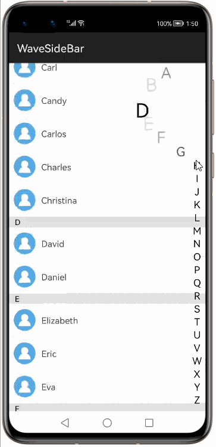
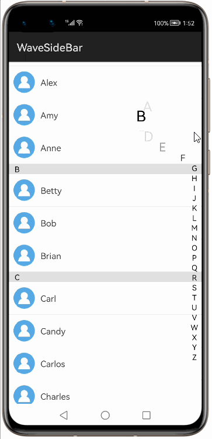

# How to use WaveSideBar Library for HarmonyOS: A developer’s Guide

## **1. Introduction**
WaveSideBar library provides you a seamless and hassle-free development experience to display a custom scrollbar with wave animation.

To get started right away, head on to [Gitee](https://gitee.com/openharmony-tpc/WaveSideBar)


## **2. Typical Use Cases**
This library - com.gjiazhe.wavesidebar, is very useful in the development of applications which are in our daily use. Couple of such examples are mentioned below:

<div align="center">
    <table>
    <tr>
        <td>
            <ul><b>WaveSideBar</b> in contact list.</ul>
        </td>
        <td>
            <ul>It can be used in any index based list.</ul>
        </td>
    </tr>
    <tr>
        <td width="50%"><p align="center"></p></td>
        <td width="100%"><p align="center"></p></td>
    </tr>
</table>
</div>


## **3. Capability**
In this section, we can see the list of features which the library provides which makes the use of this library very easy and friendly. Primarily, this library supports customization of component attributes using the below mechanisms.

* **XML layout inflation**</br>
With the help of xml layout inflation, the library is so easy to use such that, we can put the component to action without even writing a single line of code. This will be so useful for quick development, as well as for beginners who are starting with mobile-app development. On how to use the XML Layout Inflation can be seen in the coming sections of the tutorial.

* **Customization via Java APIs**</br>
In case we need to customize the component during run time, we also have the flexibility to do that using the JAVA APIs which the library exposes. The APIs will also help us to utilize the features provided from its parent “Component” Class 

## **4. Features**
Features supported by this component includes the below:
* **Setting index items**</br>
We can set the index items of the WaveSideBar using this api.

* **Setting text color**</br>
Using this library, we can set any custom color to text of index list.

* **Setting position of the bar**</br>
This property allows you to draw the WaveSideBar at right or left of the list.

* **Setting the max offset**</br>
This property allows you to set the wave width of the WaveSideBar

* **Lazy Response property**</br>
With this property we can configure the result response of the index selection in the WaveSideBar

* **Text Alignment property**</br>
With this property we can configure the Text alignment in the WaveSideBar

* **Text size property**</br>
With this property we can configure the text size of index list in the WaveSideBar

* **Setting OnSelectIndexItemListener**</br>
This interface provides a callback when an index is selected in the WaveSideBar

## **5. Installation**
For using the library in your HarmonyOS mobile app, you need to first install it by adding the below dependency in your entry/build.gradle file.
```groovy
dependencies {
    implementation fileTree(dir: 'libs', include: ['*.har'])
    implementation 'io.openharmony.tpc.thirdlib:WaveSideBar:1.0.3'
    testCompile 'junit:junit:4.12'
}
```

## **6. Usage**
This section will help us to understand the usage of the library as you use it in your Harmony-application development project.

### **Step 1: Define layout via XML**
```xml
    <?xml version="1.0" encoding="utf-8"?>
    <DependentLayout
    xmlns:ohos="http://schemas.huawei.com/res/ohos"
    xmlns:app="http://schemas.ohos.com/apk/res-auto"
    ohos:height="match_parent"
    ohos:width="match_parent"
    ohos:orientation="vertical">
        <com.gjiazhe.wavesidebar.WaveSideBar
            ohos:id="$+id:side_bar"
            ohos:width="match_parent"
            ohos:height="match_parent"
            ohos:right_padding="8vp"
            ohos:left_padding="8vp"
            ohos:WaveSideBar_sidebar_text_color="#8D6E63"
            ohos:WaveSideBar_sidebar_position="0"
            ohos:WaveSideBar_sidebar_max_offset="80"
            ohos:WaveSideBar_sidebar_lazy_respond="false"
            ohos:WaveSideBar_sidebar_text_alignment="1"
            ohos:WaveSideBar_sidebar_text_size="18fp"/>
    </DependentLayout>
```
### **Step 2: Customize programmatically via Java API**

```java
    @Override
    protected void onStart(Intent intent) {
        super.onStart(intent);
        super.setUIContent(ResourceTable.Layout_f1testcase1);
        initData();
        WaveSideBar sideBar = (WaveSideBar) findComponentById(ResourceTable.Id_side_bar);
        ListContainer listContainer = (ListContainer) findComponentById(ResourceTable.Id_list);
        listItemProvider = new ContactAdapter(this,contacts, ResourceTable.Layout_item_contacts);
        listContainer.setItemProvider(listItemProvider);
        sideBar.setIndexItems("1", "2", "3", "4", "5", "6", "7", "8", "9", "0", "A", "B", "C", "D", "E", "H", "I", "j",
                        "M", "O", "Q", "V", "W", "X", "Y", "Z" );
        sideBar.setTextColor(Color.BLUE);
        sideBar.setPosition(WaveSideBar.POSITION_RIGHT);
        sideBar.setMaxOffset(80);
        sideBar.setLazyRespond(false);
        sideBar.setTextAlign(WaveSideBar.TEXT_ALIGN_CENTER);
        sideBar.setTextSize(18);
        sideBar.setOnSelectIndexItemListener(new WaveSideBar.OnSelectIndexItemListener() {
             @Override
             public void onSelectIndexItem(String index) {
                 for (int i=0; i<contacts.size(); i++) {
                     if (contacts.get(i).getIndex().equals(index)) {
                         listContainer.scrollToCenter(i);
                         return;
                     }
                 }
             }
         });
    }
```

### **List of XML attributes supported**
Below is the list of XML attributes which are supported by the library.

<table>
	<tr>
		<th width="30%">Name</th>
		<th width="20%">Type</th>
		<th width="100%">Info</th>
	</tr>
	<tr><td>WaveSideBar_sidebar_text_color</td><td>color</td><td>To specify the text color of WaveSideBar</td></tr>
	<tr><td>WaveSideBar_sidebar_position</td><td>int</td><td>To specify WaveSideBar position</td></tr>
	<tr><td>WaveSideBar_sidebar_max_offset</td><td>int</td><td>To set Wave offset of the WaveSideBar</td></tr>
	<tr><td>WaveSideBar_sidebar_lazy_respond</td><td>boolean</td><td>To set the response of the index selection</td></tr>
	<tr><td>WaveSideBar_sidebar_text_alignment</td><td>int</td><td>To specify text alignment</td></tr>
	<tr><td>WaveSideBar_sidebar_text_size</td><td>dimension</td><td>To specify text size</td></tr>
</table>	


### **List of public APIs for app-developer**
The public methods below will help us to operate on the component at runtime.

**Setter Methods**

<table width="100%">
	<tr>
		<th width="30%">Name</th>
		<th width="30%">Type</th>
		<th width="100%">Info</th>
	</tr>
	<tr><td>setIndexItems()</td><td>String array</td><td>To specify the text color of WaveSideBar</td></tr>
	<tr><td>setTextColor()</td><td>color</td><td>To specify WaveSideBar position</td></tr>
	<tr><td>setPosition()</td><td>int</td><td>To set Wave offset of the WaveSideBar</td></tr>
	<tr><td>setMaxOffset()</td><td>int</td><td>To set the response of the index selection</td></tr>
	<tr><td>setLazyRespond()</td><td>boolean</td><td>To specify text alignment</td></tr>
	<tr><td>setTextAlign()</td><td>int</td><td>To specify text size</td></tr>
	<tr><td>setTextSize()</td><td>int</td><td>To specify text size</td></tr>
</table>

<table>
<tr><th>Interface</th><th>Interface Methods</th></tr>
<tr><td>

| name                   | info                                                   |
|------------------------|--------------------------------------------------------|
| OnSelectIndexItemListener         |  Index item listener interface           |

</td><td>

| name                   | info                                                   |
|------------------------|--------------------------------------------------------|
| onSelectIndexItem()         |  This callback is called when an index is selected        |
</td></tr> </table>

## **7. API usage examples**
In this section, we can have a look at some of the examples where the APIs of this library is put to use and the results which we can achieve.

**Example1: Setting index items**


In this example, we are setting the index list of the WaveSideBar.
<table>
    <tr>
        <td width="75%">
        <pre>
<b><u>Layout.xml</u>:</b>
&lt com.gjiazhe.wavesidebar.WaveSideBar
           ohos:id="$+id:side_bar"
           ohos:width="match_parent"
           ohos:height="match_parent"
           ohos:right_padding="8vp"
           ohos:left_padding="8vp"/>
</br>
<b><u>Java Slice</u>:</b>
WaveSideBar sideBar = 
          (WaveSideBar) findComponentById(ResourceTable.Id_side_bar);
<b style="color:blue;">sideBar.setIndexItems("あ", "か", "さ", "た", "な", 
                "は", "ま", "や", "ら", "わ");</b>
        </pre>
        </td>
        <td width="100%">
        <center></center>
        </td>
    </tr>
</table>

**Example2: Setting text color**
<table>
    <tr>
        <td width="75%">
        <pre>
<b><u>Layout.xml</u>:</b>
&lt com.gjiazhe.wavesidebar.WaveSideBar
        ohos:id="$+id:side_bar"
        ohos:width="match_parent"
        ohos:height="match_parent"
        ohos:right_padding="8vp"
        ohos:left_padding="8vp"
        <b style="color:blue;">ohos:WaveSideBar_sidebar_text_color="#8D6E63"</b>/>
</br>
<b><u>Java Slice</u>:</b>
WaveSideBar sideBar = new WaveSideBar(getContext());        
<b style="color:blue;">sideBar.setTextColor(Color.BLUE);</b>
        </pre>
        </td>
        <td width="100%">
        <center></center>
        </td>
    </tr>
</table>

**Example3: Setting position of the bar**
<table>
    <tr>
        <td width="75%">
        <pre>
<b><u>Layout.xml</u>:</b>
&lt com.gjiazhe.wavesidebar.WaveSideBar
            ohos:id="$+id:side_bar"
            ohos:width="match_parent"
            ohos:height="match_parent"
            ohos:right_padding="8vp"
            ohos:left_padding="8vp"
            <b style="color:blue;">ohos:WaveSideBar_sidebar_position="1"</b>/>
</br>
<b><u>Java Slice</u>:</b>
WaveSideBar sideBar = new WaveSideBar(getContext());        
<b style="color:blue;">sideBar.setPosition(WaveSideBar.POSITION_LEFT);</b>
        </pre>
        </td>
        <td width="100%">
        <center></center>
        </td>
    </tr>
</table>

**Example4: Setting the max offset**
<table>
    <tr>
        <td width="75%">
        <pre>
<b><u>Layout.xml</u>:</b>
&lt com.gjiazhe.wavesidebar.WaveSideBar
            ohos:id="$+id:side_bar"
            ohos:width="match_parent"
            ohos:height="match_parent"
            ohos:right_padding="8vp"
            ohos:left_padding="8vp"
            <b style="color:blue;">ohos:WaveSideBar_sidebar_max_offset="80"</b>/>
</br>
<b><u>Java Slice</u>:</b>
WaveSideBar sideBar = new WaveSideBar(getContext());        
<b style="color:blue;">sideBar.setMaxOffset(80);</b>
        </pre>
        </td>
        <td width="100%">
        <center></center>
        </td>
    </tr>
</table>

**Example5: Setting Lazy Response**
<table>
    <tr>
        <td width="75%">
        <pre>
<b><u>Layout.xml</u>:</b>
&lt com.gjiazhe.wavesidebar.WaveSideBar
            ohos:id="$+id:side_bar"
            ohos:width="match_parent"
            ohos:height="match_parent"
            ohos:right_padding="8vp"
            ohos:left_padding="8vp"
            <b style="color:blue;">ohos:WaveSideBar_sidebar_lazy_respond="true"</b>/>
</br>
<b><u>Java Slice</u>:</b>
WaveSideBar sideBar = new WaveSideBar(getContext());        
<b style="color:blue;">sideBar.setLazyRespond(true);</b>
        </pre>
        </td>
        <td width="100%">
        <center></center>
        </td>
    </tr>
</table>

**Example6: Setting Text Alignment**
<table>
    <tr>
        <td width="75%">
        <pre>
<b><u>Layout.xml</u>:</b>
&lt com.gjiazhe.wavesidebar.WaveSideBar
            ohos:id="$+id:side_bar"
            ohos:width="match_parent"
            ohos:height="match_parent"
            ohos:right_padding="8vp"
            ohos:left_padding="8vp"
            <b style="color:blue;">ohos:WaveSideBar_sidebar_text_alignment="0"</b>/>
</br>
<b><u>Java Slice</u>:</b>
WaveSideBar sideBar = new WaveSideBar(getContext());
sideBar.setIndexItems("a", "aa", "ace", "ad", "adv", "ae", 
"af", "aff", "ag", "agr", "al", "am", "an", "ap", "aq", "ar",
 "arr", "as", "at", "aw", "ax" );        
<b style="color:blue;">sideBar.setTextAlign(WaveSideBar.TEXT_ALIGN_CENTER);</b>
        </pre>
        </td>
        <td width="100%">
        <center></center>
        </td>
    </tr>
</table>

**Example7: Setting Text size**
<table>
    <tr>
        <td width="75%">
        <pre>
<b><u>Layout.xml</u>:</b>
&lt com.gjiazhe.wavesidebar.WaveSideBar
            ohos:id="$+id:side_bar"
            ohos:width="match_parent"
            ohos:height="match_parent"
            ohos:right_padding="8vp"
            ohos:left_padding="8vp"
            <b style="color:blue;">ohos:WaveSideBar_sidebar_text_size="18fp"</b>/>
</br>
<b><u>Java Slice</u>:</b>
WaveSideBar sideBar = new WaveSideBar(getContext());        
<b style="color:blue;">sideBar.setTextSize(18);</b>
        </pre>
        </td>
        <td width="100%">
        <center></center>
        </td>
    </tr>
</table>

**Example8: Setting the OnSelectIndexItemListener interface and implementing the abstract methods**
<table>
    <tr>
        <td width="75%">
        <pre>
<b><u>Java Slice</u>:</b>
WaveSideBar sideBar = 
        (WaveSideBar) findComponentById(ResourceTable.Id_side_bar);
<b style="color:blue;">sideBar.
    setOnSelectIndexItemListener(
        new WaveSideBar.OnSelectIndexItemListener() {
              @Override
              public void onSelectIndexItem(String index) {
                  for (int i = 0; i < contacts.size(); i++) {
                      if (contacts.get(i).getIndex().equals(index)) {
                          listContainer.scrollToCenter(i);
                          return;
                      }
                  }
              }
      });</b>
        </pre>
        </td>
        <td width="100%">
        <center></center>
        </td>
    </tr>
</table>


## **8. Conclusion**
WaveSideBar is a very easy to use and very powerful library.The performance of the library is very good even when it works on one of the latest operating systems in the world, which is HarmonyOS!

* For more exciting libraries to develop your app, peep into third-party-components at </br>
[OpenHarmony-TPC](https://gitee.com/openharmony-tpc)

* To know more about the development work happening on harmony application layer, and even be part of the exciting stuff, watch this space of [Application-Library Engineering Group](https://github.com/applibgroup)
