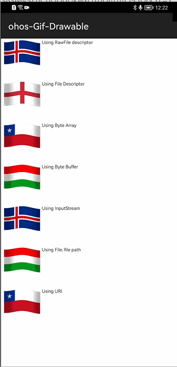
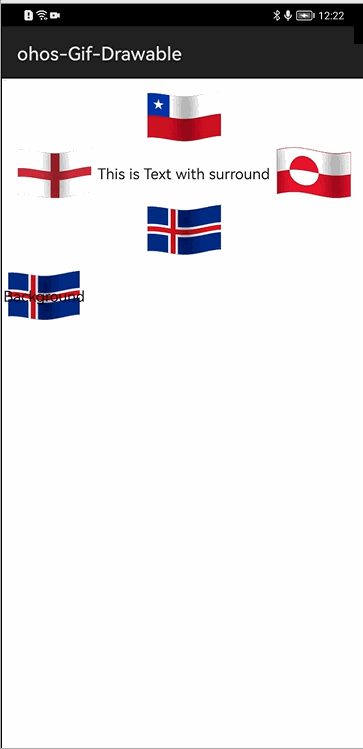
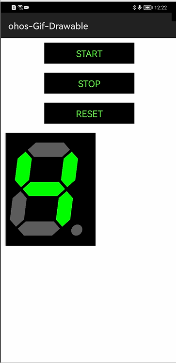
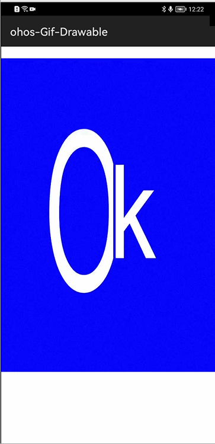

# How to use ohos-gif-drawable Library for HarmonyOS: A developer’s Guide

## **1. Introduction**
ohos-gif-drawable library provides you Views and Drawable for animated GIFs, Bundled GIFLib via JNI is used to render frames.

To get started right away, head on to [Gitee](https://gitee.com/HarmonyOS-tpc/ohos-gif-drawable)


## **2. Typical Use Cases**
This library - pl.droidsonroids.gif, is very useful in the development of applications which are in our daily use. An example mentioned below:

<div align="center">
<table>
    <tr>
        <td>
            <ul>It can be used in any place where image can be shown.</ul>
        </td>
    </tr>
    <tr>
        <td width="100%"><p align="center"></p></td>
    </tr>
</table>
</div>


## **3. Capability**
In this section, we can see the list of features which the library provides which makes the use of this library very easy and friendly. Primarily, this library supports customization of component attributes using the below mechanisms.

* **XML layout inflation**</br>
With the help of xml layout inflation, the library is so easy to use such that, we can put the component to action without even writing a single line of code. This will be so useful for quick development, as well as for beginners who are starting with mobile-app development. On how to use the XML Layout Inflation can be seen in the coming sections of the tutorial.

* **Customization via Java APIs**</br>
In case we need to customize the component during run time, we also have the flexibility to do that using the JAVA APIs which the library exposes. The APIs will also help us to utilize the features provided from its parent “Component” Class 

## **4. Features**
Features supported by this component includes the below:
* **Gif Drawable**</br>
Drawable for animated GIFs.

* **Gif ImageView**</br>
View for animated GIFs

* **Gif TextView**</br>
View for animated GIFs

* **Gif Animation control**</br>
GifDrawable provides apis for animation control

* **Gif Decoder**</br>
Decoder provides apis to get frames for a given gif file  

## **5. Installation**
For using the library in your HarmonyOS mobile app, you need to first install it by adding the below dependency in your entry/build.gradle file.
```groovy
dependencies {
    implementation fileTree(dir: 'libs', include: ['*.har'])
    implementation 'io.openharmony.tpc.thirdlib:Ohos-Gif-Drawable:1.0.0'
    implementation 'io.openharmony.tpc.thirdlib:ReLinker:1.0.1'
    testCompile 'junit:junit:4.12'
}
```

## **6. Usage**
This section will help us to understand the usage of the library as you use it in your Harmony-application development project.

### **Step 1: Define layout via XML**
```xml
    <?xml version="1.0" encoding="utf-8"?>
    <DirectionalLayout
            ohos:height="match_content"
            ohos:width="match_content"
            ohos:top_margin="1vp"
            ohos:orientation="horizontal">
    
            <pl.droidsonroids.gif.GifImageView
                ohos:id="$+id:GifRawFD"
                ohos:height="90vp"
                ohos:width="90vp"/>
            <Text
                ohos:height="match_content"
                ohos:width="match_content"
                ohos:text_size="10vp"
                ohos:text="Using URI"/>

        </DirectionalLayout>
```
### **Step 2: Create GifDrawable and set it to GifImageView via Java API**

```java
    GifImageView gifImageView = (GifImageView) rootLayout.findComponentById(ResourceTable.Id_GifRawFD);
    
    RawFileDescriptor rawFileDescriptor = getResourceManager()
                        .getRawFileEntry("entry/resources/rawfile/anim_flag_iceland.gif").openRawFileDescriptor();
    
    GifDrawable gifDrawable = new GifDrawable(rawFileDescriptor);

    gifImageView.setImageElement(gifDrawable);

    gifDrawable.setLoopCount(0);
    gifDrawable.getAnimator().start();
```

## **7. API usage examples**
In this section, we can have a look at some of the examples where the APIs of this library is put to use and the results which we can achieve.

**Example1: Creating the GifDrawable with different sources**

In this example, we are creating the GifDrawable and set it to GifImageView.
<table>
    <tr>
        <td width=700px>
        <pre>
<b><u>Layout.xml</u>:</b>
    &lt pl.droidsonroids.gif.GifImageView
        ohos:id="$+id:gifImageView"
        ohos:height="90vp"
        ohos:width="90vp"/>

<b><u>Java Slice</u>:</b>
<b style="color:blue;">
1. Using RawFileDescriptor :
    gifDrawable = new GifDrawable(rawFileDescriptor);
2. Using ByteArray:
    mbyteArray = 
        getByteArrayFromRawFile("entry/resourcess/rawfile/anim_flag_chile.gif");
    gifDrawable = new GifDrawable(mbyteArray);
3. Using ByteBuffer :
    gifDrawable = new GifDrawable(mByteBuffer);	
4. Using Uri :
    gifDrawable = new GifDrawable(dataAbilityHelper, uri);
5. Using Inputstream :
    gifDrawable = new GifDrawable(bufferedInputStream);
6. Using File :
    gifDrawable = new GifDrawable(file);
7. Using FileDescripter :
    gifDrawable = new GifDrawable(fd);
</br>	
GifImageView gifImageView = (GifImageView) rootLayout
    .findComponentById(ResourceTable.Id_gifImageView);
gifImageView.setImageElement(gifDrawable);	
</b>		
        </pre>
        </td>
        <td width=300px>
        <p align="center"></p>
        </td>
    </tr>
</table>

**Example2: Setting GifDrawable to GifTextView**
<table>
    <tr>
        <td width=700px>
        <pre>
<b><u>Layout.xml</u>:</b>
&lt DirectionalLayout
        xmlns:ohos="http://schemas.huawei.com/res/ohos"
        ohos:height="match_parent"
        ohos:width="match_parent"
        ohos:orientation="vertical">
        </br>    
        < pl.droidsonroids.gif.GifTextView
            ohos:id="$+id:gif"
            ohos:height="match_content"
            ohos:width="match_parent"
            ohos:padding="10vp"
            ohos:layout_alignment="center"
            ohos:text_alignment="center"
            ohos:text="This is Text with surround elements "/>
        </br>    
        < pl.droidsonroids.gif.GifTextView
            ohos:id="$+id:gif1"
            ohos:height="60vp"
            ohos:width="90vp"
            ohos:text_alignment="center"
            ohos:text="Background"/>    
    < /DirectionalLayout>    
</br>
<b><u>Java Slice</u>:</b>
    gifDrawable1 = new GifDrawable(getResourceManager()
        .getRawFileEntry("entry/resources/rawfile/anim_flag_england.gif")
        .openRawFileDescriptor());
    gifDrawable2 = new GifDrawable(getResourceManager()
        .getRawFileEntry("entry/resources/rawfile/anim_flag_chile.gif")
        .openRawFileDescriptor());
    gifDrawable3 = new GifDrawable(getResourceManager()
        .getRawFileEntry("entry/resources/rawfile/anim_flag_greenland.gif")
        .openRawFileDescriptor());
    gifDrawable4 = new GifDrawable(getResourceManager()
        .getRawFileEntry("entry/resources/rawfile/anim_flag_iceland.gif")
        .openRawFileDescriptor());
    background = new GifDrawable(getResourceManager()
        .getRawFileEntry("entry/resources/rawfile/anim_flag_iceland.gif")
        .openRawFileDescriptor());
    GifTextView text = (GifTextView) rootLayout
        .findComponentById(ResourceTable.Id_gif);
    <b style="color:blue;">text
        .setElements(gifDrawable1, gifDrawable2, gifDrawable3, gifDrawable4);</b>
    GifTextView textBackground = (GifTextView) rootLayout
        .findComponentById(ResourceTable.Id_gif1);
    <b style="color:blue;">textBackground.setBackgroundElement(background);</b>
    </pre>
        </td>
        <td width=300px>
        <p align="center"></p>
        </td>
    </tr>
</table>

**Example3: Gif Animation Control**
<table>
    <tr>
        <td width=700px>
        <pre>
<b><u>Layout.xml</u>:</b>
&lt pl.droidsonroids.gif.GifImageView
    ohos:id="$+id:gif"
    ohos:height="752vp"
    ohos:width="600vp"
    ohos:margin="10vp"
    ohos:padding="10vp"
    />
</br>
<b><u>Java Slice</u>:</b>
    GifImageView gif = (GifImageView) findComponentById(ResourceTable.Id_gif);
    RawFileDescriptor rawFileDescriptor = getResourceManager()
        .getRawFileEntry("entry/resources/rawfile/led7.gif")
        .openRawFileDescriptor();
    drawable = new GifDrawable(rawFileDescriptor);
    drawable.addAnimationListener(this);
    gif.setImageElement(drawable);    
<b style="color:blue;">
    drawable.getAnimator().start();
    drawable.getAnimator().stop();
    drawable.setLoopCount(FOUR);
    drawable.seekToFrameAndGet(1);</b>
        </pre>
        </td>
        <td width=300px>
        <p align="center"></p>
        </td>
    </tr>
</table>

**Example4s: GifDecoder**
<table>
    <tr>
        <td width=700px>
        <pre>
<b><u>Layout.xml</u>:</b>
&lt DirectionalLayout
    xmlns:ohos="http://schemas.huawei.com/res/ohos"
    ohos:height="match_parent"
    ohos:width="match_parent"
    ohos:orientation="vertical">    
        < Text
            ohos:id="$+id:decoderLoadingTextView"
            ohos:width="match_content"
            ohos:height="match_content"
            ohos:text="Loading"/>    
        < Image
            ohos:id="$+id:decoderImageView"
            ohos:width="match_content"
            ohos:height="match_content"/>
    < /DirectionalLayout>
</br>
<b><u>Java Slice</u>:</b>
    RawFileDescriptor rawFileDescriptor = getResourceManager()
        .getRawFileEntry("entry/resources/rawfile/anim_flag_ok_large.gif")
        .openRawFileDescriptor();
    <b style="color:blue;">
    GifDecoder decoder = new GifDecoder(new InputSource.
                            AssetFileDescriptorSource(rawFileDescriptor));
    for (int val = 0; val < decoder.getNumberOfFrames(); val++) {</b>
        PixelMap.InitializationOptions initializationOptions = 
            new PixelMap.InitializationOptions();
        initializationOptions.pixelFormat = 
            ohos.media.image.common.PixelFormat.ARGB_8888;
        initializationOptions.size = 
            new Size(decoder.getWidth(), decoder.getHeight());
        pixelMap = PixelMap.create(initializationOptions);
        decoder.seekToFrame(val, pixelMap);
        frameList.add(pixelMap);
        durationList.add(decoder.getFrameDuration(val));
    }
    decoderImageView.setImageElement(createElementfromPixelMap());
    long duration = (long)((Number)this.durations.get(currentFrameIndex))
                        .intValue();
    final Runnable task = new Runnable() {
        public void run() {
            advanceAnimation();
        }
    };
    handler.postTask(task, duration);                                      
        </pre>
        </td>
        <td width=300px>
        <p align="center"></p>
        </td>
    </tr>
</table>


## **8. Conclusion**
ohos-gif-drawable is a very easy to use and very powerful library.The performance of the library is very good even when it works on one of the latest operating systems in the world, which is HarmonyOS!

* For more exciting libraries to develop your app, peep into third-party-components at </br>
[OpenHarmony-TPC](https://gitee.com/openharmony-tpc)

* To know more about the development work happening on harmony application layer, and even be part of the exciting stuff, watch this space of [Application-Library Engineering Group](https://github.com/applibgroup)
